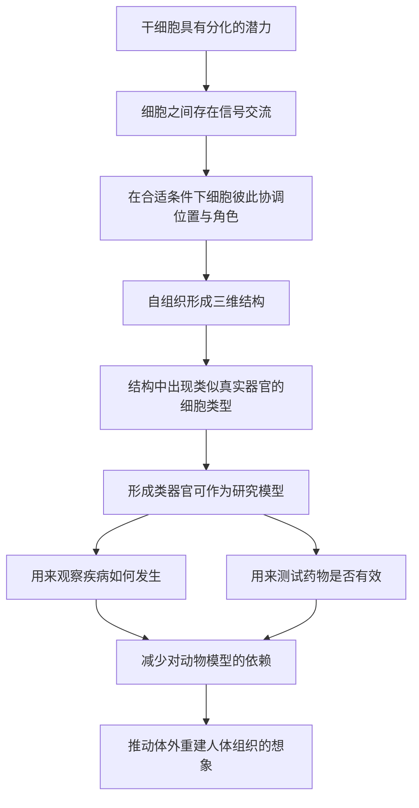

# 20｜类器官：在培养皿里「长」出迷你器官？

> 不靠动物，我们能不能在实验室里，让细胞自己组织成一个微型器官？

---

## 一、先说结论

先说结论：**能，而且这件事已经在实验室里发生了。**

科学家发现，干细胞在合适的条件下可以**自组织**成三维的微型组织结构，这就是**类器官**。它们不是完整的器官，却拥有类似真实器官的细胞类型和空间结构——迷你肠、迷你脑、迷你肝，都可以在培养皿里长出来。

据研究，荷兰科学家汉斯·克莱弗斯等大约在 2009 年培育出了肠道类器官，此后脑类器官等也相继出现。穆克吉把类器官看作细胞医学里一个特别的进展：它既是研究疾病与药物的强大工具，也把「在体外造出人体组织」这件事，从前沿想象推向了可操作的现实。

---

## 二、我们先理解一个问题

医学研究长期面临一个两难。

要研究人的疾病，最理想的材料当然是人的组织。可人的组织不容易获得，更不能随便拿活人做实验。于是很长一段时间里，研究依赖动物模型，或者依赖在塑料皿里贴壁生长的**二维细胞**——一层摊平的细胞。

可这两者都有根本性的缺陷：动物的生理和人不完全一样；而二维培养的细胞，失去了真实组织里的**空间结构**和**细胞间的对话**。一个在平皿上长得一模一样的肝细胞，和一个在立体环境里与邻居互相作用的肝细胞，行为可能很不一样。

于是问题就变成：

> **能不能让细胞自己「组织起来」，长成一个有结构、有分工的微型组织，尽可能接近真实器官？**

这个问题的吸引力在于：如果成功，我们就有了一个**无限接近真人组织、却又能随意实验**的模型。

---

## 三、作者到底提出了什么观点？

穆克吉的核心观点是：**细胞天生具有自组织的能力，只要给它合适的环境，它就能自己「造结构」。**

这里必须分清三层：

**第一，这是实验发现。** 据研究，类器官是干细胞自组织形成的三维微型组织结构；克莱弗斯等人约 2009 年培育出肠道类器官，之后又出现了脑类器官等。这是事实层面的记录。

**第二，这是穆克吉的解读。** 穆克吉强调，类器官之所以重要，不只是因为它「像」器官，而是它证明了自组织这件事：**细胞不需要一张外部图纸来指挥，它们内在地知道怎么排列自己。** 这印证了全书的一个主题——细胞不是被动的砖块，而是有主动性的生命单位。

**第三，这是生物学界的评价。** 学界普遍认为，类器官在疾病建模和药物测试上有独特价值，同时也承认它**不是真实器官**——它缺少血管、免疫细胞等关键组成，因此不能简单等同于人体器官。

穆克吉没有把类器官说成「造器官」。他真正的论点是：**它把研究人的疾病这件事，从「用替代品猜」推进到了「用人自己的组织看」。**

---

## 四、把这个观点翻译成人话

最贴切的类比，是**一小块种子在温室里长成微型植株**。

想象你手上有一小块种子或一小段枝条。你不需要照着图纸一棵一棵去拼——它自己就会长出根、长出茎、长出叶，长成一株完整的小植物。

类器官的逻辑就是这样：你给干细胞一个合适的「温室」（特定的营养和条件），它们会**自己分工**——一部分变成吸收养分的细胞，一部分变成分泌的细胞，一部分变成支撑的结构，并自动排列成类似真实器官的样子。

有两个要点必须说清楚，否则容易误解：

- **这不是人在拼装，而是细胞在自组织。** 科学家做的是提供条件，不是当施工队；
- **长出来的不是「缩小版真器官」。** 它没有血管，没有血液供应，也没有免疫系统，所以更像一个粗糙但有用的**模型**，而不是一个可以移植的零件。

所以「迷你器官」这个说法，重点在「迷你」，更在「模型」。

---

## 五、为什么会这样？

把逻辑整理成链条：

这条链里，**B 和 C 是关键。**

类器官能成立，靠的是细胞之间的「对话」：一个细胞分泌信号，旁边的细胞接收并回应，于是位置和角色被逐步协调出来。**结构不是外部强加的，而是从局部互动中涌现出来的。** 这也是为什么它和盖房子完全不同——盖房子需要图纸，而组织生长更像是一群人在对话中自然形成了秩序。

**E 和 F 之间有一个必须承认的落差：** 有结构和细胞类型，不等于有完整功能。类器官缺少血管和免疫系统，尺寸一大，内部就会缺氧坏死。所以它是强大的工具，但距离「能用的器官」还很远。

---

## 六、举一个现实生活中的例子

可以把类器官想成一个**用来试药的「测试沙盘」**。

假设要测试一种新药对肝脏是否有毒。传统的两种办法都不理想：在二维细胞上测，太简化；在动物身上测，结果未必能推广到人。

类器官提供第三种可能：用人的细胞长出一个微型「肝」，在上面加药，看它如何反应。这就像在真正的工地开工前，先在沙盘上把情况演一遍——虽然不是真实工地，但比纸面推演可靠得多。

另一个更贴近生活的类比：**酵母发酵。**

你不需要设计缸里每一个气泡该怎么产生，只要给出合适的面粉、水和温度，酵母自己就会让面团膨胀起来。**你提供的是条件，过程是它自己完成的。** 类器官的自组织，正是同一个逻辑在细胞层面的版本。

关键差别在于：面团膨胀的结果是可预测的，而细胞自组织出来的结构，有时会带来**你没想到的形态**——这既是它的魅力，也是它难以标准化控制的难点。

---

## 七、回到书中重新理解

现在回看穆克吉为什么把类器官放在改造细胞这条线的后段，就明白了。

前面几篇的技术——克隆、iPSC、CAR-T、CRISPR——都在做同一件事：**对单个细胞施加控制。** 重置它、改造它、编辑它。

类器官转向了另一件事：**不再指挥单个细胞，而是创造条件，让一群细胞自己形成秩序。**

这个转向在穆克吉的框架里意义重大。它说明细胞的「主动性」不只是被我们操控的对象，也可以被我们**借力**。你不需要设计每一个细节，只需要提供合适的舞台。

它也再次呼应了全书的主线：**细胞是生命的基本单位，而生命的基本特征之一，就是自组织。** 类器官的价值，一半在于它的用途，一半在于它证明了这个特性真实存在。

---

## 八、这个观点背后还有什么？

这个观点背后，是一个关于「模型」的深层问题：**我们研究疾病时，研究的到底是什么？**

过去我们用动物、用二维细胞、用计算机模拟，每一种都是对真实人体的近似。类器官把近似度往前推了一步，但仍然是近似。这就引出一个必须保持清醒的判断：**模型再像，也不等于本体。**

它还隐含一层关于「造器官」的想象与现实之间的距离。类器官的出现，容易让人联想到「以后可以用它替换坏掉的器官」。但器官之所以能工作，不只靠细胞类型，还依赖血管、神经、免疫系统、机械张力等一系列整体条件。**把「像」误当成「是」，是这一领域最容易被夸大的地方。**

更深一层，类器官也带来了新的伦理问题：脑类器官如果发展到一定程度，是否存在某种「感知」的可能？这个问题目前没有答案，但它提醒我们，**技术的边界问题，往往先于人能想清楚它之前就出现了。**

---

## 九、这个观点有问题吗？

有几处需要留心。

**第一，类器官不是真实器官，局限很实在。** 据研究，它缺少血管供应，尺寸受限，内部容易缺氧；也缺少免疫细胞等组成。所以它在疾病建模和药物筛选上很有用，但不能直接当作可移植的器官。说它「造出了器官」，是明显的夸大。

**第二，可重复性和标准化仍是挑战。** 因为自组织带有随机性，不同批次长出来的类器官可能不完全一样。这对需要严格对照的研究来说，是一个真实的技术障碍。科学上的可靠性，部分依赖于结果能被重复。

**第三，「减少动物实验」的期待需要谨慎。** 类器官确实能替代一部分动物实验，但目前的复杂性还不足以覆盖整体的生理反应——药物在全身的吸收、代谢、免疫反应，都不是一个孤立的小组织能完整模拟的。把它说成「动物实验的终结」，是提前的乐观。

所以更稳妥的说法是：**类器官给了一个前所未有的研究窗口，但它是一扇窗，不是一整座房子。**

---

## 十、今天再看这个观点

（以下为现代延伸，非穆克吉原文）

类器官之后，这个方向继续分化出几条明显的线。

一条是**应用线**：肿瘤类器官可以用患者自己的肿瘤细胞长出来，用来测试哪种药对这个患者更有效，这与「个体化医疗」的思路高度契合。据研究，感染、遗传病等方向也在用类器官做研究。

另一条是**复杂度提升线**：研究者尝试给类器官加上血管、免疫细胞，或者把多种类器官连接起来，做出更接近真实器官的系统。也有把类器官用于移植探索的尝试，但这仍处于早期阶段。

还有一条是**伦理线**：随着脑类器官越来越复杂，「它有没有某种意识」的讨论开始出现。目前没有定论，但它说明一件已经反复发生的事——**技术能力往往先于我们能回答的伦理问题出现。** 这与 CRISPR 那一篇的问题是同一类，只是换了对象。

---

## 十一、这一篇真正应该记住什么？

1. **类器官是干细胞自组织形成的三维微型组织。** 它长出的不是被拼装的模型，而是细胞自己形成的秩序。

2. **它填补了二维细胞与动物模型之间的空白。** 更接近真人组织，又能被随意实验，是研究与试药的强大工具。

3. **它不是真实器官。** 缺血管、缺免疫系统、尺寸受限，可移植性远未成熟，不能混淆「像」与「是」。

4. **它的价值在于是「人的组织」。** 用患者自己的细胞建模，让疾病研究和药物测试更贴近真实个体。

5. **它再次证明细胞的主动性。** 我们不必指挥每个细节，只要给对条件，细胞会自己组织起来。

---

## 十二、留一个问题

到这里，我们已经能重置细胞、改造细胞、编辑基因、甚至让细胞自己组织成微型器官。

可这一切都建立在一个前提上：**细胞的规则被遵守着。**

但细胞社会里，恰恰有一类成员不遵守规则。它们拒绝停止分裂、拒绝按时死亡、还会离开自己的位置跑到别处去——前面所有技术的反面，正是这种失控。

穆克吉从《癌症传》写到《细胞传》，最念念不忘的，始终是这一件事：

> **如果身体是一个由细胞组成的社会，那么癌症到底是什么？**

下一篇，我们来到全书的另一个核心——**癌：细胞社会的「叛变者」**。
