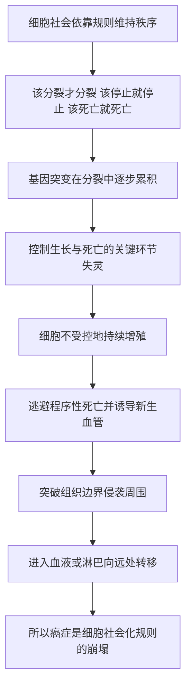

# 21｜癌：细胞社会的「叛变者」

> 如果身体是一个由几十万亿细胞组成的「社会」，那么癌症到底是什么？

---

## 一、先说结论

穆克吉认为，癌症是细胞「社会化」规则的崩塌。

一个正常的细胞生活在身体这个社会里，遵守三条不成文的契约：该分裂时才分裂、该停止时就停止、该死亡时按时死亡。癌细胞恰恰是撕毁了这三条契约的细胞——它不受控地增殖、拒绝按程序死亡、还突破边界四处迁移。

理解癌症，必须回到细胞层面。穆克吉从《癌症传》写到《细胞传》，这条线索一以贯之：癌症不是外来的怪物，而是自身细胞社会的秩序失守。

---

## 二、我们先理解一个问题

我们通常把癌症想象成一个「敌人」。

它潜伏、侵袭、扩散，最后夺走生命。用战争来比喻癌症，很自然，也很容易理解。但战争隐喻有一个致命的问题：敌人应该来自外部，而癌症偏偏来自内部——**肿瘤细胞是你自己的细胞。**

那就产生了一个更棘手的问题：

> **一个原本守规矩的细胞，究竟「坏」在了哪里？**

不是坏在长相，也不是坏在出身，而是坏在**行为**。它没有变成别的物种，它只是不再服从原来那套约束。

这一篇要回答的，正是这个问题：当细胞社会里出现一个「叛变者」，它到底违反了哪些规则，又会造成什么后果。

---

## 三、作者到底提出了什么观点？

穆克吉的观点可以拆成三层。

第一层，是**病理学上的基本事实**：癌症是细胞层面的疾病。所有细胞都来自已有的细胞，肿瘤细胞也不例外——它来自病人自己的身体。这是现代病理学的基石，不是某位作者的个人主张。

第二层，是**穆克吉的解释框架**：把身体看作一个「细胞社会」，癌症就是这个社会里规则的崩塌。正常细胞受着一套复杂的信号系统管理——什么时候分裂、什么时候停下、什么时候自我了结，都有约束。癌细胞的关键，不是学会了什么全新的本领，而是**丢掉了这些约束**。

第三层，是**他对癌症行为的概括**。据研究，癌细胞大致表现出几类共同特征：不受控地持续增殖、逃避程序性死亡、诱导新生血管为自己供血、侵袭周围组织，并最终向远处转移。这些行为，构成了癌症之所以致命的根本。需要说明的是，把这些特征归纳成一份「清单」，是后来研究者们的工作，穆克吉是在这个框架下去讲细胞的失控。

另外，**癌症源于基因突变的累积**，这已是生物学界普遍接受的看法。也就是说，规则失守的深层原因，写在基因里。

---

## 四、把这个观点翻译成人话

想象身体是一座城市，几十万亿个细胞是市民。

这里的市民很特别：每个人都有分工，而且都遵守一套自觉的规矩——需要人手时才开工，工程做完就收手，老旧破损了就主动退场，把位置让给年轻人。正因为大家守规矩，这座城市才能既庞大又稳定。

现在，出现了一个不再守规矩的细胞。

它不停地开工、不停地复制自己，明明没人需要它继续了，它也不肯停；该退场的时候它赖着不走；更糟的是，它离开自己的街区，跑到别的器官去，在那里又建起一批同样的「违规工地」。

所以，癌细胞并不是「变成了另一种生物」。**它还是你的细胞，只是不再服从这个社会的基本契约了。**

这也是为什么癌症如此难对付：如果它是一个外来的入侵者，你可以毫不犹豫地消灭它；可它和你自己太像，杀它和伤自己几乎无法分开。

---

## 五、为什么会这样？

把穆克吉框架背后的逻辑整理成一条链：

这条链里，**D 是最关键的一环。**

正常细胞其实一直「被管着」：外部有生长因子告诉它该不该分裂，内部有检查点监控 DNA 有没有出错，还有一套程序性死亡的开关，随时准备让出了问题的细胞自我了结。

癌症不需要发明新能力，它只需要**让这些管理环节一一失灵**。而失灵往往不是一次发生的——据研究，它更像是多次突变逐步累积的结果，所以年龄越大、细胞分裂次数越多，累积出问题的机会就越大。

这就解释了一个反直觉的现象：**癌症不是外敌入侵，而是内部秩序一步步松动。** 它的可怕来自「像自己」，它的可理解也来自「像自己」——因为每一步失控，都是可以被具体研究的生物学过程。

---

## 六、举一个现实生活中的例子

想一支球队。

正常比赛里，每个球员都有自己的位置和职责：前锋该进攻时进攻，后卫该回防时回防；体能下降了，教练会把你换下场，由替补顶上。正是这套分工和纪律，让十一人像一个整体那样运转。

现在想象这支球队彻底丢了纪律。

它不再听教练的换人指令，场上人数越堆越多；球员被换下时赖在场上不走；更夸张的是，他们不满足于在自己的球场踢，还跑到对手的球场、其他赛事的场地去占位置，在哪儿都摆出一套同样的阵容。

结果就是：原来的比赛被彻底搅乱，其他地方也被拖垮。

癌细胞的行为，就是这支失控球队的行为。**它不是换了一支新球队，而是原来这支球队不再守规矩了。**

这里要小心一个误读：球队失控并不等于「球员有阴谋」。癌症里的「叛变」只是一种比喻——真实的细胞并没有意图，它只是在随机突变和选择压力下，碰巧走上了这条失控的路。

---

## 七、回到书中重新理解

现在再回看穆克吉为什么把癌症放在《细胞传》的后段来讲，就容易理解了。

在《癌症传》里，他讲的是人类与癌症这场漫长战争的历史：外科、放疗、化疗、靶向药、免疫治疗，一次次的希望与挫败。而在《细胞传》里，他换了一个视角——不再从「疾病」出发，而是从「细胞社会」出发。

视角一换，癌症就从「一种可怕的病」，变成了「细胞社会规则的反面教材」。

穆克吉并不是说癌症研究不重要，恰恰相反：**正是因为细胞是生命的基本单位，癌症这个最复杂的疾病，才会在最基础的层面显出清晰的结构。** 增殖、拒死、侵袭、转移，每一步都对应着正常细胞某个被破坏的规则。

这也呼应了本书的主线：理解细胞，就拿到了理解生命与疾病的通用地图。癌症，是这张地图上最险峻、也最能说明问题的一片区域。

---

## 八、这个观点背后还有什么？

这个观点背后，藏着一个比癌症本身更宏大的判断：**癌症是多细胞协作的代价。**

单细胞生物不用担心癌症——它本来就是独立生存、独立增殖的，没有什么需要遵守的协作契约。而多细胞生命之所以能存在，靠的是无数细胞愿意分工、克制分裂、按时死亡。规则越精密，组织就能越复杂；但反过来，规则越精密，出错的机会也越多。

换句话说，人体的复杂，本身就意味着更高的失控风险。我们为了成为「多细胞生物」，就必须接受这个代价。

这也顺带解释了另一件事：**为什么癌症和年龄高度相关。** 细胞分裂的次数越多、活得越久，累积出错的机会就越大。从某种意义上说，癌症是长寿的一张「统计学账单」。

还有一个隐含前提值得点出：这个「社会—规则」的框架，默认了细胞的行为可以用规则与约束来完整描述。它很有解释力，但也意味着，我们可能忽略了那些不能被简单归结为「规则」的层面——比如细胞与周围环境的复杂互动。

---

## 九、这个观点有问题吗？

有几处需要留心。

第一，**「叛变者」是一个有倾向性的比喻。** 它容易让人以为癌细胞是「有意图的坏分子」，甚至把疾病道德化。而在生物学上，癌细胞的失控并没有目的性，它更接近随机突变加上选择的结果。用社会隐喻来理解可以，但别把它当成事实描述。

第二，**细胞层面的解释，回答了「怎么失控」，却没有完全回答「为什么会失控」。** 把癌症定位在细胞行为，是很重要的一步；但真正让规则失灵的深层原因，要到基因和分子层面才逐渐清楚。所以这一篇给出的是一个正确的观察层次，而不是完整的答案。

第三，**「癌症特征清单」本身也是会被修订的。** 后来有研究者把形形色色的癌细胞能力归纳成若干共同标志，这确实收拢了研究。但关于这份清单该包含哪些、边界在哪里，学界一直有讨论，它不是一个固定不变的教条。把某一版清单当成终极答案，是一种拔高。

第四，**社会隐喻也带来一个现实风险：归因于个人。** 如果癌症被说成「自己身体出了问题」，很容易被误读成「所以只能怪自己的生活方式」。这在科学上和伦理上都不成立——诱因可能来自环境、随机突变、遗传易感等多重因素，远不是个人能完全掌控的。

所以更稳妥的说法是：**把癌症理解为细胞社会规则的失守，是一个极有统摄力的框架——但它是一张地图，不是全部地形。**

---

## 十、今天再看这个观点

（以下为现代延伸，非穆克吉原文）

在穆克吉写书之后，对癌症的理解又往前推进了几步。

一方面，**单细胞测序**让人可以看到同一个肿瘤内部不同细胞之间的差异。过去我们习惯把肿瘤当成一团同质的「叛军」，现在则更像是各怀心思的一群人：有的对某种药敏感，有的天生耐药。这解释了很多治疗为什么会先有效、后失效，也把癌症从「一群细胞」推向「一个演化的生态系统」。

另一方面，**免疫治疗**把癌症重新放回了「社会」的框架。按这套思路，癌细胞能长起来，往往不只是因为它自己失控，还因为它成功地躲过了免疫系统的监视。于是治疗的方向，从「直接杀伤癌细胞」，转向「唤醒免疫系统去认出它」。这恰好也是后面 CAR-T 这类活体疗法的前提。

还有一个越来越受重视的角度：**癌细胞不是孤身作战，它和周围的环境（所谓微环境）互相塑造。** 它会诱导新生血管、改造周围组织，为自己创造生存条件。这让「癌症」从一个单纯的细胞问题，变成了一个牵涉整个局部生态的问题。

但底层判断没有变，反而被反复印证：**癌症是细胞社会秩序的失守，只不过这个社会比我们想象的更复杂。**

---

## 十一、这一篇真正应该记住什么？

1. **癌症是细胞社会规则的崩塌。** 该长才长、该停就停、该死就死，这三条契约一旦被撕毁，正常细胞就变成了癌细胞。

2. **它来自自己，而不是外面。** 肿瘤细胞由病人自身细胞变来，所以「彻底清除」和「不伤自身」几乎无法分开，这是癌症治疗一切困难的根源。

3. **关键行为是增殖、拒死、侵袭与转移。** 不是学会了新本领，而是丢掉了原有的约束；据研究，这背后是基因突变的逐步累积。

4. **癌症是多细胞协作的代价。** 分工与克制让复杂生命成为可能，也带来了失控风险；细胞分裂越多、活得越久，风险越高。

5. **「叛变者」只是比喻，不是事实描述。** 癌细胞没有意图，社会隐喻便于理解，但要警惕它带来的道德化与归因于个人的误读。

---

## 十二、留一个问题

我们已经看到，即使是最根本的疾病，追到底也是细胞层面的失控。

那么顺着这条线索，一个更大的念头就冒出来了：

> **既然疾病可以理解为细胞出了问题，那我们能不能干脆反过来——直接用细胞去治病，甚至用细胞去替换掉出问题的部分？**

从输血、骨髓移植，到今天被称作「活体药物」的细胞疗法，医学似乎正在做一件前所未有的事：把活着的细胞，本身当成一种药。

下一篇，我们就来看看这个判断：**「细胞医学」会重塑下一代的医学吗？**
