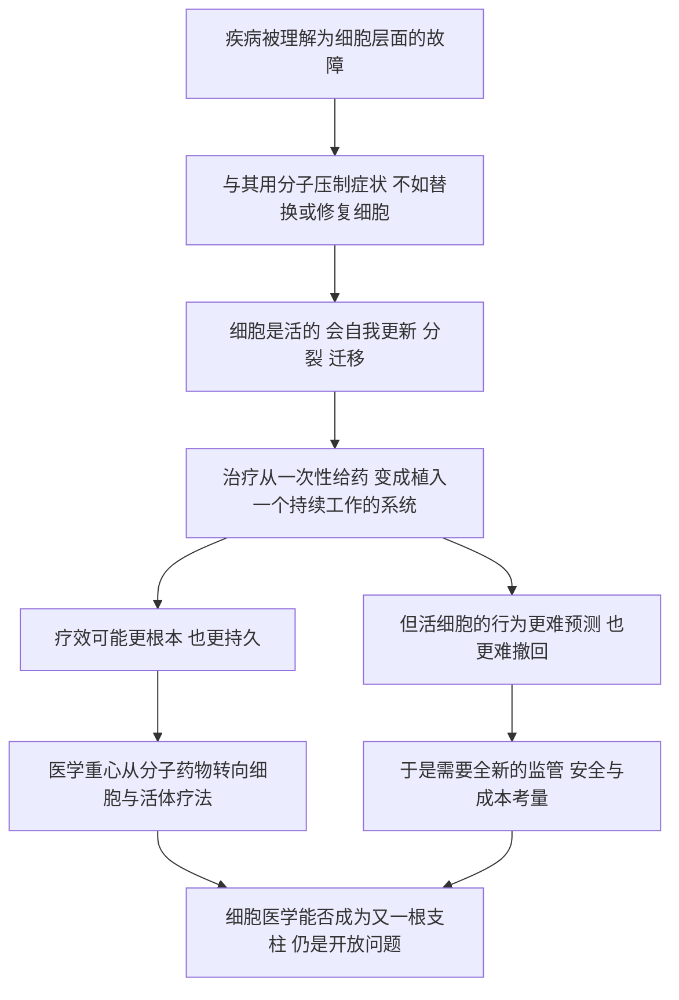

# 22｜「细胞医学」会重塑下一代的医学吗？

> 从骨髓移植到 CAR-T，医学的重心为什么正在从「药物」转向「活着的细胞」？

---

## 一、先说结论

穆克吉认为，医学正在经历一次重心的转移：从「分子与药物」，走向「细胞与活体疗法」。

过去，医生主要靠化学分子和手术刀治病；而现在，越来越多的疗法直接使用活着的细胞——移植造血干细胞重建血液与免疫系统、改造 T 细胞去追杀癌细胞、用干细胞和基因编辑去修复出问题的组织。这类疗法常被称作「活体药物」。

但要说得准确：这是穆克吉对趋势的判断，不是已被普遍接受的定论。细胞医学同时带来了全新的监管、安全和成本问题，能否真正成为继药物、手术之后的又一根支柱，仍有待观察。

---

## 二、我们先理解一个问题

我们太熟悉「吃药」这件事了，以至于很少去想它的隐含设定。

一颗药，通常是一个化学分子。它进入身体，找到自己的靶点，做一件事，然后被代谢、被排出。它的作用往往是有时限的、可预测的、可以随时停掉的。剂量、半衰期、副作用，大体都能算清楚。

现在换一种东西：一 **活的细胞**。

它会生长、会分裂、会迁移，可能在你体内待上几年甚至一辈子；它还会根据环境做出反应，而不是按照固定剧本执行动作。

于是问题来了：

> **把「活的东西」当成药，究竟意味着什么？**

这不仅是一个技术问题，它可能改变的是医学最基本的运作方式——从「定期给药」，变成「植入一个会自己持续工作的系统」。

---

## 三、作者到底提出了什么观点？

穆克吉的观点可以拆成三层。

第一层，是**已经发生的事实**：用细胞治病，并不是想象。骨髓移植早在上世纪就证明，移植健康的造血干细胞，可以重建一个病人坏掉的血液与免疫系统。这是「细胞医学」最早、也最扎实的原型。

第二层，是**穆克吉的判断**：医学的重心正在从「分子与药物」转向「细胞与活体疗法」。他注意到，骨髓移植、CAR-T、诱导多能干细胞、CRISPR 基因编辑，这些看似不同的技术，其实指向同一个方向——**直接和活细胞打交道，把它当作治疗的手段，而不只是治疗的对象。**

第三层，是**他同时看到的代价**。穆克吉并不认为这是一条只有希望的路。细胞疗法昂贵、个体化、长期安全性尚不清楚，也对现有监管体系提出了根本挑战。他把这些一并写进书里，正因为它们和疗效同样重要。

需要明确：第一层是医学史事实，第二、第三层是穆克吉的判断与提醒，属于观点，而不是定论。

---

## 四、把这个观点翻译成人话

可以用「修车」来想这中间的区别。

传统药物的思路，更像**不断加机油、清洗、换滤芯**。你的车跑起来有点抖，就加点添加剂；发动机声音不对，就调一调。这些手段成本低、见效快、随时能做，也确实解决了很多问题。但它们的共同点是：**只在外围打交道，不换核心部件。**

细胞医学的思路，更像是**直接换一台发动机**。

发动机坏了，你不再靠加机油硬撑，而是把整台机器卸下来，换上一台能正常运转的。这样一来，问题从根上被替换掉了——但它同时也意味着：要找到匹配的机器、要处理装上去之后的排异、要调试、要花大价钱，而且一旦装错，后果比加错机油严重得多。

一句话概括：**药物是「修零件」，细胞医学是「换整机」。** 从修到换，是思路的一次跃迁，也是难度和风险的一次跃迁。

---

## 五、为什么会这样？

把这条逻辑整理成一条链：

这条链里，**C 是最关键的一环。**

药物的关键属性是「可控」：剂量可控、作用可控、停用可控。而活细胞恰恰在这一点上不同——它有自己的行为逻辑。你把它放进身体，它不一定乖乖待着；它可能扩增，可能迁移，可能长期沉默，也可能多年后才出现问题。

这就带来一个矛盾：**正是因为细胞是活的，它才可能完成药物做不到的修复；也正是因为它是活的，我们才比任何时候都更难完全掌控它。** 疗效与不确定性，来自同一个原因。穆克吉所说的「全新的监管、安全与成本考量」，正是从这个矛盾里长出来的。

---

## 六、举一个现实生活中的例子

还是回到汽车，这次看得更细一点。

假设一台车的发动机严重老化，动力越来越弱、油耗越来越高。摆在面前有两条路。

第一条路，是**持续养护**：加更好的机油、定期清洗、换火花塞、做保养。这些做法能让车继续跑，也能在一定程度上改善状态，但它改变不了发动机本身在老化这个事实。这是一条典型的「药物式」思路——控制症状、延缓恶化、维持运转。

第二条路，是**换一台发动机**：把老机器整体换掉，让车的动力系统回到正常水平。这是一条「细胞式」的思路——不是围着问题打转，而是把出问题的部分直接替换掉。

骨髓移植就是第二条路的真实案例：不去修补某个具体分子，而是把整套造血与免疫系统重建一遍。

但换发动机的麻烦也一目了然：要找匹配的机器（配型），要防止装上去之后互相排斥（排异），要花远超保养的钱（成本），还得有足够专业的技师（医疗能力）。**换整机解决了根本问题，也把根本问题换成了新的根本问题。**

---

## 七、回到书中重新理解

现在再回看穆克吉为什么要把这本书的落脚点放在「细胞医学」，就明白了。

他不是从理论推演出发的，而是从病房里出发的。作为肿瘤科医生，他亲眼见过骨髓移植如何把濒临失败的治疗变成可行，也见过 CAR-T 如何让一部分血液癌症病人获得前所未有的缓解。这些不是假想的未来，而是已经落地的现实。

穆克吉的判断因此有很强的经验基础：**细胞医学不是某个遥远的方向，它的原型早就在临床里了。** 骨髓移植是起点，CAR-T 是延伸，干细胞与基因编辑还在继续铺路。

但同样重要的是，他并没有把这条路写成一条坦途。相反，他反复提醒读者：这些疗法为什么贵、为什么难、为什么需要全新的制度来管理。**一个负责任的判断，不只要说它有多重要，还要说它有多难。**

这也和全书的主线接上了：既然细胞是生命的基本单位，那么医学最终走向「用细胞治病」，几乎是逻辑的必然——但必然性不等于容易。

---

## 八、这个观点背后还有什么？

这个观点背后，有一个容易被忽略的前提：**活细胞可以被安全地植入、控制，并在必要时「关掉」。**

这个前提听起来技术性，其实极其关键。因为药物的可逆性是默认属性——停用即可。而细胞的「停用」并没有那么简单：如果一批被改造的细胞在体内异常增殖，你很难像停药那样让它立刻消失。有些前沿设计会加入「安全开关」，但这也说明，可控性必须被主动设计出来，而不是天然具备。

另一个更深的含义，是**细胞疗法对「制药」这件事本身的挑战。**

传统药物是工业化的：一种药，一个配方，批量生产，卖给成千上万人。而很多细胞疗法是**个体化**的：从你身上取出细胞，改造，再输回你身上。这相当于「一人一批」，从根本上偏离了大规模生产的逻辑。它带来两个直接后果——成本极高，等待时间很长。

所以细胞医学不只是科学问题，它还是一场关于**生产方式**和**制度设计**的变革。穆克吉把它写成医学的新前线，背后其实是这一整串连锁反应。

---

## 九、这个观点有问题吗？

有几处需要留心。

第一，**「范式转移」这个说法可能过头了。** 细胞医学确实在快速发展，但绝大多数常见病——感染、高血压、代谢病、多数实体肿瘤——在可预见的未来仍会主要由药物和手术处理。细胞疗法目前主要在一部分血液癌症、部分遗传病等领域显示出优势。把它说成「取代药物」，是对现实的夸大；更准确的说法或许是「在特定领域形成补充甚至替代」。

第二，**成本和可及性是真实的争议点，而不只是「发展中的问题」。** 一些细胞疗法单次治疗的费用极其高昂，且流程复杂、周期长。如果这些疗法只服务得起少数人，那么它们带来的可能不只是治愈，还有医疗不平等的加剧。关于这一点，学界和公共卫生领域一直有争论。

第三，**长期安全性仍是开放问题。** 被改造的细胞会在体内长期存在，几年、十几年后会发生什么，很多疗法还没有足够的数据。基因编辑还可能带来脱靶、插入突变等风险。用「已经证明有效」来覆盖「长期未知」，是一种乐观的拔高。

第四，**监管滞后本身也是争议的一部分。** 现有的药物审批体系是为化学分子设计的，很难直接套用到「活体药物」上：你怎么定义它的批次？怎么衡量它的质量？怎么追踪它在体内的行为？这些问题至今没有全球统一的答案。

所以更稳妥的说法是：**细胞医学很可能是医学的一次重要扩展，但它究竟能扩展到多大范围、以多快的速度、由谁负担，都还没有定论。**

---

## 十、今天再看这个观点

（以下为现代延伸，非穆克吉原文）

在穆克吉写作之后，围绕细胞医学的几个现实难题，出现了不少值得关注的探索方向。

一是**从「一人一批」走向「现货型」**。如果细胞疗法能预先制备、批量储存、随取随用，就可以大幅缩短等待时间、降低成本。研究者一直在尝试让细胞疗法更接近「标准化产品」，而不是完全定制的服务。这类方向通常被称作「通用型」或「现货型」细胞疗法，但它们在免疫兼容性上仍有明显挑战。

二是**制造环节的自动化**。细胞疗法的贵，很大一部分贵在流程复杂、高度依赖人工。把制备过程封闭化、自动化、标准化，是降低门槛的一条现实路径。

三是**「体内直接操作」的尝试**。与其把细胞取出来、在体外改造、再输回去，一些新思路尝试直接在体内完成编辑或改造，从而绕开昂贵的体外制备环节。这在概念上更简洁，但可控性问题也更突出。

四是**制度层面的追赶**。各国监管机构都在探索如何评估这类「活体药物」，包括长期随访、安全开关、真实世界数据等工具。

这些延伸都在同一个方向上：**不是让细胞医学变得更神奇，而是让它变得更可控、更可负担。** 而这，恰恰是穆克吉那句提醒的回响——细胞医学要成为一根支柱，技术只是入场券，制度与成本才是它能不能站稳的关键。

---

## 十一、这一篇真正应该记住什么？

1. **细胞医学的判据是「用活细胞治病」。** 骨髓移植是它的原型，CAR-T、干细胞、基因编辑是它的延伸，方向一致。

2. **它改变的是医学的底层逻辑。** 治疗从「一次性给药」变成「植入一个会持续工作的系统」，疗效更根本，不确定性也更大。

3. **疗效与风险来自同一个原因。** 正因为细胞是活的，它才能完成药物做不到的修复；也正因为它是活的，才更难预测、更难撤回。

4. **成本和可及性不是次要问题。** 「一人一批」的个体化生产挑战了工业制药模式，可能带来高昂费用和医疗不平等。

5. **这是判断，不是定论。** 「医学重心正在转移」是穆克吉的观点；细胞医学能否成为又一根支柱，取决于长期安全性、监管与成本这些现实条件。

---

## 十二、留一个问题

如果细胞医学真的走通了，我们就获得了一种前所未有的能力：不只是修复身体，而是**主动改写构成身体的基本单位。**

但能力越强，问题就越不像是技术问题。

> **当我们可以编辑细胞、甚至修改会传给下一代的基因时，边界该划在哪里？谁有权做出这个决定？**

治疗和「增强」的界线在哪里？如果改动发生在生殖细胞上，影响的是尚未出生、也无法表示同意的人，这又意味着什么？

下一篇，也是全系列的最后一篇：**谁有权改写生命？——「新人类」与伦理红线。**
