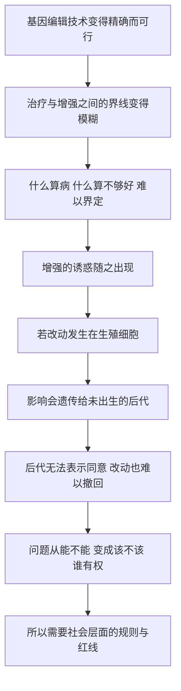

# 23｜谁有权改写生命？——「新人类」与伦理红线

> 当我们可以编辑细胞、设计后代，技术能力和道德许可之间的那条界线在哪里？

---

## 一、先说结论

穆克吉认为，细胞工程把人类带到了一个前所未有的岔路口。

问题的核心，不再是「我们能不能做到」，而是「我们该不该做、由谁来决定」。这里有一条关键的伦理区分：**体细胞编辑**只影响接受治疗的个人，**生殖细胞编辑**却会改变可遗传的基因，影响尚未出生、也无法表示同意的后代。

据公开报道，2018 年，中国科学家贺建奎宣布基因编辑婴儿出生，引发全球谴责，后被依法处理。这件事之所以震动世界，正因为它把一条原本停留在讨论层面的红线，拽进了现实。

穆克吉的态度可以概括为一句话：**技术能力不等于道德许可。**

---

## 二、我们先理解一个问题

前面我们已经走过了很长一段路：从认识细胞，到用细胞治病，到改造细胞。

移植、重编程、CAR-T、基因编辑——每一步都在扩大人类对生命基本单位的影响力。到目前为止，这些技术大多有一个共同点：它们改变的是**一个已经活着的、具体的病人**。

可现在，我们来到了一个分岔口。

如果被改动的不是某个病人的体细胞，而是卵子、精子或早期胚胎里的基因呢？那这项改动就不会随着这个人一起结束，而会传给他的孩子、孩子的孩子，一代代延续下去。

于是问题变得完全不同了：

> **我们是否有权替尚未出生的人，决定他们的基因？**

这不是一个技术问题，而是一个关于权利、责任和边界的问题。这一篇要回答的，正是这个岔路口。

---

## 三、作者到底提出了什么观点？

穆克吉的观点可以拆成三层。

第一层，是**技术现实的判断**：细胞工程已经强大到可以修改生命的基本代码。这不是遥远的想象，而是已经发生的临床现实。伦理问题因此不再是「未来的顾虑」，而是「当下的紧迫问题」。

第二层，是**他划出的关键区分**。伦理讨论中最重要的一条分界线，不在「编辑得多不多」，而在「改的是哪种细胞」：

| 类型 | 改的是什么 | 是否可遗传 | 伦理性质 |
|---|---|---|---|
| 体细胞编辑 | 病人自身的身体细胞 | 否，随个体结束 | 更接近常规医疗，争议相对较小 |
| 生殖细胞编辑 | 卵子、精子或早期胚胎 | 是，传给后代 | 触及代际伦理，争议极大 |

第三层，是**他的核心立场**：技术能力不等于道德许可。能编辑，不代表应当编辑；能做到某件事，也不自动回答「谁有权决定做这件事」。这是全书的收束，也是穆克吉给「新人类」这个副标题留下的追问。

需要明确：第一层是技术事实，第二、第三层是伦理判断与主张。伦理问题本就没有标准答案，穆克吉提供的是一个思考框架，而不是一纸裁决。

---

## 四、把这个观点翻译成人话

用手机来想这件事，会清楚很多。

给一台已经在用的手机**装一个新系统**，只影响这一台。装坏了，大不了重装、回退，或者干脆换一台——损失局限在这台设备上。

但如果去改动的是产品的**设计图纸**呢？

那意味着接下来出厂的每一台手机，都会带着这个改动。图线上一个不小心画错的参数，会被成千上万台设备继承下去；而且一旦这批设备流入市场，你不可能像召回系统更新那样，把它们全部收回。**改动是不可逆的，影响是扩散的。**

体细胞编辑，接近第一种：只修这一台设备。

生殖细胞编辑，接近第二种：改的是「设计图纸」，之后所有继承了这份图纸的人，都要承担这个改动的后果——而他们从未同意过。

这个类比里最要紧的一点是：**真正让伦理问题变得棘手的，不是「改」这个动作本身，而是「改动会被继承、无法撤回、且当事人无法同意」。**

---

## 五、为什么会这样？

把这条逻辑整理成一条链：

这条链里，**B 是最关键的一环。**

当技术只能处理明确的疾病时，伦理问题相对简单：治病救人，几乎不需要额外辩护。可一旦技术足够强大，「疾病」和「不够理想」之间的界线就开始模糊。

举个例子：某些严重的遗传病，绝大多数人都会同意应当治疗。可如果技术能降低常见病的风险呢？能提高某种能力呢？能让某个特征更符合某种审美呢？这些改动还算「治疗」吗？

**界线一旦模糊，判断的标准就不得不从科学转向价值。** 而价值问题，恰恰不是任何一位科学家或医生能单独决定的。

---

## 六、举一个现实生活中的例子

我们回到那个岔路口，把它想得更具体一点。

假设有家庭面临一个明确的遗传病风险，比如孩子有较高概率继承一种严重疾病。用技术去阻断这个风险，动机是清晰的：避免痛苦。

但如果技术不只是能避免疾病，还能调整别的特质呢？比如身高、代谢倾向、某些认知特征。每一项都有人觉得「这是好事」，问题在于：**当「避免疾病」变成「追求更优」，界线由谁来划？**

更关键的是那个「设计图纸」的问题。假设一位家长为尚未出生的孩子做了一项可遗传的改动。这个孩子长大成人后，无法表示反对——因为改动在他出生前就完成了，而且会继续传给他的孩子。

**这是一场当事人缺席的决定。** 它涉及的不是某个人是否愿意接受治疗，而是一个人从未被征询过意见，却要终生承担后果。

这正是为什么「生殖细胞编辑」会成为全球伦理讨论中最敏感的区域：它不只是一个医学决定，而是一个跨越时间的公共决定。

关于胚胎研究，学界和伦理界还长期参考一些具体界限，比如所谓「14 天规则」——即体外胚胎研究通常不超过某个早期发育阶段。这类规则的存在本身就说明：社会一直在尝试为「生命从哪一刻起值得保护」设下可以操作的标尺。

---

## 七、回到书中重新理解

现在再回看穆克吉为什么把全书的副标题落在「新人类」上，就明白了。

这本书从「细胞是生命的基本单位」讲起，一路讲到用细胞治病、改造细胞，最后收束在伦理问题上。这不是一个突兀的转折，而是一个逻辑上的必然：**当我们能够改写生命的基本单位，我们同时也就站在了重新定义「人」的门口。**

穆克吉并不是一个反技术的人。作为医生，他知道这些技术能救多少人的命。他的立场更像是：**正因为技术如此有力，我们才更需要对它保持清醒。**

这也让全书形成了一个完整的回环——开篇问的是「细胞是什么」，收尾问的是「当细胞可以被改写，人是什么」。前者是科学问题，后者是人的问题。穆克吉把这两端放进同一本书，正说明它们已无法分开。

而贺建奎事件之所以成为标志性案例，不是因为它技术上多么高深，而是因为它证明了：**红线一旦被越过，后果是真实且不可逆的。**

---

## 八、这个观点背后还有什么？

这个观点背后，有一个常常被默认、但其实很脆弱的前提：**我们能够在「治疗」和「增强」之间划出一条清晰的界线。**

现实往往没这么干净。

想想看：近视算不算「病」？身高偏矮算不算「问题」？我们今天的许多判断其实随社会变化而移动——昨天被视为「个性」，今天可能被当成「症状」；今天的「正常」，明天可能变成「可优化的项目」。

**一旦「什么是病」本身是可变的，「只允许治疗、不允许增强」这条原则执行起来就会非常困难。**

还有一层更深的隐含前提：**我们有权代表未来的人做决定。** 生殖细胞的改动，本质上是当代人对后代人的一次「代理决定」，而后代无法参与讨论，也无法事后退出。它不像普通医疗决策，可以建立在当事人的知情同意之上。

这也解释了为什么全球科学界围绕生殖细胞编辑更常见的立场是「暂停」而非「放行」：不是断言它永远不能做，而是承认我们目前既没有足够的安全证据，也没有足够的社会共识。

---

## 九、这个观点有问题吗？

有几处需要留心，而且这里的争议本身就是重点。

第一，**「治疗 vs 增强」的界线模糊，是反对严格禁止者最常用的论据。** 有人会问：如果能用同样的技术避免一种严重疾病，为什么不能用它去降低另一种风险？如果一次改动既降低患病概率、又顺带改变了别的特质，该怎么归类？界线不清，就可能出现两种相反的后果：要么禁令形同虚设，要么把合理的治疗也一并误伤。

第二，**关于生殖细胞编辑，是否存在全球共识，本身就有争议。** 一方面，不少国家和国际组织呼吁暂停或禁止可遗传的基因编辑；另一方面，也有人主张：如果能明确限定在「避免严重遗传病」的范围内，是否可以谨慎地开一个口子？把它说成「全世界一致反对」是一种简化。

第三，**全面禁止是否真能带来安全，也值得讨论。** 有观点认为，如果合法渠道被彻底关闭，需求可能转入地下或流向监管薄弱的地方，反而让风险更不可控。相反的意见则认为，正因为后果不可逆，宁可严格禁止也不能留口子。**双方的分歧不只是价值判断，也涉及对「禁令实际效果」的预测。**

第四，**贺建奎事件还引出一个更深的问题：谁有权做这个决定？** 是一个科学家、一对父母、一家机构，还是整个社会？据公开报道，事件后多国加强了对相关研究的规范与审查，但「由谁决定」至今没有全球统一答案。

所以更稳妥的态度是：**承认这是一片没有标准答案的区域。** 任何一方如果宣称问题已经解决、界线已经清楚，都值得警惕。

---

## 十、今天再看这个观点

（以下为现代延伸，非穆克吉原文）

如果把目光移到穆克吉写作之后的现实，会发现这条战线大致分成两条并行的轨道。

一条轨道是**体细胞基因编辑正在走向临床**。针对某些疾病的基因编辑疗法已进入应用阶段，用来修复病人自身细胞的致病突变。围绕它的争论主要集中在安全性、长期效果与费用，而不是「该不该允许」这种根本问题。

另一条轨道是**生殖细胞编辑，主流方向仍是审慎与暂停**。科学界与伦理界普遍呼吁：在安全性、有效性和社会共识都不充分之前，不应推进可遗传的基因编辑。各国监管尺度不一，但整体基调偏向谨慎。

与此同时，几个新变量正在加剧这场讨论的复杂性：基因编辑工具的精确度和易用度还在提高，技术门槛在下降；人工智能开始被用于分析和设计生物序列，可能进一步降低「设计」的难度；全球监管差异，则可能催生「医疗旅游」式的灰色地带。

这些延伸指向同一个核心：**技术前进的速度，很可能快于社会达成共识的速度。** 这本书最后的追问也落在这里——不是「技术会带我们到哪里」，而是「我们准备用什么规则，决定技术可以走到哪里」。

---

## 十一、这一篇真正应该记住什么？

1. **关键区分是体细胞与生殖细胞。** 前者影响个人、不可遗传；后者会传给后代、影响未出生的人也难以撤回，伦理性质完全不同。

2. **技术能力不等于道德许可。** 「能做到」不回答「该不该」。这是穆克吉对「新人类」最核心的提醒。

3. **治疗与增强的界线比看上去模糊。** 什么算「病」本身随社会变动，这使得规则在执行中很难保持清晰。

4. **生殖细胞编辑的核心难题是「同意」。** 被改动的后代从未被征询意见，却要终生承担后果，这是代际伦理的结构性困境。

5. **贺建奎事件是红线的现实警示。** 据公开报道，事件引发全球谴责并被依法处理；它证明了越线的后果真实而不可逆，但「谁有权决定」至今没有全球统一答案。

---

## 十二、留一个问题

让我们回到这本书开始的地方。

穆克吉告诉我们：细胞是生命的基本单位。从胡克在软木里看到的一个个小格，到魏尔啸的「细胞来自细胞」，人类花了几个世纪，才找到理解生命的那个最小坐标。

然后，我们学会了用它治病——移植、重编程、改造、编辑。医学正在走向「用细胞治病」的细胞医学，而这本书的副标题，最终指向「医学与新人类」。

于是，一切又回到了那个最初的问题，只是它现在有了前所未有的重量：

> **当我们能够改写构成生命的基本单位，我们到底是在治病，还是在重新定义「人」？**

如果有一天，技术足够安全、足够便宜、足够精确——「能不能」的问题彻底消失了——我们还能靠什么来决定「该不该」？

这或许才是这本书真正想留下的东西：它不是一个答案，而是一个我们必须长期带着走的问题。
