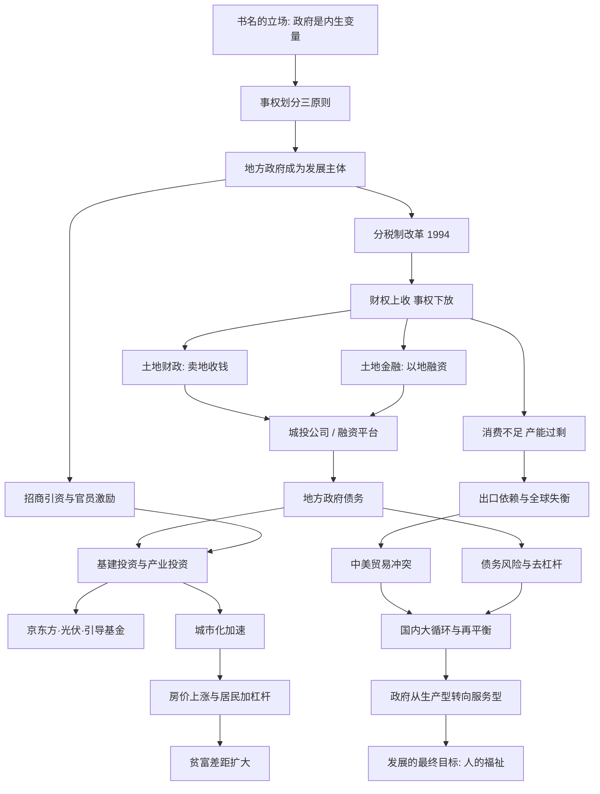

# 《置身事内》深度解读系列

## 系列简介

《置身事内：中国政府与经济发展》（兰小欢，2021）讨论的是一个被很多经济学教科书回避的问题：**在中国经济增长的过程中，政府到底扮演了什么角色？**

主流的「政府 vs 市场」框架，把政府看作市场之外的干预者：市场负责配置资源，政府负责纠正失灵。但兰小欢认为，这套框架解释不了中国。在中国的现实中，政府不是站在经济之外的「守夜人」，而是深度嵌入经济运行之中的参与者——它掌握土地、信贷、政策，亲自招商引资、办企业、搞投资、背债务。要理解中国经济，就必须把政府放进分析模型里，这就是书名「置身事内」的含义。

本书不喊口号，也不站队，而是用财税、城投、面板厂、光伏、房价、地方债、中美贸易这些具体机制，一层层拆开：地方政府为什么有动力发展经济？钱从哪里来？又是怎么背上债务的？今天的高房价、贫富差距、产能过剩、贸易冲突，和这套机制有什么关系？

本系列不按原书章节平均切分，而是按「认知难度 + 逻辑依赖」重新组织成 22 篇：先建立理解地方政府的钥匙，再讲钱袋子与债务，然后看政府在产业中的角色，接着解释宏观失衡现象，最后讨论转型与出路。每一篇只回答一个问题，连起来是一条从微观机制到宏观现象、再回到「发展是为了什么」的完整链条。

---

## 全书核心问题

用一句话概括：

> **在中国，政府究竟是经济增长的「外部条件」，还是增长本身的「内在机制」？**

拆成四个层次：

| 层次 | 问题 |
|---|---|
| 主体问题 | 为什么地方政府成了经济发展的主角？ |
| 机制问题 | 地方政府的钱从哪里来、又是怎么花、怎么背债的？ |
| 后果问题 | 高房价、贫富差距、产能过剩、中美冲突与这套机制有什么关系？ |
| 出路问题 | 政府角色需要如何转型，发展最终为了什么？ |

全书因果链：

```text
事权/财权如何划分
      ↓
地方政府成为经济发展的主体
      ↓
招商引资 + 土地财政 + 土地金融
      ↓
地方债务不断累积
      ↓
城市化加速、房价上涨、居民加杠杆
      ↓
贫富差距扩大、消费不足、产能过剩
      ↓
内外失衡 → 中美贸易冲突 → 债务风险
      ↓
政府角色必须转型
      ↓
发展最终为了人
```

---

## 全书知识地图



---

## 全系列目录

### 第一部分：钥匙——为什么必须「置身事内」（微观机制的地基）

---

### 01｜为什么“政府 vs 市场”理解不了中国经济？

核心问题：
为什么用「政府干预市场」的框架，解释不了中国过去四十年的增长？

核心观点：
在中国，政府不是市场之外的干预者，而是经济运行的内生参与者。要理解中国经济，必须把政府放进模型里面，而不是当作外生变量。

理解难度：★★☆☆☆

关键词：政府与市场、内生变量、置身事内

---

### 02｜地方政府的权力边界，究竟是谁划的？

核心问题：
地方政府能管什么、不能管什么，是由什么决定的？

核心观点：
事权划分有三条底层逻辑——外部性与规模经济、信息复杂性、激励相容。中国的地方政府在「信息本地化」的领域拥有很大自主权，这正是它有能力深度介入经济的原因。

理解难度：★★★★☆

关键词：事权、外部性、规模经济、信息复杂、激励相容

---

### 03｜为什么中国的地方政府像一个个「公司」？

核心问题：
为什么地方政府像企业一样在「做生意」？

核心观点：
地方政府掌握土地、信贷、政策等资源，通过招商引资参与竞争，形成「地方政府竞争」格局。政府像公司、地区像市场，这是中国增长的重要引擎。

理解难度：★★★☆☆

关键词：地方政府竞争、招商引资、发展型政府

---

### 04｜为什么地方官员拼命发展经济？

核心问题：
官员为什么要发展经济，而不是只求稳定？

核心观点：
财政压力（分税制后钱不够花）和政治激励（经济绩效是晋升的主要标尺）共同作用，使地方官员成为经济发展的积极推动者。

理解难度：★★★☆☆

关键词：政治激励、晋升锦标赛、财政压力

---

### 第二部分：钱袋子——分税制与土地财政

---

### 05｜1994 年分税制改革，到底改了什么？

核心问题：
一次财政改革，为什么重塑了之后三十年的地方政府行为？

核心观点：
分税制把财权上收中央、事权留在地方，造成「财权与事权不匹配」。地方财政从此长期承压，被迫寻找新的收入来源，土地财政由此登场。

理解难度：★★★★☆

关键词：分税制、财权与事权、中央与地方关系

---

### 06｜地方政府为什么离不开「土地财政」？

核心问题：
地方财政为什么高度依赖卖地收入？

核心观点：
分税制后财政缺口扩大，土地出让金成了地方最重要的「第二财政」。地方因此有强烈动机经营城市、抬升地价，形成了「征地—出让—再投资」的循环。

理解难度：★★★☆☆

关键词：土地出让金、第二财政、经营城市

---

### 07｜「土地财政」和「土地金融」有什么区别？

核心问题：
卖地收钱和用土地借钱，是同一件事吗？

核心观点：
两件事完全不同。土地财政是「卖地收钱」，土地金融是「以土地抵押融资」。后者把未来收益折现到今天使用，是地方债务扩张的关键机制，也是风险所在。

理解难度：★★★★☆

关键词：土地金融、抵押融资、未来收益折现

---

### 08｜地方债是怎么一步一步滚起来的？

核心问题：
今天巨量的地方政府债务，最初是怎么产生的？

核心观点：
城投平台以土地和财政作隐性担保，从银行和债券市场借钱搞基建。投资规模越大、债务越多；项目回报慢，只能「借新还旧」，债务因此滚动膨胀。

理解难度：★★★★☆

关键词：地方政府债务、隐性担保、借新还旧

---

### 第三部分：投资——政府如何当「股东」

---

### 09｜城投公司到底是一家什么公司？

核心问题：
城投公司为什么不完全是企业，也不完全是政府？

核心观点：
城投是地方政府的融资平台，靠政府信用和土地资产运作，干的是政府的活，却是市场化的融资主体。这种「模糊身份」既是活力的来源，也是风险的来源。

理解难度：★★★☆☆

关键词：城投公司、融资平台、政府信用、模糊身份

---

### 10｜京东方案例：政府为什么要「赌」一个产业？

核心问题：
地方政府为什么要花巨资投资一个长期亏损、强周期的面板产业？

核心观点：
面板产业资本极度密集、周期性强、又有战略外部性，单靠分散的市场资本难以承担。政府以股权投入和补贴「入场」，才有可能培育出本土产业链。

理解难度：★★★☆☆

关键词：京东方、产业政策、战略外部性、政府投资

---

### 11｜同样是给补贴，为什么光伏有时成就一个行业、有时一地鸡毛？

核心问题：
为什么产业政策有时成功，有时失败？

核心观点：
成败不取决于「补贴好不好」，而取决于是否顺应市场规律、是否维持竞争、是否能及时退出。政府能力是有边界的，产业政策本质是一场关于「何时收手」的考验。

理解难度：★★★★☆

关键词：光伏、产业补贴、产能过剩、政策边界

---

### 12｜政府引导基金，是不是「新瓶装旧酒」？

核心问题：
用基金做投资，和过去的直接补贴有什么本质不同？

核心观点：
引导基金试图用市场化方式配置财政资金，在「政府目标」和「市场纪律」之间找平衡。但它同样面临激励错配、行政干预和「只投不赚」的风险，不是万能解药。

理解难度：★★★☆☆

关键词：政府引导基金、财政资金市场化、激励设计

---

### 第四部分：失衡——宏观现象的根源

---

### 13｜房价为什么涨得这么快？

核心问题：
过去二十年，中国大城市的房价为什么持续上涨？

核心观点：
房价是城市化、土地供应、信贷扩张和地方政府动机共同作用的结果。核心矛盾是「人往大城市走，土地指标却不跟着人走」的结构性错配。

理解难度：★★★☆☆

关键词：房价、城市化、土地供应、人地错配

---

### 14｜居民为什么越来越敢借钱买房？

核心问题：
中国居民债务为什么在房价上涨中快速攀升？

核心观点：
房价持续上涨让房产成为最可靠的抵押品，家庭因此加杠杆买房，形成「房价—信贷—房价」的正反馈。这既支撑了增长，也埋下了金融风险的种子。

理解难度：★★★☆☆

关键词：居民债务、房贷、抵押品、正反馈

---

### 15｜经济高速增长，为什么贫富差距反而扩大？

核心问题：
为什么高速发展没有让所有人同步变富？

核心观点：
资产（尤其是房产）价格上涨快于劳动收入，加上户籍、土地等要素市场尚未完全市场化，财富向「有资产、有城市身份」的人集中，差距因此拉大。

理解难度：★★★★☆

关键词：贫富差距、要素市场、户籍、资产升值

---

### 16｜中国的债务风险，到底有多大？

核心问题：
中国会不会爆发类似欧美的债务危机？

核心观点：
中国债务以内债为主，储蓄率高，政府又掌控大量金融资源，因此短期爆发系统性危机的概率较低。但结构性风险和长期代价不容忽视，「不会崩」不等于「没有代价」。

理解难度：★★★★☆

关键词：债务风险、内债、高储蓄、系统性风险

---

### 17｜为什么要「去杠杆」？去的到底是谁的杠杆？

核心问题：
去杠杆为什么这么难，它到底在动谁的利益？

核心观点：
去杠杆主要针对地方融资平台和部分企业部门，但过程中容易引发信用收缩和经济下行。这是一道「既要降风险、又要稳增长」的两难题目。

理解难度：★★★★☆

关键词：去杠杆、信用收缩、债务化解、两难

---

### 18｜为什么中国消费不足、产能过剩？

核心问题：
为什么中国人生产很多，消费却相对太少？

核心观点：
收入分配、社会保障不足和户籍限制，压低了居民的消费倾向；而地方政府强力推动投资和生产，使供给能力远超国内需求，结果就是产能过剩和出口依赖。

理解难度：★★★★☆

关键词：低消费、产能过剩、内需、出口依赖

---

### 19｜中美贸易冲突的深层原因，只是贸易逆差吗？

核心问题：
中美贸易摩擦的根源到底在哪里？

核心观点：
贸易冲突是全球经济失衡的政治表现。中国高储蓄、高生产、低消费，与美国低储蓄、高消费形成互补又对立的关系。失衡无法长期持续，冲突是调整的激烈形式。

理解难度：★★★★☆

关键词：中美贸易、全球失衡、国内大循环、再平衡

---

### 第五部分：出路——政府角色的转型

---

### 20｜地区间竞争，给中国带来了什么？

核心问题：
地方政府之间的竞争，到底是好事还是坏事？

核心观点：
竞争带来了增长活力、基础设施和产业升级，也带来了重复建设、地方保护、债务膨胀和地区差距。它不是「好」或「坏」，而是发展模式的「一体两面」。

理解难度：★★★☆☆

关键词：地区竞争、重复建设、地方保护、效率与代价

---

### 21｜政府要从「生产型」转向什么？

核心问题：
过去有效的政府角色，为什么现在必须转型？

核心观点：
发展阶段变了，任务也变了。政府需要从「生产型政府」（直接推动投资和生产）转向「服务型政府」（提供公共服务、维护公平环境），这是增长模式转型的必然要求。

理解难度：★★★☆☆

关键词：生产型政府、服务型政府、转型

---

### 22｜经济发展的最终目标，应该是什么？

核心问题：
我们发展经济，最终到底是为了什么？

核心观点：
发展的目的不是增长本身，而是人的福祉和生活质量的提升。理解政府与经济的全部机制，最终要回到「人」这个目标上——这也是全书克制的温情所在。

理解难度：★★☆☆☆

关键词：以人为本、发展目标、生活质量

---

## 推荐阅读顺序

```text
01 → 02 → 03 → 04        （建立钥匙：地方政府为什么是主角）
      ↓
05 → 06 → 07 → 08        （钱从哪来：分税制与土地财政/金融）
      ↓
09 → 10 → 11 → 12        （怎么花：城投与产业投资）
      ↓
13 → 14 → 15 → 16 → 17 → 18 → 19   （宏观后果：失衡与风险）
      ↓
20 → 21 → 22             （反思与出路）
```

**三条阅读路径**（按读者需求）：

| 读者类型 | 建议路径 |
|---|---|
| 只想快速抓住主线 | 01 → 05 → 07 → 13 → 18 → 22 |
| 关心房地产与债务 | 05 → 06 → 07 → 08 → 13 → 14 → 16 → 17 |
| 完整系统学习 | 按 01 → 22 顺序通读 |

---

## 全系列质量检查（已完成）

| 检查项 | 结论 |
|---|---|
| 完整性 | 覆盖原书上下篇核心机制：事权、财税、城投、产业政策、城市化、债务、失衡、转型 |
| 连贯性 | 每篇结尾自然引出下一篇，22 篇构成一条因果链 |
| 独立性 | 每篇只回答一个核心问题 |
| 易懂性 | 每篇含大白话解释与生活例子，无专业背景可读 |
| 深度 | 每篇含「为什么会这样」的机制推演与 Mermaid 图 |
| 客观性 | 严格区分「兰小欢认为」「书中引用」「学界观点」「本系列延伸」 |
| 重复度 | 案例按分配表使用，核心案例各归一篇，交叉仅一句带过 |
| 延伸性 | 每篇第十节连接当代议题（AI、新能源、双循环等） |
