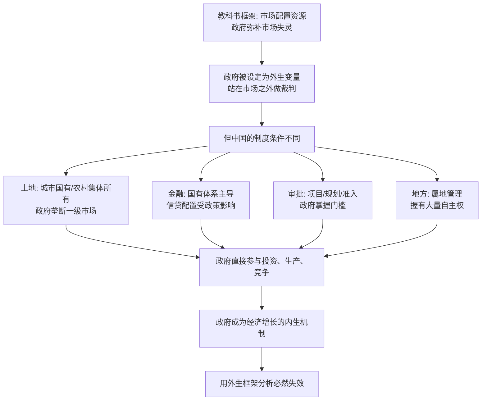

# 01｜为什么“政府 vs 市场”理解不了中国经济？

> 如果政府只是市场之外的"干预者"，那它为什么能长期、深度地参与中国经济的运行？

---

## 一、先说结论

兰小欢在《置身事内》里给出的答案，一句话就能说完：**在中国，政府不是市场之外的干预者，而是经济运行的内生参与者。**

这意味着一个很不一样的研究姿态。我们不是站在经济外面问"政府该不该插手"，而是先把政府放进经济的内部，问它"到底在做什么、怎么做的、受什么约束"。理解中国过去四十年的增长，钥匙不是"政府 vs 市场"这个二元对立，而是"政府置身事内"这件事本身。

---

## 二、我们先理解一个问题

我们脑子里大多装着一套很标准的经济学图景：市场负责配置资源，政府负责在市场失灵的地方出手纠偏——比如污染这类"外部性"问题、路灯这类"公共品"、买卖双方信息不对称的问题。

在这套图景里，政府和市场是两套东西。市场是主体，政府是补丁；市场是球员，政府是裁判。裁判可以吹哨、可以改规则，但他不会下场踢球，也不持有球队的股份。

于是我们很自然地用这套框架去套中国：政府是不是干预太多了？补贴是不是扭曲了市场？监管是不是压制了活力？这些问题本身不算错，但奇怪的是——**它们总是解释不了中国为什么能增长。**

四十多年里，中国政府一直在大规模地征地、批项目、给补贴、管信贷、办园区。按"干预越少越好"的逻辑，这类行为应该拖累增长才对，可现实是这段时间恰好是中国经济扩张最快的阶段。这中间一定有什么东西被这套框架漏掉了。

---

## 三、作者到底提出了什么观点？

兰小欢的核心主张是：**政府是中国经济的内生变量，而不是外生变量。**

所谓外生变量，就是那个站在模型外面、只在特定时刻进来敲一下的东西——你把它当成背景，算出结果后再考虑它的影响。所谓内生变量，是模型内部的一部分，它和 GDP、投资、就业一起被决定，也一起决定别人。

作者在书中反复展示的是：中国政府手上握着一整套关键资源——土地、信贷、政策、审批。它不是远远地看着市场运行，而是直接站在土地出让、基建投资、产业招商、企业融资的每一个环节里。既然它本来就长在经济体内，把它当作"场外因素"来分析，当然会看走眼。

书名《置身事内》四个字，说的正是这件事。

---

## 四、把这个观点翻译成人话

换个说法：我们习惯的模型，是把政府当成**裁判**；中国的地方政府，更像是**既当裁判、又当球员、还是俱乐部的股东**。

它制定规则（政策、审批），它下场踢球（自己组织投资、办园区、设平台公司），它还拿着股权（入股企业、提供土地和信用背书）。你如果坚持用"裁判不该下场"来分析，就会一直纠结它"犯规"，却始终没搞懂这场球是怎么踢起来的。

用"外生变量"去理解中国经济，有点像这样一件事：你想弄明白一支球队为什么年年夺冠，于是你收集了所有球员的跑动距离、传球成功率、射门转化率——数据很漂亮，但你从头到尾没看**规则是谁定的、场地是谁的、钱是谁出的、转会窗口谁在操作**。你算得很认真，可惜算错了对象。

**政府在中国经济里，不是那个偶尔吹哨的人，而是那个从规则、场地到球队都握着的人。**

---

## 五、为什么会这样？

这套"政府置身事内"的格局，不是谁设计出来的，而是由一系列制度和历史条件叠出来的。把作者的推理拆成链条，大致是这样：

这条链条里最关键的一步，是 **C → H**。

教科书框架默认了一个前提：要素市场是分散的、私人主导的，政府手里没有土地、没有银行、没有审批权。这个前提在它的发源地大致成立，所以"政府是外部补丁"讲得通。

但在中国，最关键的要素——尤其是土地和信贷——从一开始就不完全在市场手里，而是由政府和国有体系掌握。**当政府本身是最大的要素持有者之一时，它就不可能只当裁判。** 它必然要决定土地给谁、贷款给谁、项目批不批。这些决定，直接改变投资、就业和产出的走向。

于是就出现了一个特征：中国政府既是经济的管理者，又是经济的主要参与者之一。这两重身份叠在一起，就是"置身事内"。

---

## 六、举一个现实生活中的例子

想象你在看一场足球比赛，想知道哪支队更强。

第一种看法：只看球员。谁跑得多、谁传得准、谁射门狠，据此下判断。这就像只看企业的利润、营收、市场份额——很主流，也没错。

第二种看法：把球场上的"隐形玩家"也算进去。裁判的判罚尺度是宽松还是严格？规则有没有偏向某种打法？场地是天然草还是人工草？这支球队背后是不是有个愿意持续烧钱的老板？转会市场上它能不能买到人？

你会发现，**当你把这些"场外因素"补上，很多原本看不懂的比赛结果就突然讲得通了。** 一支个人能力一般的队，可能因为老板舍得投入、教练体系稳定、规则又恰好利好，年年压着天赋更好的对手打。

中国经济就是这样一个"场外因素极重"的比赛。地方政府就是那个既是老板、又是部分规则制定者、还在场上踢球、甚至持股球员的角色。如果你坚持"只统计球员数据"的分析方式，你当然会奇怪：为什么这个"球员"好像从来不会按常理出牌？为什么它亏几年也不退场？为什么它总能拿到别人拿不到的资源？

答案不在球员身上，在球场里。

---

## 七、回到书中重新理解

现在再回头看《置身事内》这个书名，就顺了。

兰小欢一开始没有急着评判政府做得好还是不好。他做的第一件事，是把"政府"从抽象的道德争论里拿出来，放回具体的制度现场：它到底掌握什么、这些资源从哪来、它面对什么约束、它如何行动。

这个顺序很重要。因为如果不先搞清楚"它怎么运转"，任何"它好不好"的讨论都是空的。你会用自己的想象去代替机制，最后得出的结论既不能解释过去，也不能预测未来。

理解了这一点，后面那些看起来技术性很强的内容——分税制、土地财政、土地金融、城投公司——就不再是一堆零散的知识点，而是**同一个机制在不同层面的展开**：政府既然置身事内，就必须解决"钱从哪来""活怎么干""风险谁担"这些问题，而这些制度就是它的答案。

---

## 八、这个观点背后还有什么？

**第一，它有一个隐含前提：二分法本身是有历史来源的。** "市场 vs 政府"不是自然的真理，而是特定历史经验的产物——它来自那些要素市场由私人主导、政府长期不直接经营的经济体。把它当成普适框架，本身就是一种偏见。

**第二，它改变了"评价政府"的方式。** 如果政府是内生参与者，那它就不再是一个"要不要存在"的问题，而是一个"以什么身份、受什么约束、效率如何"的问题。作者关心的正是后者。

**第三，它把风险一并带了进来。** 政府既然是增长引擎，也就同时是风险的集中点。它参与的领域越大，它的判断失误、它对地价和债务的依赖，就越可能变成系统性问题。这一点在书的后面会反复出现。

**第四，它和"发展型政府"的文献是相通的。** 经济学里早有一支研究东亚增长的脉络，讨论政府如何通过产业政策、信贷引导参与发展。兰小欢继承的正是这种更实证、更贴地的视角，而不是抽象的自由市场教条。

**第五，它是后面所有篇章的地基。** 不理解"政府在内"，你就无法理解为什么地方政府要卖地、为什么要办城投、为什么官员这么在意 GDP。

---

## 九、这个观点有问题吗？

有，而且争议恰恰不在"政府要不要干预"，而在**"政府在增长中的权重到底有多大"**。

支持的一方认为，这个视角明显比"政府 vs 市场"更贴近中国现实，它能解释很多标准模型解释不了的现象：超常规的基建速度、产业政策的成败、地方之间的激烈竞争。

但需要补充的是，质疑同样有力。一些经济学者强调，中国增长的主要动力来自市场化改革、民营经济的扩张、加入全球分工体系，政府更多是"松绑者"而非"建设者"；他们认为，把政府说成增长引擎，容易把那些恰恰源于"减少干预"的成就，错记到"增加参与"的账上。还有学者担心，内生视角如果用力过猛，会滑向"存在即合理"，把对政府效率的追问悄悄绕过去。

**所以争议的真正分歧点有两个：** 第一，政府在增长中的贡献占比有多高，是主因还是条件？第二，即便承认政府参与，它在哪些阶段、哪些领域是有效的，边界在哪里？兰小欢的立场更接近"具体机制、具体阶段、具体约束"，而不是"政府万能"。他没有说政府一定对，他说的是：先别急着贴标签，先看它怎么运转。

---

## 十、今天再看这个观点

**这是作者在书中的观点：** 政府是中国经济的内生参与者，理解增长必须把政府放进模型。

**以下是基于作者思想的现代延伸，不是书里的原话：** 这套逻辑在今天讨论平台经济、人工智能时，其实更容易看清楚了。当我们争论"政府该不该管 AI"时，我们又一次掉回了"政府 vs 市场"的旧框架。但现实是，算力、数据、产业基金、算力中心、行业标准，政府早就在里面了。真正有价值的提问不是"政府会不会插手"，而是"它这次以什么身份参与、受什么约束、和谁分担风险"。

换句话说，"置身事内"不只是一个关于过去四十年的解释，它更像一种看问题的方法：**先问机制，再下判断。**

---

## 十一、这一篇真正应该记住什么？

1. **政府是内生变量，不是外生补丁。** 在中国，政府掌握土地、信贷、政策和审批，直接参与投资与生产，把它当"场外因素"分析必然出错。

2. **"政府 vs 市场"来自特定历史经验。** 它默认要素市场由私人主导、政府不直接经营，这个前提在中国并不成立。

3. **《置身事内》是一种研究姿态。** 先理解"如何运转"，再讨论"好不好"，顺序不能颠倒。

4. **参与带来力量，也带来风险。** 政府越是增长引擎，就越可能是系统性风险的集中点。

5. **争议的关键是权重与边界。** 学界对"政府在增长中占多大分量""在哪些领域有效"仍有分歧，不宜把单一视角当定论。

---

## 十二、留一个问题

> 如果政府从来都在赛场之内，那么我们要评价它，该用哪一套标准？
> 用"裁判是否公正"的标准，还是用"球员是否高效"的标准？
> 这两套标准，能不能混着用？

---

**下一篇**：既然政府置身事内，那它到底能管什么、不能管什么？这条边界是谁划的，又依据什么划？下一篇，我们从"事权"这个词说起——**地方政府的权力边界，究竟是谁划的？**
