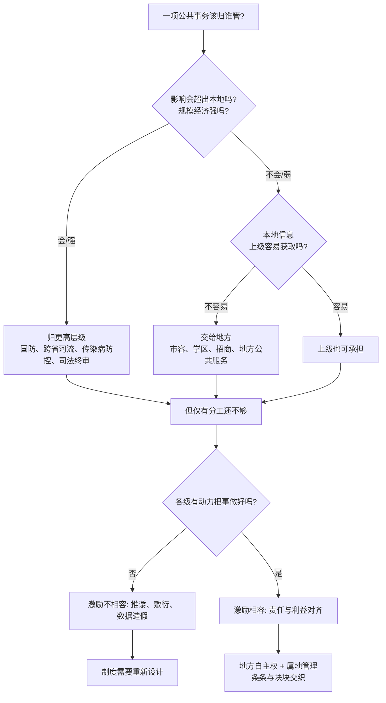

# 02｜地方政府的权力边界，究竟是谁划的？

> 地方政府能管什么、不能管什么，是由什么决定的？

---

## 一、先说结论

兰小欢在书中梳理出的答案是：**事权划分不是拍脑袋定的，它背后有三条底层逻辑——外部性与规模经济、信息复杂性、激励相容。**

其中对中国影响最深的一条，是"信息复杂性"。因为大量事务的信息只有本地掌握得最清楚，上级很难低成本地获取，所以中国的地方政府在公共服务、市容管理、招商引资这些领域，拥有比一般国家大得多的自主权。

理解了这三条逻辑，你就能回答一个看起来很朴素、其实很关键的问题：为什么有些事必须中央管，有些事偏偏只能地方管？

---

## 二、我们先理解一个问题

一个国家的公共事务成千上万，按道理总得有个分工：哪些归中央，哪些归地方。

可只要多想一步，问题就来了。国防、外交、货币发行，这些显然归中央——没有哪个省能自己造航母、自己发钞票。但垃圾清运、街道照明、中小学划片、菜市场管理，这些又显然归地方。

真正棘手的是中间那一大片：跨省的高铁、大江大河的治理、传染病的防控、司法的终审、环境保护的标准。这些事务既涉及多个地方，又高度依赖本地执行。它们到底该归谁？

如果只凭"重要不重要"来判断，就会陷入死循环——所有事看起来都重要，那是不是都该中央管？可如果全归中央，中央又根本管不过来。**这条边界一定有某种更底层的逻辑在划，而不是靠重要性排序。**

---

## 三、作者到底提出了什么观点？

兰小欢在书中指出，事权划分大体遵循三条原则。

**第一条，外部性与规模经济。** 一件事的影响如果超出了本地范围，或者它的成本效益会随规模扩大而显著改善，那就应该由更高层级的政府来负责。国防之所以归中央，是因为一个省搞国防，好处会被别的省分享（正外部性），没人愿意自己掏钱；同时国防的规模经济极强，分散搞也搞不起。

**第二条，信息复杂性。** 如果一件事的本地信息只有本地掌握得最清楚，上级要获取这些信息的成本极高，那么这件事就应该交给地方。街道哪里堵、哪个学校学位紧张、哪家企业值得扶持，这些信息上级很难靠报表看清楚。

**第三条，激励相容。** 制度设计要让各级政府的利益和责任对齐，让它们有动力把事情真正做好，而不是只顾对上负责或只顾本部门利益。

作者强调，中国的特殊性在于**属地管理**——大量事务按"地"划分责任，地方政府在土地、规划、金融、审批上握有很大自主权；同时"条条"（中央各部门往下延伸的系统）和"块块"（地方政府）相互交织。中央与地方的关系，不是简单的"分权"或"集权"，而是一种**不断调整的平衡**。

---

## 四、把这个观点翻译成人话

先不谈国家，说一个小区。

小区里有些事必须由全体业主共同决定，比如围墙、大门、监控系统、消防通道——因为这些东西一修好，整栋楼的人都受益，而且修一套就够了，各家自己修反而浪费。这就是"外部性 + 规模经济"。

另一些事则天然属于各家各户：你家晚饭吃什么、孩子报哪个兴趣班、门口要不要放鞋架。物业不可能比你更清楚这些，硬要替你决定，只会又慢又离谱。这就是"信息复杂性"。

还有一层更微妙的：就算你把前两条分得很清楚，如果负责的人没有动力去做，制度照样运转不起来。比如物业费怎么收、公共维修基金怎么用，如果规则设计得让某些人觉得"干好干坏一个样"，那再清晰的分工也白搭。这就是"激励相容"。

**国家划分事权，和小区划分物业职责，是同一类问题：谁能获得信息、谁承担后果、谁有动力去做。**

---

## 五、为什么会这样？

把三条原则合起来看，它们其实分别对应三个不同的约束。用一张图来梳理：

这张图里最重要的一跳，是 **D → E**。

它解释了为什么中国的地方自主权特别大。中国是个超大规模的国家，人口多、地区差异大、情况变化快。中央如果想把每个地方的具体信息都收上来再统一决策，信息传递的成本高得离谱，而且等决策传回去，情况可能已经变了。所以在"信息本地化"的领域，把决定权交给地方，反而更有效率。

但**光有信息优势还不够，还得有动力**。这就是为什么"激励相容"是三条里最难的一条。信息在谁手里，决定了谁适合做决定；而激励设计得好不好，决定了这个人愿不愿意认真做。中国地方政府之所以在招商和发展上表现得那么积极，很大程度上正是因为这两条同时成立：既掌握本地信息，又有动力去行动。

---

## 六、举一个现实生活中的例子

想想一家公司总部与分公司的分工。

哪些决策必须总部定？品牌标准、财务合规、核心技术的研发方向、跨区域的大额投资、统一的薪酬体系。为什么？因为这些事情要么影响整个公司（外部性），要么集中做才划算（规模经济），要么必须口径一致，否则各分公司各行其是，公司就散了。

哪些决策必须交给分公司？本地招什么人、跟本地客户怎么打交道、在本地投哪些广告、如何应对本地的竞争对手。为什么？因为只有分公司天天泡在这个市场里，知道隔壁那家店在打折、知道这里的客户更看重服务而不是价格、知道本地哪个渠道转化最好。**这些信息，总部坐在办公室里是看不出来的。**

一个真实的公司如果搞反了，后果很清楚：总部硬要插手本地营销，出的方案往往水土不服；分公司擅自改品牌、乱承诺，总部又会失控。

这正好对应中国的"条条"和"块块"。"条条"像是总部的各个职能部门——财政、税务、环保、教育，各自有从上到下的系统；"块块"像是各分公司——省、市、县，对本地的整体运转负责。一个人的日常工作，往往同时受"条条"的业务指导和"块块"的属地管理。**两套系统交织，正是中国治理结构最鲜明的特征之一。**

---

## 七、回到书中重新理解

现在再回头看作者讲的"属地管理"，就容易理解了。

中国的地方政府在土地、规划、金融、审批上有很大自主权，不是因为它"争"来的，而是因为大量事务的信息本来就属于本地。一块地该怎么用、一个园区该招什么产业、一个项目该不该批，这些判断高度依赖本地知识，上级若事无巨细地管，反而会降低效率。

但作者同时提醒：这套安排不是一成不变的。中央与地方之间的边界，会随着时代、技术、风险和治理目标不断调整。有时候上收，有时候下放。所以正确的说法不是"中国是分权国家"或"中国是集权国家"，而是**中国的央地关系是一种动态平衡**。

理解了这一点，也就理解了后面为什么地方政府会像一个公司那样去经营。因为它确实被授予了相应的权力，也确实要为本地的发展结果负责。

---

## 八、这个观点背后还有什么？

**第一，信息复杂性其实是核心变量。** 外部性和规模经济相对客观，容易判断；而"信息在谁手里"是一个更本质的问题。它决定了权力的实际分配，也解释了为什么同样的制度在不同国家会长出不同的样子。

**第二，激励相容是最难的一条，也最容易被忽略。** 只要激励没设计好，再合理的分工也会执行走样——上级的要求被敷衍，地方的选择被扭曲，数据被美化。

**第三，这条边界本身是有代价的。** 地方自主权大，意味着各地政策可能不统一、可能互相设障。效率和统一之间，天生存在张力，没有两全其美的方案。

**第四，它为后文埋了线。** 既然地方政府被赋予这么大的自主权，又必须为本地发展负责，那么它接下来会怎么做？答案就是：像企业一样去经营、去竞争。这是下一篇的主题。

---

## 九、这个观点有问题吗？

三原则是一套很有解释力的分析框架，但它不等于精确公式。真正值得追问的地方在于：**这条边界应该更偏向中央，还是更偏向地方？**

倾向地方的人强调信息效率：本地信息只有本地清楚，过度上收会牺牲灵活性和准确性，还会制造官僚主义。倾向中央的人则指出，地方自主权过大可能带来另一类问题——市场被地方割裂（地方保护）、重复建设、标准不统一、跨区域问题（如污染、河流、公共卫生）没人真正负责。

**争议的真正分歧点是：** "信息本地化"带来的效率收益，是否足以抵消"政策不统一"带来的成本？这个问题在不同领域、不同发展阶段答案并不相同，学界也没有共识。

还有一层需要补充：三原则中，"激励相容"很难被量化。你怎么知道某一级政府"有动力把事情做好"？考核指标一旦设定，本身又会改变行为，甚至催生新的扭曲——你考核什么，下面就盯着什么。所以框架能帮我们理解机制，却不能替我们直接给出制度答案。

作者的态度是克制的：他讲的是"机制如何运转"，而不是"哪种划分更好"。

---

## 十、今天再看这个观点

**这是作者在书中的观点：** 事权划分遵循外部性与规模经济、信息复杂性、激励相容三条原则，中国因属地管理而赋予地方较大自主权。

**以下是基于作者思想的现代延伸，不是书里的原话：** 数字技术正在悄悄改变"信息复杂性"这个变量的值。过去上级难以获取本地信息，是因为传递成本高、口径不统一、层层上报会失真；今天，卫星遥感、大数据平台、全国统一的政务系统，让一部分原本"只有本地知道"的信息，变得可以低成本地上收和比对。

这会带来一个自然的推论：**当信息不再那么本地化时，事权划分的理由也会发生变化。** 环境监测、税源管理、社保统筹这些领域，已经出现了上收和统一的趋势。这大概就是"全国统一大市场"背后的一层技术条件。

但也要警惕一个反直觉的地方：**数据的"可获取"并不等于"可理解"。** 上级能收到数据，不代表能理解本地的实际处境。信息可以传输，判断依然需要在地经验。所以技术会改变边界的位置，但未必会取消边界本身。

---

## 十一、这一篇真正应该记住什么？

1. **事权划分有三条底层逻辑。** 外部性与规模经济、信息复杂性、激励相容，分别回答"影响谁""谁知道""谁有动力"。

2. **信息复杂性最影响中国。** 正因为大量信息只有本地清楚，地方政府在公共服务、市容、招商等领域才拥有很大自主权。

3. **"条条"与"块块"交织是中国特色。** 部门系统与属地政府纵横交错，共同构成了地方治理的实际结构。

4. **央地关系是动态平衡。** 不是简单的分权或集权，而是随条件不断调整的边界。

5. **效率和统一之间存在永恒张力。** 地方自主带来灵活，也带来不统一，没有无代价的最优解。

---

## 十二、留一个问题

> 如果地方自主权的核心理由是"本地信息只有本地清楚"，
> 那么当技术让上级也能低成本地掌握这些信息时，
> 地方自主权的理由，还成立吗？

---

**下一篇**：边界划清了，权力也拿到手了。可地方政府拿着这些权力，到底做了什么——为什么它表现得越来越不像一个提供公共服务的机构，反而像一个在市场里拼杀的公司？下一篇，我们来看**为什么中国的地方政府像一个个"公司"。**
