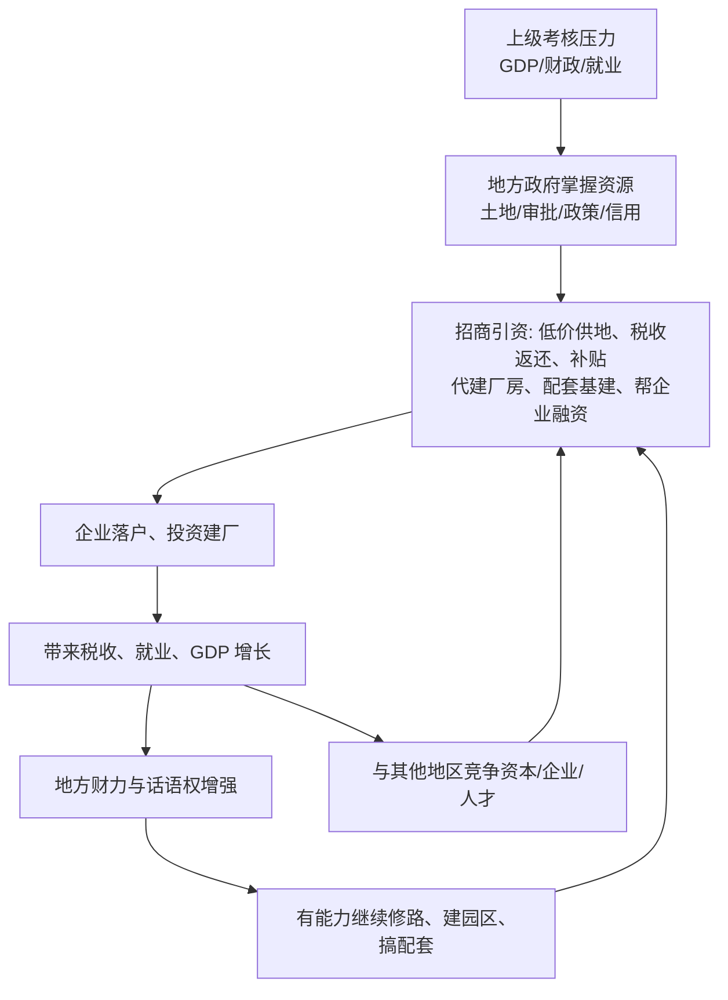

# 03｜为什么中国的地方政府像一个个「公司」？

> 为什么地方政府像企业一样在"做生意"？

---

## 一、先说结论

兰小欢在书中用"地方政府竞争"来解释中国的增长：**地方政府掌握土地、信贷、政策等资源，通过招商引资参与竞争，地区之间争夺资本、企业和人才。政府像公司、地区像市场，这构成了中国经济增长的重要引擎。**

换句话说，中国的经济竞争，不只是企业与企业之间的竞争，也是地方政府与地方政府之间的竞争。谁能招到好企业、拉来大投资、留住人才，谁就在这场竞赛里领先。

---

## 二、我们先理解一个问题

按教科书的理解，政府的职责是提供公共服务：修路、办学、维护治安、保护环境。它不该自己对市场里的输赢感兴趣，更不该像个商人一样去算计投入产出。

但在中国，你会看到一个很不一样的地方政府形象：它主动出击去找企业谈项目，愿意倒贴钱把大厂请进来，为一个招商引资项目开无数次协调会，市长带队去外地"敲门招商"是常见的事。

这就产生了一个矛盾：**一个本该中立的公共服务机构，为什么表现得像一个拼命拉客户的销售公司？**

这个问题不是细节。因为在过去几十年里，这种"像公司一样的地方政府"，恰恰是中国基础设施、制造业和产业集群快速崛起的重要推手。

---

## 三、作者到底提出了什么观点？

作者在书中指出，中国的地方政府确实具备"公司"的很多要素：

它**有资源**——土地、审批权、政策工具、甚至对地方金融的影响力；
它**有目标**——GDP、财政收入、就业、产业升级；
它**有考核**——上级给的 KPI，一层层压下来；
它还要**经营城市**——像一个 CEO 那样盘算，怎么把本地的资源盘活、把产业做起来、把钱留住。

于是地区之间就形成了一种竞争格局。地方政府争夺的对象，主要是资本、企业和人才。谁的条件更好、效率更高、服务更到位，谁就更容易赢。

作者强调，这种"地方政府竞争"是理解中国增长的常用框架。**它把地方政府从"守夜人"变成了"参赛者"，而这个转变，正好补充了上一篇说的"置身事内"。**

---

## 四、把这个观点翻译成人话

你可以把一个地方政府想象成一个巨大的控股公司。

市长、书记像这个公司的董事长和 CEO，要对整个"公司"的业绩负责。下面的各个部门——发改、财政、国土、招商、工信——像不同的业务线：有的管钱，有的管地，有的管项目审批，有的专门负责拉客户。

像 CEO 一样，这个"公司"也要算账：这块地给谁最能带来后续收益？这个项目虽然要补贴，但能带来多少税收和就业？隔壁市给了什么条件，我该给什么？

**一个地方政府盘活本地的土地、政策和信用去吸引企业，和一家公司配置自己的资源去争夺订单，逻辑是相通的。**

理解了这个类比的边界，也就理解了地方政府的处境：它不像真正的公司那样只追求利润，也不用面对破产清算，它追求的是"发展"这个更复杂的综合目标。

---

## 五、为什么会这样？

地方政府的"招商引资"不是一次性的动作，而是一个会自我强化的循环。用一张图看：

这个循环里最关键的一步，是 **B → C → D**：政府先"让利"，企业先"落户"，收益后面才回来。

这恰恰解释了为什么地方政府愿意补贴、愿意低价供地、愿意先修路再招商——因为它算的不是单笔账，而是整个循环的账。一个项目短期看是亏的，但如果它能带动配套企业、抬高本地地价、扩大税基，长期可能就赚回来了。

而推动这个循环不停转动的东西，是**竞争压力**：你不去招，企业就去别的市；别的市给了更优惠的条件，你这边就留不住项目。地区之间争夺资本、企业和人才的这场竞争，让每个地方政府都不敢松劲。

---

## 六、举一个现实生活中的例子

想象几个相邻的大型商场，同时盯上了同一个网红品牌，都想把它招进自己的场子。

A 商场说：租金给你免一年。
B 商场说：不光免租，装修费我出一半，还给你最好的中庭位置。
C 商场更狠：前面这些都有，我再帮你做半年全城广告，还专门为你调整楼层的客流引导。

品牌方最后挑一个进去。为什么这些商场愿意这样"倒贴"？因为它们算的不是"收这个铺子的租金划不划算"，而是"这个品牌进来之后，能带来多少客流、会不会吸引别的品牌跟进来、整个商场的估值会不会提高"。

这和地方政府的招商逻辑几乎一模一样：低价供地、税收返还、财政补贴、代建厂房、配套修路建园区、帮企业协调融资……**都是"先让利、后收租"，赌的是整个大盘做起来之后的回报。**

不同的是，商场之间抢的是品牌，地区之间抢的是资本、企业和人才；商场会破产关门，地方政府却不会。这个差别，后面会变成很重要的问题。

---

## 七、回到书中重新理解

有了这个背景，再去看书中列举的那些招商手段，就一点不奇怪了：低价供地、税收返还、财政补贴、代建厂房、配套基建、帮助企业融资——它们不是零散的"优惠措施"，而是同一套竞争逻辑下的标准动作。

作者在这里非常克制地没有展开细节。他提到，这些动作背后牵涉到更深层的制度安排——钱从哪里来、地怎么供、信用怎么用，那是后面几篇要专门处理的问题。在本书这里，他只需要你记住一件事：**地方政府是一个有资源、有目标、有 KPI 的竞争者，它会为了发展主动出击。**

理解了"像公司"，你也就理解了为什么中国的基建能修得那么快、为什么产业集群能形成得那么集中、为什么各地对"大项目"如此渴望。这些现象背后，站着同一类行为者。

---

## 八、这个观点背后还有什么？

**第一，"地方政府竞争"需要对手之间能自由流动的企业。** 如果企业不能自由选址、不能选择去哪个地方投资，竞争就无从谈起。所以这个机制隐含的前提是：存在一个企业用脚投票的市场。

**第二，竞争的实质是资源配置权。** 地方政府之所以能竞争，是因为它手里真的握着土地、审批和信用这些资源。如果它只是执行命令的办事机构，就既没有筹码，也没有动力。

**第三，"政府像公司"这句话的真实边界值得留意。** 真正的公司以利润最大化为核心约束，亏损了会被市场淘汰；地方政府不以利润为唯一目标，也不会破产清算。这个差别决定了它的竞争可能更长期、更激进，也更不计短期成本。

**第四，它为下一篇埋了线。** 既然是竞争，就得有人愿意拼。地方官员为什么那么拼？这背后是另一套激励结构——这是下一篇要回答的问题。

**第五，作者的态度仍然是中性的。** 他不认为"政府像公司"天然好或天然坏，他关心的是：在什么阶段、什么条件下，这种模式有效；条件变化后，它是否会变成负担。

---

## 九、这个观点有问题吗？

有说服力的一面很明显：地方政府竞争确实解释了中国基建的高速度、产业集群的形成、以及各地对营商环境的普遍重视。

但争议同样尖锐。**分歧点在于：这到底是一种"有效竞争"，还是一种"扭曲竞争"？**

支持者看到的是效率：地方政府为了争项目，不得不想办法改善服务、压低成本、提高办事速度，这本身就是一种市场化的约束。

批评者看到的是代价：为了抢项目，地方可能低价甚至亏本供地、无底线补贴，导致重复建设（各地都建相似的园区和产业园）、产能过剩、地方保护（明里暗里给外地企业设障）、债务膨胀。他们还指出，地方政府毕竟不是企业，不用破产，所以它的"竞争"可能变成"不计成本、不用还账"的竞争，最后风险和成本被转嫁给整个社会。

**还有一个更根本的质疑：** 地方政府竞争的作用是否被高估了？一些学者认为，增长的主要动力来自民营企业的市场活力和对外开放，地方政府更多是"搭台"而不是"唱戏"；把增长功劳过多地归给地方政府竞争，可能夸大了行政力量的作用。

作者没有简单站队。他的处理方式是：承认竞争有正反两面，关键看阶段和约束条件——在基础设施和产业从无到有的阶段，这种竞争可能是高效的；但当产能过剩、债务高企、要素回报下降之后，同样的竞争就可能带来严重浪费。

---

## 十、今天再看这个观点

**这是作者在书中的观点：** 地方政府掌握资源、设立目标、招商引资，形成地区之间的竞争，是中国增长的重要引擎。

**以下是基于作者思想的现代延伸，不是书里的原话：** 这套"地方政府像公司"的逻辑，在今天的平台经济里能找到几乎一模一样的翻版。平台像"地方政府"，商家像"企业"：平台用补贴、流量倾斜、降低佣金去争抢优质商家，商家在多个平台之间比价和选择。平台之间抢商家，和地方之间抢企业，是同一种"用资源换参与者"的结构。

但有一个关键差别值得记住：**平台会亏损、会倒闭，地方政府不会。** 所以当平台"补贴大战"打不下去时，市场会强制它退出；而当地方政府的招商竞争打得过度时，缺乏一个同样的退出机制。今天推进"全国统一大市场"，在很大程度上就是在降低这种地区间竞争造成的摩擦成本和重复浪费——让要素流动更顺、让地方保护更难。

---

## 十一、这一篇真正应该记住什么？

1. **地方政府像公司。** 它有资源、有目标、有 KPI，要像经营企业一样"经营城市"。

2. **核心行为是招商引资。** 低价供地、税收返还、补贴、代建厂房、配套基建、帮企业融资，都是标准动作。

3. **竞争发生在地区之间。** 争夺的对象是资本、企业和人才，谁的条件更好谁就领先。

4. **它有正面作用。** 推动了基建、营商改善、效率提升和产业升级，是中国增长的重要引擎。

5. **它也有代价。** 重复建设、地方保护、补贴过度、债务膨胀，且地方政府不会破产，缺少天然的退出机制。

---

## 十二、留一个问题

> 如果地方政府像一个公司，那么它的"股东"是谁？
> 当这个"公司"做了一笔长期亏本的招商投资时，
> 谁来让它停下来、谁来承担损失？

---

**下一篇**：竞争要有人去打。地方政府为什么会有那么强的动力去拼经济？市长、书记们为什么一个个都像"业绩狂"？这背后的激励结构是什么？下一篇，我们来看**为什么地方官员拼命发展经济。**
