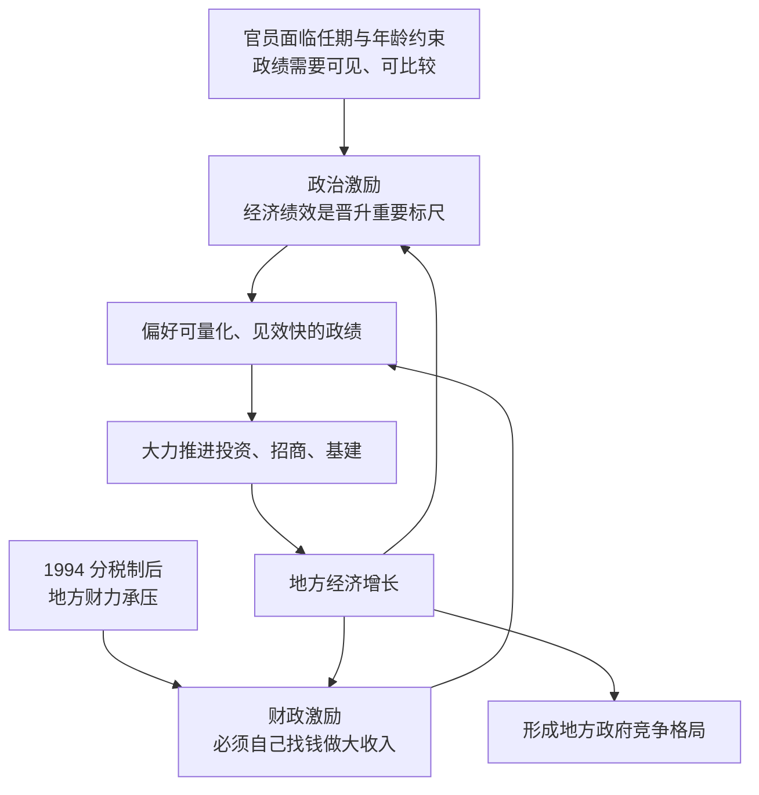

# 04｜为什么地方官员拼命发展经济？

> 官员为什么要发展经济，而不是只求稳定？

---

## 一、先说结论

兰小欢在书中给出的答案有两条腿：**财政压力与政治激励共同作用，使地方官员成为经济发展的积极推动者。**

一条是政治激励：经济绩效长期是官员晋升的重要考核标尺，上级用可量化的指标来比较下级，学界常引用周黎安的"晋升锦标赛"来描述这种竞争。另一条是财政激励：地方政府的钱要自己想办法，发展经济直接关系到本级政府能不能正常运转。

两条腿一起用力，就解释了那个乍看不太自然的现象——为什么官员们一个个像"业绩狂"。

---

## 二、我们先理解一个问题

对一个官员来说，"不出事"看起来是最安全的选择：不冒险、不折腾、按部就班，稳稳当当地熬资历。

可现实中，中国的地方官员普遍表现出一种强烈的"发展冲动"：抢项目、上工程、拉投资、拼增速，甚至不惜为一个大项目反复开会、亲自出马。

这就带来一个问题：**发展经济是有风险的——投错了会被追责，借多了会留下债务。既然求稳更安全，为什么官员们偏偏选择拼？**

这不是性格问题。它背后一定有某种制度性的原因，让"拼发展"成为一个官员的理性选择，而不是冒险。

---

## 三、作者到底提出了什么观点？

作者在书中指出，地方官员的动力来自两条激励线。

**第一条是政治激励。** 经济绩效长期是晋升的重要考核标尺。官员的政绩需要被上级看见、被量化比较，而 GDP 增速、财政收入、固定资产投资这类指标恰恰是最容易被量化和排名的。书中引用了周黎安提出的"晋升锦标赛"概念，用来描述这种围绕经济绩效展开的晋升竞争。

**第二条是财政激励。** 地方政府的钱主要得自己想办法。1994 年的分税制改革之后，财力上收、事权未同比上收，地方必须自己"找钱"（分税制的细节这里只提一句，留给下一篇展开）。地方要运转、要发工资、要搞建设，就得靠发展经济做大本地的税基和收入。

两条腿合起来，就把官员推向同一个方向：**发展经济，既是升迁的希望，也是活下去的需要。**

---

## 四、把这个观点翻译成人话

把官员想象成一个在特定考核制度下工作的人。

他的"KPI"里，GDP、财政收入、就业这类指标权重很高。这些指标有几个特点：**可量化、可比较、见效相对快。** 上级喜欢这样的指标，因为它们能一眼看出谁干得好；下级也只能围绕着它们去努力，因为其他东西很难说清楚。

于是，"发展经济"对官员来说，就成了一件**既利于晋升、又利于本级运转**的事。他不是天生爱折腾，而是他所处的制度环境，把"折腾"标注成了理性选项。

**换句话说：不是官员特别想拼，而是这套激励让他拼了才有回报。**

---

## 五、为什么会这样？

把政治激励和财政激励各自的作用链条画出来，会更清楚：

这条链里最关键的一处，是 **A → E**。

官员的职业生涯有两道硬约束：任期是有限的，年龄也是有窗口的。一个官员不能无限期地等一个长期项目慢慢见效，他必须在自己的任期内做出看得见的成绩。这就让他天然偏好那些**短周期、可量化、成果明显**的事情——上项目、修路建园区、引企业，恰恰都符合这个特征。

同时，财政激励给了另一重推力。地方要养人、要办事、要发展，钱从哪来？主要靠自己发展经济、扩大税源。这不像政治激励那样"向上比"，而是"向下压"——**本级的日常运转，本身就依赖于经济增长。**

当政治激励和财政激励指向同一个方向时，官员的行为就不再是个人选择，而是制度的产物。多个官员、多个地区同时这样做，就形成了上一篇讲的地方政府竞争。

---

## 六、举一个现实生活中的例子

想象一所学校里的两位班主任。

学校年底评比优秀班级，主要看几个硬指标：平均分、升学率、竞赛获奖人数。这两个指标可以量化、可以排名、可以在全体教师会上公布。两位班主任心里都清楚：今年的排名，既关系到年终奖金，也关系到明年能不能被提拔当年级主任。

于是他们各自想办法：一位狠抓早晚自习、组织模拟考、给尖子生开小灶；另一位调整教学方法、请家长配合、重点突破薄弱科目。

你会发现，他们不是天生爱攀比，而是**考核标准本身塑造了他们的行为**。学校考核平均分，他们就盯平均分；假如学校改成考核学生的身心健康和综合素质，他们的做法立刻就会不一样。

地方官员面对的情况非常相似。GDP、财政收入、投资增速，就像当年的"平均分和升学率"——可量化、可比较、直接关系前途。**他们之所以拼命发展经济，很大程度上是因为这套"考核指挥棒"就指向那里。** 这也是为什么考核指标的变化，会真实地改变官员的行为方式。

---

## 七、回到书中重新理解

现在再回头看书中关于官员激励的论述，就顺了。

作者讲的不是"中国官员觉悟高"，而是一套冷冰冰的机制：在一个以经济绩效为主要考核标尺的体系里，官员的年龄、任期、考核压力共同作用，使"推动经济增长"成为最符合他们利益的选择。

这里面有几个具体变量值得注意：

- **任期**：任期有限，意味着官员偏好短期内能见效的政绩；
- **年龄**：晋升有年龄窗口，过了某个阶段机会变小，动力结构会随之变化，有的更急于出成绩，有的则趋于保守；
- **考核**：考核什么就重视什么，指标设计直接决定行为方向。

理解了这些，"为什么地方官员拼命发展经济"就不再是一个道德问题，而是一个激励问题。**发展经济对官员之所以是理性选择，是因为制度把回报放在了那里。**

---

## 八、这个观点背后还有什么？

**第一，它隐含了一个前提：经济绩效能够被有效、准确地考核。** 如果指标可以被操纵、被注水，那么考核越强，扭曲可能越大。这也是为什么"数据质量"在这个体系里格外重要。

**第二，这套激励有副作用。** 偏好短期可见的政绩，天然会带来"重投资、轻民生""重速度、轻质量""重当下、轻长远"的倾向——修一条看得见的路，比改善一个看不见的治理细节更容易被认可。

**第三，它是"地方政府像公司"的发动机。** 上一篇讲地方政府像公司，这一篇讲的是：那个"公司"里的人，为什么愿意这么拼。两者是一体两面。

**第四，它本质上是"委托—代理"问题的一个版本。** 上级是委托方，希望地方发展得好；官员是代理方，会按考核信号行动。怎么设计考核，才能既激励又不过度扭曲，是永恒的难题。

**第五，它把代价也带进了视野。** 激励越强，行为越激进，债务、重复建设、环境代价也越容易被透支出去。

---

## 九、这个观点有问题吗？

"晋升锦标赛"是一个非常有影响力的解释框架，但它并不是学界公认的唯一定论。**争议的核心是一句话：经济绩效到底在多大程度上决定晋升？**

支持的一方认为，大量实证研究发现，经济增速与官员晋升之间存在统计相关性，这支撑了"锦标赛"的说法，也解释了地方政府为什么对增长如此执着。

质疑的一方则指出，相关性不等于决定性。影响晋升的变量还有很多：**年龄窗口、任期长短、政治网络与关系、部门与地区差异、上级偏好、突发事件**等等。有研究认为，随着时间推移，经济绩效对晋升的解释力在下降；也有研究强调，政治关系和上级赏识往往比 GDP 更直接地决定一个人能不能上去。

**所以争议的真正分歧点在于：** 是"经济绩效决定晋升，晋升激励驱动增长"，还是"晋升是多种因素综合作用的结果，经济绩效只是其中一个（且权重未必最高）的变量"？如果后者更接近事实，那么把地方官员的发展冲动完全归因于"晋升锦标赛"，就可能是一种过度简化。

还有一层需要补充：**即使激励存在，也要区分"激励""能力"和"机遇"。** 不是所有被激励的官员都能把经济搞上去，资源禀赋、区位条件、时代风口同样关键。把结果全归于激励，会忽略太多现实变量。

作者的处理方式是诚实的——他把"晋升锦标赛"作为**学界常用的一个分析框架**引用，而不是当作铁律。他讲的是一条重要的因果链，不是完整的因果故事。

---

## 十、今天再看这个观点

**这是作者在书中的观点：** 财政压力与政治激励共同使地方官员成为经济发展的积极推动者，其中"晋升锦标赛"是常用的分析框架。

**以下是基于作者思想的现代延伸，不是书里的原话：** 今天，这套激励结构本身正在被重新调整。考核指挥棒上，环保、债务风险、民生保障、共同富裕、安全生产等指标的分量在上升，单纯以 GDP 论英雄的导向在弱化。如果激励真的变了，官员的行为逻辑也应该随之改变——比如对"大项目"的冲动收敛，对长期治理和公共服务的投入增加。

不过，这里有一个值得警惕的技术性难题：**越是重要的事情，往往越难量化。** GDP 好量化，公平和长期健康不好量化。当考核从"容易量化的东西"转向"重要但难量化的东西"时，就很容易出现"指标好看、实质未必改善"的新扭曲。这个难题在企业里同样存在：你考核什么，员工就优化什么，哪怕代价是牺牲没被考核的东西。

---

## 十一、这一篇真正应该记住什么？

1. **官员的动力有两条腿。** 政治激励（经济绩效是晋升重要标尺）与财政激励（地方要自己找钱）共同作用。

2. **晋升锦标赛是常用框架，不是铁律。** 它由周黎安提出，本书引用它来解释官员的发展冲动。

3. **任期与年龄是硬约束。** 它们让官员偏好短期、可见、可量化的政绩，从而更倾向推动投资和招商。

4. **发展经济是理性选择，而非道德问题。** 制度把回报放在了增长上，官员自然朝那个方向努力。

5. **晋升并非只由经济绩效决定。** 年龄、任期、关系、地区差异等都在起作用，学界对此仍有不同观点。

---

## 十二、留一个问题

> 如果官员拼命发展经济，是因为考核指挥棒指向那里，
> 那么当指挥棒转向"高质量发展"时，
> 他们的行为会真的改变吗？
> "可量化"与"真正重要"之间，我们又该如何取舍？

---

**下一篇**：官员要发展经济，地方要自己找钱——这两件事的钱袋子问题，都指向同一个制度起点。1994 年那场把财力重新划分的改革，究竟改了什么，又留下了什么后患？下一篇，我们来讲**分税制改革**。
