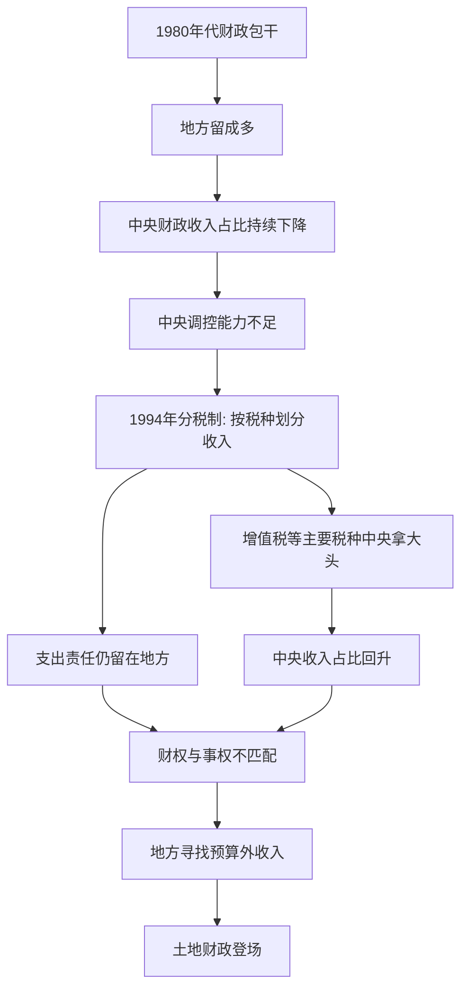

# 05｜1994 年分税制改革，到底改了什么？

> 一次财政改革，为什么重塑了之后三十年的地方政府行为？

---

## 一、先说结论

1994 年的分税制改革，是理解中国地方政府行为的一把钥匙。作者兰小欢在书中指出，这次改革把主要税种的收入大头收归中央，却没有把教育、医疗、基建这些"该谁办"的责任同步上收。于是地方政府的钱变少了，要干的事却没变少，形成"**财权与事权不匹配**"。为了填上这个缺口，地方只能另找财源——后面的土地财政、土地金融、地方债务，几乎都是从这个缺口里长出来的。

---

## 二、我们先理解一个问题

你有没有想过一个奇怪的现象：为什么中国的地方政府，看起来那么像一家公司？

它们会拼命招商引资、给企业低价供地、修路修桥建园区，甚至亲自入股企业。一个只管"公共服务"的政府，按理说不该这么热衷于"做生意"。它为什么停不下来？

答案要从钱说起。政府要办事，就得有钱；钱从哪来、归谁管，决定了它怎么做事。1994 年之前和之后，这套"分钱规则"发生了根本变化。理解这次变化，才能理解地方政府的行动逻辑。

我们要回答的问题是：**一次看似纯技术性的财政改革，为什么会重塑之后三十年地方政府的行为？**

---

## 三、作者到底提出了什么观点？

作者在书中讲得很清楚：1994 年的分税制改革，本质上是一次**财权上收、事权未变**的改革。

改革之前，用的是"财政包干"：中央和地方约定一个上缴基数，超出部分地方多留。这给了地方发展经济的强激励，但也带来一个问题——经济越增长，地方留得越多，中央拿到的比例反而越来越低。到 1993 年，中央财政收入占全国财政收入的比重掉到两成出头，中央想搞宏观调控、想在全国范围内转移支付，手里却没有足够的钱。

1994 年的改革要解决的就是这个：把收入重新划分。按税种切分——有的税归中央（如关税、消费税），有的税归地方，最大的税种增值税则由中央拿 75%、地方拿 25%（后来比例有调整）。同时设立国税、地税两套征管机构（2018 年两家又合并）。

收入的确上去了，中央占比很快回到五成上下。但作者强调，改革动的是"分钱"，没怎么动"分事"：教育、医疗、社保、基础设施这些支出责任，依然主要压在市县两级。于是矛盾出现了。

---

## 四、把这个观点翻译成人话

"财权"和"事权"，是理解这件事的两个关键词。

- **财权**：钱归谁收、归谁管。
- **事权**：事情该谁办、账该谁买。

分税制做的事情，是财权往上收；但它没动事权，事还留在下面。打个不太精确但好懂的比方：以前你和家人约定，你出去挣钱、自己留大半；现在规则改了，你挣的钱大部分要上交，但你家里的开销——孩子上学、老人看病、房子维修——还是你出。你会怎么办？

正常人都会去想两件事：第一，能不能找点"上交之外"的收入；第二，能不能少花点，或者让钱花得能生钱。

地方政府也是这样。预算内的钱不够花，它就会去找预算外的钱；它也会更在意"这笔投入能不能带来后续收入"。这不是谁道德有问题，而是规则给定之后，理性的应对方式。

---

## 五、为什么会这样？

把作者的推理拆成链条，大致是这样：

这条链条里最关键的一环，是 **G 和 H 同时成立**：收入往上走了，支出责任没跟着走。只有当"钱少了、事没少"同时发生，缺口的压力才会真正落到地方头上。

需要补充的是，改革并非只有"上收"一面。中央同时建立了税收返还和转移支付制度，把一部分钱再分给地方，尤其是中西部。所以并非所有地方都一样紧张——东部沿海本身税源足、土地值钱，办法多；中西部更依赖转移支付。这种地区差异，也是后续很多现象的背景。

---

## 六、举一个现实生活中的例子

想象一个三代同堂的家庭，原本的规矩是：谁挣的钱谁管，各花各的，公共开销大家凑。

后来家里改了规矩：为了统一调配、应付大事，子女收入的七成要交给"家庭公共账户"，由长辈统一保管。规矩改完之后，公共账户确实鼓起来了，家里遇到大事也有底气了。但问题来了——**孩子的补习费、老人的医药费、房子的物业费，规矩里没说改，还是各个小家庭自己出。**

这时候小家庭会怎么反应？

它会开始琢磨"公共账户之外"的收入：出租闲置房间、做点副业、把家里的一块空地利用起来。它也会更精打细算，希望每一笔花出去的钱，将来能带回更多钱。

地方政府的处境与此类似。分税制之后，预算内的大头收入上交了，但修路、办学、看病这些开销依然要自己扛。于是它转向预算外，去寻找能自己支配、又能持续产生收入的财源。土地，正是在这个背景下，成了最重要的答案。

这个例子只讲了"缺钱"这一半。真正让土地变得关键的，是它同时满足了两个条件：地方能支配，而且能不断增值——那属于后面几篇的内容。

---

## 七、回到书中重新理解

现在再回头看作者对分税制的论述，就顺了。

作者之所以花不少笔墨去讲 1980 年代的财政包干、讲中央占比怎么一路下滑，不是为了讲一段财政史，而是要交代一个"前因"。他要说明的是：**中央手里没钱，是推动 1994 年改革最直接的动力。** 而改革的刀刃，主要落在"收入怎么分"上。

他也特别提醒读者注意"两个比重"——财政收入占 GDP 的比重、中央财政占全国财政的比重。这两个指标在改革前持续下降，是当时决策层最担心的问题之一。改革之后，两个比重回升，中央的宏观调控能力增强。

但作者并不把分税制写成"中央赢了、地方输了"的零和故事。他更关心的是：这套新的分成规则，如何改变了地方政府面临的约束和激励。因为约束变了，行为就会变。

---

## 八、这个观点背后还有什么？

这里有几个容易被忽略的前提。

**第一，财权上收本身不是问题，问题在于"没配套"。** 世界上很多国家都是中央收钱、再转移支付给地方。真正的麻烦是，收入划分和支出责任没有对齐，地方承担了大量刚性支出，却没有稳定的自主财源。作者反复强调的"匹配"，说的正是这个。

**第二，规则决定行为，而不是人品。** 作者的一个基本立场是，讨论地方政府行为，要先看它面对的制度约束。财政压力是约束，考核指标是约束，土地制度也是约束。理解了约束，很多看似"不合理"的行为就变得可解释了。

**第三，这条线一直连到后面。** 财权与事权的缺口，直接引出了土地财政（第 06 篇）；而土地不只是能卖、还能抵押，于是又有了土地金融（第 07 篇）；再往后，是城投和地方债务。可以说，后面几篇讲的现象，都是这一篇的延长线。

**第四，还有一条平行线索是"激励"。** 财政压力让地方必须找钱，而官员考核又让地方必须出成绩。两条腿一起走，才有了后来那种近乎公司化的地方政府行为。这部分，前面几篇已经专门讲过。

---

## 九、这个观点有问题吗？

有值得讨论的地方。

**有说服力的部分**：财权上收、事权未同步上收，这个事实清楚，且与后续地方"找钱"的行为在时间上、逻辑上都对得上。用它来解释土地财政的动机，是相当有力的。

**争议主要在三处。**

第一，**分税制到底有没有让地方"更穷"，不能一概而论。** 从占比看，地方收入份额下降了；但从绝对额看，随着经济高速增长，地方的总收入其实也在大幅增加。真正变化的是"自主支配的财源结构"，而不只是"钱多钱少"。一些经济学者认为，地方财政压力被夸大了，因为转移支付和预算外收入补上了相当一部分。

第二，**土地财政的出现，是分税制的必然结果，还是多重条件的叠加？** 作者倾向于把它看作制度链条的一环。但也有观点认为，1998 年房改、城市化加速、土地招拍挂制度、银行信贷扩张，缺一不可。分税制提供了"动机"，但没有这些条件，动机也变不成现实。换句话说，因果关系更可能是"共同作用"，而不是"单线决定"。

第三，**把地方行为主要归因于财政压力，可能低估了其他因素。** 有学者强调，官员晋升激励、地方保护，乃至治理传统，同样在起作用。财政压力是重要变量，但未必是唯一变量。

**所以更准确的说法是**：分税制是理解地方政府行为的一个关键起点，但它解释的是"为什么地方有强烈动机去找钱"，而不是"地方一定会用土地去找钱"。后者还需要别的条件。

---

## 十、今天再看这个观点

以下是基于作者思想的现代延伸，不是书中原话。

书里讲的分税制是 1994 年的事，但这套逻辑今天依然在运转，只是场景变了。

一个明显的延续是**央地财政关系仍在不断调整**。2018 年国税地税合并，增值税分成比例在营改增之后又作调整，近年又推动"省以下财政体制改革"、化解地方隐性债务——这些动作，本质上都还是在处理"钱怎么分、事谁来办"的老问题。

如果把它抽象出来，这其实是一个很普遍的治理难题：**任何层级化组织，都要面对"权力上收"与"责任下沉"之间的张力。** 中央集权有利于统筹，但会削弱地方的积极性；过度分权有利于灵活，但会导致各自为政和失控。财政制度，就是调节这个平衡的旋钮。

值得进一步追问的是：当城市化放缓、土地收入减少，过去那套"地方自找财源"的模式还能不能持续？如果不能，新的央地财政平衡应该长什么样？这不是书里给出答案的问题，而是作者的问题意识在今天的自然延续。

---

## 十一、这一篇真正应该记住什么？

1. **分税制改的是"分钱规则"。** 1994 年按税种划分收入，主要税种中央拿大头，中央财政收入占比因此回升。

2. **核心矛盾是"财权与事权不匹配"。** 收入上收，支出责任没同步上收，地方政府出现结构性财政缺口。

3. **缺口逼出行为。** 地方转向预算外收入，这为土地财政、土地金融和地方债务埋下了动机。

4. **制度约束优先于道德判断。** 理解地方行为，先看它面对的钱袋子和考核规则，而不是简单贴标签。

5. **这是全书机制链的起点之一。** 后面几篇讲的"找钱"故事，几乎都能回溯到这次改革。

---

## 十二、留一个问题

> 如果中央收钱、地方花钱是很多国家都有的常态，
> 那么中国的特殊之处，到底是在"分钱规则"本身，
> 还是在地方手里握着的那份"能自己变出钱"的资源？

---

**下一篇**：分税制让地方的预算内收入紧了，但地方并没有因此停下。它找到了一个既能自己支配、又能不断增值的财源——土地。这块地是怎么变成钱的？为什么地方政府会对卖地如此上心？

下一篇我们来讲——**地方政府为什么离不开"土地财政"？**
