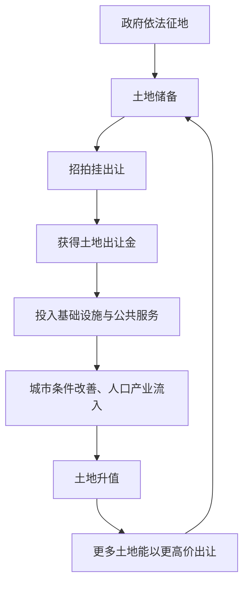

# 06｜地方政府为什么离不开「土地财政」？

> 地方财政为什么高度依赖卖地收入？

---

## 一、先说结论

作者兰小欢指出，分税制改革造成财政缺口之后，城市土地成了地方政府最重要的"**第二财政**"。制度前提很清楚：城市土地归国家所有，政府垄断土地一级市场，可以依法征地、再出让收钱。1998 年住房制度改革之后，土地价值随着城市化一路上升，而土地出让金又归地方支配。于是地方有了强烈动机去经营城市、抬升地价——因为地价越高，它能拿到的钱就越多。

---

## 二、我们先理解一个问题

先看一个现象。

过去二十多年，几乎每一座城市都在做同一件事：往城外扩张、修新区、通地铁、建场馆、盖学校医院，然后对外招商。城市面貌变化之快，常让人惊叹。

奇怪的是，这些投入都非常烧钱，而地方政府的预算内收入又并不宽裕（见上一篇）。它们哪来这么多钱？

更奇怪的是另一种做法：地方政府常常用很低的价格，甚至"倒贴"的方式把工业用地给企业，看起来在做亏本买卖。可与此同时，它又能靠卖住宅和商业用地赚得盆满钵满。

这一篇要回答的问题就是：**为什么土地出让收入会成为地方财政的命根子？地方政府是怎么把一块地变成钱的？**

---

## 三、作者到底提出了什么观点？

作者在书中给出的核心概念，是"**土地财政**"。

它的意思很直白：**政府通过出让土地来获得财政收入。** 但这件看似简单的买卖，背后有一套制度安排：

- **权属前提**：城市土地属于国家所有，农村和城市郊区的土地属于集体所有。农村土地要变成城市建设用地，一般必须先由政府依法征收。
- **垄断前提**：政府垄断了土地一级市场。也就是说，谁能把农地变成城里的建设用地、以什么价格卖出去，主动权基本在政府手里。
- **需求前提**：1998 年住房制度改革，停止了福利分房，商品房市场启动。此后城市化加速，人口和产业向城市集聚，土地越来越值钱。

在这三个前提下，土地出让金（卖地的钱）归地方使用，属于政府性基金收入的一部分，规模一度可与一般预算收入比肩，因此被称为"第二财政"。除此之外，与土地相关的还有一串税收，比如契税、土地增值税、城镇土地使用税等。

所以作者说，地方政府围绕土地，形成了一套可以自我循环的机制。

---

## 四、把这个观点翻译成人话

"土地财政"，说白了就是四个字：**卖地收钱**。

但要卖得成，得同时满足几件事。

第一，**地得是它说了算的**。这就是为什么"城市土地国有、政府垄断一级市场"这么关键——如果地是私人的、可以自由买卖，政府就只是一个收税的旁观者，而不是交易的主角。

第二，**得有买家**。城市化带来大量人口进城，要住房、要办公、要开店、要建厂，这些都是对土地的真实需求。没有需求，地卖不上价，也卖不出去。

第三，**这笔钱得能自己用**。土地出让金归地方，正是分税制之后地方最需要的那种"自主财源"。

作者并不把这件事讲成道德问题，而是当成一个制度事实来陈述：给定这样的土地制度和财税制度，卖地几乎是地方最符合逻辑的选择。真正值得研究的，是这套选择会带来什么后果。

---

## 五、为什么会这样？

把作者描述的机制画成图，是一个明显的正反馈循环：

这个循环里，最值得注意的不是"卖地"，而是**卖地之后钱去哪了**。

如果卖地的钱只是被花掉，那它就是一次性的。但地方政府通常会把相当一部分投入基础设施：修路、通水通电、建学校医院、改善环境。这些投入让城市更宜居、更有吸引力，于是人口和产业进一步流入，地价跟着上涨，下一轮土地就能卖得更贵。

换句话说，**土地收入的很大一部分，又被投回去"生产"更值钱的土地。** 这既解释了为什么城市面貌变化那么快，也解释了为什么地方政府那么在意"经营城市"——它像一个持续做开发的投资人，而不是一个只管收税的管家。

需要说明的是，"经营城市"是描述这套行为逻辑的说法，不是说政府真的成了一家公司。区别在于，政府的投资还要兼顾公共目标，且受土地、规划、审批等一系列制度约束。

---

## 六、举一个现实生活中的例子

想象你所在的城市要开发一片新区。

那片地原本是城郊的农田和荒地，一亩可能只值几万块，因为没人愿意去那儿住，也几乎没有配套。

接下来会发生什么？通常有一个相当固定的顺序：

1. **先修路、拉骨干路网**，把这片地和主城区连起来。
2. **引入一条地铁或快速公交**，让人能通勤。
3. **建学校、医院、公园**，解决"住过去不方便"的问题。
4. **招商引资**，谈下一个产业园或几家大企业，带来就业。
5. **等到预期形成**，再一批一批地把住宅和商业用地挂牌出让。

这时候，同样一亩地，价格可能已经涨了好几倍甚至几十倍。政府早期投入的修路、建校成本，往往能从后续卖地收入里收回来，甚至还有盈余。

你看到"小区门口的地铁和商场建得特别快"，背后常常就有这套逻辑：这些配套不只是公共服务，也是在为这片土地"抬价"。地价上去了，政府才有钱继续修下一条路、建下一所学校。

这就是土地财政被一些观察者称为"在特定阶段相当有效"的原因——在城市化高速推进、人口持续流入的年代，它确实能快速筹到建设资金。但反过来说，它也高度依赖两个前提：**有人愿意来，地价愿意涨。** 这两个前提一旦松动，整台机器就会慢下来。这部分，留到后面的文章再谈。

---

## 七、回到书中重新理解

现在再回头看作者关于土地财政的论述，就容易理解了。

作者之所以要花篇幅讲土地所有权、讲征地制度、讲招拍挂，不是在讲法律常识，而是要说明：**地方政府能成为土地交易的主角，靠的是一整套制度授权，而不是市场自发的地位。**

他也很注意把土地财政放在"分税制—财政缺口—寻找财源"这条链条上来看。也就是说，土地财政不是一个孤立的、突然冒出来的现象，而是上一篇文章讲的"财权与事权不匹配"结出的果。理解了前因，才不会把它简单骂成"卖地发财"。

同时，作者反复提醒：这是一个"制度事实"。这句话的意思是，讨论它可以评价、可以批评，但首先得把它当成一套有内在逻辑的机制去理解，而不是当成某个人的贪心。机制不变，换谁上来，行为大概率也差不多。

---

## 八、这个观点背后还有什么？

几个作者没有完全展开、但很关键的隐含前提：

**第一，这套机制本质上是"把未来的城市价值提前变现"。** 土地之所以能卖高价，是因为买家相信这里将来会很繁华。政府做的基建投资，正是在把这种"将来的繁华"一点点变成现实，然后卖给今天的人。所以它天然依赖"未来比现在更好"的预期。

**第二，它高度依赖城市化的阶段。** 人口持续流入、产业持续扩张时，土地需求旺盛，循环顺畅；一旦人口流出、需求转弱，同样的操作就会失灵——地卖不动，卖不上价，前期投入还不上。这意味着土地财政是有"窗口期"的，不是永远有效。

**第三，它与招商引资是配套的两种地价策略。** 工业用地往往低价甚至亏本出让，是为了换来企业和税源、就业；住宅和商业用地则高价出让，用来补财政。一低一高之间，是地方政府在做一笔精算的"组合生意"。这也是理解地方行为的一把钥匙。

**第四，它为"土地金融"埋了线。** 土地既然这么值钱，就不仅能卖，还能拿去抵押借钱。这正是下一篇要处理的问题。

---

## 九、这个观点有问题吗？

有，而且分歧不小。

**有说服力的部分**：土地财政确实为地方基础设施建设提供了大量资金，这是可观察到的事实；把它的出现与分税制后的财政缺口联系起来，逻辑也站得住。

**争议主要在这几处。**

第一，**土地财政到底是"城市建设的高效融资工具"，还是"推高房价的元凶"？** 一种观点强调它的"融资功能"：在正规融资渠道有限的情况下，它让地方政府有能力快速建成大量基础设施，支撑了城市化。另一种观点则强调它的代价：土地供应受政府控制，卖地收入又依赖高地价，这在需求旺盛时容易推高房价，并把成本转嫁给购房者。这两者未必互斥，但权重如何分配，学界看法不同。

第二，**因果方向可能被倒置。** 是土地财政推高了地价和房价，还是城市化和人口集聚本身推高了地价、土地财政只是顺势而为？有研究者认为，需求是主因，土地财政是放大器；也有人认为，供给端的垄断和节制出让才是关键。争议的焦点，其实在于"供给约束"和"需求增长"各占多大比重。

第三，**"第二财政"这个说法可能掩盖了结构差异。** 不同城市对土地收入的依赖程度差别极大。一二线热点城市和人口流出的小城市，完全是两种处境。用一个笼统的概念去概括，容易忽略这种分化。

**所以更准确的说法是**：土地财政是一套有明确制度基础和现实功能、同时也有明显代价和阶段性局限的机制。理解它，比简单赞美或谴责它更重要。

---

## 十、今天再看这个观点

以下是基于作者思想的现代延伸，不是书中原话。

书里讲的土地财政，是城市化高速期的故事。到了今天，这套逻辑正在被现实改写。

最直接的变化是**"卖地—基建—升值—再卖地"的循环开始吃力**。当城镇化速度放缓、部分城市人口不再净流入，土地需求转弱，土地出让收入下滑，过去那套靠卖地筹资的模式就难以为继。于是能看到地方政府把注意力转向别的财源：培育产业税源、盘活存量资产、发展"股权财政"，甚至把国有股权、特许经营权等纳入融资视野。

另一个延伸，是**"经营城市"的逻辑在往"经营产业"迁移**。土地财政的核心是卖资源和配套，而现在越来越多地方开始用政府引导基金、国有资本投资等方式，试图从产业成长中分享收益。这已经不是书中描述的土地财政，而是同一套"政府置身事内"的思路换了个载体。

值得进一步追问的是：如果土地财政的窗口期正在关闭，那么地方财政的"下一根支柱"应该是什么？靠产业税收、靠上级转移支付，还是靠新的财产性收入？这个问题，书里没有给出答案，却是作者的分析框架指向的必然追问。

---

## 十一、这一篇真正应该记住什么？

1. **土地财政的本质是"卖地收钱"。** 它建立在城市土地国有、政府垄断一级市场、依法征地这三重制度前提上。

2. **它是分税制财政缺口的产物。** 地方需要自主财源，而土地恰好既能自己支配、又能不断增值。

3. **核心是一个正反馈循环。** 征地—出让—投入基建—地价上升—再出让，卖地的钱又被用来"生产"更值钱的地。

4. **它依赖特定阶段。** 这套机制在城市化高速、人口流入、地价上涨时有效，前提一旦松动就会失灵。

5. **理解优先于评判。** 作者把它当作制度事实来分析，而不是简单的道德批判。

---

## 十二、留一个问题

> 如果一块地卖掉只是一次性的收入，
> 而它明明还会随着城市发展继续升值，
> 那么地方政府为什么不干脆拿它去"借"钱，而是急着把它卖掉？

---

**下一篇**：卖地收钱，是把土地的价值一次性兑现；但土地真正可怕的用法，是拿它当抵押去融资——把未来的收益挪到今天来花。这两件事看起来都在"用土地搞钱"，其实是完全不同的两回事。

下一篇我们来讲——**"土地财政"和"土地金融"有什么区别？**
