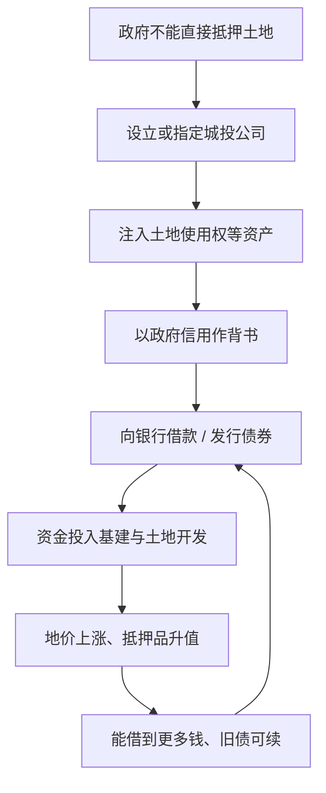

# 07｜「土地财政」和「土地金融」有什么区别？

> 卖地收钱和用土地借钱，是同一件事吗？

---

## 一、先说结论

完全不同。作者兰小欢在书中把这两件事分得很清楚：**土地财政是"卖地收钱"，进的是一笔一次性的、当期的收入；土地金融是"以土地抵押融资"，进的是负债——它把未来的收益折现到今天来花。**

后者才是地方债务扩张的关键机制。之所以要讲清这个区别，是因为许多人把"卖地"和"借钱"混为一谈，结果既看不懂地方政府的账，也看不懂风险究竟藏在哪里。

---

## 二、我们先理解一个问题

先问一个看似多余的问题：卖地和拿地借钱，不都是在"用土地搞钱"吗？为什么非要分成两个概念？

因为它们在会计上是两回事，在时间上也是两回事。

- 卖地收钱，钱进来了，事情就结束了，收进来的是**收入**。
- 拿地借钱，钱也进来了，但这是要还的，进来的是**负债**。

如果我们把这两者当成同一件事，就会觉得地方政府的钱来得理所当然；一旦分开看，就会发现：**真正让债务越滚越大的，不是卖地，而是借钱。**

于是这一篇要回答一个具体问题：既然政府手里握着那么多土地，为什么它不直接拿去银行抵押贷款，而要大费周章地绕一圈？这一圈绕出去，又带来了什么后果？

---

## 三、作者到底提出了什么观点？

作者在书里明确区分了两组概念：

- **土地财政**：政府出让土地，收取土地出让金。这是**卖地收钱**，特征是**一次性、显性、进当期收入**。
- **土地金融**：政府把土地和未来收益作为抵押或资产注入融资平台，去银行借款、去市场发债。这是**以地融资**，特征是**把未来的钱提前挪到今天花**，进的是负债。

他还指出了一个现实的约束：**政府本身并不能随意拿着土地去银行抵押贷款。** 现实中的做法，是通过一家公司来完成——通常叫"城投公司"（地方政府融资平台）。政府把土地的使用权注入这家公司，再以政府信用做背书，由公司去向银行借款或发行债券。

作者特别强调，这套融资的关键假设是：**地价会持续上涨。** 只要地价涨，抵押品就升值，就能借到更多钱、把旧债续上；一旦这个预期反转，抵押品缩水，再融资就会立刻变难，风险随之浮现。

---

## 四、把这个观点翻译成人话

先把两者放在一张表里对照，差异就一目了然了。

| 对比维度 | 土地财政 | 土地金融 |
|---|---|---|
| 一句话本质 | 卖地收钱 | 拿地借钱 |
| 会计性质 | 收入 | 负债 |
| 时间特征 | 当期、一次性 | 把未来收益折现到今天 |
| 要不要还 | 不用还 | 要还本付息 |
| 依赖什么 | 有人愿意买地 | 地价持续上涨、能不断再融资 |
| 主要风险 | 地卖不动、收入下滑 | 抵押品缩水、债务违约 |
| 政府的角色 | 卖家 | 借款人（通过平台公司） |

打个比方：土地财政像是把家里一块地卖掉，拿回一笔现金；土地金融像是把这块地抵押给银行，借出一笔钱。前者钱到手就不用管了，后者钱到手的同时，账上也多了一笔要还的债。

现在再看那句容易被忽略的话——"政府不能直接拿地抵押"。为什么不能？简单说，政府不是一般的企业，它的资产、负债都有制度和预算的约束，不能随便拿公共资源去作商业抵押。所以它需要一个"代理人"：先设立或指定一家公司，把地注入进去，让这家公司以企业的身份去融资。政府信用，则通过担保、注资、财政补贴等方式，隐性地为它兜底。

这套设计，就是后面地方债务故事的入口。

---

## 五、为什么会这样？

把这条融资链画出来，可以看得很清楚：

这条链条里，最关键的一步是 **D → E**：融资之所以能成立，靠的不只是那块地本身，还有"政府会兜底"的预期。银行和债券投资者愿意把钱借出去，很大程度上是相信：**这家公司背后站着政府。**

而链条里最脆弱的一步，是 **G**。"地价上涨"是整个循环的发动机。有了它，抵押品升值、信用增强、可以借新还旧；没有了它，抵押品缩水，新钱借不到、旧债还不上，循环就会卡住。

作者想说明的正是这一点：土地金融并不是简单的"多借点钱"，而是**把整套融资架设在了一个对未来的假设之上**。假设成立时，它可以撬动巨大的建设资金；假设不成立时，它也会放大风险。这就是它和土地财政最根本的不同——**一个花的是现在，一个花的是未来。**

---

## 六、举一个现实生活中的例子

想象一个刚工作几年的年轻人，月薪一万，手头没什么积蓄。

他看中了一个机会，想报一个很贵的进修课程，或者想开一家小店。钱不够，怎么办？他选择用信用卡和消费贷来凑：把未来两年大概能挣到的钱，提前"折现"到今天花掉。

短期内，效果非常好。课程上了、店开了，生活品质和收入预期都在上升。他每个月只要还一点最低还款额，压力看起来不大，因为他的逻辑是："等我将来挣得更多，自然就还上了。"

这套安排能一直运转下去，靠的是一个前提：**他的未来收入会持续增长。** 只要收入涨，月供占比就越来越轻，他甚至还能继续借新的钱去投更大的项目。

问题出在前提变化的那一刻。如果行业不景气、收入下降，或者工作没了，那么原先"等以后还"的债，立刻变成压在头上的石头：不但新钱借不到，旧债的月供还得照付。他只能拆东墙补西墙，用一个新贷款去填旧贷款的窟窿。

用土地抵押融资的地方政府融资平台，处境很像这个年轻人。差别只在于：它借的数额大几千倍，抵押的是一整片土地，而它之所以能借到钱，是因为银行相信"政府不会让它倒"。这份信任，就是整个故事里最关键、也最不写在纸面上的东西。

---

## 七、回到书中重新理解

现在再回头看作者为什么要费劲区分这两个词，就明白了。

如果只讲"土地财政"，你看到的是一幅地方政府靠卖地增收的图景，它听起来像一门"生意"。加上"土地金融"，图景就变了：**地方政府不只是卖地的卖家，还是以土地为抵押、以政府信用为担保的借款人。** 它手里握着的不只是现金收入，还有一大堆需要用未来去偿还的债务。

作者把这一步视为理解地方债务的**关键一步**，原因就在这里。债务不是凭空出现的，它正是通过"以地融资"这个动作被创造出来的。

同时，他也借此说明了一个更普遍的道理：**把未来收益折现，是现代金融最强大的能力，也是最危险的能力。** 用得好，它能让一个城市提前建成地铁和园区；用过头，它会把未来透支干净。区别不在于"用不用"，而在于"用多少、赌什么、能不能收场"。这个判断，作者留给读者自己去做。

---

## 八、这个观点背后还有什么？

几个容易被略过、却很关键的前提。

**第一，这套融资依赖"政府信用"这种无形担保。** 城投公司的资产是土地，但真正的信用来源是政府。这带来一个模糊地带：这笔债在法律上到底算不算政府的债？如果算，它就该进预算被管理；如果不算，它又凭什么获得这么低的融资成本？这个身份问题，是后面一整篇的主题。

**第二，它依赖对土地和未来现金流的估价。** 土地值多少钱、未来能带来多少收益，都需要评估。而评估是建立在预期上的。预期乐观时，同一块地能估出更高的价，借出更多的钱；预期逆转时，估值下调，融资能力随之收缩。**估值的顺周期性质，本身就是风险的来源。**

**第三，它天然带来期限问题。** 基建项目回报慢，往往要几十年；而借来的钱期限可能只有几年。这种"拿短钱干长事"的错配，是后面债务滚动机制的直接原因——但细节留到下一篇。

**第四，它与土地财政是互补而非替代。** 同一个政府，既卖地收钱，又拿地借钱。两块收入一起撑起了城市的建设。理解了这层关系，才能理解为什么地方对"地价"如此敏感——因为地价同时决定了卖出能收多少、抵押能借多少。

---

## 九、这个观点有问题吗？

有，而且争议恰好集中在"怎么算账"上。

**有说服力的部分**：把土地财政（收入）和土地金融（负债）区分开，在概念上是清晰的，也符合会计逻辑。用"地价持续上涨"这个假设来解释风险，方向和现实一致。

**争议主要在这几处。**

第一，**"这到底算不算政府债务"本身就是争论的核心。** 一种观点认为，城投平台是独立法人，它借的钱是企业的债，不该直接算作政府债务；另一种观点认为，平台承担的是政府投资职能、靠政府信用融资，实质就是政府的隐性负债。这不只是文字之争——**算不算、算多少，直接决定了债务规模看起来有多大、风险有多高。** 不同机构、不同学者的统计口径差异很大，根源就在这里。

第二，**土地金融是"金融创新"还是"隐患"？** 有观点肯定它的融资功能：在正规渠道有限时，它把土地的未来价值盘活，为城市建设提供了资金，是一种务实的安排。也有观点强调它的脆弱性：整套机制建立在单一预期上，一旦预期反转，风险会沿"政府—平台—银行—债市"传导。两边说的其实是不同层面的事，但取舍不同。

第三，**对"政府信用背书"的依赖，可能被低估了。** 有研究者认为，真正值钱的不是土地，而是"政府不会让平台违约"这个信念，即所谓的"城投信仰"。如果这个信念本身成了定价依据，那么融资成本就会被人为压低，风险也容易被掩盖。土地金融的问题，某种程度上是"信用定价"的问题——但这一点，作者在书中并未展开太多。

**所以更准确的说法是**：土地金融是一套设计精巧、在特定阶段有效，但把风险和预期深度绑定的机制。争议的关键，不在"它有没有用"，而在"它的风险究竟由谁承担、什么时候暴露"。

---

## 十、今天再看这个观点

以下是基于作者思想的现代延伸，不是书中原话。

书里讲的"以地融资"，背后的逻辑其实远比土地更普遍：**用未来的现金流，换今天的资金。** 这正是现代金融的核心动作。

顺着这条线往下看，你会发现同一套逻辑出现在很多地方。基础设施公募 REITs，就是把已建成、有稳定现金流的项目（如高速、产业园、仓储）打包上市，让投资者买它的未来收益；资产证券化，是把未来的应收款、租金等现金流提前变现；甚至政府引导基金，也是用今天财政的钱去投未来的产业收益。它们的共同点，都是"把未来折现"。

区别在于风险怎么分摊、信息是否透明。土地金融最大的问题，是它的抵押品估值和政府信用纠缠在一起，且高度依赖单一预期（地价上涨）；而成熟市场的证券化产品，理论上应该有更透明的定价和更分散的持有结构——当然，2008 年的美国次贷危机也说明，"理论上"并不等于"实践中"。

值得进一步追问的是：如果"以未来收益融资"是不可避免的，那么真正该设计的，是让这个"折现"过程更透明、更有约束、更能承受预期波动。这已经不是书中给出的结论，而是作者分析框架的自然延伸。

---

## 十一、这一篇真正应该记住什么？

1. **两件事，两个词。** 土地财政是卖地收钱（收入），土地金融是拿地借钱（负债），性质完全不同。

2. **一个花现在，一个花未来。** 土地金融把未来收益折现到今天，代价是多了一笔要还的债。

3. **政府要绕道平台公司。** 政府不能直接抵押土地，于是通过城投公司注入土地、以政府信用背书来融资。

4. **命门是"地价持续上涨"。** 整套融资建立在预期之上，预期反转，抵押品缩水，再融资困难，风险暴露。

5. **这是理解地方债务的关键一步。** 债务不是凭空来的，它是通过"以地融资"这个动作被创造出来的。

---

## 十二、留一个问题

> 如果一块地的价值，取决于人们对它未来的想象，
> 那么当所有人同时开始怀疑这个想象时，
> 被抵押出去的，到底是那块地，还是一种信心？

---

**下一篇**：以地融资，只是把债务"造"出来的第一步。真正的问题是：这些借来的钱，花在了什么项目上？为什么明明是修路建桥这样的好事，最后却会变成越滚越大的债务？

下一篇我们来讲——**地方债是怎么一步一步滚起来的？**
