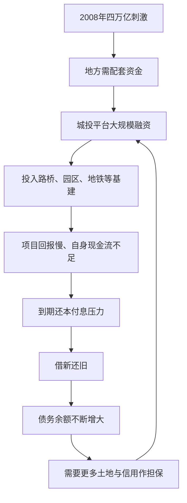

# 08｜地方债是怎么一步一步滚起来的？

> 今天巨量的地方政府债务，最初是怎么产生的？

---

## 一、先说结论

作者兰小欢指出，地方债务的累积，核心机制是：**地方政府通过城投公司，以土地和财政作隐性担保，从银行和债券市场融资搞基建。** 基建回报慢、周期长，而借来的钱期限短，于是出现"期限错配"；项目自身的现金流又不足以还本付息，只能"借新还旧"。投资越大，债务越多，债务就这样一轮一轮滚动、膨胀起来。这篇聚焦"债务怎么累积"，至于城投到底是什么身份，下一篇文章再细讲。

---

## 二、我们先理解一个问题

先纠正一个容易有的错觉：地方政府借债，并不是 2008 年之后才有的新鲜事。此前也有，但规模有限、增长平稳。

真正的转折发生在 2008 年。为了应对国际金融危机的冲击，中国推出了被称为"四万亿"的大规模刺激计划。中央出钱，地方也要配套出钱——问题是，地方哪来这么多配套资金？

于是，地方融资平台（也就是城投公司）的数量和融资规模出现了爆发式增长。

这一篇要回答的问题就是：**修路、建桥、通地铁，明明都是对城市有益的事情，为什么最后会变成一笔越滚越大的债务？好事怎么会变成问题？**

---

## 三、作者到底提出了什么观点？

作者在书中把地方债务的成因拆成几层。

**第一层，是融资载体。** 地方政府大量资金是通过"城投公司"（地方政府融资平台）借来的。它名义上是企业，实际承担着政府投资的职能（身份问题留到下一篇）。

**第二层，是资金投向。** 这些钱主要投向路桥、园区、市政、地铁等基础设施。这类项目有一个共同特征：**有很强的公共品属性，社会回报高，但自身现金流少、回本极慢。** 一条地铁修起来几百亿，票价收入可能几十年都覆盖不了成本，而它带来的地价上涨、税收增长则间接而缓慢。

**第三层，是债务结构。** 基建要几十年才回本，债务期限却往往只有几年。这种"资产的久期长、负债的久期短"，叫**期限错配**。它意味着每到还款日，项目还没产生足够现金，就得想办法再借一笔来周转——这正是"借新还旧"的由来。

作者还特别区分了两个概念：

- **显性债务**：写在政府账本上、纳入预算管理的债务，比如地方政府发行的债券。它清楚、透明、有额度管理。
- **隐性债务**：不在政府账本上，但政府很可能要兜底的债务，主要就是城投平台借的那些。它之所以"隐性"，是因为法律上不是政府的债，现实和道义上却又脱不开干系。

---

## 四、把这个观点翻译成人话

先讲清"期限错配"这个词。

想象你要开一家工厂。厂房和设备要花一大笔钱，建成投产、慢慢盈利可能需要十年以上。可你去银行借钱，银行只肯给你三年期的贷款。三年后贷款到期，工厂还在回本路上，你手里没有足够现金还钱，怎么办？只能再借一笔，先把旧的还上。

只要银行还愿意借，你就"活着"。债务余额可能没减少，甚至还在增加，但你并不会马上"爆雷"。这就是"借新还旧"。

地方政府平台的处境与此类似，而且更微妙：它修的是公共设施，本身盈利性就弱，靠项目自己还债几乎不可能。它真正的还款来源，其实是两块——**政府未来的财政收入，和土地出让收入。** 所以它借的钱，本质上是在赌"这个城市未来的税收和地价会更好"。

再说"隐性债务"为什么叫隐性。

一份债，如果记在政府自己的账上，大家都看得见，出了事也是政府的事，这叫显性。可如果它是城投公司借的，那么在法律上它就不是政府的债务，政府账面上看起来很干净。

但现实中，市场几乎都相信"政府会管"。因为城投干的是政府的活，钱是从政府信用里借出来的。于是这笔债就处在一种尴尬位置：**账上不算，心里都算。** 这种"表外"的债务，就是隐性债务。它的麻烦在于规模难统计、风险难预警，出事的时候又往往要政府来收拾。

---

## 五、为什么会这样？

把债务累积的过程画成链条，大致是这样：

这条链条最要命的地方，是 **E → F → G** 这一段。

如果项目能自己挣钱、按时还本付息，债务就是一个健康的杠杆。但基建往往做不到，于是每到还款期，平台就得再融一笔钱来周转。**只要这个循环不断，债务规模就只会越滚越大**——因为新借的钱不但要还旧债，通常还要顺带支撑新的投资。

而维持这个循环的，是两个外部条件：

1. **土地能不断升值、不断变现**，提供抵押和还款来源；
2. **银行和债市愿意相信政府兜底**，愿意持续提供资金。

这两个条件越好，循环转得越顺，债务也就积累得越多。反过来说，一旦其中一个松动——比如地价走弱、或者市场对"政府兜底"产生怀疑——循环就会吃力，甚至卡住。

这正是作者说的"债务风险传导"：地方财政、银行、债券市场、以及那份"城投信仰"，是串在一起的。哪一环出问题，压力都可能顺着链条传到别处。

---

## 六、举一个现实生活中的例子

想象一家公司，银行贷款建了一条生产线。

项目上马时，管理层算过：投产后年利润不错，几年就能回本。可实际运行下来，行业竞争激烈、产品价格下跌，利润比预期薄很多，回本周期被拉得很长。

第一笔贷款到期时，公司账上现金不够还本金。它怎么办？找另一家银行，重新贷一笔，把旧贷款还上，剩下的钱继续维持运营。这就是"续贷"，也就是地方债务里的"借新还旧"。

只要银行还愿意续，公司就一直"活着"，看起来也没什么大问题——厂房在那儿、设备也在转，账面上资产还在。可如果仔细看，会发现它的债务余额逐年增加，而利润始终没跟上。它维持运转，靠的不是项目本身的现金流，而是**不断找新的钱**。

真正的危险时刻，是银行开始收紧的那一天。一旦续不上，公司立刻面临资金链断裂：到期的债还不上，工资、货款都停摆，而账上那些厂房设备想变现又卖不出好价钱。

地方融资平台的风险逻辑与此高度相似，只是规模大得多，背后还有政府信用和土地作支撑，所以能撑得更久。但"撑得久"不等于"没有风险"——它只是把问题推迟到了未来。

---

## 七、回到书中重新理解

现在再回头看作者关于地方债务的论述，就顺了。

作者之所以要从 2008 年的"四万亿"讲起，是因为那是债务从"平缓"转向"爆发"的时间节点：刺激计划创造了地方配套的资金需求，融资平台则提供了满足这种需求的通道。需求加通道，债务自然膨胀。

他之所以要反复强调"基建的公共品属性"，是因为这决定了债务的性质：**这些项目本身很难自我偿还。** 作者想说的是，很多债务从一开始就不是靠项目现金流来还的，而是靠政府信用、靠土地、靠未来的财政收入来还。

他之所以要区分显性债务和隐性债务，是为了说明一个更本质的问题：**账面上看不到，不代表不存在。** 恰恰是那些不在政府账本上的债务，构成了最需要警惕的部分，因为它们的规模不透明、责任不清晰、风险不容易被及时识别。

理解了这些，再去看今天关于地方债务的种种讨论，就不会只停留在"欠了多少钱"这一个数字上。

---

## 八、这个观点背后还有什么？

几个作者没有完全展开、却很重要的前提。

**第一，这套债务机制默认"经济会持续增长"。** 债务相对GDP的比重能不能稳住，取决于经济总量的增长够不够快。经济高速增长时，债务看起来"可控"；增速放缓时，同样的债务就会显得沉重。**债务问题从来不是孤立地看债务，而是看它和经济增速的赛跑。**

**第二，期限错配的根源，是"用短钱干长事"。** 如果金融体系能提供更多长期资金，错配会轻一些。但现实中，银行资金本身偏短，加上考核和风控的约束，长钱不容易给到基建。这是金融结构问题，不只是地方政府的问题。

**第三，政府信用被反复"借用"，是有代价的。** 城投之所以能低成本融资，是因为市场相信政府兜底。但这种信任一旦被广泛使用，就会形成"刚性兑付"的预期，导致风险定价失灵——收益被市场主体拿走，风险却可能沉淀到政府身上。这属于隐性担保的经典难题。

**第四，它是作者整个分析链条的中间环节。** 往前，它接的是土地金融（第 07 篇）；往后，它连着城投的身份（第 09 篇）、去杠杆与风险处置（后面的篇章）。可以说，地方债务是"政府置身事内"这套机制最集中、也最棘手的产物之一。

---

## 九、这个观点有问题吗？

有，而且分歧往往不在"有没有风险"，而在"风险有多大、该怎么算"。

**有说服力的部分**：把债务累积归因于"基建回报慢 + 债务期限短 + 借新还旧"，逻辑清晰，也符合可观察的现象。显性与隐性债务的区分，同样有助于看清真实图景。

**争议主要在这几处。**

第一，**只算负债、不算资产，可能高估了风险。** 一种观点强调，地方借的钱大多变成了实实在在的基础设施——路、桥、地铁、园区，这些都是资产。如果只盯着债务余额不看资产，就像评价一家公司只算欠款不看它买下的厂房。另一种观点则反驳：很多基建资产的变现能力差、社会回报不能直接变成还款现金流，账面资产未必等于偿债能力。**争议的核心是：这些资产到底值多少钱、能不能用来还债。**

第二，**隐性债务的规模，本身就是一笔糊涂账。** 不同机构、不同研究给出的估计差异很大，因为界定口径不同。有学者认为，讨论"多大规模"之前，先得统一"怎么定义"。这也意味着，很多关于债务风险的讨论，其实是在不同的定义上各说各话。

第三，**能不能用普通企业的标准来衡量政府债务？** 有观点认为，政府拥有征税权、大量国有资产，还有货币和金融体系的支撑，且债务以本币、内债为主，因此不能用企业破产的逻辑来套，系统性风险相对可控。也有观点强调，正因为政府信用太重要，才更不能无限透支——一旦市场对"兜底"的信任动摇，反噬会更大。这两种判断，指向不同的政策取向。

**所以更准确的说法是**：地方债务是一套有明确形成机制的产物，风险真实存在，但"多大、多急、怎么算"取决于口径和判断。理解机制，比记住一个吓人的数字更重要。

---

## 十、今天再看这个观点

以下是基于作者思想的现代延伸，不是书中原话。

书里讲的是 2010 年前后债务如何累积。此后这十几年，处理债务的规则也一直在变。

2014 年修订的预算法（2015 年施行）正式允许地方政府通过发行债券来借款，试图"开前门、堵后门"——让政府显性、规范地借债，同时剥离融资平台的政府融资职能。2017 年前后的资管新规，则收紧了融资平台的很多通道，推动去杠杆。近些年又推出一系列化债安排。这些动作，本质上都在回答同一个问题：**怎么把这笔滚起来的债务，慢慢地、可控地化解掉。**

如果把它抽离出来看，这其实是所有高负债经济体都要面对的难题：债务本身不是坏事，借钱投资可以带来增长；问题出在"钱用到哪里、回报能不能覆盖成本、期限能不能匹配"。当回报慢的资产配上期限短的负债，再叠加对未来的乐观预期，风险就会悄悄积累。

值得追问的是：既然"借新还旧"能让债务一直滚下去，那么真正决定结局的，不是"能不能继续借"，而是"借来的钱有没有创造足够的价值"。这已超出书中论述，却是作者框架指向的核心判断。

---

## 十一、这一篇真正应该记住什么？

1. **债务的载体是融资平台。** 地方政府主要通过城投公司，以土地和财政担保融资搞基建。

2. **2008 年后爆发式增长。** "四万亿"刺激产生地方配套需求，融资平台顺势大规模扩张。

3. **根源是期限错配。** 基建回报慢、周期长，债务期限短，项目自身现金流不足以还本付息。

4. **靠借新还旧维持。** 每到还款期就再融一笔，债务余额因此不断增大，而不是减少。

5. **显性 vs 隐性。** 前者在账上、纳入预算；后者在账外、政府可能兜底，最难识别也最需警惕。

---

## 十二、留一个问题

> 如果一笔债，账面上不属于政府，
> 但所有人都相信政府会来还，
> 那么它到底算谁的债？
> 又是谁，在为这份"相信"定价？

---

**下一篇**：债务的载体，是一家叫做"城投"的公司。它会计上是企业、法律上是独立法人，干的却是政府的活、靠的是政府的信用。这种"身份模糊"，恰恰是理解地方债务风险的关键。

下一篇我们来讲——**城投公司到底是一种什么存在？**
