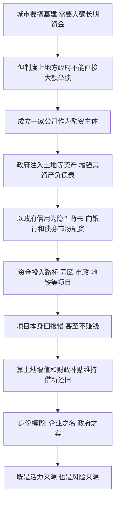

# 09｜城投公司到底是一家什么公司？

> 它注册成企业，却干着政府的活；它说自己是市场主体，市场又默认政府会给它兜底。这到底是一家什么公司？

---

## 一、先说结论

兰小欢在书中把城投公司（地方政府融资平台）描述成一个"身份模糊"的产物：**会计和法律上它是一家独立企业，实质承担的却是政府的投资职能，靠政府信用和土地资产运作。** 它既不是纯粹的企业，也不是纯粹的政府部门。

这种模糊不是设计粗糙，而是刻意留出的空间。它让地方政府能绕开"不能直接向银行借钱"的限制，把想修的路、想建的园区先干起来；也正因为模糊，它的风险边界说不清楚。**活力来自模糊，风险也来自模糊。**

---

## 二、我们先理解一个问题

先问一个看起来很基础的问题：一座城市要修地铁、修环城路、建产业园，钱从哪来？

财政收入当然是一部分，但远远不够。修一条地铁动辄几百亿，一届政府的可用财力可能连零头都凑不齐。那能不能借钱？问题在于，**在制度上，地方政府很长一段时间是不能像企业那样直接向银行大额借款的。** 预算法对地方举债有严格约束，政府不能随随便便跑到银行说"我要借五百亿"。

于是就出现了一个悖论：城市要发展，必须有大额长期资金；但政府这个"手"本身，偏偏不能直接伸手去借。怎么办？

答案就是成立一家公司。让这家公司去借。这就是城投公司的起点。所以要理解城投，不能从"它是一家企业"出发，而要从"它为什么被造出来"出发。

---

## 三、作者到底提出了什么观点？

作者在书中指出，城投公司是地方政府的**融资平台**（Local Government Financing Vehicle，简称 LGFV）。它的核心特征不是业务，而是**身份**：

- **法律身份**：一个独立法人，有营业执照、有资产负债表、能签合同、能发债。出了事，理论上它自己负责。
- **实质身份**：它做的项目，几乎都是政府想做的事——路桥、市政、园区、地铁、保障房。这些项目回报慢、周期长、甚至根本不赚钱，属于典型的公共品。
- **信用来源**：市场之所以愿意借钱给它，很大程度上不是看它自己的盈利能力，而是相信"**背后是政府**，政府不会让它倒"。

兰小欢强调，理解城投的关键，是看见这层"名义上是企业、实质上是政府的手"的双重性。它的资产负债表是企业的，它的投资决策逻辑却是政府的。

---

## 四、把这个观点翻译成人话

我们可以这样理解：

一个家庭想做生意，但家长因为某些原因不能以自己的名义去银行大额贷款。于是他让刚成年的儿子注册了一家公司，用这家公司去借。儿子名下有房、有地，营业执照齐全，手续上完全合规。银行也知道这家公司背后是那个家长，所以愿意放款。

问题来了：这家公司到底算谁的？

从工商登记看，它是儿子的，独立法人。可从实际运作看，借多少、投什么、什么时候还，都是家长在定。赚了钱归家里，出了事家里也得管——至少银行是这么预期的。**这就是城投的处境：法人是独立的，兜底是隐含的。**

再换个说法。它像一个"挂着公司招牌的政府部门"，又像一个"有政府背书的公司"。这两种描述都不完全对，因为它恰好卡在中间。

---

## 五、为什么会这样？

把这条逻辑链拆开，大概是这样的：

这条链条里，最关键的是 **C → E** 这两步：先"造一个主体"，再"给它一个身份"。

为什么非要造主体？因为政府这个"手"被制度捆住了，而城市发展的资金需求又极其巨大。造一家公司，就等于给政府的投资意愿装了一个"市场化外壳"，让它能进入银行和债券市场的语言体系里去融资。

为什么市场愿意买单？因为大家心里都有一个共同预期：**这家公司不是普通公司，它背后站着政府。** 这个预期，在业内常被称为"城投信仰"——相信政府最终会为城投的债务负责。它不是一份写进合同的担保，而是一种市场共识。

---

## 六、举一个现实生活中的例子

想象一个大学社团。

社团本身不能签商业合同、不能对外借款，因为它不是一个法律主体。但社团想办一场大型活动，需要先垫付一笔不小的场地和物料费。于是几个骨灰级成员临时注册了一个"活动执行小组"，去跟供应商签约、去拉赞助、去租设备。

供应商为什么肯先供货、肯给账期？因为大家知道：这个小组虽然有独立的公章和账户，但它背后是整个社团，是社团的信誉和那几百号会员。真出了事，社团不可能不管。小组长签的字，本质上是社团在承诺。

活动办成了，名声是社团的；账要是崩了，麻烦也得社团来收拾。

这个"活动执行小组"，就是城投的缩影：**它有自己的名字和账户，但没有真正独立的命运。** 它存在的意义，是替那个不能直接出面的主体，去做那些必须"以公司名义"才能做的事。这就是城投"不完全像企业，也不完全像政府"的根源。

---

## 七、回到书中重新理解

现在再回头看兰小欢的论述，就顺了。

他之所以反复强调城投的"模糊身份"，不是要给它下定义，而是想说明一个更普遍的机制：**在中国经济里，政府和市场的边界常常不是一条清晰的线，而是一片灰色地带。** 城投就是这片灰色地带的典型样本。

如果把城投当成一家普通企业去分析，你会得出奇怪结论：它几乎不赚钱，为什么还有人买它的债？如果把它当成政府部门去分析，你又会纳闷：它明明有独立法人，凭什么政府非得管它？

只有接受"它是两者之间的混合体"这个前提，很多现象才讲得通。作者正是提醒读者：**理解中国经济，很多时候要先放下"非黑即白"的分类冲动。**

---

## 八、这个观点背后还有什么？

这里有几个值得追问的深层问题。

**第一，"模糊"本身是有功能的。** 制度不允许政府直接借，但发展又需要借，模糊就是制度与现实之间的一道缓冲。它让事情先能运转起来。需要补充的是，这种"先运转"的代价，是把风险暂时推到了看不见的地方——哪天预期反转，模糊就会变成麻烦。

**第二，城投的价值依赖一个隐含前提：土地和资产持续增值。** 它拿土地注入、拿未来收益抵押，这套玩法建立在"地价往上走"的预期上。这一点与土地金融的逻辑一脉相承。作者在书中把城投视为解释地方债务的关键一环。

**第三，它把"政府信用"变成了可以反复使用的融资资源。** 政府的信用本来只能用于公共事务，一旦通过平台不断加杠杆，这份信用就被放大了很多倍。放大得越多，将来要兑现的压力越大。

**第四，"城投信仰"其实是一种集体心理。** 它不需要法律文书，只需要大家都相信。而集体心理最麻烦的地方在于：它稳固时能压低利率、拉长融资，崩溃时又可能瞬间逆转。

---

## 九、这个观点有问题吗？

"城投身份模糊"这个判断本身争议不大，但围绕它有几个真正的分歧点。

**分歧一：政府到底该不该兜底？** 一派认为，城投干的既然是政府的活，政府理应负责，否则借钱的成本会飙升、基建会停摆；另一派认为，如果政府总是兜底，就等于鼓励平台无限举债，把风险不断后推，最终由全体纳税人买单。**争议的实质是：兜底到底是"维护信用"，还是"制造道德风险"。**

**分歧二：城投融资到底是"效率"还是"浪费"。** 支持者说，它让城市基建在财力不足时也能超前完成，这是中国城市化高速推进的重要原因；批评者说，很多项目缺乏回报，重复建设、形象工程不少，钱花出去了，账却没人算清。**争议点在于：那些修好的路桥，算不算真正的回报？**

**分歧三：市场化转型能不能成功。** 有学者主张，城投应当逐步剥离政府融资职能，变成真正的市场化企业，靠自身现金流活下去。但也有观点认为，它承担的项目本身就不具备商业回报，硬要市场化，等于让公共品去市场上自谋生路，很难成立。

需要说明的是，作者在书中并不急于判定哪种看法对，而是强调要看**具体机制、具体阶段、具体约束**。这与他一贯的态度一致：理解现实如何运转，比急着评判好坏更重要。

---

## 十、今天再看这个观点

先明确一句：**兰小欢在书里讨论的是城投在特定历史阶段的机制，以下内容是基于他思想做的现代延伸。**

这些年，城投的角色正在被重新定义。政策层面持续推进"剥离融资平台政府融资职能"，要求隐性债务逐步化解、平台转型为真正的市场主体。换句话说，当年那个"模糊身份"正在被一点一点逼向清晰——要嘛变成真企业，要嘛退出融资舞台。

这个转向提出一个更深的问题：**当一个依靠"模糊"运转的机制被要求变清晰时，那些原本靠它完成的事，该由谁来做？** 城市更新、地下管网、保障房、公共服务，这些回报慢、外部性强的事，如果城投不能再借了，资金缺口要么由更规范的政府债券填补，要么由真正愿意承担长期风险的市场资本进入。

放到更大的视野里，这其实是所有经济体都会遇到的难题：**如何为那些"社会需要、但商业上算不过账"的事情，设计一个既可持续、又不失控的融资结构。** 城投是中国的答案之一，它的转型也是这道题的新解法。

---

## 十一、这一篇真正应该记住什么？

1. **城投是地方政府的融资平台，不是普通企业。** 它注册为公司，实质承担政府投资职能，靠政府信用和土地资产运作。

2. **它被造出来，是为了绕开"政府不能直接大额借债"的限制。** 城市要发展、要资金，制度却不允许政府直接借，于是造一个主体去借。

3. **"模糊身份"既是活力也是风险。** 模糊让事情先能运转，也让风险边界、责任归属长期说不清。

4. **"城投信仰"是一种市场预期，不是合同担保。** 市场愿意借钱，是因为相信政府会兜底；这份相信稳固时有用，逆转时危险。

5. **理解城投，要放弃非黑即白的分类。** 它是政府与市场之间灰色地带的样本，也提醒我们中国经济的边界常常是渐变的。

---

## 十二、留一个问题

> 如果一个主体既能借政府的信用、又能享受企业的灵活，
> 那么当风险真的来临时，到底是市场来承担，还是纳税人来承担？
> 这个"模糊身份"带来的账，最终该由谁结清？

---

**下一篇**：城投这类平台，主要还是在为城市修路建桥。可如果政府把巨资直接投向一个长期亏损的产业，比如一块屏幕——这又图什么？下一篇文章，我们就来看看京东方这个案例：**政府为什么要"赌"一个产业？**
