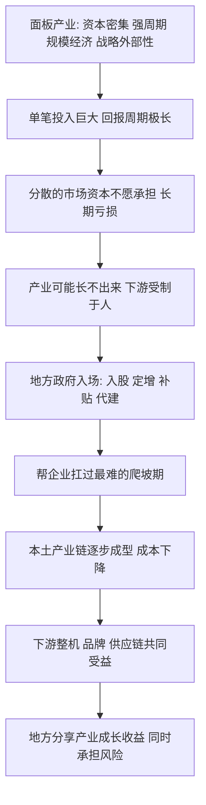

# 10｜京东方案例：政府为什么要「赌」一个产业？

> 一块屏幕背后，是一场持续多年、动辄几百亿的烧钱游戏。地方政府为什么要下场，去投一个长期亏损、强周期的产业？

---

## 一、先说结论

兰小欢在书中用京东方（面板产业）这个案例，讲清了一件事：**有些产业，单靠分散的市场资本很难撑起来。** 面板是资本极度密集、周期极强、又带战略外部性的行业，投进去可能连亏好几年，回报周期长到普通投资者难以忍受。

这时候，地方政府以入股、定增、补贴、代建等方式"入场"，用财政和信用帮企业扛过最难的阶段，才有可能培育出本土产业链。合肥等地的参与，后来分享了产业成长的红利，也承担了真实的风险。作者的态度因此是审慎的：这不是"该不该投"的问题，而是"什么条件下投、如何退出"的问题。

---

## 二、我们先理解一个问题

先问一个直觉问题：既然是市场经济，好产业自然会有人投，为什么还需要政府出手？

直觉上确实如此。有钱赚的生意，资本会自己冲进去。但现实里，有一类产业很特殊：**它未来可能非常重要，也非常赚钱，但在早期，它是个无底洞。**

面板就是这样的行业。你要建一条高世代生产线，动辄投入几百亿；建完之后，行业价格可能突然暴跌，你一亏就是好几年；等你好不容易熬到赚钱，竞争者又开始扩产，价格战再来一轮。这样的生意，一个理性的市场投资人会怎么看？

他大概率会说：**回报太不确定、周期太长、单笔金额太大，我不碰。**

于是问题就来了：如果所有分散的市场资本都这么想，这个产业是不是就永远长不出来？这，就是京东方案例要回应的问题。

---

## 三、作者到底提出了什么观点？

作者在书中指出，面板产业的几个特征，决定了它不能简单交给分散的市场资本：

- **资本极度密集**：一条生产线的投资是百亿级别，普通企业和基金根本扛不住。
- **强周期性**：面板价格大起大落，行业常常在"暴赚"和"巨亏"之间来回摆。
- **规模经济明显**：产量越大、单位成本越低，谁先做大谁就有成本优势，不进则退。
- **战略外部性**：这一点最容易被忽略。屏幕是手机、电视、电脑、汽车的核心部件，如果完全依赖进口，整条下游产业链都会受制于人。这种"我不做，别人就卡我"的价值，不会体现在某家公司的利润表里，却对整体经济至关重要。

正因为这几点叠加，作者认为：**单靠一家企业、或一群分散的市场资本，很难承担长期亏损和巨额投入。** 地方政府的介入——以股权投入、定增、补贴、代建厂房等方式——本质上是帮这个产业"买时间"，把最难的爬坡期扛过去。

---

## 四、把这个观点翻译成人话

先说清"战略外部性"这个词。

**外部性**，用大白话说就是：一件事的好处或坏处，会溢出到当事人之外。比如你种树，乘凉的是路人；你排污，受害的是下游。好处溢出的叫正外部性，坏处溢出的叫负外部性。

**战略外部性**，则是说这种溢出对整体经济、对整个产业链特别重要。屏幕就是典型：一家面板厂活下来，受益的不只是它自己，还有下游成千上万的整机厂、品牌商、工人和供应商——它们不用再高价买进口屏，也不用担心被断供。这部分好处，"当事人"是收不到的，所以市场不会自动为它付费。

这就解释了一个看似矛盾的现象：**从单个企业的角度看，投面板可能不划算；但从整个产业链的角度看，它非常值得。** 中间这个落差，就是政府要补的位置。

打个比方：一个小区里，路灯对所有人都有好处，但没有哪个住户愿意自掏腰包装一整条路的灯，因为好处大家共享、成本自己独担。这时候，往往得由物业或居委会出面统一装。政府投资战略性产业，扮演的正是这个"统一出面"的角色。

---

## 五、为什么会这样？

把这条逻辑链拆开：

这条链最关键的一步，是 **D → E**：市场不愿接，政府来补位。

为什么市场不愿接？因为市场资本的考核周期短、风险承受有限，它要的是可预期的回报，而面板恰好回报最不可预期。政府则不同：它的目标函数里不只有利润，还有就业、税收、产业链安全、区域发展——这些"不赚钱但重要"的东西，市场不替它考虑，它得自己考虑。

需要补充的是，这套逻辑成立有个前提：**政府判断的方向最终要被市场验证。** 如果投的产业后来真的起来了，前面扛的亏损就能换回长期收益；如果方向错了，投入就成了沉没成本。所以政府下场不是万能钥匙，它只是把"没人敢做"变成"有人试着做"。

---

## 六、举一个现实生活中的例子

假设一条老街上，几家小老板日子都不错，各自开着加工小作坊：做零件的、做组装的、做包装的。整条街最缺的，是一家能给所有小作坊稳定供货的原料厂。

问题是，开这家原料厂前期投入极大，头几年铁定巨亏，而且原料价格波动大，可能亏上好几年。任何一个小老板单独去开，都会把自己搭进去。所以谁都不动。

这时候，如果本地一个实力较厚的老板站出来，联合大家一起投：他出大头，其他人凑一部分，还给了块地、免了几年租金。原料厂慢慢建起来，撑过最难的几年后，成本越摊越薄。

结果会怎样？整条街的作坊都能就近拿货、压低价，生意反而更好；当初出大头的老板，也在原料厂站稳后收回了长期回报。**他赌的不是这一家厂当年的利润，而是整条街能不能一起长起来。**

京东方与地方政府的关系，逻辑上很接近。作者反复强调的重点不是"政府一定英明"，而是：**当一个产业的好处溢出到整个区域、整个产业链时，需要有人愿意承担那段"谁都算不过账"的时期。**

---

## 七、回到书中重新理解

现在再回看这个案例，就明白作者为什么把它写得这么仔细。

他不是在讲一个"政府投资很成功"的励志故事，而是在借它说明一个更底层的判断：**中国的产业升级，很多时候不是靠市场的自然演化，而是靠政府以"参与者"的身份，去承担市场不愿意承担的风险。**

这也是全书总论点的延续：中国政府是经济的内生参与者，不是外部的裁判者。京东方案例的价值，在于它把这个"参与"具体化了——不是喊口号，而是真金白银地入股、补贴、代建，然后一起承受周期。

理解了这一点，再看后面要讲的光伏、引导基金，就会更顺：它们处理的是同一类问题，只是方式和结果不同。

---

## 八、这个观点背后还有什么？

**第一，"谁承担风险"是这套机制的隐藏核心。** 政府下场的本质，是把本应由企业承担的风险，部分转移到了财政身上。这既可能是效率，也可能是隐患——关键看投对了没有。

**第二，地方政府之间的竞争会放大这种投资。** 一个城市靠面板做出了成绩，其他城市自然想复制。好处是产业更快做大，坏处是可能出现一窝蜂的重复布局。这一点在光伏案例里会更明显。

**第三，战略外部性很难量化。** 屏幕对下游有多重要？值多少钱？这些没有精确答案。正因为难量化，投资决策就容易依赖判断和魄力，而不是纯计算。这既是政府的优势，也是它的软肋。

**第四，成功案例容易被过度推广。** 合肥的收益是真实的，但我们往往只看到成功的样本。作者提醒读者要警惕"幸存者偏差"——活下来的故事会被反复讲，倒下的则很少被提起。

---

## 九、这个观点有问题吗？

这个案例的争议，不在"面板重不重要"，而在"政府该不该这样投"。

**分歧一：收益归谁、风险归谁。** 支持者说，政府入股分享了成长收益，还带动了本地就业和税收，划算；批评者说，如果投错了，亏损是财政承担的，也就是纳税人承担的，而成功时收益分配未必公平。**争议的实质是：政府用公共资金去赌一个产业，赢的账和输的账，是不是算在同一本账上。**

**分歧二：这到底是"有远见"还是"运气好"。** 有人把合肥的成功视为精准判断；也有人认为，同期很多地方做了类似投资却失败了，只是没人报道，所以个案的成功很难被当成普遍规律。**争议点在于：可复制的到底是能力，还是运气。**

**分歧三：会不会挤出真正的市场投资。** 有观点担心，政府大举入场会抬高要素价格、扭曲企业行为，让企业更依赖补贴而非靠技术竞争。也有观点认为，正是政府先扛过了早期风险，才让后来市场化资本敢于进入。

作者在书中并不把这些争议一笔抹平。他的立场是：**产业政策不是"要不要"的问题，而是"在什么条件下有效、政府能力的边界在哪里"。** 这为下一篇讨论光伏的成败，做了铺垫。

---

## 十、今天再看这个观点

先分清界限：**兰小欢在书里讲的是面板产业在特定阶段的投资逻辑，以下是他思想在今天的延伸。**

今天，这个逻辑正被套用到新的战场上：半导体、新能源、人工智能、算力基础设施。它们的共同特征与当年的面板惊人相似——投入巨大、回报周期长、战略意义强、容易被"卡脖子"。

于是老问题重新出现：**政府该在什么阶段介入、介入多深、什么时候退出？** 一个越来越清晰的共识是，政府更适合做"早期垫脚石"和"产业链组织者"，而不是长期直接经营。等产业跑起来、市场资本愿意进来时，财政资金应当逐步退出，否则容易造成产能过剩和依赖。

更深一层的追问是：**在一个技术迭代越来越快的时代，"押对方向"的难度是不是在上升？** 面板时代的周期以年计，今天的 AI 和芯片以月计。周期越短，政府决策相对市场反应慢的特点就越明显。这提醒我们，京东方式的成功，不能简单当成一套可以无限复制的方法。

---

## 十一、这一篇真正应该记住什么？

1. **有些产业单靠市场资本扛不住。** 面板资本密集、强周期、规模经济、有战略外部性，投入巨大而回报漫长。

2. **战略外部性意味着好处会外溢。** 屏幕关系到整条下游产业链的安全与成本，这部分价值不会体现在单一企业的利润里。

3. **政府下场的本质是补位、买时间。** 通过入股、定增、补贴、代建，帮产业扛过最难、市场最不愿承担的阶段。

4. **这是"参与"而非"命令"。** 政府以真金白银成为产业的一份子，成功了分享收益，失败了也承担风险。

5. **成败有条件，不能一概而论。** 合肥有收益，但也有风险与幸存者偏差，关键看方向能否被市场验证。

---

## 十二、留一个问题

> 如果政府的价值，在于替市场承担那些"谁都算不过账"的早期风险，
> 那么当产业跑起来、市场愿意接手时，
> 政府应该以什么标准、在什么时候退出，才不会既当了保姆、又当了庄家？

---

**下一篇**：政府投资并不总是成功。同样是给补贴，为什么有的产业真的做起来了，有的却变成一地鸡毛？下一篇文章，我们就用光伏这个行业，来看看产业政策的边界究竟在哪里——**为什么光伏有时成就一个行业，有时一地鸡毛？**
