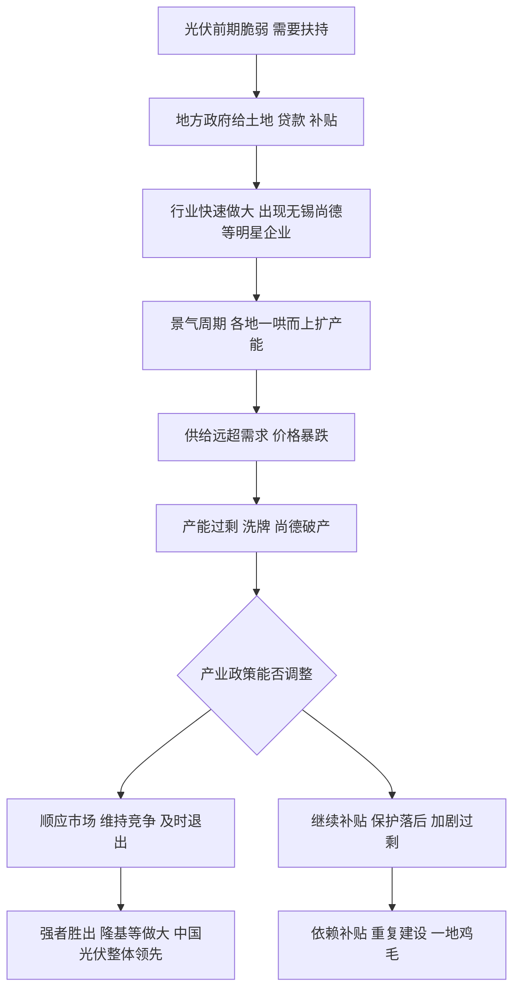

# 11｜同样是给补贴，为什么光伏有时成就一个行业、有时一地鸡毛？

> 补贴本身不是答案。真正决定成败的，是补贴背后的产业是否尊重市场规律、是否保持竞争、以及政府知不知道什么时候收手。

---

## 一、先说结论

兰小欢在书里用一个很有张力的对比来讲产业政策：**同样是政府大力扶持，光伏既出现过无锡尚德这样的明星企业轰然倒下，也最终长出了中国整体领先的光伏产业。** 同一套政策工具，既制造过惨烈的产能过剩，也助推了产业真正的做大。

所以作者的结论不是"产业政策万能"，也不是"产业政策一无是处"，而是一句更克制的话：**产业政策的成败，取决于是否顺应市场规律、是否维持竞争、是否能及时退出。** 政府能力有边界，扶持的本质，是一场关于"何时收手"的考验。

---

## 二、我们先理解一个问题

补贴这件事，听起来天经地义：新兴产业前期脆弱，给点钱、给点地、给点贷款，帮它活下来，不是很正常吗？

但现实并不这么简单。同样一笔补贴，放在两个行业、两个阶段，结果可能完全相反。有的行业补着补着真的起来了，企业开始靠技术和成本自己活；有的行业却越补越乱，企业靠补贴活着，产能越扩越多，最后价格崩盘、一地鸡毛。

问题就来了：**如果补贴工具本身是中性的、出发点是好的，那为什么会补出两种截然不同的结果？**

这不是一个抽象问题。它关系到我们怎么理解政府和经济的关系：政府的手到底能帮上多少忙，又会在哪里帮倒忙。光伏，就是回答这个问题最好的样本之一。

---

## 三、作者到底提出了什么观点？

作者在书中讲光伏，大致分成两截。

**前半截，是政府扶持的高光。** 早期中国的光伏企业，很多是在地方政府的土地、贷款、补贴支持下快速起步的，无锡尚德就是当时最耀眼的代表。地方政府给地、给融资便利、给各种政策倾斜，行业在短时间内迅速做大，中国一度成为全球光伏制造的中心。

**后半截，是寒冬与洗牌。** 光伏是典型的强周期、重资产行业。行业景气时，各地一哄而上扩产能；等全球需求变化、价格暴跌，产能过剩的问题立刻暴露。无锡尚德这样的企业，最终没能扛过寒冬，走向破产。大量投资打了水漂。

**但故事还没完。** 在经历惨烈洗牌之后，中国光伏产业的整体实力反而变得更强了，出现了隆基等一批真正具备技术、规模和成本优势的龙头企业，最终在全球市场占据主导。

作者由此提炼出产业政策成败的几个条件：

- **是否顺应市场规律**：产业最终要靠成本和技术竞争力活下去，而不是靠补贴续命。
- **是否维持竞争**：补贴如果变成地方保护、变成"谁都能拿"，就会养懒企业、催生过剩；如果补贴带来的是更激烈的竞争和优胜劣汰，反而能筛选出强者。
- **是否能及时退出**：景气时补贴该退，让市场自己运行；退得晚，就会累积过剩和依赖。

---

## 四、把这个观点翻译成人话

先解释"产能过剩"这个词。

**产能过剩**，大白话就是：生产东西的能力，超过了市场真正能消化的量。工厂建好了、工人招齐了、机器转起来了，可东西卖不完。卖不完怎么办？降价。大家一起降价，就变成价格战，越打越亏。太多产能挤在一个赛道里，谁都别想赚钱。

光伏的困境就是这样：行情好的时候，大家都觉得这是未来，各地比赛式地上项目、扩产能。结果是全行业供给远远超过需求，价格一落千丈，弱的企业先倒下，强的企业才有机会熬出来。

那补贴的问题出在哪？可以把政府扶持分成两种：

| 补贴方式 | 大致结果 |
|---|---|
| 补"入场"——谁都能拿，只看谁上项目快 | 容易一窝蜂、重复建设、产能过剩 |
| 补"竞争"——谁技术好、成本低，谁拿得多 | 更可能筛出真正强的企业 |
| 该退不退——行情好了还继续补 | 企业依赖补贴，市场信号失灵 |
| 及时退出——产业跑起来就撤 | 让优胜劣汰自然发生，行业更健康 |

关键不在于"补不补"，而在于**补贴是在制造竞争，还是在替代竞争**。

---

## 五、为什么会这样？

把光伏这条逻辑链拆开：

这条链最关键的分叉，是 **G**：**产业政策能不能根据阶段调整自己。**

产业政策最大的难点，在于它面对的是一个动态过程。早期需要扶持，因为产业太弱、市场太冷；但产业一旦起来了，扶持就可能变成负担——它会让本该被淘汰的企业活下来，让价格信号失灵，让过剩继续累积。H 与 I 的分野，就在这里。

作者想强调的其实是：**政府的能力有边界。** 政府可以帮忙启动一个产业，但很难替市场判断谁是最终赢家。所以最优的姿态，往往不是"一直扶"，而是在合适的时候把接力棒交给市场。难就难在，什么算"合适的时候"，往往事后才看得清。

---

## 六、举一个现实生活中的例子

想想家长给孩子报补习班。

有的家庭给孩子报班，是因为孩子基础薄弱、需要有人推一把。补了一两年，孩子自己找到了方法，成绩上来了，这时候如果继续猛补，反而可能让孩子依赖外部压力、失去自主学习的能力。聪明的家长，会在孩子走上正轨后逐渐减少补课，让他自己跑。

也有另一种家庭：孩子其实不适合这个方向，家长却因为已经投了很多钱、不甘心，继续加码。越补越逆反，钱花了不少，效果越来越差。**问题不在"要不要补"，而在"补的方向对不对、什么时候该停"。**

给创业朋友的资助也是同一个道理。朋友刚开始做一件事，你借他一笔钱帮他起步，很正常。可如果他一直亏、一直要靠你接济，你就要判断：他是处在爬坡期，还是根本没有可行的模式？继续给，是帮他熬过难关，还是让他在错误的路上越陷越深？

政府扶持产业，本质上就是同时回答这两个问题：**这个方向对不对，以及现在该不该停。** 光伏的教训和成就，很大程度上就取决于各地在这两个问题上的答案。

---

## 七、回到书中重新理解

现在再回看光伏这个案例，就明白作者为什么把它和京东方放在一起讲。

京东方那篇讲的是"该不该入场"，光伏这篇讲的是"入场之后怎么办"。两者合起来，构成一个完整的判断：**政府参与产业，关键不在一时输赢，而在能否随阶段调整角色。**

作者写尚德的破产，不是为了证明扶持错了——毕竟中国光伏整体最后做大了；也不是为了证明扶持对了——毕竟过程中付出了惨烈的代价。他要呈现的是一种**条件性**：同一套工具，在不同条件下，结果天差地别。

这也是《置身事内》一以贯之的态度：不简单地站队，而是看机制、看阶段、看约束。

---

## 八、这个观点背后还有什么？

**第一，"退出"比"进入"更难。** 进入有政绩、有故事、能立竿见影；退出则意味着承认判断可能该变了，还要面对企业和就业的压力。政治上的不对称，让"及时收手"变得格外困难。

**第二，地方竞争会加剧产能过剩。** 中央可以呼吁理性，但各地都在争取项目和税收，谁先退出谁吃亏，于是容易形成"所有人都不退"的僵局。光伏的过剩，很大程度上是这种地方博弈的结果。

**第三，成功企业的合法性来自市场，而非补贴。** 隆基等企业最终能站稳，是因为在成本和技术上真正有竞争力，不是因为拿的补贴最多。补贴可以帮助企业活过早期，但没法替代竞争力本身。

**第四，周期本身就是筛选器。** 残酷的洗牌虽然痛苦，却也淘汰了靠补贴和风口活着、缺乏真实竞争力的企业。从结果看，寒冬反而让产业整体更健康。这提醒我们：判断产业政策，不能只看过程多难看，也要看终点留下了什么。

---

## 九、这个观点有问题吗？

这一篇的争议格外大，因为它同时触碰了"政府该不该管"和"管得好不好"两个敏感问题。

**分歧一：光伏最终做大了，该归功于补贴还是市场？** 一方说，没有早期政府扶持，中国光伏不可能那么快起来，补贴是必要的"第一推动力"；另一方说，真正让产业强大的是那场残酷的市场洗牌，是竞争筛出了强企业，补贴的作用被高估了。**争议的实质是：起点和终点之间，功劳到底该记给谁。**

**分歧二：尚德的破产，是政策失败还是市场必然？** 有人认为，政府大力扶持反而让企业过度扩张，是悲剧的推手；也有人认为，行业周期本就残酷，任何企业都可能倒下，不能把市场风险全算到政策头上。**争议点在于：政府扶持到底是"助长冒险"，还是"承担了本该市场承担的风险"。**

**分歧三：到底有没有一个"科学的退出时点"？** 理论上都说要及时退出，可现实中，什么算"该退"？景气顶点无人知道，只有事后回看才清楚。**争议点在于：如果连专业投资者都难以判断周期，凭什么要求政府精准踩点。**

需要说明的是，作者并没有给出一个斩钉截铁的答案。他更倾向于提醒：产业政策不是"要不要"的选择题，而是"什么条件下有效"的应用题，而且政府能力确实有边界。

---

## 十、今天再看这个观点

先分清：**兰小欢讲的是光伏等产业在特定发展阶段的经验，以下是他思想在今天的延伸。**

今天，同样的剧本正在新能源车、储能、芯片、AI 等赛道上重演：地方政府争相给补贴、给政策、给土地，企业纷纷扩产能，竞争异常激烈。光伏教会我们的那几件事，此刻格外有现实感——

- **规模不等于竞争力。** 产能上得快，不代表技术强、成本低。
- **补贴退坡是常态而非意外。** 越早适应，越早摆脱依赖。
- **洗牌是产业成熟的必经环节。** 看起来惨烈，但往往是筛选强者的过程。

再往深一层看，一个更普遍的难题浮现出来：**在技术迭代越来越快的时代，"什么阶段该扶、什么阶段该退"的判断窗口正在变短。** 光伏的周期以年计，今天的 AI 变化以月计。这意味着产业政策的容错空间在收窄，对"及时调整"的要求在提高。这或许是光伏案例留给未来最重要的提醒：真正考验政府的，从来不是"敢不敢出手"，而是"懂不懂收手"。

---

## 十一、这一篇真正应该记住什么？

1. **同样的补贴，可以补出两种结果。** 光伏既有尚德破产的惨痛，也有中国产业整体做大的成就，说明工具本身是中性的。

2. **成败看条件，不看口号。** 是否顺应市场规律、是否维持竞争、是否能及时退出，是三个关键变量。

3. **补贴是在制造竞争，还是在替代竞争，至关重要。** 保护落后的补贴会催生过剩，促进竞争的补贴能筛出强者。

4. **"及时退出"比"大胆进入"更难。** 进入有政绩和短期效果，退出要承受压力和不确定，政治上的不对称让收手格外困难。

5. **政府能力有边界。** 产业政策的本质不是"万能"或"无用"，而是一场关于何时收手的持续考验。

---

## 十二、留一个问题

> 如果产业政策最难的从来不是"要不要补"，而是"什么时候停"，
> 那么当没有人能提前知道周期的顶点、
> 而每一个地方都怕自己先停就吃亏时，
> 这套"该退则退"的理想，到底要靠什么才能真的执行下去？

---

**下一篇**：既然直接补贴问题这么多，那有没有一种更"市场化"的方式？把财政的钱交给专业投资人去管，同时还要它完成政策目标——这听起来很美。下一篇我们就来问：**政府引导基金，是不是"新瓶装旧酒"？**
