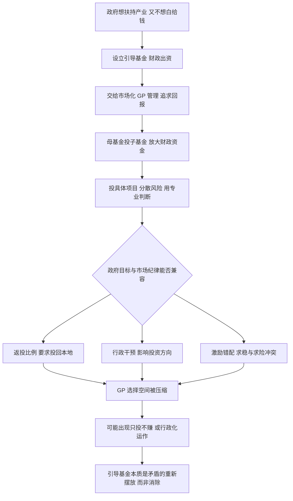

# 12｜政府引导基金，是不是「新瓶装旧酒」？

> 财政出一笔钱，交给专业的市场机构去投——这听起来像市场化改革。可如果钱是政府的、目标也是政府的，它和过去的直接补贴，究竟差在哪？

---

## 一、先说结论

兰小欢在书中把政府引导基金描述成一次**财政资金配置方式的尝试**：政府出钱设立基金，交给市场化的基金管理人（GP）去投，希望在"政府目标"和"市场纪律"之间找一个平衡。

它和过去直接补贴的最大区别，是**要求回报、分散风险、引入专业判断**。但作者也点出了它的现实难题：返投比例、行政干预、激励错配、GP 选择困难，以及"只投不赚"的风险。**"政府目标"与"市场纪律"天然紧张，引导基金不是矛盾的消除，而是矛盾的重新摆放。**

---

## 二、我们先理解一个问题

先问一个很实在的问题：政府想扶持产业，除了直接给补贴，还能怎么做？

直接补贴的毛病，上一篇已经讲清楚了：容易撒胡椒面、容易养懒企业、容易催生过剩，而且钱花出去往往没有回报，纯支出。于是有人想：能不能换一种方式？

比如，政府不直接发钱，而是设立一只基金，把钱交给专业的投资人打理。投资人按市场规矩办事，选有潜力的项目，追求回报。这样既是"扶持"，又是"投资"，钱有可能收回来，听起来两全其美。

这就有了政府引导基金。但问题也随之而来：**如果钱是政府的，政府一定想让它流向自己关心的方向；可市场化的投资人，只想投最赚钱的项目。这两件事，经常不是一回事。** 那么，这只基金到底听谁的？

---

## 三、作者到底提出了什么观点？

作者在书中解释，政府引导基金的基本运作是：

- **财政出钱**：政府拿出一部分财政资金作为母基金。
- **交给市场化 GP 管理**：由专业的基金管理人负责投资决策，按市场规则筛选项目。
- **通常采取母基金加子基金的结构**：引导基金投给若干子基金，子基金再投具体项目，用杠杆放大财政资金的作用。

它想解决的核心问题，是让财政资金不再"白给"，而是像市场资本一样被要求回报。这与直接补贴有几处不同：

1. **要求回报**：投出去的钱希望能收回来、有增值，而不是一次性支出。
2. **分散风险**：通过基金组合投一批项目，而不是把宝押在一家企业上。
3. **引入专业判断**：让更懂行业的人来决定投谁，而不是行政拍板。

但作者同时指出，现实中的引导基金面临几个绕不开的难题：

- **返投比例**：政府常要求子基金把一定比例的资金投回本地，以带动本地产业。这直接限制了 GP 的选择范围。
- **行政干预**：政府作为出资人，难免希望影响投资方向。
- **激励错配**：财政资金求稳、怕亏损，市场化 GP 追求高风险高回报，两者动力不一致。
- **GP 选择困难**：选谁管钱本身就是个难题，选错了，机制设计再好也白搭。
- **只投不赚**：有些基金投出去的钱难以产生回报，最后变成另一种形式的财政支出。

---

## 四、把这个观点翻译成人话

先解释两个词。

**GP**，就是基金管理人，用大白话说，就是"帮别人管钱、做投资决定的那个人或机构"。
**返投比例**，就是"你拿了我这笔钱，必须有多少比例投回到我们本地"。比如政府给了十个亿，要求至少六成投在本省本市的项目上。

把这套机制翻译成一个生活场景：父母有一笔钱，想让孩子将来有个好出路。直接给孩子现金，孩子可能乱花（这就是直接补贴的毛病）。于是父母换了个办法——把钱交给一个专业的理财顾问去打理，同时提一个条件："这笔钱，必须有一部分投在教育相关的方向上。"

这就同时有了三个好处：钱有专业的人管、有增值的可能、方向也照顾到了父母的心愿。

但麻烦也藏在细节里。顾问本来想投一个最赚钱的项目，可那个项目不在父母要求的方向上，只好放弃；父母时不时又来"关心"一下："是不是该多投点这个、少投点那个？"顾问的专业判断被干扰；更麻烦的是，如果后来钱亏了，顾问会说"是你们指定的方向不行"，父母会说"是你没管好"，责任说不清。

**引导基金的两难，就浓缩在这段关系里：出钱的人想要方向，管钱的人想要收益，而方向与收益并不总是重合。**

---

## 五、为什么会这样？

把引导基金的逻辑链拆开：

这条链最关键的是 **F**：政府目标与市场纪律能否兼容。

为什么它们天然紧张？因为两者的**评判标准不同**。政府看的是"有没有带动本地产业、有没有完成政策意图"；市场 GP 看的是"这笔投资能不能赚钱"。这两套标准，有时候一致，有时候直接冲突。返投比例、行政干预、激励错配，本质上都是这个冲突的具体表现。

需要补充的是，引导基金并没有"解决"这个冲突，它只是把冲突从"政府直接发钱"搬到了"基金内部"。过去是政府和企业之间的博弈，现在变成了政府、GP、子基金、项目之间的多重博弈。**机制设计得越精巧，越要警惕：矛盾没有被消除，只是被重新分配了。**

---

## 六、举一个现实生活中的例子

再设想一家公司，想推动内部创新。

老板很有钱，也想鼓励员工搞新东西。最直接的办法是给项目组发钱，可过去的经验是：钱一发下去，容易变成"谁关系好谁拿"，项目做不做成都没人负责（这对应直接补贴的毛病）。

于是老板换了个思路：成立一个"创新基金"，定一个总额，交给外面专业的天使投资人来管。投资人按市场规则选项目、要回报、允许失败但要看出逻辑。

听起来更专业了。但老板很快提了几个要求："投的项目得和公司主业相关""至少一半要投公司内部团队""我想知道你们每一个决定"。投资人也有自己的顾虑：内部项目未必是最好的，硬投了可能亏；老板老干预，专业判断就失灵；而且万一亏了，是谁的责任？

最后可能出现两种结局。一种是良性循环：投资人有专业筛选能力，内部团队为了拿到钱真的做出东西，老板只做监督不插手，基金既有回报又带动了创新。另一种是形式化：投资人为了满足老板的要求，挑几个"看起来合规"的项目把钱投出去，亏了也没人追究，基金变成了换个名目的内部拨款。

**这就是引导基金的两种可能。** 决定走向哪一边的，不是"有没有基金"这个形式，而是**规则设计得是否清楚、边界守得是否住、责任是否说得明**。

---

## 七、回到书中重新理解

现在再回看作者对引导基金的讨论，就能抓住重点了。

他不是在鼓吹"引导基金是先进工具、应该大力推广"，也不是简单否定它"换汤不换药"。他呈现的是**一次真实的制度尝试**：在财政资金使用上，从"直接花钱"转向"市场化配置"，方向是对的，但落地时会撞上政府目标与市场纪律的结构性张力。

这与全书的一贯判断一致：**政府置身事内，它在不断寻找更好的参与方式。** 引导基金是众多尝试中的一种，它既继承了过去的问题，也带来了新的可能。理解它的价值，不在于判断它"好"或"坏"，而在于看清它在多大程度上真的引入了市场纪律，又在多大程度上只是把补贴换了件外衣。

---

## 八、这个观点背后还有什么？

**第一，"市场化"是一种手段，不是一个标签。** 把财政资金交给 GP，不等于就市场化了。如果返投比例过高、行政干预过多，市场化就只是形式。**判断标准是：投资决策的自由度有多大。**

**第二，激励设计才是核心。** 引导基金要想真正运转，必须让 GP 和政府的利益某种程度对齐：既让 GP 有动力追求回报，又让政策目标不至于被完全抛弃。这需要精巧的制度设计，难度极高。

**第三，财政资金和风险资本的性质不同。** 财政资金求稳、怕问责，而风险投资天生允许失败、靠少数成功覆盖多数失败。把两者硬凑在一起，容易出现"不敢投"或"乱投"两种极端。

**第四，它其实是政府角色转型的一个缩影。** 从直接生产、直接补贴，转向做基金的出资人和规则制定者，方向上是"从运动员转向引导者"。这个转型能不能成功，不止关乎一只基金，而关乎政府与市场关系的整体演进。

---

## 九、这个观点有问题吗？

围绕引导基金的争议，集中在"它到底是不是真的进步"。

**分歧一：究竟是市场化改革，还是换了件外衣的补贴？** 支持者说，它引入了专业判断、要求回报、分散风险，明显优于直接补贴；批评者说，返投比例、行政干预限制了真正的市场化，很多基金最后变成"变相财政支出"，本质上还是政府在配置资金。**争议的实质是：形式上的市场化，能不能带来实质上的市场纪律。**

**分歧二：返投比例是必要的，还是有害的？** 一方认为，本地化投资才能带动本地就业和税收，否则钱投到外地，地方财政图什么？另一方认为，返投比例直接压缩了 GP 的选择空间，好项目投不进去，剩下的只能凑数，反而降低资金效率。**争议点在于：政策目标和投资效率，哪个该优先、能不能兼得。**

**分歧三：谁来为亏损负责？** 如果基金亏了，是 GP 判断失误，还是政府设的条件本身就不合理？责任边界不清，就容易出现两种情况：要么 GP 不敢投、只求不出错；要么胡乱投、反正亏损有财政兜着。**争议点在于：在没有清晰问责机制的情况下，"市场化"可能既不专业、也不负责。**

作者在书中的态度是审慎的：既肯定它试图引入市场纪律的努力，也不回避它与生俱来的张力。他没有给出"它一定行"或"它一定不行"的判断，而是把它作为一个正在演进的机制来观察。

---

## 十、今天再看这个观点

先明确：**兰小欢讨论的是引导基金在特定阶段的运作与问题，以下是他思想在今天的延伸。**

这些年，引导基金从中央到地方都非常活跃，规模不断扩大，成为地方"以投促引"的重要工具。它们在支持硬科技、半导体、新能源等产业上，扮演了越来越重要的角色。但前述的几个老问题，也随之在更大范围里重现：返投要求、招商导向、GP 同质化、"重设立、轻运营"。

一个值得追问的新问题是：**当引导基金从"小规模试点"变成"普遍模式"，它对市场生态意味着什么？** 好处是，更多财政资金以市场化方式进入早期投资，缓解了硬科技"输血不足"的困境；隐忧是，如果各地纷纷设立、层层加码，可能造成资金过剩、项目估值虚高、地方之间新一轮的贴钱竞争。

更进一步看，引导基金其实是全球都在探索的一道题：**如何用公共资金支持那些"社会需要、但市场暂时不敢投"的领域。** 美国的 SBIC、以色列的 Yozma、新加坡的淡马锡，思路各有不同，但都绕不开同一个核心：**如何在不扼杀市场判断的前提下，完成公共目标。** 这或许正是引导基金真正的价值所在——它逼着我们去认真设计"政府与市场的边界"，而不只是喊口号。

---

## 十一、这一篇真正应该记住什么？

1. **引导基金是财政资金配置方式的尝试。** 政府出钱、交给市场化 GP 管理，试图兼顾政策目标与市场纪律。

2. **它与直接补贴有三点不同。** 要求回报、分散风险、引入专业判断，钱的"性质"从支出变成了投资。

3. **"政府目标"与"市场纪律"天然紧张。** 返投比例、行政干预、激励错配、只投不赚，都是这种张力的具体表现。

4. **它没有消除矛盾，只是重新摆放了矛盾。** 从政府与企业的博弈，变成了政府、GP、子基金、项目之间的多重博弈。

5. **成败的关键在规则设计。** 投资决策的自由度、激励是否对齐、责任是否清晰，才是判断"市场化"是真是假的核心。

---

## 十二、留一个问题

> 如果引导基金的价值，在于用市场的方式去完成政府的目标，
> 那么当"市场判断"和"政策方向"发生冲突时，
> 究竟该听专业的判断，还是听出资人的意志？
> 一个既想让钱赚钱、又想让钱听话的机制，边界到底在哪里？

---

**下一篇**：到这里，我们已经看完了政府如何通过平台、投资、补贴、基金参与产业。但所有这些故事，最终都要落到一个普通人绕不开的地方——房子。下一篇文章，我们就来问一个几乎人人关心的问题：**房价为什么涨得这么快？**
