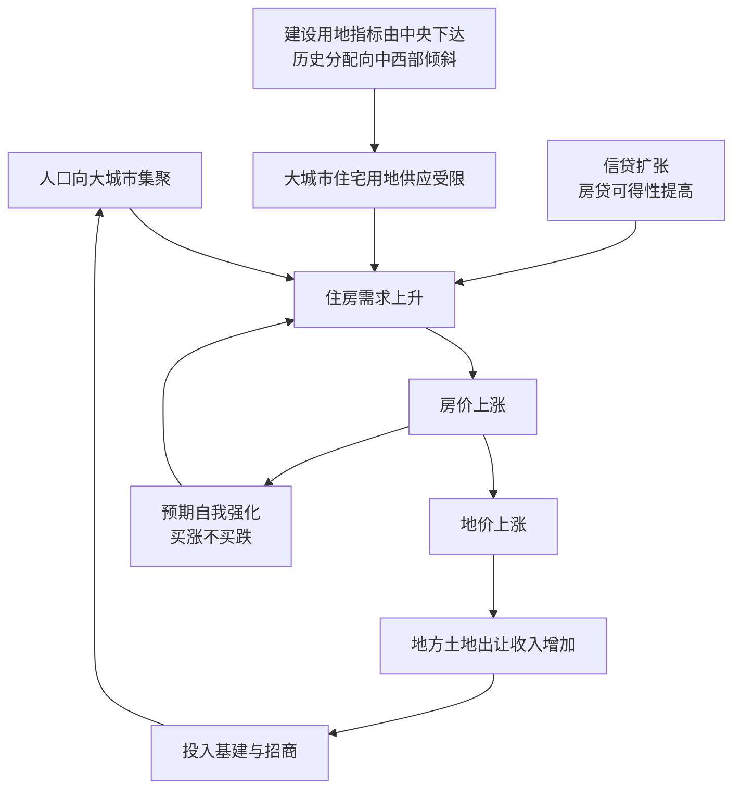

# 13｜房价为什么涨得这么快？

> 过去二十年，中国大城市的房价为什么持续上涨？

---

## 一、先说结论

兰小欢在《置身事内》里没有把房价上涨归咎于某一个"坏人"，而是把它拆成几个互相咬合的机制：**城市化带来需求，建设用地指标卡住供给，信贷扩张放大购买力，地方财政又依赖地价。** 四个齿轮一起转，房价就被持续推高。

其中最核心的矛盾，可以概括成一句话：**人往大城市走，土地指标却不完全跟着人走。** 这个结构性的错配，是理解中国大城市房价的关键。

---

## 二、我们先理解一个问题

如果房子只是一件普通商品，那么按照最朴素的供需逻辑：需求多了，价格涨，自然会有更多人、更多钱涌进来盖房，供给跟上，价格就该回落。

可现实不是这样。过去二十年，像北京、上海、深圳这样的大城市，房价涨了十倍上下，但供给并没有像理论上那样迅速跟上。更奇怪的是，有些地方政府明明看着地价飞涨，也不见得愿意多卖地。

于是问题来了：**为什么需求最旺的地方，房子反而没有盖得最多？**

这个问题不解决，我们就没法理解房价，也没法理解后面一连串的现象——地方财政、居民负债，乃至今天的保交楼。

---

## 三、作者到底提出了什么观点？

兰小欢在书中指出，房价上涨不是单一原因，而是几股力量叠加的结果：

- **城市化与人口集聚**：改革开放以来，中国城市化率从不到 20% 一路升到 60% 以上，几亿人从农村走向城市，而且优先涌向就业机会最多的大城市，住房需求因此持续膨胀。
- **土地供应受指标约束**：城市建设用地不是想批多少就批多少，而是由中央按年度下达「新增建设用地指标」。这个指标的历史分配偏向中西部，以支持区域均衡，而人口却持续向东部沿海和大城市流动。
- **信贷扩张**：银行体系提供了大量按揭贷款，让家庭可以把未来几十年的收入"搬到今天"来买房，等于放大了购买力。
- **地方政府的动机**：土地出让收入（俗称「土地财政」）和与土地相关的税收是地方财政的重要来源，地价越高，地方越有动力维持高地价。

作者把这些因素拧成一句话：**房价是城市化、土地供应、信贷和政府动机共同作用的结果，核心是"人地错配"。**

---

## 四、把这个观点翻译成人话

先说一个常识：房子不是空中楼阁，它必须盖在土地上。而土地在中国不是普通商品，它的用途和数量都受严格管理。

你可以这样理解「建设用地指标」：**每年中央会拿出一批"可以盖房子的额度"，分给各省，再往下分。** 一个城市能新增多少建筑用地，很大程度上取决于它拿到多少指标。指标多的年份，能多盖；指标少的年份，就算开发商想盖、老百姓想买，也未必批得下来。

问题就出在这里。过去二十多年，人口持续涌向少数几个大城市群：长三角、珠三角、京津冀。人到了，就要住。但新增建设用地指标的分配，并没有完全跟着人口走，出于区域均衡等考虑，相当一部分指标给了中西部。于是出现一个拧巴的局面：

**人最挤的地方，能盖房的额度最紧张；人没那么挤的地方，反而拿了不少指标。**

这就是「人地错配」——**人口流动的方向，和土地供应增加的方向，没有对齐。**

需要提醒的是，这篇文章只讲房价的宏观成因；至于家庭为什么愿意借钱、敢加杠杆，那是下一篇的主题，这里先按下不表。

---

## 五、为什么会这样？

把作者的推理拆成链条，大致是这样：

这条链条里有三个关键环节。

**第一，B → C → D 这一步，就是"人地错配"。** 需求和供给被两套不同的逻辑支配：人在市场上自由流动，土地却按计划分配。两套逻辑不一致，价格就会持续偏离。

**第二，F → G → H → I 这一步，是地方政府的动机回路。** 地价上涨让卖地收入增加，这笔钱又能投入基建和招商，进一步吸引人口和企业，反过来又推高地价。这个循环在城市化上升期非常顺畅。

**第三，J → D 这一步，是预期的自我强化。** 当所有人都相信"房价还会涨"，买房就从"居住消费"变成了"抢跑投资"，需求被提前、被放大，价格更容易脱离基本面。

四个齿轮咬合在一起，才是房价"涨得这么快"的完整解释。

---

## 六、举一个现实生活中的例子

假设有这么一座正在扩张的省会城市。这几年，市里建了新区，地铁通了，几家大企业搬了进来，每年有十几万年轻人从省内各地涌来工作。租房市场立刻紧张，一居室租金两年涨了四成。

按道理，开发商应该赶紧盖楼。可他们发现，真正卡脖子的不是钱，也不是买家，而是**地**。新区周边适合建住宅的地，每年能上市的指标有限，还得优先安排产业用地、道路和公共设施。结果就是：想买的人一波接一波，能交到市场上的新房却只有那么多。

于是我们看到熟悉的一幕：新楼盘开盘，几百套房，几千人排队，摇号、验资、全款优先。二手房东一看行情，立刻跳价，甚至毁约不卖。房价不是慢慢涨上去的，而是被人流和稀缺的供给一起推着，一截一截跳上去的。

热门学区房是同一个逻辑的极端版本：房子本身可能又老又小，但因为它绑定了一所好小学的入学资格，价格能比同地段高出好几倍。**这时你买的已经不只是砖头，而是稀缺的、被制度锁定在城市里的资源。**

---

## 七、回到书中重新理解

现在回头看作者的分析，就顺了。

他之所以要在讲房价之前，先花大篇幅讲土地制度、土地财政、土地金融，正是因为在他看来：中国的房价问题，不能只从"货币多不多"去看，也不能只从"炒房客坏不坏"去看，而要回到**土地这个要素究竟是怎么被配置的**。

他认为，地方政府的收入结构、中央对建设用地的计划管理、人口的自由流动与土地指标的非自由流动，这几个制度性事实叠在一起，才构成了中国房价的特殊底色。

理解了这一点，你也就理解了为什么"调控房价"这么难：因为你要动的不是一个价格，而是背后一整套财政、土地、人口的安排。

---

## 八、这个观点背后还有什么？

有几个作者没有完全展开、但值得追问的前提。

**第一，土地是"要素"，而要素市场没有完全市场化。** 劳动力可以相对自由地跨省流动，但土地指标不能自由跨省交易，资本的价格（利率）也受到管制。当几个要素的市场化程度不一致时，价格信号就会扭曲，房价正是这种扭曲的集中体现。

**第二，地方政府对土地一级市场的垄断。** 城市土地归国家所有，政府依法征地后，通过招拍挂出让。这意味着供给端高度集中——**不是完全竞争的市场在决定供地量，而是地方政府的节奏在决定供地量。**

**第三，房子同时是消费品和投资品。** 它既是"住的地方"，也是家庭最重要的储值工具。一旦人们普遍相信它会涨，需求就不只是居住需求，还叠加了投资需求，价格更容易自我强化。

**第四，"人地错配"的真正分量，在于它是长期的。** 它不是说某一年指标分错了，而是说一整套计划分配逻辑，和市场化的人口流动之间，存在结构性的张力。这才是它值得反复被提起的原因。

---

## 九、这个观点有问题吗？

有，而且关于房价成因，学界分歧很大。**作者给出的是一条有力的解释路径，但不是唯一解释，更不是学界共识。** 争议主要发生在几个点上。

**第一，"供给不足"还是"货币太多"？** 作者和不少学者（如长期研究城市与区域经济的陆铭等）强调土地供应受限、人地错配；但也有经济学者认为，房价本质是货币现象——过去二十年广义货币（M2）快速增长，钱总要找地方去，房产成了最大的蓄水池。这两个解释并不完全排斥，但侧重点不同：一个看供给，一个看货币。

**第二，"人地错配"到底有多重要？** 有研究支持这个判断，认为如果大城市能获得更多土地指标，房价会明显更低；也有学者质疑，核心地段的稀缺是客观的，增加一点指标未必压得住价格。**分歧的关键在于：土地供给对房价的弹性到底有多大。**

**第三，学区房的问题。** 学区房的高价，本质上是优质公共服务的价格被"资本化"进了房价。把它简单归为"土地供应不足"可能并不准确——即便土地充足，只要教育资源不均等，学区房照样能贵。

**第四，统计口径也影响判断。** 官方房价指数和中介平台成交价常常对不上；不同城市、不同地段差异极大。"中国房价涨了多少"这句话，本身就要限定时间和城市。

所以更准确的说法是：**房价上涨是多重机制叠加的产物，"人地错配"是其中很重要的一环，但不是全部。**

---

## 十、今天再看这个观点

**先说书中的观点**：兰小欢认为，房价问题根植于土地供应制度、地方财政动机和人口流动之间的错配，理解房价必须理解政府如何配置土地这个要素。

**以下内容是把作者的分析框架拿到今天来看，属于本系列的延伸，不是书中原话。**

书中成稿时，中国人口还在增长、城市化还在快速推进。而今天，局面已经变了：全国人口开始负增长，城市化速度放缓，楼市从"普涨"转向"分化"——深圳、杭州和鹤岗、乳山，几乎活在两个世界。这说明，当年那套"人往大城市走"的机制依然在起作用，但总量上的"水"已经不一样了。

与此同时，政策重心也从"抑制房价"转向了"保交楼、防风险、建保障房、租购并举"。另一个值得注意的变化是：学区房的一些优势，正在被多校划片、教师轮岗等政策稀释——这恰好从反面印证了"优质公共服务会被资本化进房价"这一判断。

换句话说，**当年解释房价上涨的那套机制，今天也在解释房价为什么会分化、为什么会回调。**

---

## 十一、这一篇真正应该记住什么？

1. **房价是四个齿轮一起转的结果**：城市化带来需求，土地指标卡住供给，信贷放大购买力，地方财政依赖地价。
2. **核心矛盾是"人地错配"**：人往大城市走，建设用地指标却不完全跟着人走。
3. **土地不是普通商品**：用途和数量受计划管理，地方政府垄断一级市场，供给节奏不完全由市场竞争决定。
4. **房子兼具消费与投资属性**：一旦"会涨"成为共识，需求会自我强化。
5. **解释有力但非定论**：房价成因学界仍有"供给论""货币论""财政论"等分歧。

---

## 十二、留一个问题

> 如果房价上涨的根源，是土地和人口这两种要素没能"对齐"，
> 那么，什么样的改革能让它们重新对齐？
> 而在对齐之前，那些已经上了车、背上三十年贷款的家庭，又该怎么办？

---

**下一篇**：房价能一直涨，除了供需，还有一个关键推手——钱。过去十几年，越来越多的中国家庭愿意借钱、甚至掏空两代人的积蓄去买房。他们为什么越来越敢借？这背后又藏着怎样的风险？

下一篇我们就来拆这个问题——**居民为什么越来越敢借钱买房？**
