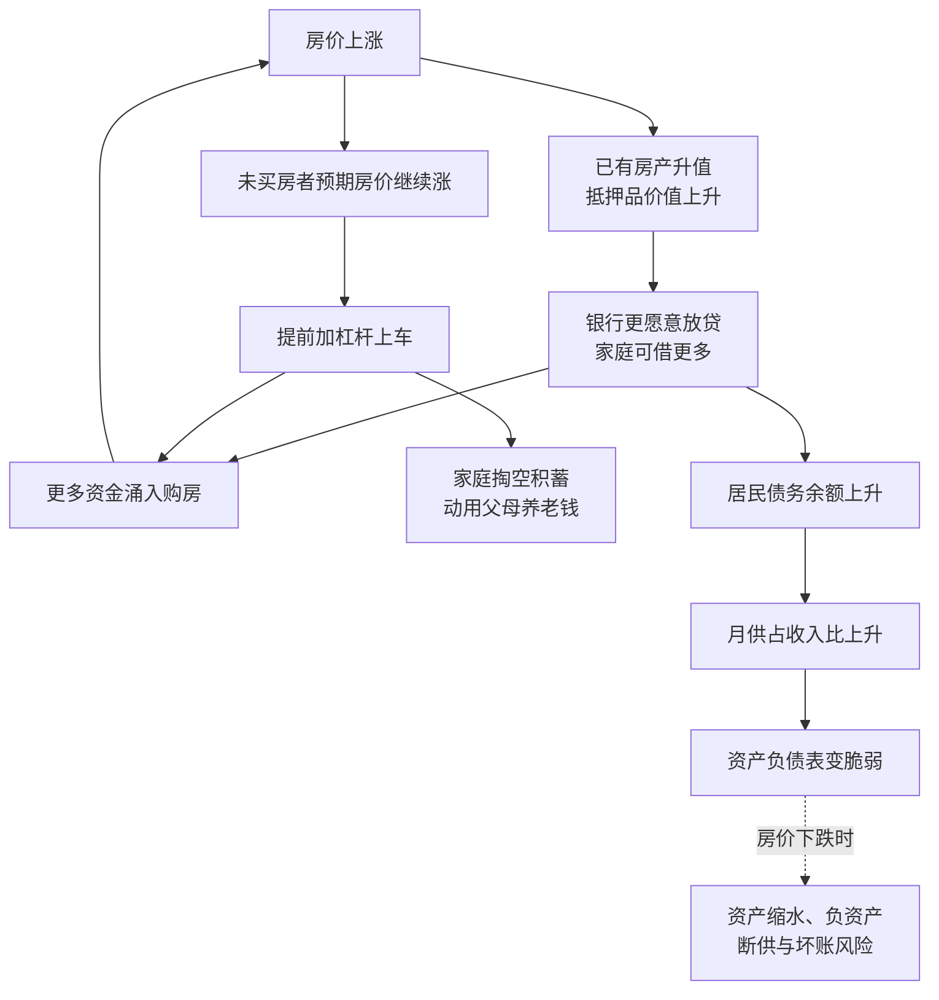

# 14｜居民为什么越来越敢借钱买房？

> 中国居民债务为什么在房价上涨中快速攀升？

---

## 一、先说结论

兰小欢的分析可以浓缩成一条正反馈：**房价持续上涨，让房产成了家庭手里最可靠、最值钱的抵押品；于是家庭更愿意借钱买房，借钱又进一步推高房价。** 这个"房价—信贷—房价"的循环，既支撑了过去的增长，也悄悄积累了风险。

换句话说，居民债务上升不是某个家庭一时冲动，而是被一套不断自我强化的机制推着走的结果。

---

## 二、我们先理解一个问题

先看两个看上去矛盾的事实。

一方面，中国居民素来以"爱存钱"闻名，储蓄率长期偏高；另一方面，过去十几年，居民部门的债务——尤其是房贷——增长得非常快。一个以节俭著称的社会，为什么会在短短十来年里，集体背上这么重的债？

而且这笔债不是小数目。对很多家庭来说，房贷是这辈子最大的一笔负债，要还二三十年。**借钱买房，本质上是在赌一件事：未来的收入能覆盖今天的承诺。**

于是问题来了：他们凭什么敢赌？又是什么让他们越赌越大？

---

## 三、作者到底提出了什么观点？

兰小欢在书中指出，居民债务的快速攀升，和房价上涨是同一个过程的两个方面。

最核心的机制是「抵押品」：**当房价持续上涨，房子作为抵押品的价值就不断上升。** 对银行来说，房子越值钱，就越敢放贷；对家庭来说，房子越值钱，就越容易借到更多钱——不管是加按揭、换更大的房子，还是拿房产去做别的周转。

于是形成一个闭环：**房价涨 → 房子更值钱 → 家庭能借更多 → 更多钱进入楼市 → 房价再涨。**

在这个过程中，房贷成为居民债务的绝对大头。作者同时提醒，中国的情况和 2008 年美国次贷危机有相似的风险逻辑，但也有明显差异：**中国首付比例较高、住房贷款的证券化程度低、政府对信贷的管控能力强**——这些降低了短期爆发式危机的概率，却没有消除风险本身。

需要说明的是，房价上涨的宏观成因（城市化、土地供应、人地错配等）已在上一篇讲过，本文只聚焦一件事：**居民为什么会加杠杆。**

---

## 四、把这个观点翻译成人话

先解释两个词。

**「杠杆」就是借钱的程度。** 你有 100 万，全款买房，杠杆是 1 倍；你有 100 万，付三成首付、贷 200 多万买一套 300 万的房，杠杆就放大了好几倍。杠杆让收益放大，也让风险放大。

**「抵押品」就是借钱的担保物。** 你去银行贷款，银行最怕你不还。如果有一样东西押在它手里、你一旦不还它就能卖掉抵债，它就放心多了。房子，正是普通家庭能拿出的最贵、最保值的那样东西。

现在把逻辑串起来：假设你三年前花 200 万买了一套房，现在它涨到了 400 万。你手里这套房的"账面身家"翻倍了。这时你会怎么想？

- 你会觉得"我很富有"，于是更敢消费、更敢投资；
- 银行也会觉得"你是优质客户"，愿意再借给你钱；
- 没买房的人则看着房价一路涨，越来越焦虑，想赶紧上车。

三股力量合在一起，结果就是：**房价越涨，大家越想买、越敢借；越多人借钱买，房价又越涨。** 这就是那个正反馈。

---

## 五、为什么会这样？

把机制画出来，是这样：

这条链里有三个要点。

**第一，A → B → C 是关键的一步。** 房价上涨不是只让有房者"感觉变富"，而是实实在在地提高了他们的借贷能力。房产从"住的地方"变成了"可以撬动资金的工具"。

**第二，E → F → G 是预期的作用。** 买房这件事有很强的"再不买就来不及"的心理。为了让年轻人上车，父母、甚至祖父母的钱被动员起来——这就是常说的"六个钱包"。家庭把分散的储蓄集中起来，砸进首付。

**第三，H → J → K 是风险的积累。** 债务余额上升不一定是问题，问题在于**月供占收入的比例**。当收入稳定、房价上涨时，一切都好；一旦收入中断或房价下跌，家庭就会发现：房子缩水了，欠的钱却一分没少。这就是所谓的"资产负债表"压力。

---

## 六、举一个现实生活中的例子

我们来算一个普通家庭的账本。

小两口在一座二线城市工作，两人税后月收入合计 2 万元。他们看中一套 300 万的房子，首付三成要 90 万。两人自己攒了 40 万，剩下 50 万，由双方父母各出 25 万——这几乎是两边老人多年的积蓄。这就是典型的"六个钱包凑首付"。

剩下的 210 万办三十年房贷，按年利率 5% 粗略估算，**月供约 1.05 万元**，占家庭月收入的 52%。也就是说，每个月工资一到手，一半以上先交给银行。

买房头两年，他们是"幸福的负债人"：房价涨到 350 万，账面浮盈 50 万，比两年工资还多；朋友聚会上，他们是"上车成功"的榜样。于是他们开始琢磨——要不要再借点钱，换一套地段更好的学区房？

但如果房价掉头呢？假设跌到 250 万，他们的房子已经不抵贷款余额（负资产），月供却仍是 1.05 万。如果此时一人失业，现金流立刻断裂。**收入没变，债务没变，变的是资产端——而资产端的缩水，会瞬间改变整个家庭的处境。**

账本就摆在那里：他们并不是不理性，恰恰相反，在房价长期上涨的预期下，借钱买房几乎是当时最理性的选择。

---

## 七、回到书中重新理解

现在再看作者关于居民债务的论述，就清楚了。

他之所以把注意力放在"抵押品"和"正反馈"上，是因为在他看来，居民加杠杆不是一个孤立的金融现象，而是**房价上涨这套机制的自然延伸**。房子涨了，它作为抵押品的价值就涨；抵押品值钱了，信贷就扩张；信贷扩张了，又反过来支撑房价。增长和风险，是同一枚硬币的两面。

他也不主张简单地谴责"炒房"或"借钱的人不理性"。因为在那个预期下，不借钱、不上车，反而可能被房价越甩越远。**理解这个机制，比评判个人的对错更重要。**

---

## 八、这个观点背后还有什么？

几个值得深挖的前提。

**第一，房产在中国家庭资产里占比极高。** 很多家庭的财富几乎全押在一套房上。这意味着，房价的涨跌几乎直接等于家庭财富的涨跌，风险没有被分散。

**第二，中国和美国次贷的相似与不同。** 相同的是底层逻辑——用不断上涨的抵押品去支撑不断扩张的信贷；不同的是中国首付比例高（三成甚至更高）、住房贷款证券化程度低、政府能直接管控房贷利率和额度。这些"安全垫"让中国不容易出现美国那种层层打包、连锁爆雷的情形，但**高杠杆带来的脆弱性依然存在**。

**第三，作者没明说的一点：债务是刚性的，收入不是。** 房贷金额写死在合同里，但未来几十年的收入充满变数。这种"刚性负债 + 弹性收入"的错配，才是家庭风险真正的来源。

**第四，这也解释了宏观上的两难。** 居民加杠杆支撑了房地产和消费，是过去增长的重要动力；但杠杆加到一定程度，又会挤压未来的消费能力。这是一个典型的"当期收益、长期代价"的取舍。

---

## 九、这个观点有问题吗？

有，而且这里恰恰是争议最集中的地方之一。

**第一，居民债务到底高不高？** 看不同的分母，结论完全不同。用"债务/GDP"衡量，中国居民杠杆率大约 60% 出头，明显低于美国；但用"债务/可支配收入"衡量，中国的水平就相当高了，甚至接近一些发达国家。**分歧就在于：哪个指标才真正反映家庭的还款压力？**

**第二，是主动加杠杆还是被动上车？** 一派认为，是宽松的信贷和上涨预期让居民主动加杠杆；另一派认为，在很多城市，房价涨幅远超收入涨幅，居民其实是"被迫"借钱——不借就买不起。这两种解释对应着完全不同的政策药方：前者要收信贷，后者要稳房价、增供给。

**第三，房价"最可靠"这个假设本身是否成立？** 过去二十年的经验让人相信房产比股票、存款都安全。但这是"历史"，不是"规律"。日本 1990 年代之后、美国 2008 年之后的经历都说明，抵押品价值可以长期下跌。**争议的核心是：把家庭财富高度集中在一类资产上，究竟算不算安全？**

**第四，政府的强管控是降低了风险，还是推迟并转移了风险？** 高首付、限贷确实降低了家庭违约概率，但也可能把压力转移给开发商和地方财政，最终以"保交楼""隐性债务"等形式重新浮现。

所以更准确的说法是：**"房价—信贷—房价"这个正反馈，是理解居民加杠杆的钥匙；但它是主动选择还是被动裹挟，学界的判断并不一致。**

---

## 十、今天再看这个观点

**先说书中的观点**：兰小欢认为，房价上涨使房产成为最可靠的抵押品，家庭因此加杠杆买房，形成正反馈，既支撑增长，也积累风险。

**需要先声明：这一层是沿作者思路做的当代推演，书里并没有直接这样写。**

书里描述的，主要是"加杠杆"的上半场。而最近几年，我们看到了这枚硬币的另一面：当房价预期转弱，居民的行为会迅速反转——**从抢着贷款买房，变成抢着提前还贷。** 这不是因为收入变好了，而是因为居民发现，手里的钱拿去还掉 5% 利率的房贷，比任何理财都划算；同时，他们主动压缩消费、增加储蓄，修复自己的资产负债表。

这种"资产负债表式"的收缩，正是当年那个正反馈的镜像。它提醒我们：**支撑房价上涨的，从来不只是砖头，更是人们对未来的信心；而当信心转向，整个循环也会反向运转。**

---

## 十一、这一篇真正应该记住什么？

1. **抵押品是关键**：房价上涨让房子更值钱，家庭因此能借更多钱，这是居民加杠杆的起点。
2. **正反馈是核心机制**：房价涨→更敢借→更多钱入市→房价再涨，循环自我强化。
3. **"六个钱包"是家庭层面的应对**：为凑首付，父母祖辈的积蓄被集中动员，家庭风险高度绑定在房产上。
4. **中美相似又不同**：风险逻辑相似，但中国首付高、证券化低、政府管控强，短期爆发危机的概率较低，脆弱性仍在。
5. **债务刚性、收入弹性**：未来收入充满变数，而房贷数字写死，这是家庭风险的根本来源。

---

## 十二、留一个问题

> 如果过去二十年，"借钱买房"在多数时候都是最理性的选择，
> 那么当房价停止上涨、甚至下跌时，
> 这一代人积累下来的资产负债表，要靠什么来修复？
> 又由谁来承担修复的代价？

---

**下一篇**：房价上涨，让早买房的人财富翻倍，也让没上车的人越追越远。可问题还不止于此——过去四十年，中国经济高速增长，为什么并没有让所有人同步变富？财富究竟流向了谁？

下一篇我们就来拆这个问题——**经济高速增长，为什么贫富差距反而扩大？**
