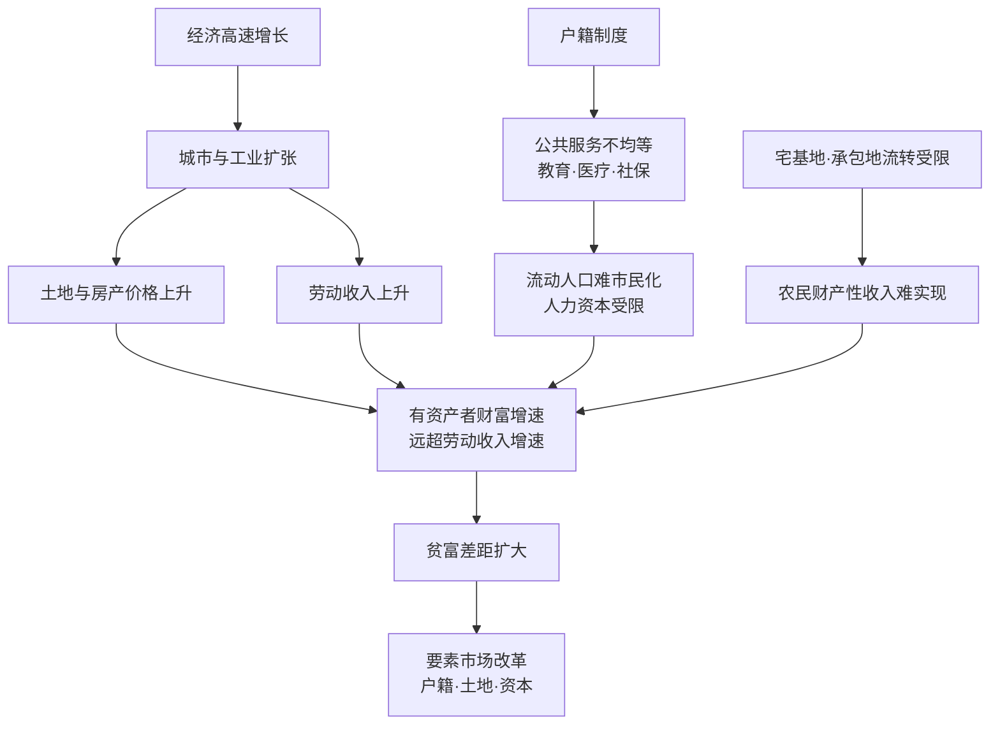

# 15｜经济高速增长，为什么贫富差距反而扩大？

> 为什么高速发展没有让所有人同步变富？

---

## 一、先说结论

兰小欢的答案并不复杂，但很扎心：**经济增长的果实，并没有按同样的速度分给所有人。**

原因主要有两条线。第一条是**资产升值快于劳动收入**——尤其房产，早买的人靠资产涨价，财富增速远远甩开只靠工资的人。第二条是**要素市场还没完全市场化**——户籍让公共服务不均等，农村的宅基地和承包地流转受限，农民的财产性收入很难实现。

合起来就是：财富在向"有资产、有城市身份"的人集中。作者由此主张，下一步的改革重心，应该是**要素市场改革**。

---

## 二、我们先理解一个问题

先摆一个事实：过去四十多年，中国让几亿人摆脱了绝对贫困，这是人类历史上罕见的成就。按"有没有饭吃、有没有衣穿"的标准，几乎所有人都变好了。

可就在同一时期，收入差距、财富差距也在扩大。这里就出现了一个让人费解的地方：

**如果蛋糕一直在快速做大，为什么分蛋糕的比例反而越来越不均？**

这不是一个道德问题，而是一个机制问题。理解它，需要先弄清楚：在这个高速增长里，有一部分人的财富是靠什么涨起来的？另一部分人为什么没跟上？

---

## 三、作者到底提出了什么观点？

兰小欢在书中从几个层面解释贫富差距的扩大。

**第一，资产升值快于劳动收入。** 一个家庭的主要收入有两类：一类是劳动收入（工资、奖金），一类是财产性收入（房子涨价、股息、租金）。过去二十年，大城市的房产价格涨幅，远远超过普通人的工资涨幅。于是"有没有资产、什么时候买的资产"，成了财富分化的关键变量。

**第二，户籍制度让公共服务不均等。** 教育、医疗、社保等公共服务，长期和户籍挂钩。一个在城市打工多年的人，如果没有本地户口，子女上学、看病报销、养老保障都可能受限。**这不仅是当下的不公平，更影响下一代的人力资本积累，让差距代际传递。**

**第三，农村土地流转受限，农民财产性收入难实现。** 农村的宅基地和承包地，是农民手里最重要的资产，但它们的抵押、买卖、流转受到严格限制。结果是，农民守着价值不低的土地，却很难把它变成可支配的现金流或资本。城市的房产可以抵押、可以出售、可以升值变现；农村的房产却难有同样的金融功能。

**第四，要素市场改革是出路。** 作者认为，问题的根源之一，是土地、劳动力、资本这些"要素"的市场化程度不一致。要让发展成果更公平地分享，就需要推进**要素市场改革**——让户籍、土地、资本这些制度安排，能更顺畅地让普通人参与进来、分享收益。

---

## 四、把这个观点翻译成人话

先解释一个词：**「要素市场」。** 经济要运转，需要几种最基本的"原料"：土地、劳动力、资本（钱），可能还有技术、数据。买卖这些原料的地方，就叫要素市场。你上班，是在卖自己的劳动力；企业贷款，是在买资本；政府出让土地，是在配置土地。**要素市场越畅通，价格越合理，普通人也越容易从中获利。**

现在看两个对比。

**城乡差距**：一个农村家庭，最值钱的东西往往是宅基地上的房子和几亩承包地。但这些资产不能像城里房子那样自由买卖、抵押贷款。它"值钱"，却"动不了"。而城市家庭的一套房子，可以抵押、可以出租、可以随房价上涨而增值。**同样是资产，一个能撬动资金，一个只能闲置。**

**城市内部的差距**：在同一座城市里，两个收入差不多的人，差距也可能很大。一个在房价起飞前上了车，一个一直在存钱等"回调"。十年后，前者的房产可能涨了几百万，后者攒下的现金却被通胀和房价甩在后面。**他们付出的是相似的劳动，但财富结果天差地别——差别不在努力，而在持有什么资产。**

这就是作者想说的：**在一个资产价格快速上涨的时代，"劳动致富"和"资产致富"是两条速度完全不同的赛道。**

---

## 五、为什么会这样？

把机制画出来，是这样：

这条链的关键，是看清"分岔点"在哪里。

**C 和 D 是两条不同的收入跑道。** 同样参与经济增长，有人拿到的是资产升值，有人拿到的是工资。而 C 的速度明显快于 D，差距就从这里拉开。

**F 和 I 是两种"制度性摩擦"。** 户籍限制了人（劳动力要素）的自由流动和公共服务的均等享受；土地流转限制则卡住了农民把资产变现的通道。一个卡"人"，一个卡"地"。

**L 是作者给出的方向。** 在他看来，只有让这些要素更自由地流动、更公平地交易，增长的果实才可能分得更均匀。

---

## 六、举一个现实生活中的例子

老张和阿明是大学同班同学，毕业时成绩、能力都差不多，一起留在了同一座城市工作，起薪也一样。

2010 年前后，老张在家里的帮助下，凑了首付买了一套房。阿明则觉得房价太高，判断"迟早要跌"，于是把钱存起来，打算等回调再买，顺便拿点理财收益。

十年过去，两人收入涨得也差不多，都是普通白领。但账面上：

- **老张**的房子从 100 万涨到了 400 多万，净资产增加了三百多万；
- **阿明**省吃俭用攒下的钱，加上理财收益，大概增加了七八十万，而当初看中的那些房子，他越来越买不起了。

两人的区别，不是谁更努力、谁更聪明，而是**一个把财富放在了会快速升值的资产上，一个放在了几乎不涨的现金上。** 更微妙的是，老张的房子让他能抵押、能换更好的学区房，孩子的教育起点也被抬高；而阿明只能继续租房，孩子上学还要面对户口和学区的门槛。

**一次在正确时间的买房决策，就这样裂变成两个人、两代人之间越来越大的差距。** 这就是"资产升值快于劳动收入"最生动、也最残酷的样子。

---

## 七、回到书中重新理解

现在再看作者的分析，就顺了。

他之所以反复强调"要素市场"和"户籍"，不是为了讲抽象的理论，而是想指出：**中国的贫富差距，很大程度上不是市场竞争自然形成的结果，而是制度安排造成的参与机会不均等。**

在理想的市场经济里，劳动力能自由流动、土地能自由交易、资本能自由配置，那么发展成果会通过价格机制相对广泛地传播。但在现实里，这些"要素"的流动都受到各种约束。约束在哪里，机会的不均等就在哪里。

理解了这一点，也就理解了为什么作者会把"要素市场改革"看得那么重——在他看来，这不仅是经济效率问题，更是公平问题。

---

## 八、这个观点背后还有什么？

几个值得深挖的前提。

**第一，绝对改善和相对差距可以同时发生。** 几乎所有人都比过去富了，但富的速度不同。**"差距扩大"不等于"穷人变穷"。** 这一点常被情绪化的讨论忽略。

**第二，资产效应是有周期的。** 房价上涨时，有房者财富膨胀；但如果房价长期横盘或下跌，资产效应就会减弱甚至反转，差距的形态也会改变。把某个阶段的现象当成永恒规律，会误判形势。

**第三，户籍问题不只是"户口本"。** 它背后绑定的是财政、公共服务和土地权益的分配。改户籍容易，改它背后的资源和责任分配很难。这才是改革真正的难点。

**第四，代际传递比当期差距更值得警惕。** 父母的资产和教育投入，会直接影响下一代的机会。如果这一渠道过强，差距就会从"一代人的差距"变成"几代人的分层"。这是作者没有展开、但极重要的一层。

---

## 九、这个观点有问题吗？

有，而且关于贫富差距，学界的争论相当激烈。**分歧首先就发生在"用什么尺子量"上。**

**第一，指标之争。** 最常用的是**基尼系数**（0 表示绝对平均，1 表示绝对不平均）。国家统计局公布的全国居民收入基尼系数长期在 0.46～0.47 左右；但不少学者认为，由于高收入群体的收入难以被调查捕捉，真实差距可能更大；也有观点认为，考虑社保、转移支付和城乡生活成本差异后，差距被高估了。**同一份现实，用不同的统计口径会得出完全不同的图景。**

**第二，城乡差距还是城市内部差距？** 过去，中国收入差距的主因是城乡差距；而近十几年，随着城市化推进，**城市内部的差距（尤其由房产造成）变得越来越重要**。学者们对"当前主要矛盾在哪"判断不一，这直接影响政策该向哪里使劲。

**第三，资产效应可持续吗？** 支持"要素改革"的一派认为，只要资产价格继续上涨，差距就会继续拉大；但反方指出，资产效应依赖房价单边上涨，一旦楼市转向，靠房产拉开的身位可能收窄，甚至反向。**差距到底是被"结构"锁死的，还是被"周期"放大的，这是核心分歧。**

**第四，库兹涅茨曲线的解释之争。** 经济学里有个著名假说（库兹涅茨曲线）：发展初期差距扩大，发展到一定阶段后差距会自然缩小，呈倒 U 形。但后来的研究并不都支持它，法国学者皮凯蒂就提出，如果资本回报率长期高于经济增长率，财富集中反而会持续加剧。**换句话说：差距是"发展过程中的暂时现象"，还是"资本主义的长期趋势"？学界没有定论。** 作者显然更倾向于认为，靠市场自发缩小差距并不可靠，需要制度层面的改革。

---

## 十、今天再看这个观点

**先说书中的观点**：兰小欢认为，资产升值快于劳动收入，加上户籍、土地等要素市场尚未完全市场化，使财富向"有资产、有城市身份"的人集中，出路在于要素市场改革。

**下面这些是把书里的逻辑继续往前推，属于本系列的延伸，不归到作者名下。**

书出版后的这几年，政策语汇里多了一个高频词——"共同富裕"，以及配套的"三次分配"讨论。这和书中"要素市场改革"的方向有呼应，但重点不完全相同：书中更强调效率和参与机会的均等，而近年的政策更强调分配环节的调节，比如对资本无序扩张的规范、对高收入的调节、房产税试点的探索。

与此同时，一个新的变量正在浮现：**数据作为一种新的"要素"进入视野。** 如果说过去二十年，土地和房产是拉开差距的关键资产，那么在数字时代，数据、算力、平台和 AI 能力，可能成为下一代"要素"。谁掌握这些要素，谁就可能在下一轮财富分配中占据优势。这已经超出书中的讨论范围，但延续了同一个追问——**当新的要素出现时，普通人能不能公平地参与进去？**

---

## 十一、这一篇真正应该记住什么？

1. **两条跑道**：资产升值的速度长期快于劳动收入，这是财富分化的核心机制。
2. **制度性摩擦加剧不均**：户籍让公共服务不均等，土地流转限制让农民财产性收入难实现。
3. **要素市场改革是关键**：让土地、劳动力、资本更自由地流动和交易，才能让成果分得更广。
4. **差距扩大 ≠ 穷人变穷**：绝对水平普遍改善与相对差距扩大，可以同时存在。
5. **度量方式决定结论**：基尼系数、统计口径的不同，会让人对同一现实得出不同判断。

---

## 十二、留一个问题

> 如果财富分化的关键，是"谁持有会升值的资产"，
> 那么在资产价格不再单边上涨的时代，
> 我们该靠什么让后来者也能分享增长的果实？
> 是继续等一轮新的资产红利，还是改革分配的游戏规则本身？

---

**下一篇**：讲到这里，一个绕不开的问题浮出水面——支撑起这一切的土地财政、居民房贷、地方投资，背后都是债务。中国的债务规模已经不小，它到底会不会引发一场类似欧美的危机？"不会崩"是不是就等于"没问题"？

下一篇我们就来拆这个问题——**中国的债务风险，到底有多大？**
