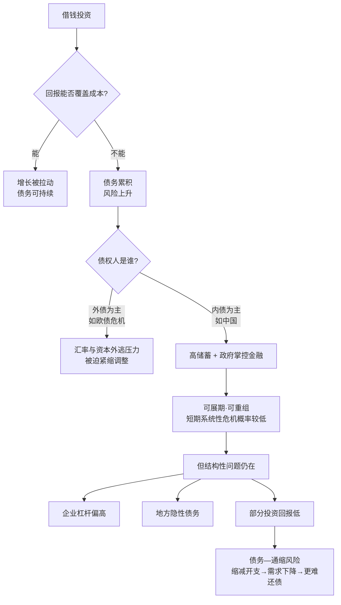

# 16｜中国的债务风险，到底有多大？

> 中国会不会爆发类似欧美的债务危机？

---

## 一、先说结论

兰小欢的态度是克制的，不唱衰也不盲目乐观。他的核心判断可以拆成两半：

**前半句——短期爆发系统性金融危机的概率较低。** 因为中国的债务以内债为主，储蓄率高，政府掌握大量金融资源，出现"资不抵债、被外国债主逼债"那类欧美式危机的条件并不充分。

**后半句——"不会崩"不等于"没有代价"。** 企业杠杆偏高、地方隐性债务庞大、部分投资回报低，这些都是真实的结构性风险。风险未必以危机形式爆发，却可能以长期低效、增长放缓的形式慢慢支付。

---

## 二、我们先理解一个问题

先破除一个直觉：很多人一听到"债务"就紧张，觉得欠钱是坏事。可宏观上，借钱本身是中性的。**你借钱买房、企业借钱建厂、政府借钱修路，只要借来的钱能带来足够回报，债务就是推动增长的工具。**

真正的问题从来不是"有没有债"，而是三个更具体的问题：

- **借来的钱用到了哪里？**
- **投资产生的回报，能不能覆盖利息和本金？**
- **万一还不上，债权人是谁，会引发什么连锁反应？**

把这三问想清楚，关于"中国债务风险有多大"的讨论，才不会变成情绪化的站队。

---

## 三、作者到底提出了什么观点？

兰小欢在书中先做了国际对照，再指出中国的特殊性。

**先看两个反面教材。** 2008 年美国次贷危机，本质是居民和金融体系借了太多钱去买房，抵押品（房价）一旦下跌，层层打包的金融产品连锁爆雷；2010 年欧债危机，则是希腊等国借了太多外债，又失去了货币自主权，还不上时只能求助外部。**两者的共同点是：债务到了不可持续的地步，只能被迫调整。**

**再看中国的特殊性。** 作者指出，中国债务有几个关键特征，使它对短期系统性危机的"免疫力"相对更强：

1. **以内债为主。** 借钱的多数是国内的银行、居民和机构，欠的也是国内的钱。欠外国人钱可能要面对汇率和资本外逃的压力，欠自己人钱则相对容易协调。
2. **储蓄率高。** 居民和企业手里有大量存款，整个国家不缺"存款来源"，金融体系的流动性基础比较稳。
3. **政府掌控大量金融资源。** 银行体系以国有为主，信贷的投向、节奏在很大程度上受政策引导，政府有能力在关键时刻"托底"和重组。

**但风险是真实存在的。** 作者没有回避：企业部门（尤其国企）杠杆偏高；地方政府通过城投平台积累了规模庞大的隐性债务；不少投资回报偏低，修了桥、建了园，却收不回成本。这些债务短期内不会集中爆雷，却会长期拖累效率。

---

## 四、把这个观点翻译成人话

先解释两个关键词。

**「杠杆」就是借钱的程度。** 你自己有 30 块，向银行借 70 块，凑 100 块去做投资，杠杆就是 3 倍多。赚了，收益放大；亏了，亏损也放大。

**「内债」就是欠"自己人"的钱，「外债」就是欠"外国人"的钱。** 这个区别，比很多人想的重要得多。

来做一个生活化的思维实验：假设你欠了 100 万。这笔钱是欠银行的，还是欠你表哥的，后果有什么不同？

- **欠银行**：到期必须还，还不上就上征信、被起诉、房子被拍卖。条款是硬的，没什么商量余地。
- **欠表哥**：虽然也得还，但关键时刻可以商量——"先还一半行不行？""利息缓一缓行不行？"因为你们在同一个家庭网络里，他并不希望你彻底垮掉。

宏观层面也是这个道理。**一群国家欠另一群国家的钱（外债），一旦还不上，就是主权违约，货币暴跌、资本外逃；而一个国家内部，"政府欠银行、银行欠居民、居民又存钱在银行"，大家在同一个体系里，回旋余地大得多。** 这就是中国"以内债为主"为什么重要的原因。

---

## 五、为什么会这样？

把逻辑画出来，是这样：

这条图里，最需要讲清的是最后一步：**「债务—通缩」风险。**

它的意思不难理解：当债务压力变大，企业和家庭会主动缩减开支、拼命还债。可你的开支就是别人的收入——大家都少花钱，需求就下降、价格就下跌（通缩），企业利润变薄、裁员降薪，收入进一步减少，还债反而更难。**于是形成一个"越还债、越难还"的恶性循环。** 这正是当年美国大萧条和日本长期停滞的教训。

所以中国的风险，未必是以"某天突然爆雷"的形式出现，更可能以"债务慢慢消化、增长长期偏低"的形式存在。

---

## 六、举一个现实生活中的例子

设想两个人，各自欠了 200 万，但债主不同。

**第一个人，欠的是银行。** 他有房有车，但都是抵押物。一旦失业、断供，银行会起诉、拍卖房子，征信留污点，甚至影响孩子上学、坐高铁。压力是刚性的、即时的。

**第二个人，欠的是亲戚朋友。** 借钱的是表哥、舅舅、老同学，有的还没写借条。这个人如果遇到困难，可以挨个去商量：先还谁、缓一缓谁、利息能不能免掉一部分。他未必轻松，但他有腾挪的空间，不会被一纸合同逼到墙角。

**中国的债务结构，更接近第二种。** 地方政府欠银行和城投债持有人的钱，这些债权人本身又是在国内体系里的机构；居民的房贷欠的是国内银行，而银行背后是存款的居民；政府在银行体系里有很强的话语权。于是当某个环节真的还不上时，常见的做法不是"爆雷清算"，而是**展期、重组、借新还旧、注入资产**——用时间换空间。

但请注意，"能商量"不代表"没成本"。展期意味着债权人拿不到钱，重组的损失总要有人承担。**代价没有消失，只是被拉长了、被分摊了。**

---

## 七、回到书中重新理解

现在再看作者的论述，就清楚了。

他之所以要花篇幅去对照美国和欧洲的危机，并不是为了证明"中国不会有危机"，而是想说明：**债务风险的关键，不在于欠了多少，而在于债主是谁、钱用到了哪里、体系有没有协调能力。**

在他看来，中国这套"以内债为主 + 高储蓄 + 政府掌控金融"的组合，确实降低了短期系统性风险的概率，但同时，它也让风险更容易被"藏起来"而不是被"解决掉"——比如地方隐性债务，就是典型的"看不见但真实存在"的压力。

所以他真正想传达的，是一种**既不恐慌也不轻慢的态度**：结构性问题真实、代价真实，但它更可能表现为长期的效率损失，而不是一场戏剧性的崩塌。

---

## 八、这个观点背后还有什么？

几个值得深挖的前提。

**第一，"能兜底"不等于"应该兜底"。** 政府有能力救，不代表每次都该救。如果每次都兜底，会造成"道德风险"——借钱的平台和企业知道反正有人救，就更敢乱借。长期看，这反而会积累更大的风险。

**第二，债务的"质量"比"数量"更重要。** 一笔钱借来建了一所学校，可能不直接产生现金流，但提升了人力资本；借来建了一个没人用的产业园，就纯粹是浪费。GDP 上的债务数字一样，真实回报却天差地别。

**第三，隐性债务的"隐性"是问题的一部分。** 因为不在预算内、不在明面上，它难以被监管、难以被统计，也很难被问责。**看不清，就没法管。**

**第四，去杠杆本身有代价。** 收紧信贷确实能降风险，但过程中会出现"信用收缩"——企业贷不到款、项目停工、民企融资难。**降风险和稳增长之间，天然存在紧张。** 这正是下一步改革要面对的难题。

---

## 九、这个观点有问题吗？

有，而且对于中国债务前景，主流看法分歧极大。**关键是要把分歧点讲清楚：乐观派和悲观派争的，其实不只是数字，而是机制能否自我修复。**

**乐观派认为：**

- 债务主要是内债，不存在被外国债主挤兑的风险；
- 储蓄率极高，国家的"家底"厚，有足够的资源慢慢消化；
- 政府有能力调配金融资源，可以在关键时刻控制节奏，把风险"拆弹"而不是"引爆"；
- 中央政府的显性债务水平其实并不算高，还有加杠杆空间来对冲风险。

**悲观派则认为：**

- 债务的绝对规模和增速已经很高，尤其是企业和地方隐性债务；
- 大量投资回报低，钱没有变成能还债的现金流，只是变成了钢筋水泥；
- 人口老龄化、城市化放缓，未来的收入增速可能撑不起当前的债务；
- 政府反复兜底会扭曲市场纪律，最终把风险越滚越大。

**分歧究竟在哪里？** 核心有三点：

1. **"内债不怕"这个优势，能承受到什么程度？** 乐观派认为它管用，悲观派认为它只是把违约从"对外"转成了"对内"，损失依然要由纳税人、储户或通胀来承担。
2. **隐性债务的规模到底有多大？** 口径不同，估计相差极大。有的研究认为可控，有的认为远超预期。**数据本身就有争议，自然谈不上共识。**
3. **时间站在哪一边？** 乐观派赌的是"用增长慢慢消化债务"，悲观派担心的是"增长在债务消化完之前就慢下来了"。**这本质上是在赌未来的增速。**

所以更公允的说法是：**短期内出现系统性崩塌的概率确实不高，这一点学界分歧较小；但"代价有多大、由谁承担、会不会演变成长期停滞"，才是真正的分歧所在。**

---

## 十、今天再看这个观点

**先说书中的观点**：兰小欢认为，中国债务以内债为主、储蓄率高、政府掌控金融资源，短期爆发系统性危机的概率较低；但结构性风险和长期代价不容忽视。

**以下讨论仍沿着作者的框架，但已经跳出了书本的时间范围，属于延伸而非原文。**

书成稿后，政策层面对债务的治理明显加码：对地方隐性债务的清理、对城投平台的规范、对房地产企业杠杆的约束（"三道红线"）、以及后来的化债安排。这些动作，本质都是在回应书中指出的问题——**把"看不见的债"变成"看得见的债"，把"隐性"变成"显性"。**

同时，一个书里尚未展开的新变量是：**当人口开始负增长、城市化接近尾声，过去那套"靠增长和地价上涨慢慢消化债务"的路径，难度明显上升了。** 这意味着，未来更倚重的可能不是"做大蛋糕来稀释债务"，而是"调整结构、提高投资效率、让钱真正流到能产生回报的地方"。这已经超出书中讨论，但延续了同一个判断：**债务问题，最终是效率问题。**

---

## 十一、这一篇真正应该记住什么？

1. **债务本身不是坏事**：借钱投资能带来增长，关键看回报能否覆盖成本。
2. **问三个问题**：钱用到哪里、回报够不够、债主是谁。
3. **中国的特殊性**：以内债为主、高储蓄、政府掌控金融资源，降低了短期系统性危机的概率。
4. **风险真实存在**：企业杠杆偏高、地方隐性债务、部分投资回报低，可能以"债务—通缩"和长期低效的形式付出代价。
5. **分歧的核心在机制**：乐观派赌增长能消化债务，悲观派担心增长跑不过债务，关键变量是未来的增速与投资效率。

---

## 十二、留一个问题

> 如果中国的债务风险，主要不在于"会不会爆"，而在于"用什么代价慢慢消化"，
> 那么在这场消化里，
> 代价会落在谁身上——是储户的利息、纳税人的钱，还是这一代人的时间？

---

**下一篇**：既然风险更多是"慢慢消化"的问题，那具体怎么消化？过去几年，中国推行了去杠杆、供给侧改革、资管新规，试图主动拆弹。可拆弹的过程并不轻松——信用一收缩，最先喊渴的往往是民营企业。为什么降风险的政策，会先伤到民企？

下一篇我们就来拆这个问题——**去杠杆，为什么先伤到了民营企业？**
