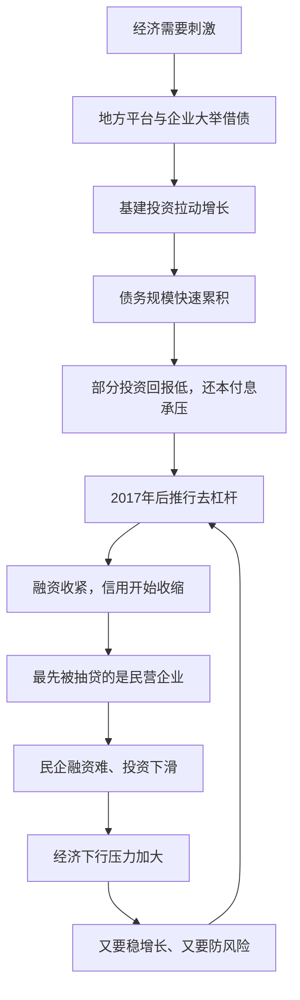

# 17｜为什么要「去杠杆」？去的到底是谁的杠杆？

> 去杠杆为什么这么难，它到底在动谁的利益？

---

## 一、先说结论

兰小欢在书中给出的立场很克制：去杠杆不是一次道德清算，也不是简单地把债务砍掉，而是给一个已经靠债务运转的经济体做"减重手术"。

改革主要针对的是地方融资平台、部分国有企业、房地产等债务扩张快、回报又不确定的部门。但麻烦在于，收缩信用会连带伤到最需要钱、又最没有隐性担保的民营企业，进而拖累整体增长。于是政策就卡在一个两难里：不降，风险越滚越大；降得太急，经济先撑不住。这一篇要讲的，就是这个两难。

## 二、我们先理解一个问题

先说"杠杆"这个词。

杠杆，说白了就是**借钱的程度**。你自己出十万、再借九十万去买一套一百万的房子，你就是"加了杠杆"。赚了，收益翻倍；亏了，亏损也翻倍，还可能连本金都赔进去。

放到整个经济里，"杠杆率"通常用**债务除以 GDP** 来衡量。数字越大，说明整个经济体越依赖借钱来运转。

问题就出在这里：一个家庭、一家企业、一个地方政府，在某个阶段借钱都是合理的——借钱修路、借钱建厂、借钱买房，都可能带来更高回报。但如果债务增速长期快于收入增速，借钱就不再是"投资"，而是"借新还旧"。

那么，为什么不能让债务就这样一直滚下去，非要"去杠杆"？

## 三、作者到底提出了什么观点？

兰小欢在书里反复强调一句话：**债务本身不是坏事，关键看钱用到了哪里、回报能不能覆盖成本。**

他并不认为中国的债务问题已经到了马上要爆的程度。理由有三：其一，中国的债务**以内债为主**，欠的主要是本国居民和本国金融机构的钱；其二，**储蓄率很高**，银行里始终有大量可用资金；其三，政府手里握着大量金融资源，能在关键时刻出手干预。这三点决定了，中国短期内爆发系统性金融危机的概率相对较低。

但风险是真实的。作者指出几个薄弱环节：企业部门的杠杆偏高、地方政府的**隐性债务**（会计上不算政府债务、但政府可能兜底的那部分）规模不清、以及不少投资的回报率偏低，连利息都还不上。

所以在他看来，去杠杆（2015 年之后的供给侧结构性改革、2017 年出台的资管新规）本质是一次**结构性调整**：让债务从低效率的部门撤出来，而不是把所有负债者都打倒。

## 四、把这个观点翻译成人话

想象你是一个普通上班族。

你办了三张信用卡，刷出来付了房子首付，又贷了一笔装修贷。每个月工资到账，第一件事是还最低还款，剩下的才用来生活。前几年房价在涨、工资也在涨，你觉得这没什么，反正资产在升值。

但有一天，公司效益变差，工资不涨了，房价也不涨了。你突然发现：**每个月的利息已经吃掉你一大半收入，本金却几乎没动。**

去杠杆，就是在这种情况下，你必须做的那个决定：不能再靠借新债还旧债了。

可问题是，你一旦决定"不借了"，接下来会发生什么？房贷还是要还，生活还是要过，孩子的学费还是要交。如果你为了省钱，把日常开销砍到极限，你会发现自己虽然少欠了钱，但生活质量急剧下降，甚至可能因为省下看病的钱而把小病拖成大病。

**这就是去杠杆的难处：它要动的不是一笔账，而是一整套已经习惯了的活法。**

## 五、为什么会这样？

把去杠杆的链条拆开，大致是这个样子：

这条链条最值得注意的，是 **G → H** 这一步。

理论上，去杠杆针对的是地方融资平台、国企、房地产这些"高杠杆大户"。但在实际操作中，中国的信用体系是分层的：国企和平台背后有政府信用，银行愿意借；房地产有土地和房产作抵押，也相对好借；而民营中小企业，靠的是自身现金流和抵押品，一旦整体融资环境收紧，它们**最先被抽贷、最先借不到钱**。

结果就是：政策的本意是给大户"减重"，但真正被"饿到"的，往往是体型最小的那批企业。

这正是作者反复提醒的一个机制——**去杠杆不是平均地减少债务，而是有顺序、有先后地收缩信用**，而顺序本身就决定了谁承受代价。

## 六、举一个现实生活中的例子

想象一家开了十年的制造企业。

前些年订单好，老板贷款扩产，上了两条新产线，还在外地设了分厂。现在行业增速放缓，他发现：新产线有一半产能是闲着的，但贷款利息一分不少。

理性做法当然是"降本增效"——砍掉不赚钱的业务、裁掉冗余的人、停止扩张。

可如果砍得太快呢？现金流会立刻绷紧。供应商看到你在收缩，可能要求现款现货；银行看到你业绩下滑，可能提前收贷；核心员工看到公司在裁员，可能开始找下家。等到你想保的那条"好业务"需要资金周转时，钱已经没有了。

于是老板陷入两难：**不砍，利息越滚越大；砍狠了，好业务也跟着死。**

这就是去杠杆在宏观层面上的样子——它不是简单地"少借钱"，而是在**保住经济基本盘**和**拆除债务风险**之间，找一条极窄的路。

## 七、回到书中重新理解

现在再回头看兰小欢关于债务的论述，就顺多了。

他没有把债务讲成一个"贪婪与惩罚"的故事，而是把它讲成一个**时间与顺序**的问题：债务把未来的收入提前挪到今天使用，用得好，是加速发展；用过头，就是把还债的负担堆到明天。

所以他讨论去杠杆时，重点不在"该不该降"，而在"怎么降、先降谁、多快降"。这也是他为什么反复强调"两难"——因为任何一刀切的方案，都会在另一个方向上制造新的问题。

## 八、这个观点背后还有什么？

有几个作者没有完全展开、但很关键的隐含前提。

**第一，信用是有"身份等级"的。** 在中国，不同主体借钱的难易程度差异极大。政府信用、土地抵押、国企背景，构成了隐性的层级。去杠杆收紧时，这个层级会被放大，而不是被抹平。

**第二，"债务化解"最终要有人买单。** 债务不会凭空消失，它只会被转移或延后。常见的化解方式有四种：**展期**（拉长还款时间）、**置换**（用低息债换高息债）、**增长消化**（靠经济做大让债务占比自然下降）、**财政承接**（用财政资金兜底）。每一种都意味着成本落到了某个群体头上——可能是储户、纳税人，也可能是时间。

**第三，风险与增长不是对立的两件事。** 增长本身就是化解债务最温和的方式。一个经济体的收入涨得比债务快，杠杆率自然会降。这也是为什么"稳增长"和"防风险"看似矛盾，实际却互相需要。

## 九、这个观点有问题吗？

去杠杆是目前中国经济讨论中争议最大的话题之一。至少有三处分歧值得说清楚。

**第一，力度与节奏之争。** 一派认为 2017 年后的收紧太猛，导致 2018 年民营企业融资难、股市承压、经济下行；另一派认为去杠杆本身没错，问题在于执行方式，是"运动式"还是"渐进式"。分歧的核心是：**风险应该在增长中慢慢消化，还是趁窗口期一次性出清？**

**第二，是否误伤民企。** 政策目标是平台、国企、房地产，但现实里最先受伤的却是民企。有人认为这是执行偏差，可以靠定向降准、纾困基金补救；也有人认为这是结构必然——只要信用分配按身份分层，收紧时就一定会伤到最弱的一环。

**第三，谁来承担成本。** 这是最深的分歧。债务化解的四条路——展期、置换、增长、财政——背后是不同的分配结果：展期和低息置换可能让储户的利息收入缩水；财政承接意味着纳税人分担；增长消化则要等时间。学界的分歧，本质上是**成本分摊的公平性**之争，而不是"要不要降杠杆"之争。

需要补充的是，作者本人对这些问题保持了克制的态度。他更关心机制怎么运转，而不是替某一方下判断。

## 十、今天再看这个观点

先说清楚立场：**"去看债务的机制、别做道德审判"是兰小欢在书中的观点**；下面这部分，是基于他思想的现代延伸。

书中成稿于 2020 年前后，那时去杠杆的主线还是"资管新规 + 结构性去杠杆"。此后几年，现实给出的答案是：**去杠杆从"集中攻坚"转向了"在发展中化债"。** 房地产领域的"三道红线"、地方政府债务的大规模置换与展期安排、以及疫情后的财政扩张，都说明一件事——防风险很难靠单点收缩完成，它需要和一整套增长与财政安排配合。

一个常被拿来做对照的例子是日本：20 世纪 90 年代初资产价格见顶后，企业与家庭集体转向还债（学界常称之为"资产负债表衰退"），结果越还钱、需求越弱、经济越冷。这个案例提醒我们，**去杠杆最大的风险不是降得太少，而是在降的过程中把增长也一起降没了。**

当然，日本的情况和中国有很多不同（内债结构、政府掌控力、发展阶段），直接类比并不严谨。但"债务是时间的重新分配"这个视角，在任何经济体里都成立。

## 十一、这一篇真正应该记住什么？

1. **杠杆就是借钱的程度。** 用"债务除以 GDP"衡量，借钱投资能带来增长，前提是回报要高于利息。

2. **去杠杆主要针对平台、国企、房地产，** 但信用收缩会连带伤到民企，这是方向正确、执行有代价的典型问题。

3. **它是一道两难题，不是一道是非题。** 降风险会拖累增长，稳增长又会累积风险，关键是节奏、顺序和谁能承担成本。

4. **债务不会消失，只会转移或延后。** 展期、置换、增长消化、财政承接，四种方式背后是不同的利益分配。

5. **最好的化债方式是增长。** 收入涨得比债务快，杠杆率自然下降，这也是"稳增长"和"防风险"相互依存的原因。

## 十二、留一个问题

> 如果债务的本质，是把明天的钱挪到今天来花，
> 那么一个经济体究竟该由谁来决定"明天"？
> 是这一代人，还是下一代人？

---

**下一篇**：去杠杆处理的是"借来的钱"这一侧。可为什么中国会积累这么多债务和产能？答案要回到经济的另一面——**为什么我们生产得多、消费得却少？** 下一篇，我们从"高储蓄、低消费"讲起。
