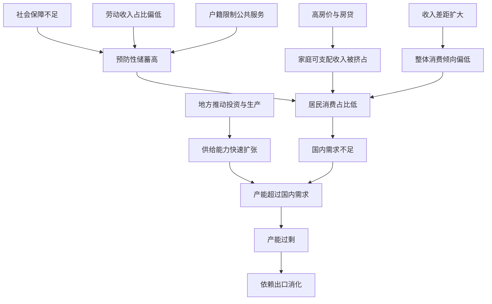

# 18｜为什么中国消费不足、产能过剩？

> 为什么中国人生产很多，消费却相对太少？

---

## 一、先说结论

一句话：中国的"消费不足"和"产能过剩"，其实是同一枚硬币的两面。

兰小欢在书里给出的解释综合了多种因素：居民收入在国民收入中占比不高、社会保障不足让人不敢花钱、高房价挤占了消费空间、户籍制度限制了进城人口的消费能力。与此同时，地方政府为了增长和税收，持续推动投资和生产，供给能力一路扩张，最终超过了国内需求。多出来的产能，只能靠出口消化。

所以"内需为什么难起来"，不是一个消费观念问题，而是一个收入、社保和激励机制的问题。

## 二、我们先理解一个问题

先看一个基本事实：中国居民消费占 GDP 的比重，长期明显低于世界平均水平。

在多数国家，居民消费大约占 GDP 的六成左右，而中国长期在四成上下徘徊（不同统计口径略有差异）。与此同时，中国的储蓄率长期偏高，投资占 GDP 的比重也远高于同类经济体。

这就出现了一个反差：**这个国家能造出全世界最多的钢铁、水泥、家电、手机、汽车，但自己人花的钱，却相对少得多。**

为什么会这样？

## 三、作者到底提出了什么观点？

兰小欢在书中的判断可以概括成一句话：**消费不足，主要不是观念问题，而是结构问题。**

他列出几条相互叠加的原因：

- **劳动收入占比不高。** 在国民收入分配中，居民拿到的份额相对偏低，企业利润和政府收入占比偏高。老百姓分的蛋糕少，自然花得少。
- **社会保障不足。** 医疗、养老、教育的不确定性高，居民要靠自己存钱应对风险，于是"预防性储蓄"高。
- **房价挤出消费。** 为了买房和还贷，家庭把大量收入锁进了首付和月供。
- **户籍限制。** 大量进城务工人口无法平等享受本地公共服务，消费行为更保守、更倾向存钱。
- **收入分配差距。** 高收入者的消费倾向本来就更低，收入差距扩大也会压低整体消费率。

而另一边，是供给端的持续扩张。地方政府围绕 GDP、税收和就业展开竞争，天然倾向于招商引资、上项目、扩产能。**供给跑得比内需快，就形成了产能过剩**（生产能力明显超过有支付能力的需求），也只能靠出口来消化。

## 四、把这个观点翻译成人话

可以把一个国家想象成一个大家庭。

如果这个家庭每年赚 100 块，只花 40 块、存 60 块，那么存下来的钱会去哪？如果放在银行，银行就要把它贷出去——贷给企业建厂、贷给地方政府修路。于是投资增加，产能扩大。

可问题是：**产能是给"花"准备的。** 你建了能供应 100 块的工厂，但全家只消费 40 块，多出来的 60 块产品卖给谁？只能卖给外人——也就是出口。

所以"高储蓄—高投资—高产能—依赖出口"是一条完整的链条。储蓄率高，不完全是坏事，它提供了投资的资金；但如果消费长期跟不上，生产出来的东西就没有对应的国内买家。

理解了这一条，就能理解为什么"扩内需"喊了这么多年，却始终不那么容易。

## 五、为什么会这样？

这张图想说明的是：**消费不足和产能过剩不是两个独立的问题，而是同一条失衡链条的两端。** 左边是"为什么不敢花"，右边是"为什么造太多"。

左边那几项，本质上都是居民对未来缺乏安全感；右边那一项，本质上是地方政府有强烈的动机去生产。两边一起作用，就形成了"内需不足 + 供给过剩"的组合。

## 六、举一个现实生活中的例子

来看一个典型的城市家庭。

夫妻俩税后月入两万，在一座二线城市有房贷，月供六千。剩下的钱，他们并没有全花掉，而是存下了一大半。为什么？

- **怕生病。** 虽然有医保，但一场大病自费部分仍可能掏空积蓄。
- **怕养老。** 退休金替代率不高，老了想过得体面，现在就得存。
- **怕孩子上学。** 从幼儿园到大学，教育支出是一笔不确定的长期账单。
- **还有双方父母要顾。** 养老和医疗的责任，很大程度上仍落在家庭内部。

于是他们的生活状态是：拼命工作、尽量少花、能省就省。这不是因为他们不爱生活，而是因为**未来的支出是不确定的，而收入也是不确定的**。在这种预期下，攒钱是理性的。

把这个家庭放大到十四亿人，就是这个国家的消费率。要是社会保障更扎实、收入增长更稳定、房价压力更小，他们也愿意多花一点、活得更舒展一些。

**消费不是被"劝"出来的，是被"安全感"和"收入"托起来的。**

## 七、回到书中重新理解

现在再看作者的论述，就明白他为什么要把"消费不足"和"地方推动投资"放在一起讲。

他不是在批评中国人节俭，也不是在批评政府搞投资，而是在描述一个**激励机制的结果**：地方政府的收入主要来自生产和流转环节（比如增值税），GDP 和就业考核又高度依赖投资和工业，所以政府天然亲近生产、亲近企业，而对居民消费缺少直接的动力。

换句话说，**供给端有一台很强的发动机，需求端却缺少同样强的支撑。** 时间一长，差异就会以产能过剩和出口依赖的形式显现出来。

## 八、这个观点背后还有什么？

有三层更深的东西值得说。

**第一，这解释了为什么内需政策常"隔靴搔痒"。** 发消费券、家电下乡、以旧换新，短期能拉动一些消费，但如果收入、社保、房价这些"根子"不动，效果就像往漏水的桶里加水。

**第二，储蓄率高其实是发展阶段的产物。** 一个国家在高速工业化、城市化的阶段，往往储蓄多、投资多、消费少——东亚几个经济体都经历过类似过程。问题不在于储蓄本身，而在于**当发展阶段过去之后，结构有没有跟着调整。**

**第三，它和财政、土地、户籍是一整套系统。** 地方靠土地财政和投资拉动增长，而进城人口因户籍限制缺乏安全感，正是这种增长模式的一部分。想真正提振消费，就要动这套系统，而它牵涉的利益非常广。

## 九、这个观点有问题吗？

关于"消费不足"，学界至少存在四处分歧。

**第一，文化偏好论 vs 制度结构论。** 一种流行解释是"中国人天生爱储蓄、重节俭"，这是文化传统。兰小欢这一类研究者更强调制度因素：社保不足、户籍限制、收入分配、房价。分歧点在于：**储蓄偏好是外生给定的文化，还是被制度塑造的结果？** 如果是后者，那政策是可以改变的。

**第二，储蓄率高是不是坏事。** 有人认为高储蓄支持高投资、高增长，是"东亚奇迹"的共同经验，属于发展阶段的正常现象；也有人认为它意味着消费被压抑，长期看不可持续。这取决于你站在增长视角还是福利视角。

**第三，统计口径本身有争议。** 有学者指出，中国的居民消费可能被低估（比如自有住房的估算租金、部分服务业消费的统计遗漏），投资可能被高估。如果口径调整，消费占比的绝对水平会变化。所以引用具体数字时要谨慎。

**第四，药方之争。** 有人主张直接"发钱、发券"刺激消费；有人主张先补社保、改户籍；有人主张从收入分配入手，提高劳动报酬占比。这些方案背后，是对**"消费不足的根子到底在哪"**的不同判断。

需要补充的是，作者本人在书中更偏向"结构改革"这一侧——但这不是唯一解释，学界并没有定论。

## 十、今天再看这个观点

先明确：**"消费不足源于收入、社保、户籍等结构因素"是兰小欢在书中的观点**；以下是基于这一思想的现代延伸。

书成稿之后，这个问题不但没有消失，反而更清楚了。疫情冲击让居民"预防性储蓄"进一步上升；房地产调整让家庭资产缩水、消费更谨慎；"以旧换新""消费券""育儿补贴"等政策接连出台，说明决策层已经把扩内需摆在更重要的位置。

一个新的背景是技术。**如果 AI 和自动化让生产效率进一步提高，供给端会更便宜、更强，那么"谁来消费"这个问题会变得更尖锐。** 如果收入仍然集中在少数人手里、社保仍然不足，那么产能过剩就可能以新的形式出现——不再是钢铁水泥，而是更高效的工业品和服务。

从这个角度看，作者讲的"从生产型政府转向服务型政府"，不只是一个分配主张，也可能是技术进步条件下维持经济循环的必要条件。

## 十一、这一篇真正应该记住什么？

1. **消费不足和产能过剩是一枚硬币的两面。** 一边是居民不敢花，一边是供给被推到超过国内需求，两者互为因果。

2. **不敢花的根子是安全感不够。** 社保不足、房价过高、户籍限制、收入差距，共同压低了居民的消费倾向。

3. **政府天然亲生产、亲投资。** 税收和考核都挂钩生产与增长，所以供给端的发动机一直很强，需求端缺少同样的动力。

4. **刺激消费的政策容易治标不治本。** 没有收入与社保改革，再多的消费券也只是往漏桶里加水。

5. **消费率的高低，也有统计与阶段因素。** 不宜把结构性判断简单化成"中国人不爱花钱"。

## 十二、留一个问题

> 如果"敢花钱"的前提是"有安全感"，
> 那么提振内需的第一步，究竟是刺激消费，
> 还是先让普通人相信：生病、养老、孩子上学，不会把自己压垮？

---

**下一篇**：国内消费不足、产能过剩，多出来的东西怎么办？答案是卖到国外去。可当顺差越来越大，另一端的国家就会越来越不舒服。下一篇，我们看**中美贸易冲突的深层原因**——它真的只是贸易逆差吗？
