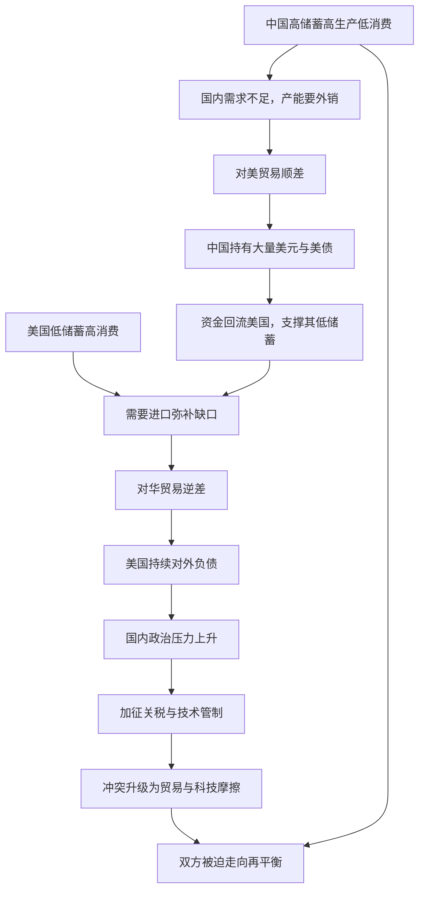

# 19｜中美贸易冲突的深层原因，只是贸易逆差吗？

> 中美贸易摩擦的根源到底在哪里？

---

## 一、先说结论

兰小欢在书中的判断是：**贸易冲突是全球经济失衡的政治表现，而不是一个单纯的贸易逆差问题。**

中国是高储蓄、高生产、低消费；美国是低储蓄、高消费。两者在贸易上互为镜像：中国对美国长期顺差，美国对中国长期逆差。美元又是全球主要储备货币，这给了美国长期维持逆差的能力。这种失衡短期内能相安无事，长期却不可能持续。当调整压力积累到一定程度，就会以关税、制裁、技术管制等激烈形式表现出来。

所以出路不是靠加关税，而是**再平衡**——把重心转向扩大内需，也就是后来被概括为"以国内大循环为主体、国内国际双循环"的方向。

## 二、我们先理解一个问题

2018 年起，美国对中国发起贸易摩擦，加征关税，理由之一是"中国对美贸易顺差太大"。

可这里有一个让人困惑的地方：**如果贸易逆差是美国的问题，那加关税不是应该由逆差国自己承担代价吗？** 关税加在中国商品上，美国进口商要交税，最后往往转嫁到美国消费者身上。既然如此，为什么还要打？

更重要的是：**为什么贸易逆差会持续这么多年？** 它到底是一个"不公平贸易"的结果，还是一个更深结构的结果？这就是本篇要拆的问题。

## 三、作者到底提出了什么观点？

兰小欢在书中引用并梳理了"全球失衡"的框架，核心是一个对称的结构：

- **中国这一端**：高储蓄、高生产、低消费。储蓄大于国内投资需求，多出来的产能必须出口，形成贸易顺差。
- **美国这一端**：低储蓄、高消费。国内支出大于产出，缺口靠进口弥补，形成贸易逆差。
- **美元这一端**：美元是全球主要的储备和结算货币，各国愿意持有美元资产（尤其是美国国债）。这让美国可以长期"借外国人的钱"来维持高消费，而不像其他逆差国那样被迫调整。

由此，作者认为：**这不是某一方单方面造成的，而是双方结构加上国际货币体系共同作用的结果。** 中国顺差流入美国，变成对美国国债的投资，资金又流回美国，支撑了美国的低储蓄高消费——两边形成一个循环。

而贸易冲突（2018 年起），是这个失衡积累到一定程度后的**政治表现**。作者明确说，它不只是贸易逆差的问题。

## 四、把这个观点翻译成人话

"全球失衡"这个词听起来抽象，其实可以用一个简单的画面理解。

假设有两个人做生意：甲特别能干、特别能省，卖出去的东西多，自己花的少，账上全是别人欠他的钱；乙特别能花、不太能省，买的多、赚的少，账上欠着甲一大笔。

短期看，这没问题——甲有货款收，乙有东西用，皆大欢喜。但长期看，两边的账会越差越大：

- 甲会说：我年年被你欠钱，你是不是在占我便宜？
- 乙会说：我一直在买你的东西，你还嫌我欠你钱？

这就是全球失衡的日常版。中国更像是甲，美国更像是乙，而美元的特殊地位，让乙可以一直"打白条"而不至于立刻破产。

**问题不在于谁对谁错，而在于这种结构无法长期持续。**

## 五、为什么会这样？

这张图有两个要点。

第一，**这是一个循环，而不是一条单向的线。** 中国赚到的美元去买美国国债，钱又流回美国，支撑了美国继续借债消费。D → I → F 这一步，是这个循环能持续多年的关键。

第二，**冲突的根源在 H 和 J**，也就是美国国内积累的政治压力——制造业外流、地区衰落、就业焦虑。贸易逆差是最容易被看见、也最容易被政治化的那个符号，而真实的矛盾其实更深：产业结构、技术竞争、利益分配。

## 六、举一个现实生活中的例子

两个人合伙开公司。

甲负责生产，手艺好、成本控制得也好，赚了钱也舍不得花，都存在公司账上，还时不时借给乙周转。乙负责销售和花钱，市场能力强、出手大方，但存不下钱，年年要向甲借钱维持运营。

前几年生意好，相安无事。

后来市场增速慢了，乙开始焦虑：钱都借给甲的项目了，自己的利润越来越少。于是他提出：以后从甲那进货，要多收一道"过路费"（加关税）；再后来，他发现真正要命的不是货款，而是甲掌握了他做不了的关键技术，于是干脆限制技术合作。

**甲会觉得委屈——我辛辛苦苦生产，还借你钱，你怎么反过来怪我？**
**乙也会觉得委屈——我一直在买你的东西，你却越来越强，我的产业却空了。**

这就是中美之间那个结构在现实中的样子：**表面上是贸易和逆差的争执，实质上是失衡格局下的利益与地位之争。**

## 七、回到书中重新理解

现在再读作者关于"双循环"的论述，就比较容易理解了。

"**以国内大循环为主体**"，不是关起门来搞自给自足，而是要让生产和消费在国内形成更匹配的循环——减少对单一外部市场的依赖，把内需真正撑起来。

"**国内国际双循环相互促进**"，是说中国仍然开放，仍然参与全球分工，只是内外两个循环要更平衡，而不是把增长押在出口顺差上。

在作者看来，这才是应对贸易冲突的根本办法：**外部失衡的根源在内部结构，那么解法也要回到内部——提高居民收入和消费，让国内需求接上供给。**

## 八、这个观点背后还有什么？

有三层值得展开。

**第一，美元地位是一种结构性特权。** 因为美元是全球储备货币，美国可以长期维持贸易逆差和对外负债，而不必像其他国家那样被迫立刻调整。这让失衡的调整更慢、也更容易积累。

**第二，失衡不是零和，但调整一定是痛苦的。** 失衡期间，双方其实都受益：中国获得市场和外汇，美国获得廉价商品和资金。但当调整到来时，阵痛是真实存在的——中国的出口部门、美国的制造业地区，都要承受冲击。

**第三，技术竞争是这轮冲突中越来越核心的部分。** 贸易逆差是最表面的议题，产业政策和关键技术才是更深层的东西。这解释了为什么冲突从"加关税"逐渐走向"卡芯片、限技术、重构供应链"。

## 九、这个观点有问题吗？

贸易逆差到底由什么造成，学界存在明显分歧，而且没有定论。

**第一，储蓄率解释。** 国际收支恒等式告诉我们，逆差本质上等于"国内储蓄减去国内投资"的缺口。美国储蓄低，所以必然有逆差。这个视角下，加关税无法解决美国自身的储蓄问题。

**第二，汇率解释。** 有人认为人民币被低估，导致中国出口价格偏低、顺差扩大。另一些研究则认为，汇率对贸易差额的影响有限，尤其是当逆差主要来自结构而非价格时。

**第三，产业链与统计口径解释。** 今天的贸易是"全球价值链"分工：一部手机在中国组装出口，但它的大量零部件来自日韩、设计来自美国，顺差在统计上全记在中国头上。**按增加值计算，中国对美顺差会大幅缩小。** 这是对"逆差数字"最直接的技术性质疑。

**第四，美元地位解释。** 美元作为储备货币，天然要求美国向世界提供流动性，也就意味着长期逆差（这被称为"特里芬难题"）。在这个视角下，逆差是美国提供全球货币的副作用，不是中国"作弊"的结果。

**第五，技术竞争解释。** 有观点认为，贸易逆差只是借口，真正的焦点是中国的产业升级和技术追赶，美国要遏制的是后者。这派解释认为，即便中国大幅减少顺差，冲突也未必停止。

需要补充的是，这些解释并不完全互斥，现实很可能是多种因素叠加。**所以"加关税解决不了结构问题"这一点，学界的共识度较高；但"逆差的根本成因是什么、谁该担责"，则远未统一。**

## 十、今天再看这个观点

先明确：**"贸易冲突是全球失衡的政治表现、出路在于再平衡和双循环"是兰小欢在书中的观点**；以下是基于这一思想的现代延伸。

书成稿于 2020 年前后。此后几年，现实沿着作者预判的方向继续走，并超出了贸易范畴：技术管制不断加码、芯片成为焦点、供应链出现"友岸外包"和"去风险"的讨论、全球贸易格局被重塑。"双循环"也从政策表述，变成了一套更具体的调整方向——扩内需、强科技、保供应链安全。

一个值得注意的新变量是：**如果全球化的逻辑从"效率优先"转向"安全优先"，那么过去那种深度分工、彼此依赖的失衡结构，会被强行拆解。** 拆解的过程，对所有参与者都是成本。这也让"扩大内需、减少对单一市场依赖"从可选项变成了必选项。

当然，作者写这本书时，还没有后来这些具体事件。用"全球失衡"的框架去理解它们，是对作者思想的延伸，而不是书里的原话。

## 十一、这一篇真正应该记住什么？

1. **贸易冲突不只是逆差问题。** 它是全球失衡积累到一定程度后的政治表现，逆差只是最容易看见的符号。

2. **中美是镜像结构。** 中国高储蓄、高生产、低消费，美国低储蓄、高消费，两国在贸易上互为顺差与逆差。

3. **美元地位让失衡可以长期存在。** 美国能长期逆差而不被迫立即调整，这让矛盾的积累更慢、也更持久。

4. **加关税解决不了结构问题。** 逆差是美国储蓄不足的镜像，靠对外征税无法改变自身的储蓄与消费结构。

5. **出路是再平衡与双循环。** 扩大内需、让国内大循环为主体，才是让内外两个循环更平衡的根本办法。

## 十二、留一个问题

> 如果中美之间的失衡，本质上是"一个多生产、一个多消费"的结构问题，
> 那么当中国真的把内需提起来、开始多消费时，
> 失衡会消失，还是只是换一种形式重新出现？

---

**下一篇**：我们讲完了对外失衡，还要回到国内。中国经济增长的强大引擎，很大程度上来自**地方政府之间的竞争**——它带来了基建、招商和产业升级，也带来了重复建设、地方保护和债务膨胀。下一篇，我们来看看这台引擎的两面性。
