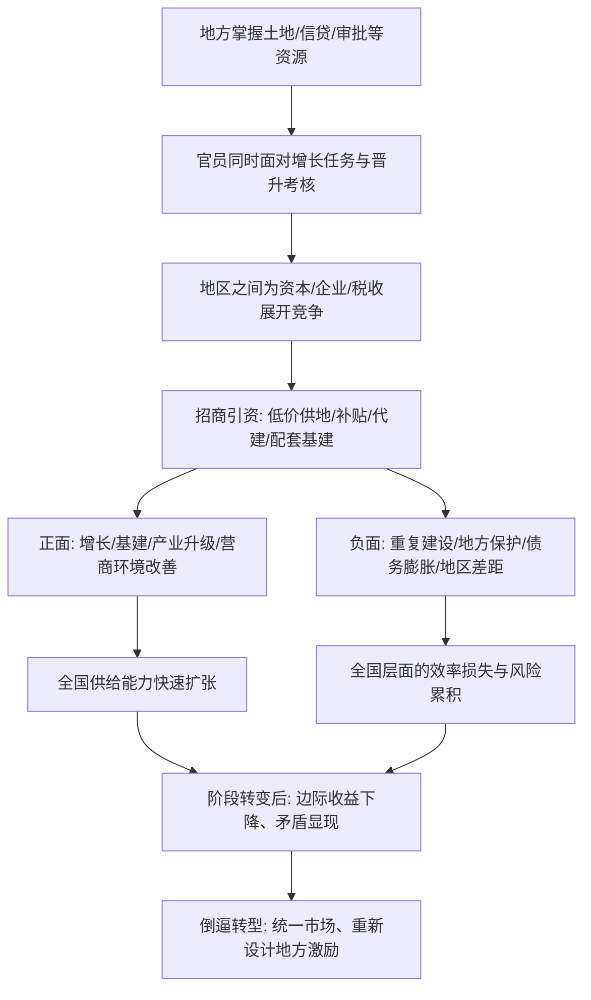

# 20｜地区间竞争，给中国带来了什么？

> 地方政府像公司一样互相竞争，这究竟是中国增长的秘密武器，还是一堆麻烦的来源？

---

## 一、先说结论

兰小欢在《置身事内》里给出的答案，既不是表扬，也不是批评：地区之间的竞争，是同一套激励机制的**一体两面**。它带来了增长活力、基础设施和产业升级，也带来了重复建设、地方保护、债务膨胀和地区差距。它不是「好」或「坏」的问题，而是「在什么阶段、什么条件下，收益大于代价」的问题。把竞争简单褒扬或简单否定，都会错过真正重要的东西——那套让地方政府拼命往前跑的激励，究竟是怎么设计出来的。

## 二、我们先理解一个问题

先问一个有点奇怪的问题：为什么在中国，是**地方政府**在操心招商引资、修路建厂、抢项目抢企业？

在很多国家，这类事主要交给企业自己，政府提供法律和公共服务就够了。但在中国，如果你去一个县里走一圈，会发现县长、书记最忙的事之一，往往是「今年招了几个项目、引了多少投资、落了几家龙头」。地方官员像企业的负责人一样，管着土地、规划、财政、审批、融资，设定经济增长目标，再一层层分解下去。

这就引出了本文真正的问题：**地方政府之间这样互相竞争，到底给中国经济带来了什么？** 是活力，还是浪费？是效率，还是内耗？如果答案不是二选一，那么「一半好一半坏」的背后，有没有一个统一的逻辑？

## 三、作者到底提出了什么观点？

兰小欢在书中借用并整理了一个被广泛使用的分析框架：**地方政府竞争**。

他的核心判断大致有三层。

第一，地方政府并不是市场的「外部干预者」，而是深度**置身事内**的参与者。它手里掌握着其他市场经济体里政府通常不直接掌握的资源——土地、信贷通道、政策优惠、审批权。

第二，正因为手里有资源，地方政府之间可以像企业一样，为了争夺资本、企业和人才而展开竞争。招商引资是这场竞争最主要的动作。

第三，竞争的手段相当具体：低价甚至零地价供地、税收返还、财政补贴、代建厂房、配套修路修桥、帮着企业找银行贷款……地方政府等于把自己的一部分「家底」押上去，换取企业落地和后续的税收、就业、GDP。

作者并不急于给这场竞争下道德判断。他关心的是：**这套激励从哪来，它为什么在某个阶段极其有效，又为什么会在另一个阶段显出代价。**

## 四、把这个观点翻译成人话

你可以把每个地方政府想象成一家「公司」。

这家公司有资产（辖区内的土地、国有资产），有收入（税收、卖地收入），有 KPI（经济增长、招商引资、就业），还有一位任期有限的「总经理」（地方主官）。它不直接生产商品，但它能决定：这块地给谁、给什么价；这笔补贴发给谁；这条路先修到哪里；这家企业能不能拿到低息贷款。

现在，假设全国有几百上千家这样的「公司」，它们互相之间不能直接合并，却要争夺同样的东西：头部企业、产业链、人才、上级的认可。于是竞争自然发生。

竞争的方式也很好懂。A 市为了引进一家新能源电池厂，承诺三年免税、地价打三折、帮忙建好标准厂房；隔壁 B 市一看，条件加码：不仅地更便宜，还帮你配套建设员工宿舍和变电站。C 市再跟上，直接由地方平台公司入股。

这就像一条街上开奶茶店。第一家生意好，第二家立刻开在对面，第三家搞「第二杯半价」，第四家干脆装修更豪华、价格更低。**每个人都在努力，结果却未必是每个人都更好。**

## 五、为什么会这样？

把兰小欢的推理拆开，大致是下面这条链：

这条链里最关键的，是 D 之后的**分岔**：同一个动作，同时长出好的果实和坏的果实。

先说好的那一面：

- **增长活力。** 地方政府有强烈动力把资源投向能见效的项目，投资和建设速度很快，这是中国经济长期高增长的重要动力之一。
- **基础设施。** 为了招商、为了形成「营商环境」，地方会大修路网、园区、电网、港口。很多地方的基础设施水平，是靠这种「军备竞赛」式投入堆起来的。
- **产业升级。** 地方会主动培育新产业，从早期承接加工制造，到后来争抢面板、光伏、新能源、芯片。书中提到的京东方、光伏等案例，某种程度都是地方竞争的产物。
- **营商环境改善。** 为了抢到好企业，地方必须改善服务效率，「最多跑一次」这类改革，背后也有竞争压力。

再说坏的那一面：

- **重复建设。** 只要某个产业看起来赚钱，各地就会一窝蜂上同一个赛道。你上一条生产线，我也上一条；你建一个园区，我也建一个。供给迅速过剩，价格战随之而来。
- **地方保护。** 为了保住本地企业和税收，有些地方会设置隐形壁垒：本地政府采购优先本地品牌、对外地产品设置额外检测或准入门槛、限制外地企业参与本地项目。
- **债务膨胀。** 竞争要花钱，钱从哪来？地方财政不够，就通过地方融资平台借。修路、建园区的钱很多是借来的，回报却很慢，债务就这样一层层累积起来。
- **地区差距。** 竞争不是公平起跑。区位好、家底厚、政策强的地方更容易抢到好项目，赢得越多越强；底子薄的地方越抢越难，差距于是被拉开。

**所以「好」和「坏」不是两套机制，而是同一套机制的两个出口。** 促增长的动力，和造成浪费的压力，是同一股力量的两种表现。

## 六、举一个现实生活中的例子

想象一条不太长的商业街，突然有两个人同时看上了「奶茶」这门生意。

第一个人开了店，生意不错。第二个人立刻在斜对面也开一家。为了抢客，一家开始「买一送一」，另一家就「第二杯半价」；一家把店装修成网红打卡风，另一家干脆把价格压到成本线附近。

短期看，消费者赚了：奶茶更便宜、选择更多、服务更好。但时间一长，你会发现问题：这条街上的店太多，谁都赚不到钱；两三家撑不住倒闭；倒闭后，店铺空置，装修全打了水漂；甚至有人开始用更差的原料来压成本，最后伤害的是顾客。

再换一个场景：几个城市争抢同一个「新能源汽车产业园」项目。

先是 A 市给出地价优惠，B 市追加税收返还，C 市直接承诺政府平台入股。项目最终落在条件最狠的那个城市。但代价是：这块地本来可以有别的用途，这笔补贴本可以投到学校或医院，这座园区建成后可能面临产能过剩。而落选的两个城市，为了「不白忙一场」，转头又去谈下一个类似项目——因为 KPI 还摆在那里。

这正是地区竞争的日常缩影：**每个参与者都在做对自己而言「理性」的选择，但加总到全国层面，就可能变成过度投入。**

## 七、回到书中重新理解

现在再回头看兰小欢的论述，就顺了。

他之所以用相当大的篇幅去写地方政府怎么招商、怎么竞争，并不是要给地方官员写表扬信或批评信，而是要说明：**中国经济增长的微观发动机，恰恰是这些看起来有点「不市场经济」的政府行为。**

书中引用了不少学者的研究。比如有学者（如周黎安）提出「晋升锦标赛」的概念，认为经济绩效长期是官员晋升的重要考核标尺；也有研究强调财政激励——1994 年分税制改革之后地方财权上收、事权没有同步上收，地方必须自己「找钱」，这构成了竞争的另一条腿（这些更细的机制，前面几篇已经讲过，这里只一笔带过）。

理解了这一层，你就会明白作者为什么说地方政府是「置身事内」的：它不是在市场外面吹哨的裁判，而是亲自下场的球员。既然下场，就既有进球，也有犯规；既有配合，也有恶性拼抢。

## 八、这个观点背后还有什么？

有几层东西，作者没有完全展开，但很关键。

第一，**竞争的对象和规则，是被人为设定出来的。** 地方竞争这么激烈，不只是因为地方官「有干劲」，而是因为考核体系、财政体制、土地制度共同把「经济增长」变成了地方官最划算的选项。激励机制变了，行为就会跟着变。

第二，**「属地管理」放大了竞争。** 中国的治理结构里，地方对辖区内的事务有很大的自主权（「块块」），同时又受各条部门系统（「条条」）的影响。这种结构让地方既有动力、也有能力去拼经济。

第三，**竞争的收益和成本，作用在不同层级上。** 单个地方拼命投项目，好处主要落在本地（税收、就业、GDP）；但重复建设、产能过剩的成本，却常常由全国承担。这种「收益本地化、成本全国化」的结构，是理解很多问题的钥匙。

第四，**它解释了为什么「一放就活、一管就死」的钟摆感会反复出现。** 竞争带来活力，也带来混乱；中央于是收紧；收紧后活力下降，又需要重新放权。作者对这种循环的态度是理解而非抱怨。

## 九、这个观点有问题吗？

有争议，而且争议恰好就发生在「褒贬」这件事上。

**分歧点一：竞争带来的净效应，究竟是正还是负？**
一方认为，地区竞争是中国高速增长的制度性秘密，没有这种「地方政府办企业」式的竞争，基础设施和产业升级不会这么快；另一方认为，重复建设、地方保护、债务风险已经证明这种模式的代价越来越高，正收益正在变成负收益。**关键分歧在于「用哪个阶段的数据说话」**：在追赶阶段，收益明显；到了产能过剩、债务高企的阶段，代价更突出。

**分歧点二：增长到底是竞争带来的，还是竞争只是「顺便」出现的现象？**
有经济学者认为，地方竞争只是更底层因素（如市场化改革、人口红利、全球化）的表现，把它当主因可能夸大；也有研究强调，地方竞争是理解中国增长绕不过去的机制。学界对此并没有完全统一的结论。

**分歧点三：地方保护到底有多严重？**
有人认为地方保护是普遍现象，抬高了全国统一市场的交易成本；也有人认为随着交通、电商和监管的推进，地方保护的强度在下降，不宜过度渲染。

**分歧点四：作者的框架有没有过度简化？**
「地方政府像公司」是一个有力的类比，但地方政府毕竟不是公司：它要承担公共服务、就业、稳定等非利润目标，也不能像公司一样破产退出。把它完全当公司看，可能忽略了很多约束。**需要补充的是**：作者本人也强调了政府能力有边界，这个类比是分析工具，不是全部真相。

所以更准确的说法是：地区竞争是一套**阶段性有效**的机制，它在特定历史条件下释放了巨大能量，也在新的条件下暴露了代价。争论的焦点，不是它「有没有用」，而是它「还用不用得起」。

## 十、今天再看这个观点

先说书里的观点：兰小欢在书中指出，地区竞争是中国增长的重要机制，同时清醒地看到它的负面后果，并主张通过改革（如要素市场化、统一大市场）来降低内耗。这是书中的判断。

以下是基于这套思想的现代延伸，不是书里的原话。

这几年，一个高频词是「全国统一大市场」，指向的正是本文说的那类问题：地方壁垒、重复招商、补贴竞赛。从政策方向看，意图是让竞争从「拼优惠、拼补贴」转向「拼服务、拼环境」，也就是减少那种「拿财政的钱互相砸」的内卷。

另一个新变化是产业赛道的集中。当新能源、人工智能、半导体成为各地都想抢的方向时，「一窝蜂上同一个产业」的老问题，可能以更大的金额、更高的技术门槛重演。谁能在这一轮里学会「不盲目跟风、量力而行」，谁就更可能避免上一轮的教训。

这其实把问题推向下一篇：如果单纯拼投入、拼生产的竞争方式，收益在递减，那么地方政府该把力气花到哪里去？

## 十一、这一篇真正应该记住什么？

1. **地区竞争是激励机制的产物，不是性格问题。** 地方官员拼命招商，是因为考核与财政共同把增长变成了最划算的选项。

2. **同一套机制同时产生动力与代价。** 增长、基建、产业升级与重复建设、地方保护、债务膨胀，是同一个硬币的两面。

3. **收益本地化、成本全国化，是理解内耗的关键。** 单个地方投项目的好处留在本地，重复建设的成本却由全国分担。

4. **竞争是阶段性的。** 门槛低、回报高的追赶阶段，竞争利大于弊；进入产能过剩、债务承压阶段，代价开始显性化。

5. **出路不是消灭竞争，而是改规则。** 让地方从「拼补贴」转向「拼环境、拼服务」，才是可持续的方向。

## 十二、留一个问题

> 如果地方政府之间的竞争既带来活力又带来浪费，
> 那么真正该改的，是「竞争」本身，
> 还是那套让地方不得不靠拼投入、拼生产才能交差的规则？

---

**下一篇**：既然竞争的重点正在从「抢项目、拼生产」转向别的地方，那地方政府这个角色，是不是也该跟着变？过去那套「亲自下场搞生产」的打法，为什么越来越不好使了？下一篇我们就来谈——**政府要从「生产型」转向什么。**
