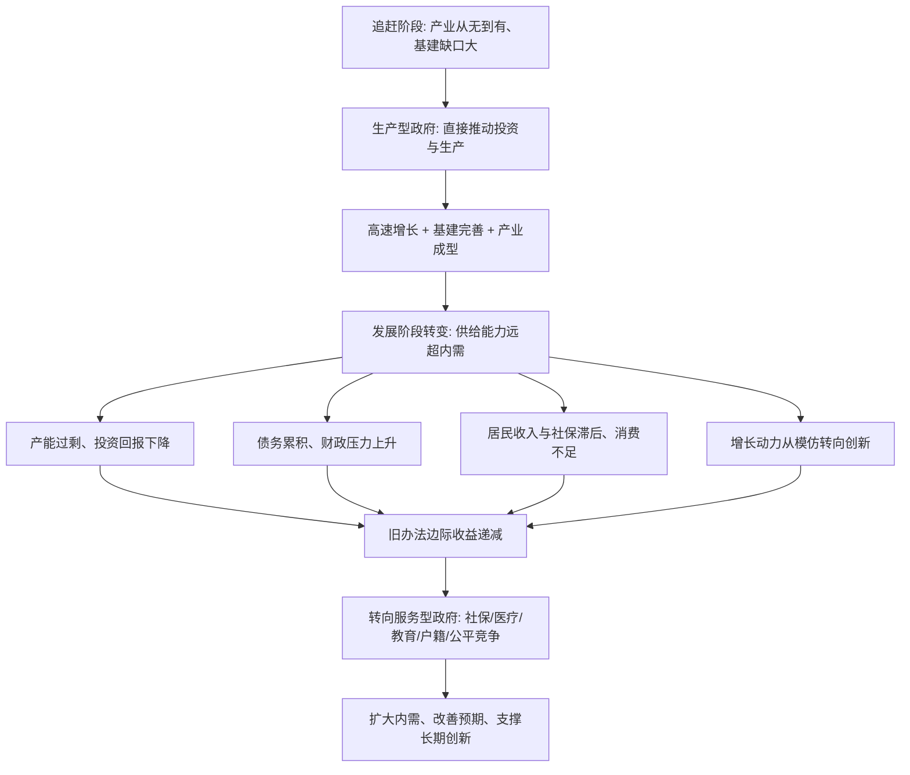

# 21｜政府要从「生产型」转向什么？

> 如果过去那套「政府亲自抓生产」的办法曾经有效，为什么今天必须改？

---

## 一、先说结论

兰小欢的答案是：**发展阶段变了，政府的任务也变了。** 过去是追赶阶段，产业要从无到有，政府直接下场推动投资和生产，效率很高；今天产能过剩、债务累积、消费不足，创新所需要的环境也完全不同，政府的角色必须从「生产型政府」（直接推动投资和生产）转向「服务型政府」（提供公共服务、维护公平环境、完善社会保障）。这不是说政府不重要了，而是说政府该做的事换了。

## 二、我们先理解一个问题

很多人对政府的想象是二元的：要么「管得越少越好」，要么「政府应该多干一点」。但《置身事内》提供了一个更实用的视角：**政府该干什么，取决于经济发展到了哪个阶段。** 追赶阶段需要的政府，和成熟阶段需要的政府，可能完全不是同一种。

问题是：为什么同样一套「政府抓经济」的方法，曾经是成功的秘诀，现在却成了问题的来源？如果我们承认「过去有效」，那就必须解释「现在为什么不行」——这中间的转折点，到底在哪里？

## 三、作者到底提出了什么观点？

兰小欢在书中把过去几十年的地方政府概括为「**生产型政府**」：它的重心是直接推动投资、扩大生产、招商引资。

它有效的原因，作者讲得很清楚：

- 追赶阶段，很多产业是「从无到有」。市场资本分散、怕风险、缺乏长期承受力，政府如果不顶上，产业可能根本起不来。
- 基础设施需要大规模投入，回报周期长、公共属性强，企业不愿单独承担，政府下场能加速建设。
- 目标明确、路径清晰：别人已经走过的路（工业化、城市化）可以借鉴，谁跑得快、投得多，谁就领先。

但作者同时指出，这个模式在新的发展阶段遇到了天花板：

- **产能过剩**：供给能力被推得远超国内需求。
- **债务累积**：靠借来的钱搞投资，回报越来越薄。
- **消费不足**：钱大量投向生产，居民收入和社保相对滞后，内需起不来。
- **创新环境不同**：从「模仿追赶」转向「原创突破」，需要的不是政府替企业选方向，而是更好的教育、法治、知识产权保护和公平竞争。

于是，作者提出的方向是转向「**服务型政府**」：把重心从直接推动生产，转到提供公共服务、维护公平竞争环境、完善社会保障和民生支出上。

## 四、把这个观点翻译成人话

打个不太精确、但很好用的比方：**政府过去像个「生产队长」，现在要学着当「后勤部长」。**

生产队长的活是：定指标、分任务、催进度、保产量。在开荒阶段，这特别管用——地还没开出来，大家各自为战容易荒废，有个队长带着冲，效率最高。

可当地已经都开出来了、产量也够了、甚至粮食卖不动了，队长的老办法就不灵了。这时候真正缺的，反倒是后勤：把水渠修好、把学校办好、把生病的人照顾好、把规则定公平，让每个人能安心干活、愿意消费。

这里有两个容易误解的地方。

第一，**「服务型」不等于「无所作为」。** 提供社保、医疗、教育、户籍改革、公平竞争规则，每一件都需要极强的组织能力和财政投入，一点都不轻松。

第二，**不是说生产型政府「当年错了」。** 作者的态度很清楚：在那个阶段，那套办法有它的合理性，甚至别无选择。问题在于，**把一个阶段有效的办法，硬用到另一个阶段。** 过去的药，今天可能变成了病。

## 五、为什么会这样？

把作者的推理画成链条：

最关键的一跳是 **C → D**。不是政府「变坏了」，而是**经济本身已经长到了另一个阶段**：该有的产能大部分有了，该修的路大部分修了，靠继续加码投资拉动增长的回报越来越低。

这就解释了一个看似矛盾的现象：为什么「政府越努力地推投资，效果却越差」。因为推的方向，已经不再是这个阶段最缺的东西了。

那这个阶段最缺什么？作者指向的是：**内需、预期和人力资本。**

- 内需靠什么？靠居民有稳定收入、有社保兜底、不用为养老看病存太多钱。
- 预期靠什么？靠规则稳定、产权受保护、竞争公平。
- 长期创新靠什么？靠教育、靠人才、靠允许试错的环境。

这些恰恰是「服务型政府」的职能，而不是「生产型政府」擅长的东西。

## 六、举一个现实生活中的例子

想象一个普通家庭的三代人（这里只借用「家庭生命周期」来类比，不涉及具体数据）。

**第一代**，从农村进城，白手起家。这个阶段全家只有一个目标：挣钱、盖房子、站稳脚跟。父母起早贪黑，能省就省，恨不得把每一分钱都投到「盖房、买设备、扩大生意」上。这时候，一个「生产型」的家庭策略是对的：多投入、多积累，日子才有奔头。

**到了第二代**，房子有了，生意也稳定了。如果还照第一代的办法，把所有钱都砸进「再盖一栋房、再开一家店」，就会出问题：房子空着租不出去，店开太多互相抢客，还欠了一屁股债。这时候家庭真正需要的，是换个重点——给孩子好的教育、给老人好的医疗、给自己留点休息和保障。**从「拼命挣钱盖房子」，转向「花钱改善生活、教育孩子」。**

**再到第三代**，目标可能又变了：不再只是挣钱，而是追求选择自由——想做什么工作、想在哪里生活、想过什么样的日子。

一个家庭的策略必须随阶段变化，一个国家的政府角色也一样。作者想说的，就是中国正处在这样的换挡期：**不是不努力了，而是努力的方向该换了。**

## 七、回到书中重新理解

现在再看兰小欢的论述，就能理解他为什么要在全书结尾谈转型。

他不是在开一张漂亮的改革清单，而是在做一件事：**说明过去的成功和今天的问题，来自同一个逻辑。** 生产型政府之所以有效，是因为它把资源集中投向生产；它之所以遇到麻烦，也正是因为它把资源集中投向生产——当生产已经够了，继续这么投，就变成了过剩、债务和低消费。

这也解释了作者为什么反复强调「具体阶段、具体约束」。在他看来，没有一种政府角色是永远正确的「标准答案」。有效的制度，是**与当时的发展任务相匹配**的制度；任务变了，制度也得跟着调。

顺带一提（前面几篇已详述，这里只用一句话）：土地财政、城投债务、要素市场、户籍，这些问题在作者笔下并不是「政府做错了」的证据，而是同一个增长模式的副产品。转型，就是要把这些副产品带来的失衡慢慢消化掉。

## 八、这个观点背后还有什么？

几点作者没完全展开、但值得注意的前提。

第一，**政府能力是有边界的。** 生产型政府容易产生一种自信：既然我当年能把产业做起来，那我今天也能。但创新、消费、民生这些事情，靠「集中力量办大事」未必有效——它们更依赖千千万万个普通人的预期和选择。作者主张「有所为有所不为」，就是要承认这个边界。

第二，**服务型政府对财政的要求其实更高，也更「难见政绩」。** 修一座桥，看得见、数得出；办好社保和教育，效果要好多年后才显现。这就引出一个深层问题：如果考核还是看短期、看可见的产出，地方政府会有动力转向服务吗？

第三，**转型不是「关掉政府」，而是「换个位置」。** 在成熟经济里，政府依然是重要的：提供公共品、纠正市场失灵、维护稳定。变的不是「要不要政府」，而是「政府站在哪里」。

第四，**它对个体的预期有直接影响。** 如果社保、医疗、教育更可靠，普通家庭就敢少存钱、多消费；消费起来，企业才有稳定的国内市场。服务型政府不只是道德要求，也是经济循环的关键一环。

## 九、这个观点有问题吗？

争议很大，而且争议有好几个层次。

**分歧一：转型的速度该多快？**
快派认为，旧模式的风险（债务、过剩）已经积累到必须尽快切换，拖得越久代价越大；缓派认为，转型过程中如果收缩太快，会带来增长失速、就业压力和地方财政困难。**真正难的是节奏**：降风险会拖累增长，稳增长又会累积风险，这个两难前面几篇已经反复出现。

**分歧二：政府与市场的边界到底划在哪？**
即使在「转向服务型」这件事上，也没那么简单。政府在教育、医疗、住房里应该扮演什么角色？是直接供给，还是购买服务、制定规则？是补贴生产者，还是补贴消费者？不同选择会带来完全不同的结果。作者强调「具体机制」，但具体的边界，学界和实践都仍在摸索。

**分歧三：地方激励怎么重新设计？**
如果不再考核 GDP，那考核什么？民生指标容易被量化成「刷数字」，创新指标难以短期衡量，环境指标可能影响增长。**换一套 KPI 并不自动带来好行为**，这是转型里最技术、也最现实的一环。

**分歧四：「服务型政府」会不会成为另一种口号？**
需要补充的是，「服务型」这个词本身很正面，但如果没有财政、监督和问责机制跟上，它也可能停留在文件里。作者的态度是务实的：关键不在词好不好听，而在机制能不能让好事发生。

所以更准确的判断是：**转型的方向争议不大，争议在于路径、节奏和代价的分担。** 说「应该转向服务型」容易，说清「怎么转、谁来付账、转的过程中谁受损」，才是真正的难题。

## 十、今天再看这个观点

先说书中的：兰小欢在书中明确指出，随着发展阶段变化，政府需要从生产型转向服务型，重点转向公共服务、社会保障、公平竞争和要素市场改革（这是书里的判断）。

以下是现代延伸，不是书里的原话。

站在今天看，这个判断又多了一层紧迫性。人口老龄化意味着养老和医疗支出只增不减；职业技能快速过时意味着教育和再培训的需求上升；年轻人对「确定性」的敏感（就业、住房、婚育）本质上也是对公共服务和社会保障的投票。政府在这些领域的能力，越来越直接地决定社会的信心。

另一条线是人工智能。AI 提升效率的同时，也会冲击部分岗位和收入分配。如果「服务型政府」的职能里，本来就包含「给转型中的普通人提供缓冲」，那么在 AI 加速替代劳动的时代，这套缓冲机制的重要性只会更高。这不是书里的预言，而是作者框架在今天的一种自然延伸。

## 十一、这一篇真正应该记住什么？

1. **政府角色没有永远的正确答案，只有与阶段匹配的答案。** 生产型政府在追赶阶段有效，不等于在成熟阶段还同样有效。

2. **旧办法失效，不是因为政府「变坏」，而是经济「长大」了。** 产能、基建大体到位后，继续加码投资，回报下降、风险上升。

3. **服务型政府的核心是内需、预期与人力资本。** 社保、医疗、教育、户籍和公平竞争，既是民生，也是经济循环的基础。

4. **「有所为有所不为」是能力边界的自觉。** 集中力量办大事擅长追赶，未必擅长创新与消费，需要承认并设计新机制。

5. **难点在节奏与激励。** 转型方向争议不大，如何把握速度、重设考核、分担代价，才是真正的挑战。

## 十二、留一个问题

> 如果政府的职能要从「多生产」转向「多服务」，
> 那么我们评判一届政府「干得好不好」的标准，
> 是不是也该跟着换一换？
> 而在换标准的过程中，谁的利益会被重新分配？

---

**下一篇**：我们谈增长、谈竞争、谈转型，谈了一整套机制。但绕到最后，有一个问题始终没有被正面回答——**我们发展经济，最终到底是为了什么？** 这将是本系列的最后一篇。
