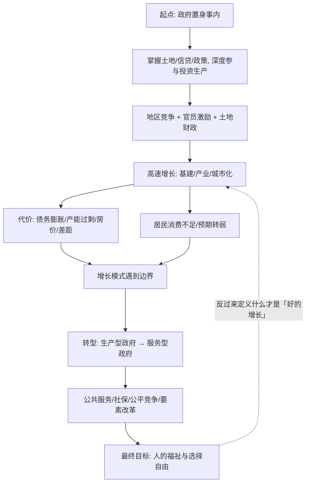

# 22｜经济发展的最终目标，应该是什么？

> 我们谈增长、谈债务、谈转型，可这一切最终是为了谁？

---

## 一、先说结论

《置身事内》全书讲的是机制——土地、财政、债务、竞争——但在最后，兰小欢把话题收回到一个朴素的地方：**发展的目的不是增长本身，而是人的福祉和选择自由。** 理解政府与经济的全部机制，最终要回到「人」这个目标上。这也是全书克制的温情所在：它不做道德审判，却始终记得，数字背后是具体的人。

## 二、我们先理解一个问题

一个社会可以有很多目标：GDP、税收、就业、国际地位、产业升级……这些目标常常被当成「目的」来追求。但如果追问一句「然后呢」，就会发现它们大多只是**手段**：增长是为了什么？是为了更多的收入、更好的生活、更多的选择。

问题在于：当手段被当成目的，会发生什么？我们会不会在拼命增长的过程中，忘了增长本来要解决的是什么？这本书讲了一路的机制，最后必须回答一个问题——**我们发展经济，最终到底是为了什么？**

## 三、作者到底提出了什么观点？

兰小欢在书的结尾处，把落脚点放在「人」上。

他并不否认增长的重要性。恰恰相反，他花了整本书说明：对中国这样一个人口众多、起点很低的国家，增长、投资、工业化，曾经是改善绝大多数人生活最现实的路径。但他也提醒读者：**增长是手段，不是终点。**

在作者看来，发展的最终意义，落在几件事上：

- **生活质量的提升**：更好的收入、更安全的环境、更从容的生活节奏；
- **选择自由**：能选择在哪里生活、做什么工作、过什么样的日子，而不是被户籍、土地、身份限制锁死；
- **福祉的公平**：发展成果能被更广泛地分享，而不是集中在少数人和少数地区。

作者的态度是克制的：他不喊口号，也不做廉价的道德批判。他更愿意说：**看清机制怎么运转，理解它的约束，然后才谈得上怎么让它更好地服务于人。** 这种「先理解，再判断」的立场，贯穿全书。

## 四、把这个观点翻译成人话

先做一个小实验。

假设问一个人：「你今年目标是什么？」他可能回答：「挣 50 万。」再问：「挣这 50 万是为了什么？」：「换更好的房子。」「换房子为了什么？」：「孩子上好学校，家人住得舒服。」「那又是为了什么？」：「希望一家人过得更好、更安心。」

你会发现，**「挣 50 万」从来不是终点，「过得更好、更安心」才是。** 钱和增长只是通向那个终点的桥。

一个国家也是如此。GDP 是桥，产业是桥，基建是桥。桥本身修得再漂亮，如果过了桥之后，人的日子没有变好、压力反而更大、选择反而更少，那这座桥就失去了意义。

这里要小心两个极端：

- **一个极端是「只要增长，别的以后再说」。** 这容易把代价（债务、污染、差距、焦虑）不断推到未来，直到推不动。
- **另一个极端是「增长不重要，直接谈福祉」。** 这也不现实——在一个还很穷的国家，没有增长，福祉根本无从谈起。

作者的方法不是选边，而是承认：**在什么阶段，什么最紧急。** 追赶阶段，增长本身就是最大的民生；到了新阶段，如果增长方式开始伤害生活质量、压缩选择空间，那就得调整目标的重心。

## 五、为什么会这样？

把整个系列的逻辑串起来，可以画成这样一条链：

这条链有意思的地方，是最后那条虚线箭头：**目的不只是链条的终点，它还会反过来定义过程。** 一旦承认「发展是为了人」，那么什么样的增长是好增长、什么代价不能接受、哪些改革该优先，判断标准就变了。

这正是作者全书的一个隐含主线：**机制是冷的，但理解机制的目的是热的。** 我们研究土地怎么卖、债务怎么滚、竞争怎么打，不是为了欣赏这套机器有多精妙，而是为了看清它如何影响千千万万人的日子，并在必要时推动它改变。

## 六、举一个现实生活中的例子

再说回那个家庭（延续上一篇的类比，但这里换一个角度：三代人目标的变化）。

**爷爷那一代**，目标是「活下去、吃饱饭」。对他们来说，多打一点粮食、多挣一点工分，就是全部的意义。生存本身，就是最大的福祉。

**父母那一代**，目标变成了「挣钱、盖房、让孩子读书」。他们愿意拼命干活、省吃俭用，因为相信「苦一点、累一点，下一代就能过得好一点」。增长在这个阶段，和改善生活是高度一致的。

**到了年轻人这一代**，目标又变了。他们可能不再满足于「比上一代多挣一点」，而会问一些上一代觉得「奢侈」的问题：我为什么一定要留在这座城市？这份工作除了钱，还有没有意义？我能不能不加班、不生那么多孩子，也过得体面？我想要的到底是更高的收入，还是更从容的生活？

一个家庭的这三段变化，几乎就是中国发展的一个缩影：**当收入到了一定水平，人们追求的东西就从「有没有」转向「好不好」「自不自由」。** 这时候，如果社会的制度（户籍、社保、教育、医疗、劳动时间）还停留在只服务「多产多挣」的阶段，就会和人们真实的愿望错位。

一个人拼命加班赚钱，某天深夜问自己「我这么拼到底为了什么」，如果答案是「为了家人过得更好」，那目标清晰；但如果答案是「不知道，只是不敢停」，那就说明——**手段已经绑架了目的。**

## 七、回到书中重新理解

现在再回看《置身事内》的结尾，就能理解作者为什么要在讲完那么多「硬机制」之后，笔锋一转，谈价值、谈人、谈生活。

因为整本书回答的其实是两个层次的问题：

- **第一个层次：中国经济是怎么运转的？** 答案是一整套机制——事权划分、分税制、土地财政、土地金融、城投债务、政府投资、地区竞争。
- **第二个层次：这套运转方式，最终为的是什么？** 答案是：为了人。

作者没有把第二个层次写成慷慨激昂的宣言，而是保持了克制。他没有说「必须如何」，而是说「理解具体机制与约束」；没有把所有问题归给某个「坏人」，而是指出这是一套**激励结构**在特定阶段的结果。这种克制本身就是一种态度：**真正对「人」负责的方式，是先诚实地说清现实，再谈改变。**

## 八、这个观点背后还有什么？

几点值得往深处想。

第一，**「福祉」是难以测量的。** GDP 能被统计，债务能被核算，但生活质量、焦虑、尊严、选择自由，很难放进一个指标里。这就带来一个现实问题：如果考核体系只承认可测量的东西，那么「发展为了人」就可能被简化成「发展为了可测量的数字」。

第二，**目的由谁定义？** 「人的福祉」听起来没有争议，但具体到「什么是好生活」，不同的人答案不同：有人要更多收入，有人要更多闲暇，有人要更公平，有人要更自由。作者没有代替所有人给出答案，这正是一种尊重。

第三，**过程与目的会相互塑造。** 我们以为可以先增长、后补福祉，但增长方式本身就决定了福祉的分配。一个把资源高度投向生产的模式，很可能同时压制消费和民生。目的与手段并不总是分离的。

第四，**作者的观点与全书立场一致。** 「政府置身事内」讲的是**如何运转**；「发展为了人」讲的是**为了什么**。前者是实证的冷静，后者是价值的温度，两者合起来，才是完整的一本书。

## 九、这个观点有问题吗？

有争议，而且争议不在于「要不要以人为本」（几乎没人反对），而在于**怎么落地、由谁定义、代价谁承担**。

**分歧一：福祉应该用增长来衡量，还是用别的？**
一派认为，对发展中国家来说，收入增长仍是最可靠、最可测量的福祉来源，过早淡化增长会伤害底层；另一派认为，增长与福祉会脱钩，必须用健康、环境、闲暇、不平等、安全感等更全面的指标来衡量。**分歧在于：在什么发展阶段，什么该优先。**

**分歧二：转型期的代价由谁承担？**
如果为了长远的福祉（比如环保、去杠杆、完善社保）而牺牲短期增长，那么被牺牲的行业、地区、岗位怎么办？说「长远看大家都好」容易，但**承担短期代价的往往是具体的人**。这是最现实、也最尖锐的争议。

**分歧三：「发展为了人」会不会变成一种正确但空泛的口号？**
需要补充的是，这类表述很容易被所有人接受，也因此容易被所有人架空。真正的考验是：当「以人为本」与「稳定增长」「地方财政」「就业」发生冲突时，决策的天平往哪边倾斜。作者的价值在于——他把这个张力明明白白地摆出来，而不是用一个漂亮结论把它盖住。

**分歧四：谁来定义「好生活」，会不会被滥用？**
如果由少数人替所有人定义「什么对人的福祉最好」，可能走向另一种强加。作者的克制，某种程度上正是对这个问题的小心回应：不给唯一答案，而是把机制和约束讲清楚，让读者自己去判断。

所以，成熟的态度不是争论「要不要以人为本」，而是持续追问：**在具体的取舍面前，我们到底把什么放在了前面。**

## 十、今天再看这个观点

先说书中的：兰小欢在书的结尾强调，发展的最终目的是人的生活与福祉，理解中国要理解它的具体机制与约束，不轻易用抽象标签评判（这是书里的判断）。

以下是现代延伸，不是书里的原话。

站在 AI 快速发展的今天，这个命题被赋予了新的张力。一方面，技术能极大提升效率，本可以释放更多闲暇、改善医疗教育、把人力从重复劳动中解放出来——这都在「为了人」的框架里。另一方面，如果效率提升的收益高度集中、岗位被大量替代、普通人越来越难跟上节奏，那么「增长」和「人的福祉」就会再次出现裂缝。

这引出一个属于我们这个时代的问题：当机器越来越像人一样「能干活」，人到底靠什么定义自己的价值和位置？也许答案仍然在兰小欢的框架里——**不是靠「生产了多少」，而是靠「过得怎么样、有没有选择」。** 一个社会如果能把这一点放在中心，技术就会是福祉的放大器；如果只把技术当成新的增长工具，它也可能成为新的代价来源。

这不是作者在书里下的判断，而是他的框架交给今天的我们的问题。

## 十一、这一篇真正应该记住什么？

回望整个系列，这一篇要记住的核心是：

1. **增长是手段，人的福祉才是目的。** 土地、财政、债务、竞争、转型，这一整套机制最终都要回到「人过得怎么样」上来检验。

2. **政府置身事内，是全书的起点；发展为了人，是全书的落点。** 理解机制是为了理解现实，理解现实是为了知道该往哪走。

3. **同一套机制会随阶段变化。** 追赶阶段，增长本身就是最大的民生；成熟阶段，增长方式若伤害生活质量，就该调整重心。

4. **作者的克制，是一种负责的态度。** 不做道德审判，不喊口号，先把约束和代价说清楚，再谈改变——这本身就是对「人」的尊重。

5. **懂中国经济，最终是为了更清醒地生活。** 能用自己的话解释这个时代如何运转，也能在具体的取舍面前，想清楚自己珍视什么。

## 十二、留一个问题

> 如果一个社会的所有数字都在增长，可身处其中的人却越来越紧绷、越来越不敢停下来，
> 那么，我们该怎么判断——这究竟算不算「发展」？
> 而如果答案是否定的，改变的起点，应该从谁开始？

---

**这一篇，是本系列的最后一篇。**

从第一篇追问「为什么用『政府 vs 市场』理解不了中国经济」，到中间拆开土地财政、城投债务、地区竞争，再到今天回到「人」——我们走了一整圈。

《置身事内》这本书最动人之处，或许不在于它给出了多少答案，而在于它示范了一种态度：**对复杂的现实保持诚实，对具体的约束保持敬意，对活在其中的人保持温度。**

**谢谢读到这里的你。**
