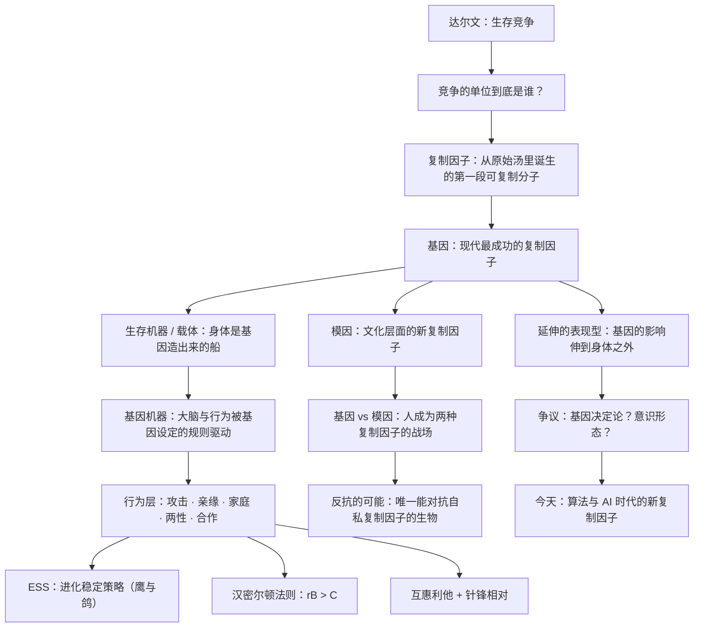

# 《自私的基因》深度解读系列

## 系列简介

1976 年，牛津大学的动物学讲师理查德·道金斯出版了一本小书，书名是《自私的基因》。它后来被译成二十多种语言，销量超过百万册，被《卫报》评为非文学类百大好书，也被英国皇家学会称为「最有启发性的科学书籍」之一。

这本书的核心主张，用一句话概括是：

> **自然选择的基本单位不是物种，不是群体，也不是个体，而是基因。**

从基因的视角看，一切生命的身体都只是「生存机器」，是基因为了让自己延续而建造的载体。所以道金斯说，我们以及其他一切动物，都是各自基因所创造的机器，被暗中编好了程序，去保养那些叫做基因的自私分子。

但「自私」这两个字，也是全书被误读最深的地方。它描述的**不是人的道德品质**，而是基因在演化中的行为效果——一个能在复制竞争中胜出的基因，必然表现得像是「只关心自己的延续」。道金斯本人后来承认，这个书名给了读者不恰当的印象，他一度后悔没有用编辑建议的另一个名字。

本系列不按原书章节复述，而是重建一条认知链：先弄清「基因中心视角到底是什么、为什么它颠覆了我们对自己的理解」，再依次走进行为的基因逻辑——进攻、亲缘、家庭、两性、合作，然后是那个开启了整个「模因」时代的第十一章，最后回到今天：这套视角哪里有力、哪里被误读、在 AI 时代又意味着什么。

---

## 全书核心问题

| 层次 | 问题 |
|---|---|
| 单位问题 | 自然选择到底选择的是什么？为什么不是个体，也不是物种？ |
| 起源问题 | 第一个会自我复制的东西是怎么出现的？「复制因子」意味着什么？ |
| 身份问题 | 如果我们只是基因的「生存机器」，那「我们」算什么？ |
| 行为问题 | 利他、攻击、合作、牺牲——这些行为在基因层面如何解释？ |
| 计算问题 | 基因如何「计算」亲疏、投资与收益？ |
| 文化问题 | 除了基因，还存在别的复制因子吗？模因为什么能独立演化？ |
| 自由问题 | 如果基因是自私的，我们还有没有自由意志？能不能反抗？ |
| 争议问题 | 这本书是科学，还是意识形态？「基因决定论」的指控成立吗？ |
| 延伸问题 | 基因的影响能延伸到哪里？在 AI 时代，谁是新的复制因子？ |

一句话版本：

> **当生命被重新定义为「基因延续自身的工具」时，我们该如何理解自己的身体、行为与自由？**

---

## 全书知识地图



再压缩成一句话：

```text
生存竞争 → 竞争的单位是基因
  → 基因造出生存机器（身体与大脑）
  → 机器按「亲疏 + 收益」逻辑行事
  → 于是有了攻击、亲缘、家庭、两性、合作
  → 而人类还额外产生了第二种复制因子：模因
  → 基因与模因的拉扯，构成了「人」的特殊处境
  → 理解规则，才有可能反抗规则
```

---

## 全系列目录

### 第一部分：一个颠覆性的视角

#### 01｜《自私的基因》究竟在说什么？——一个被误读了四十年的书名

核心问题：「自私的基因」里的「自私」，到底指谁自私？为什么这个书名会被反复误解？

核心观点：自私描述的是基因在演化中的**行为效果**——能在复制竞争中胜出的基因，必然表现得只顾自己的延续。它不是说人天生自私，也不是给自私行为提供借口。道金斯本人后来承认，这个书名给读者留下了不恰当的印象，30 周年版前言里他甚至说，当初也许该听编辑的建议，叫《永恒的基因》。

理解难度：★★☆☆☆

关键词：书名误读、基因中心视角、The Immortal Gene、道金斯的后悔

---

#### 02｜为什么要把视角从「个体」换成「基因」？——一场关于「选择单位」的革命

核心问题：为什么不用「个体生存」「物种延续」来解释演化，非要用基因？

核心观点：个体是暂时的，群体是模糊的，只有基因是能够穿越世代、近乎长期存在的复制单位。道金斯的老师是威廉斯的《适应与自然选择》与汉密尔顿的亲缘理论——把选择单位从个体下移到基因，很多「个体利益受损」的现象立刻变得可解释。

理解难度：★★★☆☆

关键词：选择单位、基因中心观、乔治·威廉斯、反群体选择

---

#### 03｜生命是从哪里开始的？——复制因子与「原始汤」

核心问题：在完全没有生命的海洋里，怎么会诞生出第一个会自我复制的东西？

核心观点：达尔文的生存竞争，其实从分子层面就已经开始。一段偶然能自我复制的分子出现后，就形成了「稳定者生存」的筛选机制：复制得越准、越快的分子，数量越多。**复制因子**由此诞生——这是道金斯为整本书打下的地基。

理解难度：★★★☆☆

关键词：复制因子、原始汤、稳定者生存、自我复制

---

#### 04｜为什么基因「不朽」，而我们的身体必须死亡？

核心问题：为什么身体有寿命，基因却似乎能一直活下去？

核心观点：基因度过时间的方式不是「活着」，而是「被拷贝」。它通过一代又一代的载体传递，每次都是一份新的拷贝。所以真正穿越时间的不是物质，而是**信息**——道金斯用「不朽的双螺旋」说明，我们各自只是基因这条长河上的一朵浪花。

理解难度：★★★☆☆

关键词：不朽的双螺旋、拷贝、信息、世代更替

---

#### 05｜我们到底是什么？——「生存机器」与载体的隐喻

核心问题：如果我们只是基因的载体，那「我们」在演化中扮演什么角色？

核心观点：身体是基因为了延续自己而建造的「生存机器」。这不是在贬低人，而是在描述一种分工：基因是复制者，身体是载体。理解这个区分，才能看懂后面所有关于利他与自私的讨论——**受益的主体是基因，不是身体**。

理解难度：★★★☆☆

关键词：生存机器、载体、复制者、身体的位置

---

#### 06｜基因远在细胞核里，怎么「指挥」我们的行为？——基因机器

核心问题：基因不可能遥控每一个动作，那它究竟如何影响行为？

核心观点：基因不是遥控器，而是**规则编写者**。它通过设定大脑的偏好、恐惧、渴求与反应倾向来影响行为。道金斯说，生存机器是被提前编程的机器人——而大脑，就是那台负责实时计算的计算机。

理解难度：★★★★☆

关键词：基因机器、大脑、程序、偏好与规则

---

### 第二部分：行为的基因逻辑

#### 07｜既然「适者生存」，为什么动物不把对手往死里打？

核心问题：如果自然界只有残酷竞争，为什么同一物种之间的争斗常常点到为止？

核心观点：因为斗争是有代价的。真正的战斗可能受伤甚至死亡，而收益往往只是资源或配偶。道金斯指出，把「自私基因」理解成「见谁杀谁」是最幼稚的误读——演化优化的不是暴力，而是**收益减成本**。

理解难度：★★★☆☆

关键词：进犯行为、代价与收益、同类相残、克制

---

#### 08｜什么是「进化稳定策略」（ESS）？——鹰与鸽

核心问题：为什么最凶狠的策略没有统治世界？为什么温和与好斗会长期共存？

核心观点：ESS 是一套「如果种群中大多数人都这么做，任何偏离者都占不到便宜」的策略。当全种群都是「鸽子」时，来一只「鹰」会大赚；当全是「鹰」时，来一只「鸽子」反而更安全。**稳定点往往在两者之间，而不是某个极端。**

理解难度：★★★★☆

关键词：ESS、鹰与鸽、博弈论、约翰·梅纳德·史密斯、稳定点

---

#### 09｜基因怎么认出「谁是我的亲人」？——汉密尔顿法则

核心问题：基因没有眼睛，凭什么「知道」谁和自己共享拷贝？

核心观点：汉密尔顿法则给出了定量答案：**rB > C**——当「亲缘系数 × 受益方的收益」大于「自己的付出」时，利他行为就能在演化中扩散。基因不认「关系」，只认「共享拷贝的期望值」。这一条，解释了自然界中大量看似温情的牺牲。

理解难度：★★★★☆

关键词：汉密尔顿法则、rB>C、亲缘系数、亲缘选择

---

#### 10｜工蜂为什么甘愿为蜂后卖命？——单倍二倍体与「超个体」

核心问题：一只工蜂从不生育，为什么还要为蜂群拼命工作甚至牺牲？

核心观点：在社会性昆虫（蚂蚁、蜜蜂、黄蜂）中，雌性由受精卵发育、雄性由未受精卵发育，造成了奇特的亲缘结构：**姐妹之间共享的基因比例高达 75%，超过母女之间的 50%。** 从基因视角看，帮母亲养出更多姐妹，比自己生育更「划算」。这是亲缘理论最惊人的一次胜利。

理解难度：★★★★★

关键词：单倍二倍体、工蜂、姐妹血缘、超个体、真社会性

---

#### 11｜「舍己救人」真的存在吗？——利他行为的真相

核心问题：如果每个基因都是自私的，那些冒着生命危险的利他行为怎么解释？

核心观点：道金斯做了一个关键区分：**真正的利他**（付出者受损、受益者与付出者无基因关联）极其罕见；自然界中的大部分「利他」，其实都是亲缘计算或互惠计算的结果。所以他的结论是一句著名的话——**明显的利他行为，往往是伪装起来的自私行为。** 但注意：这里的「伪装」不是欺骗，而是说收益最终回到了基因身上。

理解难度：★★★★☆

关键词：表面利他、真正的利他、群体选择的误区、伪装的自私

---

#### 12｜父母和子女为什么会冲突？——代际之战

核心问题：父母和子女的基因高度重叠，为什么还会有断奶、争吵与离家？

核心观点：因为重叠是 **50%，不是 100%**。对父母来说，每个孩子都是「一半的自己」；对孩子来说，自己才是「全部的筹码」。于是父母倾向于在孩子间均摊投资，孩子却希望多分一点。断奶、哭闹、偏心、青春期冲突，都是这场不对称博弈的表现。

理解难度：★★★★☆

关键词：代际之战、特里弗斯、亲子冲突、50% 相关度、断奶

---

#### 13｜动物为什么会「少生孩子」？——计划生育

核心问题：如果基因只想尽可能多地复制自己，为什么动物不拼命多生？

核心观点：因为资源有限，后代数量与单个后代的成活率之间存在权衡。道金斯引用拉克的「最优窝卵数」说明：一只鸟如果多下几个蛋，每个雏鸟分到的食物就变少，可能一个都养不大。**基因最大化的是「期望总收益」，而不是「数量」。**

理解难度：★★★☆☆

关键词：计划生育、拉克、最优窝卵数、数量与质量的权衡

---

### 第三部分：两性与合作

#### 14｜两性之间为什么注定有冲突？——亲代投资

核心问题：为什么雄性普遍花心、雌性普遍挑剔？这种不平等从哪里来？

核心观点：不对称从**配子**就开始了——卵子比精子大得多、贵得多。投资多的一方会天然变得谨慎，投资少的一方则倾向于「广撒网」。特里弗斯的「亲代投资」理论说明，两性的冲突不是道德问题，而是投资结构决定的。

理解难度：★★★★☆

关键词：亲代投资、卵子与精子、投资不对称、特里弗斯

---

#### 15｜雌性为什么挑剔，雄性为什么炫耀？——性选择与「广告」

核心问题：孔雀的尾巴是个累赘，为什么反而成了择偶优势？

核心观点：性选择是另一种演化逻辑——雌性用挑剔来筛选「好基因」，雄性用夸张的展示来证明自己的质量。杂乱的羽毛、响亮的叫声、危险的动作，都是在说：「我带着这么重的负担还能活下来，说明我基因很好。」所以展示是**广告**，不是浪费。

理解难度：★★★★☆

关键词：性选择、孔雀尾巴、炫耀、好基因假说、广告逻辑

---

#### 16｜非亲属之间为什么会互相帮助？——互惠利他

核心问题：没有亲缘关系，帮助别人在基因上怎么算得回来？

核心观点：答案是**互惠利他**：今天我给你，是为了明天你能还。但它有三个硬条件——双方要能长期反复相遇、要能识别对方是谁、要能记住并惩罚「欠账不还」的骗子。缺了任何一条，互惠合作都撑不起来。

理解难度：★★★★☆

关键词：互惠利他、反复相遇、记账、骗子识别

---

#### 17｜为什么「好人」能赢？——囚徒困境与「针锋相对」

核心问题：在一次又一次的重复博弈中，什么样的策略最终胜出？

核心观点：政治学家阿克塞尔罗德组织了两轮博弈竞赛，结果最简单的「针锋相对」（Tit for Tat）胜出：**第一次先友善；对方背叛我就报复；对方回头我就原谅；行为清晰可预测。** 它同时做到了善良、可被激怒、宽容、清晰——道金斯专门为它加写了第十二章「好人终有好报」。

理解难度：★★★★☆

关键词：囚徒困境、阿克塞尔罗德、针锋相对、善良与宽容

---

#### 18｜骗子为什么消灭不了？

核心问题：如果「针锋相对」这么好，为什么世界上还有搭便车的人？

核心观点：因为任何策略都有可被利用的弱点。「针锋相对」的宽容会被「先骗一把就跑」的策略占便宜。道金斯说得很清楚：演化里没有「善的最终胜利」，只有**各种策略频率的动态平衡**。善良必须配一双能识别骗子的眼睛。

理解难度：★★★★☆

关键词：搭便车、欺骗策略、频率平衡、无最终胜利

---

### 第四部分：模因与人

#### 19｜文化也会像基因一样进化吗？——「觅母」的诞生

核心问题：除了基因，还有没有别的复制因子？

核心观点：道金斯在全书最后提出：**觅母（meme）**——曲调、观念、时尚、口号——也在被复制、变异、淘汰。它们栖居在人脑之间，遵循和基因类似的演化逻辑。这个当时只是结尾顺手一提的概念，后来长成了一门「模因学」，也在互联网时代变得无处不在。

理解难度：★★★★☆

关键词：觅母、meme、文化复制、模仿、模因学

---

#### 20｜基因和模因，谁在控制我们？——两种复制因子的战场

核心问题：当模因与基因的利益发生冲突时，会发生什么？

核心观点：模因可以驱使我们做基因绝不「希望」的事——独身、禁欲、殉道、把一生献给一个观念。道金斯指出，人类是两种复制因子的交汇地，所以我们身上既有「生物性」的拉扯，也有「文化性」的拉扯，而且它们常常方向相反。

理解难度：★★★★★

关键词：基因与模因的冲突、独身主义、殉道、双重感染

---

#### 21｜我们能反抗自己的基因吗？

核心问题：如果一切都被基因的自私逻辑解释，那我们还自由吗？

核心观点：道金斯给出的答案是他的名句——**我们是地球上唯一能够反抗自私复制因子暴政的生物。** 反抗的前提是理解：看清基因给我们设定了什么倾向，才有可能不被它完全支配。这也是全书最重要的一次从「描述」到「立场」的转变。

理解难度：★★★★☆

关键词：反抗基因、自由、意识、先天与习得、道金斯的立场

---

### 第五部分：延伸、争议与今天

#### 22｜基因的影响能延伸多远？——延伸的表现型

核心问题：基因的「表现」只到身体表面为止吗？

核心观点：道金斯在 1982 年的《延伸的表现型》里提出，基因的表现型可以延伸到体外：河狸的坝、鸟的巢、寄生虫改变宿主的行为……都可以理解为「基因造成的外部影响」。这让「基因的边界」变得极其模糊——也把本书第 13 章的范围推到了一个新层面。

理解难度：★★★★★

关键词：延伸的表现型、河狸坝、宿主操控、基因的边界

---

#### 23｜「自私的基因」是科学，还是意识形态？——争议从哪里来

核心问题：一本讲演化的科普书，为什么会被指控为「为自私辩护」？

核心观点：争议主要有三类：一是**词义误读**（把基因的自私等同于人的自私）；二是**政治误读**（被用来反对合作与互助）；三是**方法论争议**（基因中心视角是否过度简化，是否忽略了发育、环境与群体过程）。道金斯的态度很直接：科学描述不构成道德辩护，从「是什么」推不出「应该怎样」。

理解难度：★★★★☆

关键词：科学 vs 意识形态、自然主义谬误、政治误用、过度简化

---

#### 24｜「基因决定论」是误读吗？——道金斯的两次澄清

核心问题：道金斯真的认为一切行为都由基因决定吗？

核心观点：并非如此。他在后续版本中反复澄清，其中 40 周年增订版新增了约六万字来回应争议，核心是「基因决定论与基因选择论」的区分，以及「对于完美化的制约」。前者明确区分「基因决定」与「基因被选择」；后者反驳了「一切性状都是最优适应」的过度解读。他坚持的是「基因是选择的核心单位」，而不是「基因决定了每一个细节」。

理解难度：★★★★★

关键词：基因决定论、基因选择论、完美化的制约、40 周年版

---

#### 25｜当复制因子变成算法——AI 时代，谁在复制谁？

核心问题：在模型、数据与内容为王的今天，「复制因子」的思想还成立吗？

核心观点：如果把「复制因子」定义成「任何能被复制、变异、被选择的信息单元」，那么代码、提示词、模型权重、流行内容都可以被看成新的复制因子。问题随之变成：**当内容的传播速度第一次超过基因，人类是模因的宿主，还是正在成为算法的「生存机器」？** 这一部分是基于道金斯思想的现代延伸，不是他在书中的原话。

理解难度：★★★★★

关键词：复制因子、算法模因、信息宿主、AI 与演化

---

#### 26｜最后：读懂《自私的基因》，我们该拿走什么？

核心问题：如果不照单全收，这本书最值得留下的到底是什么？

核心观点：基因中心视角是一副**透视镜**，不是一套人生哲学。它让你看清行为背后的深层逻辑，也让你意识到：你不必服从这套逻辑，因为你恰好是那种能够理解并质疑它的生物。这本书最大的礼物，不是「人天生自私」这个结论，而是**「看清规则，才有可能不被规则支配」**。

理解难度：★★★☆☆

关键词：视角而非教条、理解与自由、拿走什么

---

## 推荐阅读顺序

```text
第一板块｜先建立新视角
  01 书名到底在说什么
  02 为什么竞争的单位是基因
  03 复制因子：生命如何开始
  04 为什么基因不朽
  05 我们是生存机器
  06 基因如何影响行为

第二板块｜行为的基因逻辑
  07 为什么不往死里打
  08 进化稳定策略（鹰与鸽）
  09 汉密尔顿法则
  10 工蜂为什么不生育
  11 利他行为的真相
  12 代际之战
  13 计划生育

第三板块｜两性与合作
  14 亲代投资
  15 性选择与炫耀
  16 互惠利他
  17 针锋相对：好人能赢
  18 骗子为什么消灭不了

第四板块｜模因与人
  19 觅母的诞生
  20 基因与模因的冲突
  21 我们能反抗基因吗

第五板块｜延伸、争议与今天
  22 延伸的表现型
  23 是科学还是意识形态
  24 基因决定论是误读吗
  25 AI 时代的新复制因子
  26 该拿走什么
```

优先关系：

> 01–06 是全书的地基：不先接受「复制因子」和「基因中心视角」，后面每一条行为解释都会显得荒谬；
> 07、08 是同一件事的两步：先讲「为什么克制」，再讲「克制到什么程度是稳定的」；
> 09、10、11 是一条递进链：汉密尔顿法则给出算法 → 工蜂给出最戏剧化的案例 → 然后才能理解「表面利他、基因自私」的真正含义；
> 12、13 依赖 09（先懂亲缘系数，才懂代际不对称）；14、15 依赖 12（投资结构决定性别博弈）；16、17、18 是一条合作链：先有互惠的条件，才有博弈策略，才有骗子的生态位；
> 19、20、21 是模因三连：先有新的复制因子，才有两种因子的冲突，才有「反抗」的可能；
> 22、23、24 属于反思层，25、26 属于延伸与收束，须在理解完整套逻辑之后才读得动。

---

## 与原书结构的对照

| 原书章节 | 对应文章 |
|---|---|
| 第一章 为什么会有人呢？ | 01、02 |
| 第二章 复制基因 | 03 |
| 第三章 不朽的双螺旋 | 04、05 |
| 第四章 基因机器 | 06 |
| 第五章 进犯行为：稳定性和自私的机器 | 07、08 |
| 第六章 基因种族 | 09、10、11 |
| 第七章 计划生育 | 13 |
| 第八章 代际之战 | 12 |
| 第九章 两性战争 | 14、15 |
| 第十章 你为我搔痒，我就骑在你的头上 | 16 |
| 第十一章 觅母：新的复制基因 | 19、20 |
| 第十二章 好人终有好报（1989 年第二版新增） | 17、18 |
| 第十三章 基因的延伸（1989 年第二版新增） | 22 |
| 「基因决定论与基因选择论」等 40 周年增订版新增内容（中文版以第十四、十五章形式收录） | 24 |
| 序言、前言与各版导言 | 23、24、26 |
| 全书的立场与结论 | 21、26 |

> 说明：本书 1976 年初版为 11 章；1989 年第二版新增第十二、十三章；40 周年增订版再增第十四、十五章。各中文版章节译名略有差异（如「觅母」也译作「模因」或「瀰」，「复制基因」也译作「复制因子」），本系列统一采用中信版《自私的基因》的通行译名。

---

## 下一步

全系列 26 篇已完成，并已生成同名 HTML（含 `index.html` 目录页）。如需调整，可指定 **「把第 X 篇讲得更简单」** 或 **「第 X 篇深入一点」**。
