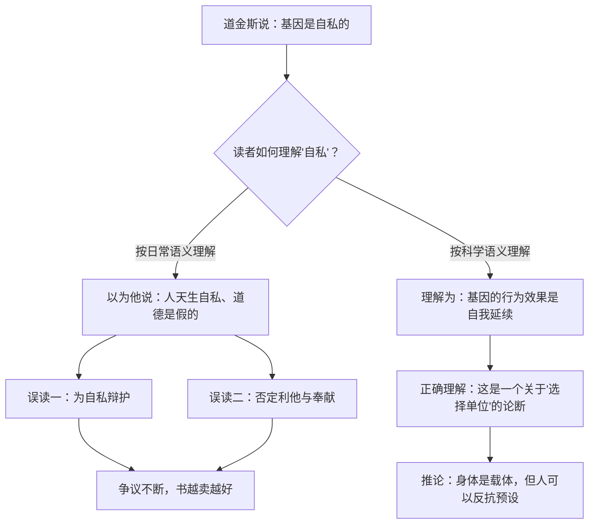

# 01｜《自私的基因》究竟在说什么？——一个被误读了四十年的书名

> 「自私的基因」里的「自私」，到底指谁自私？为什么这个书名会被反复误解？

---

## 一、先说结论

先说最重要的一件事：**「自私的基因」不是「自私的人」。**

道金斯说的「自私」，描述的是**基因在演化中的行为效果**——一个能在复制竞争中胜出的基因，必然表现得像是一个只关心自己能否延续下去的东西。它不是在说人天生自私，更不是在为自私行为提供科学辩护。

恰恰相反。在这本书的最后，道金斯写下了一句被引用了几十年的话，大意是：

> **我们是地球上唯一能够反抗自私复制因子暴政的生物。**

所以这本书真正的主题不是「人有多坏」，而是一个更冷峻、也更有力量的问题：**如果我们是被基因造出来的机器，我们还有没有可能不被它完全支配？**

---

## 二、我们先理解一个问题

先看一个几乎所有人都听说过的误用。

在职场里、在饭桌上、在商业报道里，你大概听过类似的话：

> 「人都是自私的，这是基因决定的，所以别谈什么理想主义。」
>
> 「《自私的基因》都说了，利他不过是伪装的自私，所以谈奉献都是虚伪。」

这些说法听起来像是「引用了一本科学名著」，但它们其实**完全说反了这本书的意思**。

问题来了：

> 如果作者本意根本不是这个，为什么这本书会被这样反复误读四十年？

---

## 三、作者到底提出了什么观点？

要理解这本书，先要理解道金斯真正在问的问题。

**第一，他问的不是「人为什么自私」，而是「自然选择到底在选择什么」。**

在他之前，很多人习惯用「为了物种的延续」「为了群体的利益」来解释生物行为。道金斯认为这种说法含糊、甚至错误。他主张：**自然选择真正筛选的单位，是基因。**

**第二，基因没有意识，也没有「自私」这种心理状态。**

道金斯用「自私」这个词，是一种**拟人化的 shorthand**。就像我们说「河流奔向了海」，不是说河有愿望，而是在描述一种趋势。基因不会算计，它只是恰好那些「表现得像只关心自己复制」的基因，在竞争中活了下来。

**第三，从这个视角看，身体有了新的定位。**

身体是基因建造的「生存机器」，是它延续自己的载体。所以我们不是基因的主人，而是它的船。这个说法听起来很刺耳，但它是理解全书所有行为的钥匙。

**第四，也是最重要的：这个描述不是宿命。**

道金斯明确说，人类因为拥有意识与文化，具备了**反抗**这种基因预设的可能。他知道基因给了我们什么倾向，因此可以选择不服从。

---

## 四、把这个观点翻译成人话

我们用一个非常日常的类比。

假设你手机里装了一个 App。这个 App 的唯一目标是「让自己被更多人安装」。为此它会设计各种机制：诱导分享、制造焦虑、让你上瘾、不停地推送。

现在问一句：「这个 App 自私吗？」

严格说，**App 没有情绪，也没有道德**。说它「自私」，只是在描述它的行为效果：它的一切设计，最终都服务于自己的扩散。

**「自私的基因」里的「自私」，就是这种意义上的自私。**

它不是「基因是个坏蛋」，而是「基因的行为效果，看起来就像只顾自己」。

再进一步：

- 你不是 App，你是**手机**。App 在你上面运行，用你的电量、你的网络、你的注意力活下来并扩散开去；
- 你可能会误以为「是我想刷手机」，但其实是那套机制在你身上起作用；
- 而如果你看清楚了这套机制，你就有可能手动关掉推送、限制使用时长——**这就是道金斯说的「反抗」**。

**看清 App 想干什么，是你摆脱它的第一步。** 这正是这本书的写作意图。

---

## 五、为什么会这样？

为什么这个书名会引发如此一致的误读？可以用一张图解释误读是怎么发生的。

误读的根源，有三个：

**第一，日常语言和科学语言的碰撞。**

「自私」在日常生活里是一个道德评价词。道金斯把它用作一个技术性描述。同一个词，两种用法，几乎必然造成误解。

**第二，读者往往只读标题和二手转述。**

这本书最有名的恰恰是书名，而真正关键的「反抗」那一句，在书的最末尾。**大多数人只带走了一个词，没有走到最后。**

**第三，这个词对某些立场太有用。**

「基因决定了人就是自私的」——这句话对懒于自我要求的人、对想为不当行为开脱的人、对某些意识形态都太好用了。**一个可以被利用的误读，往往比一个准确的表述传播得更快。**

**而道金斯本人，其实早就预见到了这个问题。**

在 30 周年版的前言里，他坦言这个书名给读者留下了不恰当的印象。他说，回想起来，当初也许应该听取他的编辑汤姆·麦奇勒的建议，改叫**《永恒的基因》（The Immortal Gene）**。

这个细节很有意思：**如果当年用了这个名字，「自私」和「利他」的争论可能根本不会那么激烈——但这本书大概也不会卖得这么好。**

---

## 六、举一个现实生活中的例子

我们看一个很多人都遇到过的场景：**一个母亲为孩子放弃了自己的事业。**

这件事怎么解释？不同的框架给出了完全不同的答案。

**日常道德框架**：母爱是伟大的、无私的，这是人性中最美好的部分。

**粗糙的社会达尔文主义框架**：「看，连母爱都是基因的自私在驱动，所以根本没有真正的无私。」——这是典型的误读。

**道金斯的框架**：

- 孩子身上带着母亲基因的拷贝，各占一半；
- 母亲放弃事业去照顾孩子，从基因的视角看，这是它延续自己的一种方式；
- 所以这个行为在**基因层面**是「自我服务」的；
- 但在**人的层面**，这位母亲的爱是真实的，她的选择是真实的，她的痛苦也是真实的。

注意最后两条：**这两句话并不矛盾。**

说基因的行为效果是自私的，并不等于说这位母亲的爱是假的。就好像说「心脏的作用是泵血」，并不等于说「这个人不真诚」。

**混淆这两个层面，就是四十年来最主流的那种误读。**

再举一个反面例子：

假如有一位母亲，为了一个与自己毫无血缘关系的陌生孩子，放弃事业并终身抚养他——这在道金斯的框架里叫**「真正的利他」**，因为它在基因层面算不平账。

而这种行为，恰恰在人类身上反复出现。**这本身就说明了：人类并不完全服从基因的逻辑。**

---

## 七、回到书中重新理解

现在再回到道金斯的第一章「为什么会有人呢？」，就能读懂他的开场意图。

他没有从「人为什么坏」开始，而是问了一个更根本的问题：**为什么会存在「人」这种复杂的东西？**

他的回答是：因为基因需要载体。复杂如人的身体，是基因为了更有效地复制自己而建造出来的精密机器。第一章的这个提问方式，已经埋下了全书的整个视角。

而在第三章的结尾，他说出了那句著名的话——我们以及其他一切动物，都是各自基因所创造的机器，被在暗中编好了程序，去保养那些叫做基因的自私分子。

**但紧接着，他补上了转折：**

> 在这个世界上，只有我们，能够反抗自私的复制因子的暴政。

**这个转折，才是这本书真正的立场。**

---

## 八、这个观点背后还有什么？

**隐含前提一：自然选择可以追溯到一个更基本的单位。**

道金斯假设「基因是选择单位」这个论断是可检验的。事实上，这在演化生物学界至今仍有争论（详见第 23、24 篇）。

**隐含前提二：用「自私」这个词是恰当的。**

这一点连道金斯自己都犹豫过——他后悔没换书名。**一个需要用四十年去澄清的比喻，本身就说明它在传播上有缺陷。**

**隐含前提三：理解机制能够带来自由。**

这是道金斯的价值观主张，而不是科学结论。**「看清了就能反抗」是一种信念，它需要被论证，而不能被假定。**

**与其他观点的联系：**
- 第 02 篇会讲清楚「为什么选择单位要下移到基因」；
- 第 11 篇会讲清楚「表面利他」和「真正利他」的区别；
- 第 21 篇会专门讨论「反抗基因」这个立场的来龙去脉。

---

## 九、这个观点有问题吗？

有，而且质疑相当集中。

**第一，书名本身就是一个传播事故。**

道金斯承认了这一点。一个核心概念如果必须靠四十年的反复澄清才能被正确理解，那么它在表达上一定失败了。**这提醒我们：重要的不是作者想说什么，而是读者会以为他在说什么。**

**第二，「基因中心视角」被批评为过度简化。**

批评者认为，发育过程、环境作用、群体动态、表观遗传等因素都被压缩了。**把所有行为都追溯到「基因的利益」，容易让人产生一种「一切都是基因安排好的」的错觉。** 道金斯后来专门写了两章澄清（见第 24 篇）。

**第三，这本书的语言太有感染力，这既是优点也是缺点。**

道金斯是极好的写作者，他的比喻生动、锋利、令人难忘。**但正是这些比喻，比如「生存机器」「自私的分子」，最容易被断章取义。** 好文笔在这里变成了双刃剑。

**第四，「反抗」这个立场在科学上其实是外搭的。**

演化生物学描述的是「是什么」。道金斯在末尾谈「我们可以选择不服从」，这是一个**价值选择**，而不是科学推论。**它很有力量，但它不属于科学论证的一部分。**

---

## 十、今天再看这个观点

「自私的基因」这个词，今天的使用频率比任何时候都高——但误读率大概也一样高。

在社交媒体上，它经常被用来做两件事：

- **解释一切**：人为什么出轨？人为什么贪财？人为什么内卷？——「基因决定的。」
- **开脱一切**：「人性如此，别苛求。」

有意思的是，这种用法的逻辑，正好和道金斯相反。

道金斯说的是：**基因给了你倾向，但这恰恰是你可以识别并抵抗的东西。** 而流行的用法是：**基因给了你倾向，所以你不必负责。**

这两者之间的距离，就是「科学」和「借口」之间的距离。

在 AI 时代，这个区分变得更重要了。因为今天我们面对的已经不是「基因设定」，而是「算法设定」：推荐系统、模型微调、产品机制，都在我们身上起作用，塑造我们的注意力和偏好。

**「看清机制，然后决定是否服从」**——这个道金斯四十年前提出的姿态，可能正是我们今天最需要的能力。

这是**基于道金斯思想的现代延伸**，不是他书中的原话。

---

## 十一、这一篇真正应该记住什么？

1. **「自私的基因」说的是基因的行为效果，不是人的道德品质。**
2. **道金斯的结论不是「人天生自私」，而是「人是唯一能反抗自私复制因子的生物」。**
3. **误读的根源：日常词义与科学词义的碰撞，加上大多数人只读标题。**
4. **道金斯自己后悔了这个书名——他更想叫《永恒的基因》。**
5. **说「基因层面是自利的」，不等于说「人的爱是假的」。这两个层面不能混淆。**

---

## 十二、留一个问题

> 如果一位母亲的爱，在基因层面可以被解释为「自私的延续」，那么这份爱还「真诚」吗？
>
> 再深一层：**如果一件事可以被解释，它是否就不再珍贵了？**
>
> 下一篇，我们来看这个视角真正的革命之处——**为什么道金斯要把「自然选择的单位」从个体下移到基因？** 这一步，为什么改变了一切。
