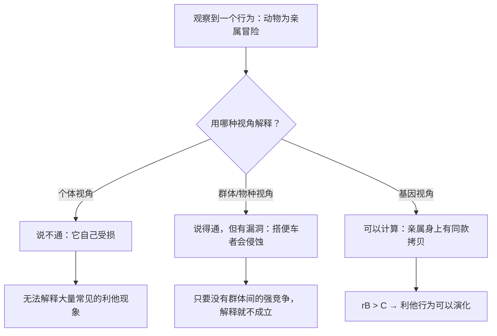

# 02｜为什么要把视角从「个体」换成「基因」？——一场关于「选择单位」的革命

> 为什么不用「个体生存」「物种延续」来解释演化，非要下移到基因？

---

## 一、先说结论

在道金斯之前，人们解释生物行为时常用两种说法：

- **个体视角**：动物拼命，是为了自己活下来、多生孩子；
- **物种/群体视角**：动物牺牲，是为了整个物种的延续。

道金斯说这两种都不够好，尤其是第二种，几乎总是错的。他的方案是把选择单位**下移到基因**：

> **自然选择筛选的不是物种，不是群体，通常也不是个体，而是基因——那些能让自己在基因池里变得更多的复制因子。**

这个转向之所以是革命性的，是因为它一下子解释了很多「个体视角说不通、群体视角说不清」的现象。

---

## 二、我们先理解一个问题

先看一个让早期演化论者极其头疼的现象：**工蜂自杀式地蜇人。**

蜜蜂蜇人会把自己的内脏撕出来，当场死去。它为什么愿意为蜂群做这种「自杀式防御」？

**用个体视角解释**：说不通。它死了，它自己的基因就传不下去了。

**用群体视角解释**：可以说通——「为了保护整个蜂群」。听起来很合理。

那问题来了：

> 如果群体视角能解释，为什么道金斯说它「几乎总是错的」？

---

## 三、作者到底提出了什么观点？

道金斯的论证可以拆成四点。

**第一，群体选择论有一个致命的漏洞：搭便车。**

假设一个群体里有「愿意牺牲的个体」和「只顾自己的个体」。牺牲者死了，自私者活着并且繁殖。**于是在这个群体内部，自私者的比例会一代代上升。** 就算群体之间真的存在竞争，群体内部的这种侵蚀也会一直持续。

道金斯有一句很锋利的话，大意是：**一个物种如果内部充满自私的个体，它比一个内部充满利他个体的物种更难被淘汰——因为自私的个体会活下去并繁殖。**

**第二，个体视角也有问题：很多行为在个体层面是「亏本」的。**

最典型的就是照顾后代、照顾亲属、甚至为亲属去死。这些行为让个体付出代价，却在自然界极其普遍。

**第三，基因视角能同时解释这两类现象。**

- 当基因让个体照顾自己 → 个体活下来，基因被复制；
- 当基因让个体照顾亲属 → 亲属身上的同款基因被复制；
- 当基因让个体为群体牺牲（且没有亲属在场）→ 这个基因反而会减少。

**关键不是「行为服务于谁」，而是「行为让哪一份基因拷贝变多了」。**

**第四，所以选择单位是「基因的拷贝」，不是「装着基因的身体」。**

身体是暂时的容器，基因是跨越世代的信息。**道金斯说：个体是「载体的载体的载体」——真正的连续体是基因。**

---

## 四、把这个观点翻译成人话

我们用投资来类比，会非常清楚。

假设你持有一家公司的股票。

- **个体视角**：你希望这家公司活下去。但这家公司是会破产、会倒闭的；
- **群体视角**：你希望整个行业好。但你的收益和整个行业没直接关系；
- **基因视角**：你真正关心的是「我持有的这份股票权益能不能一直在复制、繁衍」。

现在关键来了：**如果你同时在多家公司都有同样的股份，你会怎么选？**

你当然会优先投资那些「能让你这份权益变多」的地方——哪怕那意味着牺牲其中一家公司。

**基因也是一样。** 它在很多身体里都有拷贝。所以当它「决定」牺牲某一只工蜂、某一位母亲、某一个哥哥时，它算的不是「这个身体划不划算」，而是「我这份拷贝的总体收益」。

再换一个更日常的比喻：

> **你不是你的形象。基因也不是它的载体。**
>
> 你换一部手机，你的微信账号不会消失。基因换一具身体，它的「信息」也不会消失。

所以道金斯才说，**基因是「不朽的」（第 04 篇会展开），而身体是会过期的。** 一旦接受这个类比，很多「牺牲」就不再是谜。

---

## 五、为什么会这样？

为什么「选择单位下移」这一步如此关键？用一张图看三种视角的差别。

三个视角的差别，本质上是**「收益归属谁」**的差别：

| 视角 | 谁受益 | 能否解释亲属利他 | 能否抵御搭便车 |
|---|---|---|---|
| 个体 | 这个身体 | 不能 | 可以 |
| 群体 / 物种 | 整个群体 | 能（但含糊） | **不能** |
| 基因 | 基因的拷贝 | 能（可计算） | 可以 |

道金斯的主张是：**只有基因视角同时满足了「能解释利他」和「能抵御搭便车」这两个要求。**

这也解释了为什么「群体选择」在他的批评里处境最差——它看起来很有道德感染力（「为了集体」），但在逻辑上最脆弱。

**要说明的是**：现代演化生物学对「群体选择」的态度，比道金斯写作时更复杂。一些学者认为，在特定条件下（群体间差异大、迁移少），群体层面的选择也能产生真实的效应。这一争论至今没有完全结束（第 23 篇会讨论）。

---

## 六、举一个现实生活中的例子

我们看一个特别贴切的现代类比：**一家公司的「事业群」与「公司整体」。**

假设一家大公司有两个事业群 A 和 B。

**事业群视角（≈ 个体视角）**：A 群只想自己业绩好，不管公司整体。这很自然，但会在公司内部争资源。

**公司视角（≈ 群体视角）**：希望整体利益最大化。听起来对，但有个问题——**如果公司要求 A 群牺牲自己去补 B 群，A 群里的人会怎么做？** 他们会消极执行、阳奉阴违、甚至跳槽。**这就是「搭便车」的组织版本**：牺牲的人受损，不牺牲的人获益，于是「不牺牲」的行为在公司内部扩散。

**股东视角（≈ 基因视角）**：假设你自己同时持有 A 群和 B 群的股份。你关心的不是 A 或 B 谁赢，而是**你的总权益**。

于是你的决策逻辑就变了：

- 如果让 A 牺牲能换来整体更大的收益，你支持；
- 如果 A 只是被 B 占便宜，你反对；
- 你会去查：A 的牺牲，到底换来了什么？

**这正是基因在做的事。** 它不关心具体是哪一具身体，它只关心「我的这份拷贝总量有没有变多」。

所以道金斯说的「自私」，落实到计算层面，其实是一种**冷酷的会计**：算的是期望收益，不是道义。

---

## 七、回到书中重新理解

现在回到第一章「为什么会有人呢？」，道金斯的开篇就变得非常清晰了。

他明确表示，他要在书里反驳一种流行的观念：**「物种利益」或「群体利益」是演化的目标。** 他认为这是含糊、错误、而且容易被误用的。

他也坦率地说，他在这本书里的立场，是继承自乔治·威廉斯的《适应与自然选择》和汉密尔顿的亲缘理论——**把选择的单位严格地放在基因层面。**

同时，他做了一件很聪明的事：**他并不否认「个体」和「群体」是真实存在的。** 他只是说，它们不是**选择的单位**。

- 个体是真实存在的（它是载体）；
- 群体是真实存在的（它是基因池的边界）；
- 但**演化积累的改变，发生在基因频率的层面。**

这个区分，正是全书所有论证的地基。

---

## 八、这个观点背后还有什么？

**隐含前提一：基因是清晰可界定的单位。**

「一个基因」其实比想象中模糊——它有重叠、有调控、有连锁。**道金斯用的是「基因」的一种理想化定义：一段足够稳定、能跨越世代被完整拷贝的遗传单位。**

**隐含前提二：基因与表现型之间是清晰的因果链。**

现实中，一个性状往往受大量基因影响，也存在表观遗传与环境交互。**「基因决定某个行为」在大多数情况下是一种简化。**

**隐含前提三：长期视角。**

基因视角假设「足够多的世代」。在短时间尺度上，个体和群体的效应可能更明显。

**与其他观点的联系：**
- 第 03 篇会讲「复制因子」是怎么诞生的，那是这一条的历史起点；
- 第 09 篇的汉密尔顿法则，是「基因视角」最漂亮的数学化；
- 第 11 篇会正面处理「群体选择」的争议；
- 第 23、24 篇会讨论这一视角受到的批评。

---

## 九、这个观点有问题吗？

有，而且这一条是演化生物学里最持久的争论之一。

**第一，「群体选择」并没有被一劳永逸地淘汰。**

道金斯在 1976 年对群体选择的批评非常有力。但此后几十年，包括戴维·斯隆·威尔逊在内的学者提出：**多层次选择**（multilevel selection）是更准确的框架——选择和演化可以同时发生在基因、个体、群体甚至物种多个层面。**今天的共识更接近「多层次」，而不是「只有基因」**，虽然基因层面的解释仍然是最精确的工具。

**第二，「基因是自私的」这个表述容易造成「基因有目的」的错觉。**

严格地说，基因没有目标。所谓「自私」，是用效果反推的一个隐喻。**这个隐喻在传播上的代价，我们已经在第 01 篇看到了。**

**第三，「下移到基因」可能忽略了个体的不可替代性。**

从基因的账本看，一个身体可以被替换；但从人的角度看，**每一个身体都是唯一的、不可复制的**。这种「会计视角」在解释行为时有力，在面对生命价值时则显得冷漠。

**第四，这个框架对「复杂系统」的处理能力有限。**

在解释单个行为（如工蜂蜇人）时，基因视角非常锋利；但解释整个生态系统、社会结构、文化现象时，它就显得不够用了。

---

## 十、今天再看这个观点

「选择单位」这个问题的现代版本，其实换了个领域出现了：**我们今天也在争论，算法时代「选择」的单位是什么。**

- 是**用户**吗？——不完全是，用户会疲劳、会流失；
- 是**平台**吗？——不完全是，平台也会倒闭；
- 是**内容**吗？——不完全是；
- 是**推荐模型的参数**吗？这才是真正被反复筛选、优化、留存下来的东西。

如果按道金斯的说法，那答案很可能是：**被选择的单位，是那些能在系统里被反复复制和强化的最小单元。**

在企业里，这可能是一个流程、一个 KPI、一条话术；在内容生态里，这可能是一种「爆款结构」。

**「谁在被筛选」这个问题，比「谁看起来在赢」更重要。** 这大概是「选择单位」这个思路在今天最有价值的迁移。

这是**基于道金斯思想的现代延伸**，不是他书中的原话。

---

## 十一、这一篇真正应该记住什么？

1. **选择的单位是基因，不是物种，通常也不是个体。**
2. **群体选择论最大的漏洞是「搭便车」：自私者会在群体内部持续扩散。**
3. **基因不关心具体哪一具身体，它只关心「我的拷贝总量有没有变多」。**
4. **这个视角能同时解释「自私」与「利他」，这是它的力量所在。**
5. **现代生物学更倾向于「多层次选择」——基因视角有力，但不是唯一的解释框架。**

---

## 十二、留一个问题

> 如果一位母亲照顾孩子，本质上是「基因在扩大自己的拷贝」——那么她的辛苦，究竟是为了孩子，还是为了基因？
>
> 如果这两件事在你的体验里是同一件事，那「为了谁」这个问题，还成立吗？
>
> 下一篇，我们回到时间的起点——**在还没有任何生命的海洋里，第一个会自我复制的东西，是怎么出现的？**
