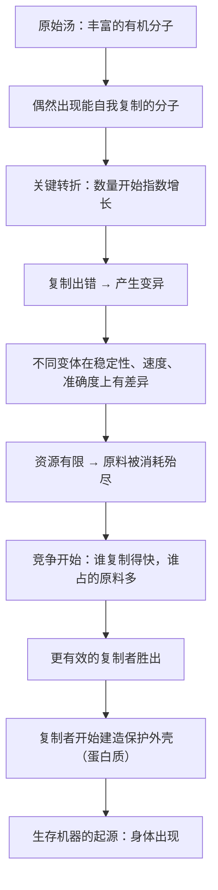

# 03｜生命是从哪里开始的？——复制因子与「原始汤」

> 在完全没有生命的海洋里，怎么会诞生出第一个会自我复制的东西？

---

## 一、先说结论

道金斯认为，要理解「自私」，必须先理解「复制」这件事是怎么开始的。

他的设想是这样的：

> **在早期的地球海洋里（他称之为「原始汤」），偶然出现了一些能够自我复制的分子。一旦出现，就形成了一个必然的结果——复制得越快、越准、越稳定的分子，数量就越多。**

这些最早的复制者，道金斯给它们起了一个贯穿全书的名字：**复制因子（replicator）**。

关键洞察是：

> **达尔文的「生存竞争」，并不只发生在狮子与羚羊之间，它在分子层面就已经开始了。**

而今天所有的生命——包括我们——都是这场分子级竞争的后续产物。

---

## 二、我们先理解一个问题

先看一个看似简单、其实极难的问题。

如果你把一堆化学物质放在一个池子里，然后放上几亿年，会发生什么？

答案当然是：什么都不会发生——除非**碰巧出现了一个能自我复制的东西。**

现在，真正的问题是：

> 为什么「自我复制」这个属性，会让整个池子从此再也回不到从前？

---

## 三、作者到底提出了什么观点？

道金斯的第二阶段论证，可以拆成五步。

**第一，原始汤里可以出现「偶然的复制」。**

他设想，在富含有机分子的原始海洋中，某些分子偶然具备了「吸引周围同类分子、把自己拼起来」的能力。这种复制是粗糙的、会出错的，但**它是复制**。

**第二，一旦能复制，就立刻进入「稳定者生存」的筛选。**

道金斯用了一个极其精炼的说法：**稳定者生存（the survival of the stable）。** 这不是说「强者生存」，而是说：在这个池子里，能稳定存在、能被反复造出来的东西，会越来越多。

**第三，复制会有误差，而误差就是变异。**

复制不精确，产生的新分子就略有不同。有些更稳定、有些复制得更快、有些复制得更准。**于是「自然选择」的原材料，在完全无意识的情况下被制造出来了。**

**第四，竞争的资源是有限的。**

制造新分子需要的「建筑材料」会被消耗掉。于是复制者之间开始竞争原料，**谁复制得快，谁就占据更多原料。**

**第五，复制者开始「建造容器」。**

道金斯说，复制因子后来演化出了蛋白质外壳——**这就是「生存机器」的起源**。它不再只是裸露的一段分子，而是带着自己的保护层、工具和武器。**身体，从这一刻开始出现。**

---

## 四、把这个观点翻译成人话

我们用一个特别形象的类比：**一款会自我复制的 App。**

假设某个程序员随手写了一段小脚本，它的功能只有一个：**复制自己并运行。**

会发生什么？

1. 只有一份 → 变成两份 → 四份 → 八份……
2. 复制的过程中会出错，于是出现变体：有的复制更快，有的更容易被杀毒软件发现，有的会偷偷改自己；
3. 复制得更快的那个版本，很快就在系统里占据大多数；
4. 由于 CPU 和内存是有限的，脚本之间开始互相挤占资源；
5. 最后，成功的脚本演化出了各种「外挂」——隐藏自己的代码、伪装成系统进程、甚至给自己加个界面骗用户点击。

**「原始汤」就是那个系统，「复制因子」就是那段脚本。**

注意这个类比揭示了几个关键点：

- **不需要有谁设计**，只要有「复制 + 变异 + 资源有限」这三件事，竞争和演化就会自动发生；
- **「自私」在这里的意思就是「倾向于让自己变多」**，它完全不需要有意识；
- **后来的所有复杂结构（保护壳、外挂、界面）都是手段**，目的只有一个：让复制继续。

这也是道金斯说「稳定者生存」的含义——**不是最强的活下来，而是最稳定、最能被重复造出来的活下来。**

---

## 五、为什么会这样？

为什么「复制」这个属性，会让整个世界彻底改变？用一张图看这个不可逆的过程。

这里有几个非常值得注意的推论：

**第一，「复制」一旦开始，就不可逆。**

在复制出现之前，池子是一个化学平衡系统，一切都会缓慢地回归平衡。**复制出现之后，出现了一种「自我放大」的机制**——它不再服从平衡，而是持续扩张。这就是生命的开端与化学的分水岭。

**第二，变异不需要被设计。**

复制不精确，本身就是变异的来源。**不需要任何「想改进」的力量，改进会自动发生**——因为差的版本会被淘汰。

**第三，竞争是复制必然带来的结果。**

只要资源有限、复制持续，竞争就是内生的，不是谁选择的。**这解释了为什么「自私」在道金斯的框架里是一个默认状态，而不是一种道德败坏。**

**第四，身体是「手段」而不是「目的」。**

这是最反直觉的一点：**在道金斯的叙事里，身体不是起点，而是结果。** 它是复制者为了解决「如何在恶劣环境中活得更久」这个问题，而发明出来的一种工具。

---

## 六、举一个现实生活中的例子

我们看一个更贴近今天、也更能说明问题的例子：**一段病毒的传播。**

一个病毒本质上是什么？——**一小段遗传信息 + 一个外壳 + 一套侵入宿主并复制自己的机制。**

把它和道金斯的复制因子对比：

| 复制因子模型 | 病毒 |
|---|---|
| 能在环境中自我复制 | 必须借助宿主细胞的机制复制 |
| 复制会出错 | 变异快（尤其 RNA 病毒） |
| 资源有限 → 竞争 | 竞争宿主、竞争传播途径 |
| 演化出「外壳」保护自己 | 有蛋白质衣壳，有些还有脂质包膜 |
| 更好地复制者胜出 | 传播力强的变体占据主流 |

**你会发现：整个病毒的故事，几乎是「复制因子」理论的现实版本。**

而且这里还有一个更耐人寻味的观察：

病毒是「自私」的吗？它没有意识，也没有恶意。**它只是在执行一段「复制」的程序。** 但它造成的后果，可以是致命的。

**「没有恶意，却造成伤害」——这正是道金斯想让我们理解的「基因的自私」的性质。**

再延伸一步：

病毒从来不为宿主的利益服务。它甚至会改造宿主的行为（有些寄生虫会操控宿主行为，第 22 篇会专门讲）。**宿主只是它复制的工具和交通工具。**

这不是感情判断，而是结构描述。

---

## 七、回到书中重新理解

现在回到第二章「复制基因」，道金斯的原始表述就变得非常清楚了。

他写的其实是这么一个场景：

> 在大约几十亿年前，海洋里充满了简单的有机分子。某个时刻，一种特殊的分子出现了——它能够做一件此前从未有的事：**制造自己的副本。**

他特别强调，这个过程**不需要任何目的、任何设计、任何意识**。它只是「化学上恰好可以发生」。

然后他说了那句关键的话大意是：**一旦复制因子出现，它就会自动开始一种全新的竞争——不是对食物的竞争，而是对「存在」本身的竞争。**

而这本书后面所有关于「自私」「利他」「策略」的内容，都是建立在这一章之上的。

**也就是说：道金斯在讲任何道德讨论之前，先把「自私」的来源锁定在了分子层面。** 它不是从人类社会学的，而是从「复制」这个物理事实里长出来的。

---

## 八、这个观点背后还有什么？

**隐含前提一：原始汤的条件是可能的。**

这是科学家至今仍在研究的领域（RNA 世界假说等）。**道金斯的描述是「一种可能」，而不是确定的化学史。** 他自己也承认这一点。

**隐含前提二：「复制」是界定生命的关键属性。**

现代生物学对「生命」的界定更复杂（代谢、信息、边界、演化能力等）。**道金斯选择「复制」作为主线，是因为它直接通向演化论，而不是因为它穷尽了生命的全部特征。**

**隐含前提三：简单规则可以生成复杂结果。**

这是道金斯整个思路的底层信念：**复制 + 变异 + 选择，三件事就能生成我看到的一切。** 这个信念在计算领域（如人工生命、遗传算法）得到了大量验证。

**与其他观点的联系：**
- 第 02 篇解释了为什么选择单位是基因——这一篇解释了「基因这种东西是怎么出现的」；
- 第 04 篇会讲复制因子为什么能「不朽」；
- 第 05 篇会讲复制因子如何造出「生存机器」。

---

## 九、这个观点有问题吗？

有，主要体现在几个方面。

**第一，这是「合理的故事」，而不是「确认的史实」。**

道金斯本人也承认，关于生命起源，我们有的主要是逻辑上自洽的推测。**「原始汤 + 偶然自复制」是一个漂亮的模型，但它并不能被直接观察到。**

**第二，「稳定者生存」的说法可能过于宽泛。**

「稳定者生存」几乎可以被用来解释任何事——因为任何活下来的东西，都可以被说成是「稳定的」。**一个不能被证伪的表述，在解释力上就会打折扣。**

**第三，从「分子复制」到「生物体」之间，是巨大的跳跃。**

复制子如何演化出代谢系统、细胞膜、遗传密码、蛋白质合成机制——这中间是一系列极其复杂的事件。**道金斯用一章就把它们带过了，这掩盖了大量未解之谜。**

**第四，「自私」这个词在分子层面使用，可能加剧了拟人化。**

说一段分子「自私」，在修辞上很有力，但也最容易让读者以为分子有意图。**这正是第 01 篇讲的那个误读的源头之一。**

---

## 十、今天再看这个观点

「复制因子」这个思路，在今天最有意思的对应物就是**计算机病毒与自我复制代码。**

- 它们是人类第一次**完整观察**到「复制 + 变异 + 选择」的全过程，而且速度快到可以在几小时内看到演化；
- 恶意软件的演化史，几乎是一部微缩版的「生命起源史」：从简单复制，到变异对抗杀毒软件，到演化出隐蔽、传播、甚至「寄生」在正常程序里的复杂策略；
- 更近的例子是：**提示词注入、自动化 Agent、模型自我改进**——都带上了「复制与变异」的味道。

道金斯在书里也专门指出：**复制因子不必是碳基的。** 只要是能被复制、变异、选择的信息单元，都可以进入演化过程。

这一点，在 1976 年只是理论上的可能性；今天，它已经变成了日常现实。

这是**基于道金斯思想的现代延伸**，不是他书中的原话。

---

## 十一、这一篇真正应该记住什么？

1. **复制因子是一段能够自我复制的分子，它是所有生命的起点。**
2. **「复制 + 变异 + 资源有限 → 竞争」这个循环一旦启动，就不可逆。**
3. **「稳定者生存」不是强者生存——能被反复造出来的东西，才会占多数。**
4. **身体（生存机器）是复制因子后来「建造」出来的工具，而不是起点。**
5. **复制因子不一定是碳基的——任何可复制、可变异的信息单元都能进入演化。**

---

## 十二、留一个问题

> 如果生命的开端只是「一段能自我复制的分子」，那么「我们应该怎样生活」这个问题，是不是从一开始就不在基因的议程里？
>
> 换句话说：**基因给了我们身体和倾向，但「意义」这件事，是从哪里来的？**
>
> 下一篇，我们来看复制因子的第一个惊人属性——**为什么它「不朽」，而承载它的身体必须死亡。**
