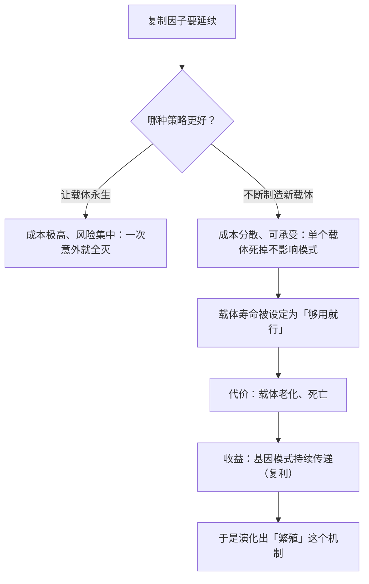

# 04｜为什么基因「不朽」，而我们的身体必须死亡？

> 身体有寿命，基因却似乎能一直活下去——这中间的差别到底在哪里？

---

## 一、先说结论

道金斯用「不朽的双螺旋」这个说法，想表达一个很容易被误解的洞见：

> **基因穿越时间的方式不是「活着」，而是「被拷贝」。**

它没有「一直活着」——它是**一次又一次地被重新制造出来**。每一代人都得到一份新的拷贝，而原件其实早已不在了。

所以真正穿越时间的，不是物质，而是**信息**。

一句话：

> **我们每个人只是基因这条长河上的一朵浪花；浪花会碎，河还在流。**

---

## 二、我们先理解一个问题

先看一个听起来很奇怪的问题。

你说：「我的鼻子长得像我的外公。」

这句话是什么意思？是有一根鼻子从外公那里传到了你脸上吗？

当然不是。外公的鼻子早就随着他的身体一起消失了。**穿过时间来到你这里的，不是鼻子，而是「如何造一个这样的鼻子」的那段说明。**

于是问题来了：

> 如果传下来的只是一份「说明」，那么「我」到底是这段说明，还是这段说明造出来的东西？

---

## 三、作者到底提出了什么观点？

道金斯关于「不朽」的论证，可以拆成四点。

**第一，基因是「拷贝」，不是「原件」。**

这是最容易被忽略的一点。我们平常说「我的基因来自父母」，听起来像是「同一批东西被传过来了」。但严格说：**在减数分裂和受精的过程中，你身体里的基因是一次全新的组合与拷贝。** 你并没有得到父母的哪个原件。

**第二，真正稳定的是「信息模式」。**

所以「不朽」的含义是：**这个信息模式被反复复制，而且保持得足够稳定。** 道金斯说，你可以把自己想象成一个「基因的临时组合」，而基因是那个一直在被复制的模式。

**第三，身体是消耗品，基因是复利。**

道金斯说，基因为了延续自己而建造了身体。身体会老化、会死——**从基因的账本看，这是可接受的成本。** 重要的是载体在死亡前，把基因传给了下一代。

**第四，所以「个体永生」这个愿望，在基因的框架里是个误解。**

基因不追求个体的永生；它追求的是**模式的不间断传递**。这也是为什么「牺牲个体以保存亲属」在演化上完全说得通——**死掉的是一个载体，活下来的是模式。**

---

## 四、把这个观点翻译成人话

我们用一个特别贴切的类比：**一份音乐的乐谱。**

贝多芬已经死了两百年。但他的《第九交响曲》今天还在被演奏。

现在问：今天乐团演奏的那个「第九交响曲」，是贝多芬写的那份吗？

不是。**乐谱被一代代抄写、印刷、重新解读。今天的演奏是新的声音、新的乐团、新的乐器。** 穿越两百年来到我们这里的，不是那些音符的墨迹，而是**那个信息模式**。

现在再看「不朽」这个词：

- 贝多芬死了（载体消失）；
- 但「第九」这个模式，只要还有人愿意演奏，就一直在；
- 每一次演奏，都是一次新的拷贝。

**基因完全一样。**

- 你的祖父死了，他的身体回到了元素；
- 但他身上那套「造一个高鼻子」的说明，在你身上被执行了一次；
- 你身上并没有他身上的物质，你只是**那份说明的一次新执行**。

反过来看「死亡」：

> **死亡不是模式的终结，而是这个特定载体的终结。**

也就是说——**你之所以珍贵，恰恰因为你是独一无二的这一份组合，而不是因为你能永生。**

---

## 五、为什么会这样？

为什么「信息不朽、载体必死」会成为生命的基本结构？用一张图看清这个逻辑。

这里有一个非常关键的推理：

**「让个体永生」在演化上其实是一个糟糕的策略。**

为什么？

- 永生需要持续修复损伤，成本极高；
- 永生意味着不能通过繁殖产生多样性，适应速度慢；
- 永生意味着一次意外就让整个谱系终结，风险集中。

相比之下，**「不断制造新的、短暂的载体」这个策略要稳健得多**：

- 每个载体只要活到能繁殖就够了；
- 死亡制造了世代更替，也就是多样性的来源；
- 单个载体的失败无关大局。

**这就是为什么死亡不是生命的「缺陷」，而是生命得以延续的机制。**

道金斯说过一个很有冲击力的说法，大意是：**身体是基因用来制造更多基因的工具，用完就可以扔掉。**

这句话听起来冷，但它精确地解释了为什么所有生物都会老化、都会死。

---

## 六、举一个现实生活中的例子

我们看一个现代社会里非常贴切的类比：**一家公司和一个项目组。**

想象你是一家公司的 CEO。

**公司视角（≈ 基因）**：公司希望自己的商业模式不断被复制、执行、扩张。
**项目组视角（≈ 身体）**：一个项目组通常寿命有限——完成一个项目后，可能被解散、重组、或者换血。

现在看几个现象：

- 为什么公司愿意「牺牲」某个项目组？因为它算的是整体；
- 为什么项目组的人觉得「公司太无情」？因为他们算的是自己；
- 为什么公司不会让一个项目组永远存在？因为**长期存在的组织会僵化、会失去适应性**；
- 为什么表现好的项目组会被「复制」？因为它的模式被推广了。

**这就是「载体必死、模式未必死」的组织版本。**

而且注意一个关键点：**公司并不是不在乎项目组。** 它需要有人愿意加入项目组，所以它会提供意义、报酬和归属感。**但没有哪个 CEO 会认为「让这个项目组永远存在」是公司的目标。**

**基因和身体的关系就是这样：有照顾，也有底线的计算。**

这不是说基因「心狠」，而是说：**结构决定了它的目标函数。**

---

## 七、回到书中重新理解

现在回到第三章「不朽的双螺旋」，你会发现道金斯那个著名比喻的真正用意。

他把 DNA 描述成一条长长的、盘旋的带子，而每一个基因只是其中的一小段。他的比喻里，我们每个人的身体，都只是这条带子在时间里的一次短暂停留。

他还提出了一个非常重要的概念区分：**「复制者」（replicator）与「载体」（vehicle）**。

- **复制者**：基因，追求被复制；
- **载体**：身体，被造出来服务于复制。

**这两个概念的分离，是全书最关键的骨架。**

而「不朽」这个说法，其实是在强调：**在演化这场长跑里，评判标准不是「谁活了多久」，而是「谁的模式传得远」。**

所以：

- 一只活了 100 岁但没有后代的动物，在基因的账本上是「失败」的；
- 一只活了 3 年但留下了 20 个后代的动物，在基因的账本上是「成功」的。

**这个标准很冷酷，但它是理解整个演化逻辑的钥匙。**

---

## 八、这个观点背后还有什么？

**隐含前提一：基因是一段足够稳定的信息模式。**

如果复制过程中信息丢失严重，「不朽」就无从谈起。**DNA 的稳定性（加上纠错机制）是这一条的物质基础。**

**隐含前提二：世代连续。**

如果繁育中断，模式就真的终结了。**「不朽」其实是有条件的——它依赖持续的传递。**

**隐含前提三：基因与载体之间有清晰的对应关系。**

「一个基因决定一个性状」在现实中并不总是成立（多基因、基因调控、表观遗传）。**道金斯用的是简化模型。**

**与其他观点的联系：**
- 第 03 篇解释了复制因子怎么来的，这一篇解释它为什么能长期存在；
- 第 05 篇会展开「生存机器」这个载体概念；
- 第 12、13 篇会用到「基因算期望收益」这个视角，去解释家庭里的投资与冲突。

---

## 九、这个观点有问题吗？

有，值得注意的有四点。

**第一，「不朽」是一个修辞，不是字面事实。**

基因也会消失（一支血脉断了、一个物种灭绝了）。**它只是相对身体而言更持久，而不是绝对不朽。** 这个说法容易让人产生「基因永远存在」的错觉。

**第二，「基因是唯一的复制者」后来被道金斯自己修正了。**

在本书的最后一章，他提出了**觅母（meme）**——文化层面的复制因子。**也就是说，「复制者」并不只有基因一种。** 这一点在第 19 篇会详细展开。

**第三，把身体完全工具化，会漏掉「体验」这一层。**

从基因视角看，身体是耗材；但从载体的第一人称视角看，**痛苦、快乐、爱、遗憾，都是真实且不可替代的。** 道金斯的框架擅长解释结构，不擅长处理体验。

**第四，这个视角容易被用来消解个体的意义。**

「你只是载体」「你只是一朵浪花」——这类说法在事实层面也许成立，**但如果被当作人生结论，就可能变成一种虚无主义的武器。** 道金斯本人在书末恰恰是走向了相反的方向：正因为我们是那个「能理解的载体」，我们才特别。

---

## 十、今天再看这个观点

在今天，「信息比载体更持久」这件事有了新的表现形式。

想一想：

- 你的相册、聊天记录、社交账号——**身体会消失，数据可能一直在；**
- 你的阅读偏好、消费记录、行为画像——**这些「模式」正在被系统反复复制、使用、交易；**
- 甚至出现了「数字永生」的讨论：用一个人的语料训练一个「像他」的模型。

**这几乎就是「不朽的双螺旋」的数字版：模式穿越时间，载体一次性地消耗。**

但这也带来一个值得警惕的对照：

**基因的延续需要你有后代；而数据的延续，不需要你活着。**

也就是说，今天真正「不朽」的，可能不是「你」，而是**关于你的那套数据模式**——而它可能被用来做你完全不同意的事。

**载体必死，模式永生；但模式的支配者，未必是你。**

这是**基于道金斯思想的现代延伸**，他在书中并未讨论这些问题。

---

## 十一、这一篇真正应该记住什么？

1. **基因穿越时间的方式不是「活着」，而是「被一次次拷贝」。**
2. **真正不朽的是信息模式，不是物质；你的身体里没有外祖父的任何原件。**
3. **死亡不是生命的缺陷，而是多样性、适应与延续的机制。**
4. **演化评判的标准不是「活了多久」，而是「模式传得多远」。**
5. **把身体视为载体，能解释牺牲；但这不等于消解每个载体的独特价值。**

---

## 十二、留一个问题

> 如果「你」是一段被反复执行的信息模式，而不是一堆持续存在的物质——那么「你」是在什么时候开始的？又会在什么时候结束？
>
> 再想一层：**如果模式可以活下去，而载体必须死去，你会更想保护哪一个？**
>
> 下一篇，我们来看这段模式究竟造出了什么——**「生存机器」：身体到底是什么，它是怎么被建出来的。**
