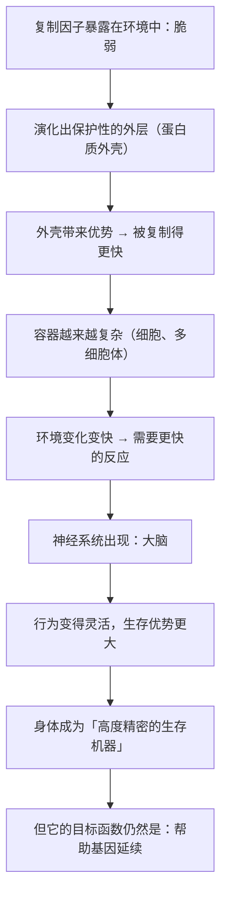

# 05｜我们到底是什么？——「生存机器」与载体的隐喻

> 如果我们只是基因的载体，那「我们」在演化里扮演什么角色？

---

## 一、先说结论

道金斯给出的答案，是全书最刺耳、也最容易被误解的一句话：

> **我们以及其他一切动物，都是各自基因所创造的「生存机器」。**

这句话的意思不是「你没有价值」，而是一个关于**分工**的判断：

- **基因是「复制者」**：它追求的是被复制；
- **身体是「载体」**：它是被造出来的容器、交通工具、执行器。

所以道金斯说：

> **受益的最终主体是基因，不是身体。**

理解这个区分，是看懂后面所有「利他」「牺牲」「合作」讨论的前提。

---

## 二、我们先理解一个问题

先看一个奇怪的现象。

一个生物，从受精卵开始，会经历极其复杂的发育过程：细胞分裂、分化、长出器官、搭建神经系统……**整个过程极其精密，而且显然需要大量「信息」。**

现在的问题来了：

> 这些信息是从哪来的？是「你」在指挥发育，还是别的什么东西在指挥？

如果答案是「基因」，那紧接着的问题就是：

> 如果身体是基因造出来的，那么身体和基因，到底谁是谁的工具？

---

## 三、作者到底提出了什么观点？

道金斯关于「生存机器」的论证，可以拆成四点。

**第一，身体是为基因服务的「容器」。**

道金斯说，裸露的复制因子在原始汤里其实很脆弱：容易被分解、被抢走原料、被别的分子干扰。**所以成功的复制因子「发明」了一件事——给自己造一个保护壳。**

这个壳，就是最早的生存机器；复杂化之后，就是我们现在说的「生物体」。

**第二，生存机器的复杂度，取决于基因「需要」它有多复杂。**

道金斯的意思不是基因在思考，而是：**能造出更适应环境的容器的基因，会胜出。** 于是容器越来越复杂——从单细胞，到多细胞，到有神经系统的动物。

**第三，神经系统是「更快的反应装置」。**

道金斯指出，早期生物的反应是缓慢的化学式的；神经系统出现后，生物可以在毫秒级做出反应。**这让生存机器能处理更复杂、变化更快的环境。** 这是「大脑」的起源。

**第四，所以身体不是主人，而是「被设计得非常精密的工具」。**

这一点是道金斯整个体系里最冷的部分：**身体会死、会老化、会被牺牲**——因为从基因的账本看，这些都是可接受的成本。

---

## 四、把这个观点翻译成人话

我们用一个现代类比来理解：**一个游戏里的角色与操控它的玩家。**

在一款网络游戏里：

- 有一个角色（有血量、有装备、有技能）；
- 有一个玩家（在外面的真实世界里操作）。

现在看几个现象：

- **角色会「死」**——掉线、被击败、被删号。但玩家不会因为角色死了就消失；
- **角色的装备和技能，是为了让玩家更容易达成目标**——不是角色自己想要的；
- **角色越强，玩家能做的事越多**——所以玩家愿意给角色升级；
- **有时候玩家会「牺牲」一个角色**（比如用小号去探路），因为他算的是整体；

**在这个类比里：**

| 游戏世界 | 生物世界 |
|---|---|
| 角色 | 身体（生存机器） |
| 玩家 | 基因（复制者） |
| 角色死了可以重开 | 身体死了，基因传给下一代 |
| 角色被升级以服务玩家 | 身体被演化以服务复制 |

**你大概已经看出了这个类比的锋利之处，也看出了它的不舒服之处。**

因为这里有一个明显的差异：**游戏里的角色，我们不会认为它「有感受」；但生物的身体，是有感受的。**

这正是这个隐喻的争议所在，也是我们后面要处理的问题。

---

## 五、为什么会这样？

为什么「身体是工具」这个结论会从单纯的逻辑里推出来？用一张图看这个演进。

这里有一个关键的逻辑：

**演化不「想要」复杂的身体，它是被「需要」逼出来的。**

- 环境简单 → 简单的容器就够了；
- 环境复杂 → 需要能感知、判断、行动的系统；
- 于是大脑出现了。

而大脑一旦出现，就产生了一个**副作用**：**它开始能够反思「我为什么存在」。**

这就是人类的位置：

> **我们是被基因造出来的工具，但我们恰好是那种能看见自己是工具的工具。**

这个「副作用」，正是第 21 篇要讲的「反抗」的起点。

---

## 六、举一个现实生活中的例子

我们看一个很多人都有过的、非常扎心的体验：**一个上班族在职场里的自我怀疑。**

他可能想过：

> 「我每天加班、通勤、应付老板，到底是为了什么？我是不是只是公司的一个零件？」

把这个疑问和「生存机器」对照：

| 职场 | 生物世界 |
|---|---|
| 员工（零件） | 身体（载体） |
| 公司 | 基因 / 复制者 |
| 员工被要求「对齐公司目标」 | 身体被「编程」去服务复制 |
| 员工离职或被裁 | 身体死亡或不再繁殖 |
| 公司希望员工有归属感，但不会被某个员工绑死 | 基因「在意」载体的状态，但它会造新的载体 |

**你会发现，这种「我是零件」的体验，恰恰是「生存机器」这个视角带给人的典型感受。**

但这里有一个关键的分岔：

- **悲观版本**：如果我只是零件，那我努力还有意义吗？
- **道金斯版本**：正因为你能看见自己是零件，你才有可能不再是纯粹的零件。

**「看清自己是被谁定义的」，这本身就是一种解放。**

而这个分岔，正是这本书和其他「宿命论」式解读最大的区别。

---

## 七、回到书中重新理解

现在回到第三章结尾和第四章开头，道金斯的表述会更容易读懂。

他用的词是「生存机器」（survival machine），而不是「奴隶」或「傀儡」。这个措辞是有意的：

- **「机器」强调的是结构性与功能性**：它是一台被建造出来、为某个目的服务的装置；
- **它不是道德判断**，也不是价值判断。

他也明确说，他并不认为这个比喻是在贬低生命。相反，他的意思是：**你能在这里思考这个问题，本身就是演化最惊人的成就。**

再看第四章「基因机器」，他的论述从「容器」推进到了「行为」：

> **基因为了让自己的载体更适应环境，不仅造出了身体，还造出了一套「行为倾向」。**

这套倾向，就是下一章要讲的「基因机器」。

---

## 八、这个观点背后还有什么？

**隐含前提一：基因与载体之间的因果关系是单向的。**

「基因造出载体」——这个说法在发育学上简化了很多（母体效应、环境影响、随机性都存在）。**它更接近一个有用的模型，而不是完整的因果描述。**

**隐含前提二：载体的「利益」可以被简化为「繁殖成功率」。**

这是演化生物学的标准假设。但**「利益」这个词在这里已经是技术性的了**，它不等同于「幸福」或「体验」。

**隐含前提三：复杂结构必须由基因指导。**

现代生物学发现，很多结构是「发育过程中涌现」的，不完全由基因逐条指定。**基因更像是给出参数与环境条件，而不是画出一张完整图纸。**

**与其他观点的联系：**
- 第 03、04 篇交代了复制因子的来历与属性；
- 第 06 篇会把「生存机器」推进到「行为如何被影响」；
- 第 21、26 篇会回到「作为载体的人，如何获得自由」。

---

## 九、这个观点有问题吗？

有，而且这一条是最容易被误读、也最需要澄清的。

**第一，「机器」这个隐喻抹掉了「体验」。**

机器没有痛感、没有孤独、没有爱。但人都有。**如果只从「机器」的角度看，就会完全漏掉第一人称的生活。** 道金斯的方法论解释了「结构」，但没有解释「为什么会有感受」——这至今仍是意识研究的难题。

**第二，「我们只是载体」可能被误读成「生命无意义」。**

这是流传最广的一种误读。**道金斯并没有说「生命没有意义」，他只是说「基因没有给生命分配意义」。** 这两句话差别巨大：

- 「意义不是你被给予的」≠「意义不存在」。

**第三，这个框架忽略了个体的不可替代性。**

从基因的账本看，一具身体是可以被替换的；但从人的角度，**没有人可以被替换**。这个「会计视角」在解释群体行为时有力，面对个体时则显得残酷。

**第四，「载体」这个说法在文化层面可能产生负面效应。**

如果被用来论证「你只是工具」，那么它就成了一种压迫性的叙事。**这也是这本书反复被误用的原因之一。**

---

## 十、今天再看这个观点

今天「生存机器」这个说法的现代版本，其实已经悄悄换了主角。

过去是「基因把身体当机器」，现在是：

- **平台把用户当流量**；
- **算法把人当数据**；
- **商业模式把注意力当原料**。

也就是说，我们今天的处境，比道金斯描述的更复杂：**我们既是被基因造的载体，也是被平台建模的对象。**

这带来一个很现实的问题：

> **如果「载体」从基因换成了平台，那么「看清自己是谁的工具」，是不是同样是一次解放的开始？**

道金斯的原则在这里仍然适用：**不是「谁在利用你」这件事让你不自由，而是「你不知道谁在利用你」让你不自由。**

这是**基于道金斯思想的现代延伸**，不是他书中的原话。

---

## 十一、这一篇真正应该记住什么？

1. **身体是基因建造的「生存机器」，基因是复制者，身体是载体。**
2. **演化不「想要」复杂的身体，是环境「逼」出了它——大脑是副作用，也是成就。**
3. **「机器」是结构性隐喻，不是价值判断；它解释结构，但不解释体验。**
4. **「生命没有意义」是误读，道金斯说的是「意义不是被基因分配的」。**
5. **看清自己被谁定义，本身就是获得自由的第一步。**

---

## 十二、留一个问题

> 如果身体是造出来的容器，那么「你」意味着什么——是这具身体，是里面的感受，还是那套被拷贝的模式？
>
> 更重要的是：**如果你可以选择让哪一个「活下去」，你会选哪一个？**
>
> 下一篇，我们来看基因为什么不只造身体，还要造「行为」——**基因机器：基因如何影响我们做什么。**
