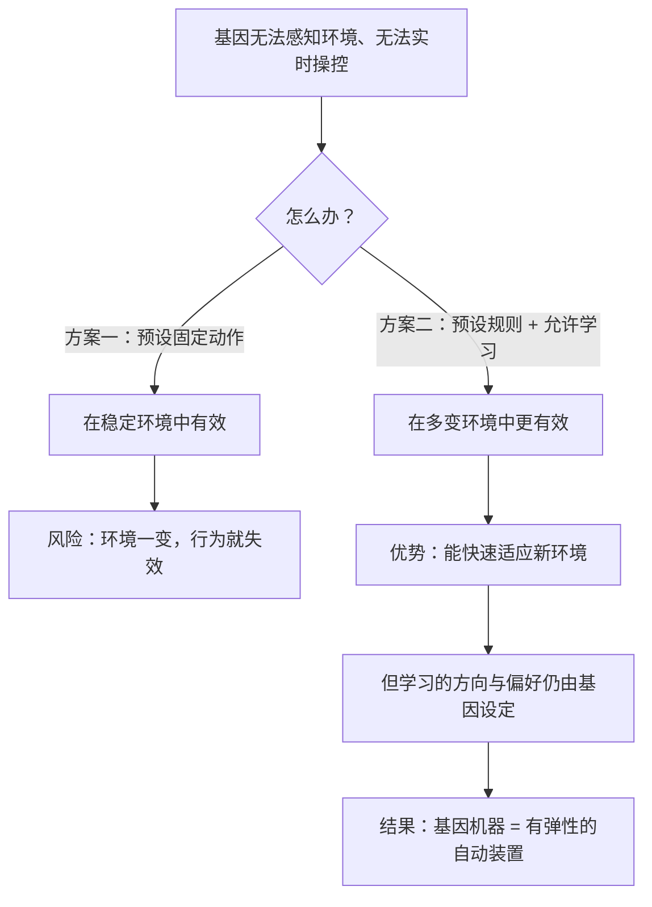

# 06｜基因远在细胞核里，怎么「指挥」我们的行为？——基因机器

> 基因不可能遥控每一个动作，那它究竟靠什么影响我们？

---

## 一、先说结论

道金斯的答案是一个极其重要的区分：

> **基因不是遥控器，而是「规则编写者」。**

它无法实时指挥你的每一个动作——因为基因在细胞核里，而你的行为发生在外面的世界。但它可以做一件更聪明的事：

> **设定你的偏好、恐惧、渴求与反应倾向，让你在具体情境中「自己」做出对它有利的选择。**

这就是「基因机器」的含义：**我们是执行预设程序的机器人，而大脑，是那台负责实时计算的计算机。**

---

## 二、我们先理解一个问题

先看一个几乎所有人都熟悉的体验。

你在深夜刷手机，明知道该睡了，但手指还在往下滑。

这时问一个有点奇怪的问题：

> 是「你」想刷，还是别的什么东西想让你刷？

如果你说「是我自己」，那再问：

> 那为什么你「明知道」不该刷，却停不下来？

**「我」和「我的行为」之间的这个裂缝，正是这一篇要讲的东西。**

---

## 三、作者到底提出了什么观点？

道金斯关于「基因机器」的论证，可以拆成五点。

**第一，行为是基因影响世界的方式。**

基因待在细胞核里，无法直接捕猎、逃跑、交配。**它唯一能施加影响的途径，是通过身体和行为。**

**第二，基因设定的是「决策规则」，不是「具体动作」。**

道金斯强调，基因不能预测每一个细节。它能做的是给出**一套在特定情境下会触发特定反应的规则**：

- 饿的时候想吃 → 但具体吃什么，由环境决定；
- 看到比自己强很多的东西会恐惧 → 但具体怕什么，是学来的；
- 面对同类会评估成本和收益 → 但具体怎么评估，依赖经验。

**第三，神经系统是「更快的计算装置」。**

道金斯指出，生物早期只有缓慢的化学式反应。神经系统出现后，反应速度从分钟级提升到毫秒级。**这让基因可以「预设」更复杂、更灵活的行为程序。** 大脑本质上是基因的「外挂计算机」。

**第四，学习能力是被基因允许的「灵活性」。**

道金斯说得很精妙：**让动物能够学习的基因，比让动物先天就会某种固定行为的基因，可能更成功。** 因为环境多变，会学比会做更重要。但注意——**「能学什么」这件事，仍然是被基因设定边界的。**

**第五，所以「本能」和「学习」不是对立，而是分层。**

不是「要么靠基因、要么靠环境」，而是：**基因设定了学习的能力、方向和优先级，学习负责填充细节。**

---

## 四、把这个观点翻译成人话

我们用一个现代人非常熟悉的类比：**一款预装了系统权限的 App。**

假设你手机上装了一个 App。它自己不能直接操作你的手机——**但它可以在你装它的时候，请求一堆权限：**

- 访问通讯录；
- 读取通知；
- 后台自启动；
- 获取位置；
- 发送通知。

**一旦拿到这些权限，它就不需要再「操控」你了，它只需要在你打开它的那一刻，设计好你接下来会点什么。**

现在对照基因：

| App | 基因 |
|---|---|
| 请求权限 | 设定偏好与反应倾向 |
| 设计界面引导点击 | 设计行为规则与触发条件 |
| 推送通知 | 制造饥饿、欲望、焦虑 |
| 允许你「自由使用」 | 允许学习，但设定学习的方向 |

**这就是「基因机器」的核心：它不需要遥控，它只需要设好「什么情况下你会想要什么」。**

而且你注意到一个细节：**App 的目标不是「让你痛苦」，它只是要「让你用得更久」。** 让你痛苦只是手段之一。

基因也一样：**它不在乎你快不快乐，它只在乎你的行为是否有利于复制。**

---

## 五、为什么会这样？

为什么基因演化出「设定规则 + 允许学习」这种间接方式，而不是直接控制每一个动作？用一张图看这个逻辑。

关键的推理是：

**「固定动作」在环境稳定时很高效，但环境一变化就会失效。**
**「可学习的规则」灵活性高，代价是学习期更长、需要更大的大脑。**

于是演化在两个方案之间做了权衡。而**人类押注在了「学习」这一端**——代价是我们需要极长的成长期。

这也解释了一件事：

> **为什么人类婴儿几乎什么都不会，而很多动物一出生就能跑能躲？**

因为人类把大量的「行为程序」外包给了学习。**我们不是预装好了软件，我们是预装了「一套很强的人工智能学习框架」。**

而这个框架的参数和边界，仍然是基因给的。

---

## 六、举一个现实生活中的例子

我们看一个极其贴近生活的例子：**怕蛇与怕插座。**

人类对蛇的恐惧，几乎是天生的——甚至没有见过蛇的孩子，看到蛇的图片也会瞳孔放大、心率上升。**这种恐惧不需要学习，它是预装的。**

但人类对「插座」没有天生的恐惧。一个孩子看到插座，不会本能地害怕——**他需要被父母反复警告、甚至被轻微电一下，才会学会怕。**

现在对比一下：

| 恐惧对象 | 是否预装 | 判断 |
|---|---|---|
| 蛇、蜘蛛、悬崖 | 是（几乎不用学） | 祖先环境中常见且致命的威胁 |
| 汽车、插座、塑料袋 | 否（需要反复学习） | 近代才出现，演化来不及预装 |

**这个差异，几乎完美地印证了道金斯的「基因机器」模型：**

- 基因预装了「古老威胁」的恐惧模块；
- 对于「新威胁」，基因只提供了一个泛化的学习能力（比如「被警告多次的东西要小心」），让你自己去填。

**这就是「基因设定边界、学习填充细节」的含义。**

再进一步：

如果你把一个人放到一个充满「新式诱惑」的环境里——短视频、垃圾食品、抽卡游戏——**你会发现基因预装的模块被精准地利用了：**

- 高热量食物触发「稀缺时代的暴食模块」；
- 社交点赞触发「群体认可需求」；
- 不确定性奖励触发「赌徒式的期待回路」。

**这些模块在祖先环境里是有用的，在今天被放大了。** 这不是基因「设计错了」，而是**环境变得比基因的更新速度快得多。**

---

## 七、回到书中重新理解

现在回到第四章「基因机器」，道金斯的原始表述会更容易理解。

他在这章里做了一件很有意思的事：**他把「行为」也放进了「表现型」的范畴。**

也就是说：**不只是你的身高、眼睛颜色是基因的表现，你的行为倾向、你的学习能力、你怕什么、你想要什么——也都是。**

他还有一句非常关键的判断（大意）：

> **基因通过预先设定大脑的「规则」来影响行为，而不是通过实时遥控。**

这一句区分，是整章的核心。它同时也回应了一个常见的批评——「如果基因能决定行为，那不就成了宿命论吗？」

道金斯的回答是：**不。基因设定的是「倾向」，而倾向在具体环境中会被复杂的、可变的机制所调节。**

第 24 篇会看到，他后来专门为这个误读写了两章澄清。

---

## 八、这个观点背后还有什么？

**隐含前提一：行为有可遗传的成分。**

这一条在现代行为遗传学里得到了大量支持（很多行为的遗传度并不为零）。**但「有遗传成分」不等于「由基因决定」。**

**隐含前提二：基因「设定规则」是一种有用的简化。**

真实的发育过程极其复杂，基因不是以「如果……就……」的方式在运作。**这个模型是解释性的工具，而不是机制描述。**

**隐含前提三：学习的方向可以被基因引导。**

这是这个模型最关键、也最容易被忽略的一点。**能学的东西远比不能学的东西重要。**

**与其他观点的联系：**
- 第 05 篇的「生存机器」是硬件，这一篇的「基因机器」是软件；
- 第 07、08 篇会讲基因如何「编写」关于冲突与克制的规则；
- 第 09–18 篇会讲基因如何「编写」关于亲缘、家庭、两性与合作的规则；
- 第 24 篇会处理「基因决定论」的指控。

---

## 九、这个观点有问题吗？

有，而且这一条的风险特别值得警惕。

**第一，「基因机器」这个说法太容易被误读成「基因决定论」。**

「基因设定规则」和「基因决定一切」是两件事，但公众叙事往往把它们混为一谈。**这也是道金斯后来被指责最多的地方。**

**第二，它可能低估了文化与环境的塑造力。**

同一套基因在不同文化中会表现出截然不同的行为（比如对暴力的态度、对性的态度）。**文化不只是「填充细节」，它有时会彻底改写模块的优先级。**

**第三，行为的遗传学基础比这个模型复杂得多。**

现代研究表明，绝大多数行为受成百上千个基因影响，每个影响都很小。**不存在「一个基因对应一种行为」的情况。**

**第四，它可能被用来为「本能论」的社会政策辩护。**

历史上，「行为由基因决定」这个说法曾被用来为种族主义、性别歧视、阶级固化提供「科学依据」。**这是一个真实且严重的历史教训。**

所以更谨慎的表述应该是：

> **基因提供了行为的初始参数与学习倾向；环境与文化建设了大部分的内容，并且可以反过来改变参数的表达。**

---

## 十、今天再看这个观点

「基因机器」这个模型，今天最好的对照物是**大语言模型**。

想一想：

- 一个基座模型（预训练）**设定了它的能力边界、偏好和倾向**；
- 提示词和微调**填充了具体任务的具体表现**；
- 它不会「实时」被某个外部力量操控每一个 token，但它**已经被训练成会朝某个方向输出**。

**这几乎就是道金斯说的「基因机器」：不是被遥控，而是被训练出了倾向。**

再进一步看，这个类比还揭示了两个有意思的点：

**第一，「倾向可以被识别，但不等于可以被轻易消除」。**

你可以识别出模型的偏见，但完全消除它非常困难。**人的很多直觉倾向也是如此——识别容易，改变极难。**

**第二，「环境会放大某些倾向」。**

把一个模型放在特定的提示环境里，它就会表现出特定的行为。**人也是——** 把一个人放进充满诱惑或压力的环境，某些模块就会被触发。

**「知道自己被设定了什么倾向」，是「不被倾向牵着走」的第一步。** 这正是第 21 篇的主题。

这是**基于道金斯思想的现代延伸**，不是他书中的原话。

---

## 十一、这一篇真正应该记住什么？

1. **基因不是遥控器，而是规则编写者：它设定偏好与反应倾向，而非具体动作。**
2. **基因设定的是「能学什么、优先学什么」，学习负责填充细节。**
3. **本能与学习不是对立，而是分层——这是人类押注「学习」的策略。**
4. **怕蛇天生、怕插座需要学，这个差异完美印证了基因机器的模型。**
5. **基因影响行为 ≠ 基因决定一切；环境与文化能改写模块的优先级。**

---

## 十二、留一个问题

> 你今天做的哪一件事，是「你」想做的？哪一件，更像是某个预装模块被触发了？
>
> 如果这两者很难分辨——**那「自由」到底意味着什么？**
>
> 下一篇，我们进入行为的基因逻辑的第一站——**既然「适者生存」，为什么动物不把对手往死里打？**
