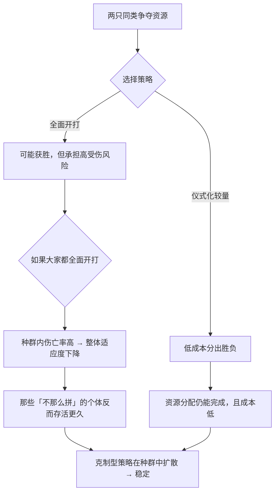

# 07｜既然「适者生存」，为什么动物不把对手往死里打？

> 如果自然界只有残酷竞争，为什么同一物种之间的争斗常常点到为止？

---

## 一、先说结论

很多人对「自私的基因」有一个想当然的推论：

> 既然基因自私，那生物就应该尽量消灭竞争对手，见谁杀谁。

道金斯说，**这是对自私基因理论最幼稚的误读。**

真实的自然界是这样的：

- 同种动物之间的争斗，绝大多数是**仪式化的**：比大小、吼叫、摆姿势、虚张声势；
- 真正打到见血的，比例很低；
- 打完之后，输的一方往往**认输撤退**，赢的一方**通常不会追杀**。

原因很简单：

> **斗争是有成本的。** 受伤、消耗、甚至死亡，都是代价；而收益往往只是资源或配偶。

所以道金斯说：**演化优化的不是暴力，而是「收益减成本」。**

---

## 二、我们先理解一个问题

先看一个思想实验。

假设有两只雄性鹿，为了一只雌鹿正在对峙。

**选项 A**：全力冲撞，把对手的角插进它的身体，杀死它。
**选项 B**：吼叫、压低头角、比体型，弱的一方主动退走。

按「强者生存」的直觉，A 应该更好——反正对手死了，我就独占资源。

但请再想一层：

> **如果对手也这么想呢？**

那么每一次争夺都变成生死战。结果可能是：

- 你在这次赢了，但受了伤，下个月跑不动，被天敌吃掉；
- 或者你这次就输了，直接死掉；
- 就算你每次都赢，你可能也活不长。

于是问题来了：

> **在「大家都拼命」的世界里，那些不那么拼命的个体，会不会反而活得更久、留下更多后代？**

---

## 三、作者到底提出了什么观点？

道金斯关于「进犯行为」的论证，可以拆成五点。

**第一，把「自私」等同于「暴力」是误读。**

道金斯明确写道，认为同类屠杀在自然界普遍存在，是对自私基因理论的一种幼稚理解。**自私的基因优化的是「净收益」，而不是「伤害对手」。**

**第二，争斗是「投资」，不是「发泄」。**

每一次争斗都有成本：时间、能量、受伤风险、暴露给天敌的风险。**如果没有足够的收益，这场仗就不值得打。**

**第三，同种个体之间的争斗最危险，也最需要克制。**

因为同种个体的体型、武器、战术都相似——**这意味着打起来两败俱伤的概率最高。** 相反，对付不同物种的猎物或天敌，往往是一边倒。

**第四，所以演化出了大量的「仪式化冲突」。**

吼叫、展示体型、摆出架势、虚张声势、把对手按倒但不咬——这些都是**用低成本的方式解决争端**。

**第五，这些行为是「稳定」的，所以能长期存在。**

如果一个种群全是「拼命的疯子」，那这个种群会自我毁灭；如果全是「遇事就退的懦夫」，那资源会被外来者抢走。**真正能长期存在的，是某种混合状态。**

**这句话，直接引出了下一篇的「进化稳定策略」。**

---

## 四、把这个观点翻译成人话

我们用一个现代职场类比。

假设你和同事都在竞争同一个晋升名额。

**方案 A（拼命型）**：不惜代价——给对手使绊子、向上级告状、制造舆论、拉拢一切资源。目标是把对手挤出局。

**方案 B（仪式化型）**：比业绩、比方案、比汇报，输了就认。

现在想一层：**在一个「大家都用方案 A」的公司里，会发生什么？**

- 每个人都把大量精力花在内耗上；
- 公司整体业绩下滑，晋升名额可能直接消失；
- 你最有可能的结果是：**没升职，还结了一堆仇。**

而在一个「大家都用方案 B」的公司里，一个用方案 A 的人可能短期占便宜——**但一旦大家都学会用 A，环境就恶化了。**

**所以长期稳定下来的，往往不是「最狠的」，而是「够狠但不过线」的混合状态。**

再说回动物：

- **吼叫** = 报价；
- **展示体型** = 展示实力；
- **退让** = 接受报价；
- **真的开打** = 谈判破裂。

**冲突的本质是谈判，而不是屠杀。** 这就是道金斯那一章的核心比喻。

---

## 五、为什么会这样？

为什么「不过线的争斗」会成为主流？用一张图看这个成本收益的逻辑。

关键在于 E → G 这一步：

> **一个「全员拼命」的种群，会因为内部消耗而整体变弱。**
>
> **而在这样的种群里，哪怕出现一个「更愿意退让」的个体，它反而有生存优势——因为它不受伤。**

这就是**「频率依赖选择」**的雏形：**一个策略好不好，不取决于它自身，而取决于种群中其他人怎么做。**

- 当「拼命」很普遍时，「退让」是划算的；
- 当「退让」很普遍时，「拼命」是划算的。

**于是没有任何单一策略能一统天下，系统会趋向一个混合的平衡点。**

这正是下一篇要形式化的东西——ESS。

---

## 六、举一个现实生活中的例子

我们看一个非常真实的场景：**高速公路上的抢道。**

- **文明驾驶**：打灯、观察、礼让、按顺序通过。
- **野蛮驾驶**：强行加塞、逼车、报复性别车。

现在问一个反直觉的问题：

> **在一个大家都文明驾驶的路上，加塞其实很划算——你能省很多时间。**
>
> **但在一个大家都加塞的路上，加塞反而极其危险——因为人人都在抢，事故率飙升。**

这就是频率依赖：

| 环境 | 加塞的收益 |
|---|---|
| 大多数人守规矩 | 高（你占便宜，风险低） |
| 大多数人乱来 | 低（你也占不到便宜，还容易撞车） |

**所以「加塞」这个策略的收益，取决于有多少人在加塞。**

这个逻辑，几乎就是道金斯描述的动物争斗：

- 大多数时候，靠规则（仪式）解决；
- 少数时候，靠越界（真打）获利；
- 但越界太多，规则崩溃，所有人一起受损。

**「克制」不是道德，而是稳定性的产物。**

---

## 七、回到书中重新理解

现在回到第五章「进犯行为：稳定性和自私的机器」，道金斯的原始表述会更清楚。

他在这章开头就做了一个重要的澄清，大意是：

> 对于生存机器来说，合乎逻辑的策略看起来是「杀死对手，最好吃掉它」。**但认为同类屠杀在自然界普遍存在，是对自私基因理论的一种幼稚理解。**

他随后指出：**真正需要解释的不是「为什么会有攻击」，而是「为什么攻击这么有节制」。**

而他的答案是：**攻击的节制，本身就是「自私」在成本收益下的计算结果。**

注意这一点很关键——**他不是说动物「善良」，而是说克制在算计里更划算。**

他还提出了一个很有启发的观察：

> **同种个体之间的冲突最激烈，也最危险，因此最需要被规则化。**

这个判断在今天依然成立。

---

## 八、这个观点背后还有什么？

**隐含前提一：个体能评估成本与收益。**

这需要某种「判断能力」——可以是本能，也可以是学习。**对简单生物来说，这种「评估」是程序化的。**

**隐含前提二：争斗的收益主要是可替代资源。**

如果资源是唯一的、不可替代的（比如唯一的领地），争斗的激烈程度会上升。

**隐含前提三：种群内存在足够的互动频率。**

频率依赖选择需要个体反复互动。**在一次性、孤立的相遇中，这个逻辑会弱很多。**

**与其他观点的联系：**
- 第 08 篇会把这一篇的逻辑形式化成 ESS；
- 第 09 篇会讲「亲人之间为什么不打」（亲缘系数改变了收益计算）；
- 第 17 篇会把这一套思路推广到「重复博弈中的合作」。

---

## 九、这个观点有问题吗？

有，值得注意的有四点。

**第一，「仪式化冲突」并不能覆盖所有情况。**

在资源极度稀缺、或者涉及繁殖权的关键冲突中，真实的致命冲突并不少见（比如狮子、黑猩猩的族群战争）。**道金斯的描述偏向「多数情况」，而不是全部。**

**第二，这个框架对「情绪」的处理不足。**

从基因的账本看，愤怒、恐惧、羞辱都是「参数」；但从体验看，它们是真实的、有时是非理性的。**人有时候会为了面子打一场毫无收益的架——这在纯算计模型里是「错误」。**

**第三，成本收益模型依赖「可预期的长期重复」。**

在一次性、不可逆的冲突中，克制就不一定划算了。**这也是为什么「陌生人之间更容易爆发极端冲突」这一现象，在人类社会中反复出现。**

**第四，这个解释可能被用来为「攻击性」开脱。**

「攻击是基因的安排」这类说法，容易被误用为「所以打架是自然的、可以理解的」。**但描述攻击的来源，不等于认可攻击。**

---

## 十、今天再看这个观点

「频率依赖」这个思路，在今天最好的应用领域是**竞争策略的设计**。

想一想：

- 在一个大家都打价格战的行业里，不降价可能反而更赚钱（因为对手在流血）；
- 在一个大家都在刷量的内容平台上，做深内容可能在某个时间点突然占优；
- 在一个大家都内卷的团队里，专注做真正重要的事，反而可能被看见。

**「最优策略」不是一个固定的答案，而是「相对于当前环境中其他人」的答案。**

这带来一个非常重要、也非常实用的推论：

> **不要问「什么策略最好」，要问「在当前这个环境里，别人都在用什么策略，还缺什么策略」。**

道金斯在四十多年前描述的「鹰与鸽」，本质上就是这个思路在生物界的版本。

这是**基于道金斯思想的现代延伸**。

---

## 十一、这一篇真正应该记住什么？

1. **把「自私基因」等同于「暴力」是最幼稚的误读。**
2. **争斗是投资，不是发泄；没有足够收益，这场仗就不值得打。**
3. **同种个体之间最危险，因此最需要仪式化、规则化。**
4. **一个策略的好坏取决于「别人在用什么策略」——这是频率依赖。**
5. **克制不是善良，而是成本收益与稳定性的产物。**

---

## 十二、留一个问题

> 在你所处的行业或团队里，哪一种「过度攻击」的策略正在流行？它现在还很划算吗？
>
> 如果所有人都学会了它，会发生什么？
>
> 下一篇，我们把这一篇的逻辑形式化——**什么是「进化稳定策略」，以及鹰与鸽，为什么谁都无法彻底胜出。**
