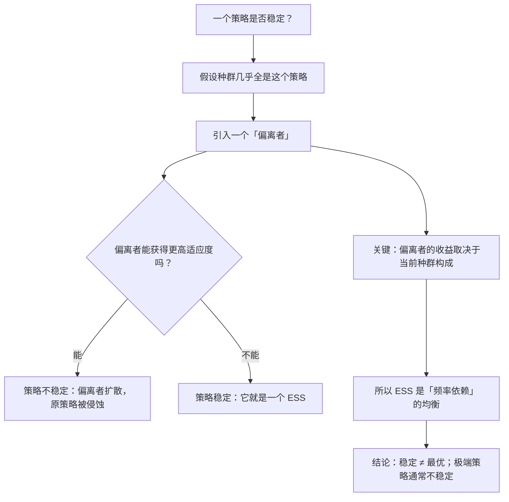

# 08｜什么是「进化稳定策略」（ESS）？——鹰与鸽

> 为什么最凶狠的策略没有统治世界？为什么温和与好斗会长期共存？

---

## 一、先说结论

上一篇我们讲了一个反直觉的事实：动物不会见谁杀谁。道金斯接着问：**那到底什么样的行为组合，能长期稳定地存在？**

约翰·梅纳德·史密斯给出了一个概念，道金斯把它作为整本书的支柱之一——**进化稳定策略（ESS, Evolutionarily Stable Strategy）**：

> **ESS 是一套策略，如果种群中大多数个体都在采用它，那么任何一个偏离者都无法靠「换一种做法」占到便宜。**

它最重要的反直觉含义是：

> **演化追求的不是「最优」，而是「稳定」。**

而鹰与鸽的经典模型说明了：**稳定点往往在两者之间，而不是某个极端。**

---

## 二、我们先理解一个问题

先看一个简单版的模型。

假设一个种群里的个体，面对冲突只有两种做法：

- **鹰（Hawk）**：全力以赴，打到对方受伤或逃跑为止；
- **鸽（Dove）**：只做展示，一旦对方升级就撤退。

现在问三个问题：

1. 如果种群全是鸽子，会发生什么？
2. 如果种群全是鹰，会发生什么？
3. 那最终的稳定状态，是哪一个？

---

## 三、作者到底提出了什么观点？

道金斯关于 ESS 的论证，可以拆成五点。

**第一，ESS 是一个「均衡」概念，不是一个「最优」概念。**

「最优」是一个绝对标准；「稳定」是相对的——**它指的是「在这个环境里，没有人能靠偏离来获利」。** 一个策略可以不是最优的，但依然稳定。

**第二，ESS 的判断标准是「反入侵」。**

判断一个策略是否稳定，标准是：**假如种群几乎全是这个策略，那么一个突变出来的、行为不同的个体，能不能活得更好、留下更多后代？**

- 如果「能」→ 不稳定，这个策略会被侵蚀；
- 如果「不能」→ 稳定，它会长期存在。

**第三，全鸽子不稳定。**

如果全是鸽子，一只鹰出现，它几乎必胜每一次冲突，而且不受伤。**于是鹰的数量会快速上升。**

**第四，全鹰也不稳定。**

如果全是鹰，那么每一次冲突都是血战，双方都受伤。**在这种环境里，一只愿意退让的鸽子反而活得更好——它虽然输掉资源，但保住了命。**

**第五，所以稳定点通常在混合状态。**

道金斯说，最终达成的稳定，可能是：

- 种群中**一定比例的鹰 + 一定比例的鸽**；
- 或者每个个体**按一定概率随机扮演鹰或鸽**。

**关键结论：凶悍与温和都会长期共存，比例由成本收益决定。**

---

## 四、把这个观点翻译成人话

我们用一个大家都熟悉的场景：**马路上的司机。**

假设一条路上有两种司机：

- **抢行者**（≈ 鹰）：能加塞就加塞，别人不让就硬顶；
- **礼让者**（≈ 鸽）：别人要加塞就让，避免冲突。

现在看三种情况：

**情况一：路上全是礼让者。**
抢行者大赚——每到一个路口都能加塞，几乎零成本。于是抢行者的比例会上升。

**情况二：路上全是抢行者。**
每个路口都在互怼，剐蹭不断，通行效率暴跌。**这时候一个愿意礼让的人，反而更快通过**（因为他避开所有冲突）。于是礼让者的比例会回升。

**情况三：稳定状态。**
路上是**一部分抢行者 + 大部分礼让者**。抢行者能占到一些便宜，但代价是要冒碰撞风险；礼让者通过速度稳定，但偶尔被占便宜。

**这就是 ESS：没有任何一方能彻底消灭另一方。**

把这个类比提炼一下：

| | 鹰 | 鸽 |
|---|---|---|
| 面对鸽 | 大胜 | 退让 |
| 面对鹰 | 血战（双方都受伤） | 退让（保命） |
| 在「全鸽」环境 | 非常划算 | 被占便宜 |
| 在「全鹰」环境 | 代价极高 | 反而划算 |

**「划算不划算」，取决于环境里有多少鹰。** 这就是 ESS 的核心。

---

## 五、为什么会这样？

为什么 ESS 会成为演化论的支柱概念？用一张图看它的逻辑结构。

这里有三个非常重要的推论：

**第一，「稳定」比「最优」更接近演化的真相。**

演化不是有一个「理想状态」在等着所有生物去达到。**它只是一个不断筛选偏离者的过程——停下来的地方，就是没人能靠偏离获利的地方。**

**第二，ESS 天然是多态的。**

因为纯策略通常不稳定，所以自然界最常见的状态是**混合**：不同策略、不同性别、不同行为型态共存。

**第三，「随机化」也是一种 ESS。**

如果一个个体在每次冲突中**按一定概率随机决定当鹰还是当鸽**，这本身也可以是一个稳定策略。**因为对手无法预测你，也就无法针对你。**

这最后一点很关键：**不可预测性本身就是一种优势。**

---

## 六、举一个现实生活中的例子

我们看一个商业上的经典案例：**价格战。**

假设一个行业里有两类公司：

- **鹰型**：只要对手降价，我就降得更狠，把对手拖垮；
- **鸽型**：坚持价格，只打品牌和差异化。

**如果全行业都是鸽型**：一个鹰型公司突然大幅降价，会瞬间抢走大量客户。于是降价策略扩散。

**如果全行业都是鹰型**：所有人都在低价内卷，利润被压到接近为零，谁也活不好。**此时一个坚持不降价、做差异化的公司，反而能拿到利润。** 于是「鸽型」扩散。

**最终稳定的状态，通常是：**

- 大部分公司维持价格区间；
- 少数公司靠低价冲量；
- 少数公司靠差异化赚钱；
- 但没有哪一类能彻底消灭另外两类。

而且注意一个非常 ESS 式的现象：

> **一旦有人开始打价格战，整个行业的「最优策略」就变了。**

昨天「坚持价格」是对的，今天「跟进降价」是对的，明天可能又变回来。**因为「对」不是绝对的，它取决于别人在干什么。**

这就是为什么商业战略里有一句话：

> **没有最好的战略，只有在当前竞争格局下最合适的战略。**

它的底层逻辑，就是 ESS。

---

## 七、回到书中重新理解

现在回到第五章后半部分，道金斯引用梅纳德·史密斯的 ESS 理论时，读者往往容易把它当成一个「数学小插曲」。

但它其实是整本书的枢纽：

- 第 07 篇讲「为什么克制」；
- 第 08 篇讲「克制到什么程度才是稳定的」；
- 后面第 09–18 篇的所有内容（亲缘、家庭、两性、合作），**都可以被看作在计算不同的「收益矩阵」下，什么是 ESS。**

道金斯还特别强调了一个容易被忽略的点：

> **ESS 说的是「如果大家都这么做，你也最好这么做」，而不是「这么做本身是对的」。**

这句话非常重要，因为它剥掉了道德色彩：**稳定不等于善，共存不等于和谐。** 鹰和鸽共存，不是因为它们互相尊重，而是因为任何一方都无法彻底消灭另一方。

**这是一个纯粹的均衡结论，与价值无关。**

---

## 八、这个观点背后还有什么？

**隐含前提一：收益可以被量化。**

ESS 的计算依赖「收益矩阵」。但在真实的自然界，收益很难精确测量。**它是一个理论模型，而不是精确预测工具。**

**隐含前提二：种群足够大、互动足够频繁。**

ESS 是一个**群体层面的均衡概念**。在小种群、随机漂变强的情况下，它会被削弱。

**隐含前提三：策略是可遗传的。**

ESS 假设策略有遗传基础（或至少能被稳定传递）。**如果策略完全靠后天学习且变化极快，ESS 的解释力会下降。**

**与其他观点的联系：**
- 第 07 篇是这一篇的直觉版本；
- 第 14、15 篇会用类似的博弈框架处理「两性冲突」；
- 第 16、17、18 篇会用「重复囚徒困境」的形式，处理「合作与背叛」的均衡。

---

## 九、这个观点有问题吗？

有，主要在这几点。

**第一，ESS 的「稳定」不等于「不可动摇」。**

环境一变（资源变了、天敌来了、规则改了），原来的 ESS 就可能立刻失效。**它描述的是一个局部均衡，而不是永恒的定律。**

**第二，把行为简化为「鹰 / 鸽」是一种高度抽象。**

真实动物的行为是一个连续谱，还受年龄、状态、经验、环境的影响。**二选一的模型很清晰，但也很粗糙。**

**第三，这个框架容易让人产生「一切都是平衡的」错觉。**

如果只看 ESS，你会觉得世界总是趋于稳定。**但现实中，系统会被外部冲击、随机事件、路径依赖打乱，长期困在不理想的均衡里。** 人类社会的很多问题（比如某些恶性竞争），就是「稳定的坏均衡」。

**第四，「没有最优只有稳定」这个结论，可能让人放弃改良。**

如果一切都只是均衡，那还有什么可做的？**道金斯的框架是描述性的，但人类恰恰可以改变收益矩阵本身**（比如通过制度、规则、文化），从而移动到另一个均衡。

这一点，是从「演化描述」走向「人的能动性」的关键一步——也是第 21 篇的主题。

---

## 十、今天再看这个观点

ESS 在今天最有用的迁移，是**平台与生态的竞争分析**。

想一想：

- 一个平台上的内容创作者，是「深耕专业」还是「追热点」？
- 答案取决于**平台上其他人怎么做**。如果大家都追热点，深耕反而稀缺；如果大家都深耕，追热点反而暴利。
- 平台规则（流量分配、推荐机制）**就是那个「收益矩阵」**。改变它，就会改变创作者的最优策略。

**所以平台调整规则，本质上是在改变一个 ESS。**

这也解释了一个常见的困惑：

> **为什么「好内容」不一定被推荐，而「标题党」总是有效？**

因为标题党在当前的收益矩阵下是一个更划算的策略。**这不是道德的失败，而是均衡的结果。**

而如果你想让好内容胜出，最有效的做法往往不是呼吁，而是**改变收益矩阵**——改推荐机制、改评价标准、改流量分配。

这是**基于道金斯思想的现代延伸**，不是他书中的原话。

---

## 十一、这一篇真正应该记住什么？

1. **ESS 不是「最优策略」，而是「没人能靠偏离获利」的稳定策略。**
2. **判断稳定的方法是「反入侵」：假设大家都在用，偏离者能占便宜吗？**
3. **全鹰不稳定（两败俱伤），全鸽也不稳定（被鹰碾压），稳定点通常在混合状态。**
4. **策略的好坏是频率依赖的——它取决于别人在用哪种策略。**
5. **稳定不等于善；但人类可以改变「收益矩阵」本身，从而移动到另一个均衡。**

---

## 十二、留一个问题

> 你现在所在的环境里，最「稳定」的行为模式是什么？它对你好吗？
>
> 如果它是一个「稳定的坏均衡」——**你可以改变哪个「收益参数」，让好策略变得划算？**
>
> 下一篇，我们从「同类相争」转向「亲人相助」——**基因凭什么认出谁是自己人？汉密尔顿法则的 rB > C。**
