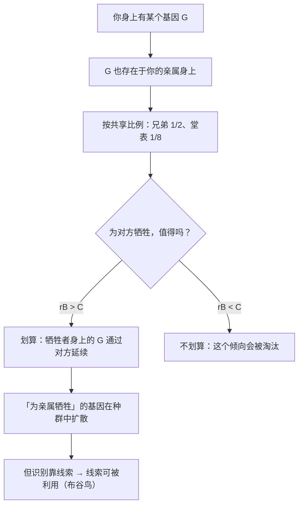

# 09｜基因怎么认出「谁是我的亲人」？——汉密尔顿法则

> 基因没有眼睛，凭什么「知道」谁和自己共享拷贝？

---

## 一、先说结论

上一篇我们讲的是「同类之间为什么克制」。这一篇要处理一个更难的问题：**为什么动物会为了某些个体，做出远超克制的牺牲？**

道金斯的答案来自汉密尔顿——一个人称「亲缘选择」的理论。它的核心是一个简单的公式：

> **rB > C**

- **r** = 亲缘系数（你和对方的基因共享程度）；
- **B** = 对方得到的收益；
- **C** = 你自己付出的代价。

当这个不等式成立时，一个「愿意为亲属牺牲」的基因，就能在演化中扩散。

关键洞察是：

> **基因不认「关系」，它只认「共享拷贝的期望值」。** 所谓亲情，在基因的账本上是一次精确的算术。

---

## 二、我们先理解一个问题

先看一个极端的数字。

假设你有一个亲兄弟。你们共享多少基因？

大多数人会说：一半。

**那如果你有 8 个亲兄弟呢？** 从基因的视角看，你们 9 个人加起来，相当于「另一个你」——**因为 8 × 50% = 400%……等等，那早就超过 100% 了。**

这里就有意思了。

如果你为 8 个兄弟中的 2 个牺牲，你在基因上的收益，大约是：

> **2 × 50% = 100%**

也就是说：**牺牲自己、保全两个兄弟，在基因层面大致是「不亏」的。**

这就是问题的起点：

> **如果基因真的在做这种「算术」，那「利他」就不再是谜——它只是另一种形式的自我延续。**

---

## 三、作者到底提出了什么观点？

道金斯关于亲缘选择的论证，可以拆成五点。

**第一，亲缘系数是可以计算的。**

- 你和你自己：1
- 兄弟、姐妹、父母、子女：1/2
- 祖父母、孙辈、叔伯、姑舅、半同胞：1/4
- 堂表兄弟姐妹：1/8

**第二，利他行为能否演化，取决于这个不等式。**

**rB > C**：当「亲缘系数 × 受益」大于「自己的损失」时，利他行为有利可图。

**第三，所以「为亲属牺牲」是有条件的，不是无条件的。**

不是「只要是自己人就一定救」，而是**「划算才救」**。这就解释了一个有趣的现象：**动物对亲属的帮助程度，通常和亲缘远近成正比。**

**第四，亲属识别是「启发式」的。**

基因当然不能直接「看到」对方的基因。生物用的是各种线索：

- 一起长大的（童年相处时间）；
- 气味相似；
- 长相相似；
- 巢里的（同窝的）。

**第五，所以「亲情」可以被骗。**

道金斯指出一个非常关键的点：**因为识别靠的是线索而不是真相，所以这些线索会被利用。** 这就是布谷鸟把蛋下在别的鸟巢里、让寄主养大它的雏鸟的原因——**寄主被「巢里就是我的孩子」这条启发式规则骗了。**

---

## 四、把这个观点翻译成人话

我们用一个所有人都熟悉的场景：**大家庭里的亲戚。**

假设一个人有三个亲戚同时遇险，他只能救一个：

- 他自己的亲弟弟；
- 他的堂表兄弟；
- 一个完全没有血缘的陌生人。

按汉密尔顿法则，优先级大致是：

| 对象 | 亲缘系数 | 在基因账本上的价值 |
|---|---|---|
| 亲弟弟 | 1/2 | 高 |
| 堂表兄弟 | 1/8 | 低 |
| 陌生人 | ≈0 | 几乎没有 |

**也就是说：如果为了救一个陌生人而牺牲自己、同时又不救弟弟，这在基因层面是巨大的亏损。**

但请注意，这里有一个非常重要的转折：

> **如果这个「陌生人」是你的幼年伙伴呢？**

人类的亲缘识别，很大程度依赖**「一起长大」**这个线索。研究表明，人对「幼年同住的人」会有强烈的性厌恶——**这就是「反乱伦」机制的一部分，而它依赖的正是「共处时间」这个启发式线索，而不是基因检测。**

于是就有两种可能：

- **兄弟姐妹分开长大 → 成年后相遇时可能产生性吸引**（因为「一起长大」这条线索不在了）；
- **从小一起长大的朋友 → 反而不会有那种吸引**（因为线索会把对方误判成亲属）。

**这正是「基因不认关系，只认线索」的直接证据。**

道金斯在书里就提到过类似现象，并指出：**乱伦禁忌的真正原因，很可能不是道德，而是这条启发式规则在起作用。**

---

## 五、为什么会这样？

为什么生物会演化出「为亲属牺牲」这种行为？用一张图看这个计算。

这里有几个特别值得注意的推论：

**第一，利他不是「无私」，而是「另一种分配」。**

从基因的视角看，牺牲自己救兄弟，不是「放弃」，而是**把资源从一份拷贝转移到两份拷贝**。**这不是利他，这是投资。**

**第二，亲缘选择解释了自然界中最令人费解的现象。**

蚂蚁、蜜蜂、白蚁的真社会性——成千上万的不育个体为一个繁殖个体工作——在个体和群体视角下都说不通。**只有基因视角能解释。**

**第三，「亲情」是有刻度的。**

不是「亲人就重要」，而是「越近越重要」。**这在人类身上也成立**：大量研究表明，人们对亲属的照顾程度、遗产分配、情感投入，都随亲缘系数递减。

**第四，所以「亲情」必然伴随着「偏心」。**

既然亲疏有刻度，那么在资源有限时，偏袒更近的亲属就是必然的。**这也直接引出了下一篇和第 12 篇的冲突主题。**

---

## 六、举一个现实生活中的例子

我们看一个非常现代的、也很扎心的场景：**遗产分配。**

假设一位老人去世了，留下一笔遗产。理论上，他有：

- 一个亲儿子；
- 一个多年不联系的侄子；
- 一个照顾了他十年的邻居。

**从法律和道德的角度看**，讨论会非常复杂：谁付出得多？谁更需要？老人的意愿是什么？

**从基因的账本看**，答案非常「冷酷」：

| 对象 | 亲缘系数 | 基因视角的「权重」 |
|---|---|---|
| 亲儿子 | 1/2 | 高 |
| 侄子 | 1/4 | 中 |
| 邻居 | ≈0 | 低 |

**如果只看「基因利益」，遗产应全归儿子。**

但请注意，这不是道金斯在主张什么——**他只是在描述「基因的影响倾向」。** 而现实生活中，**人完全可能把遗产留给照顾自己的邻居**，这恰恰是「人类可以反抗基因预设」的例子。

这个例子还有一个更深的层面：

**为什么人类会有「亲情偏心」？**

- 亲儿子确实更容易得到偏爱；
- 但这种偏爱**可以通过共同生活的经历、情感投入来改变**——这些是「启发式线索」在起作用；
- 所以「亲生的不如养大的」这种情况，在现实中也真实存在。

**线索胜过关系，这正是汉密尔顿法则的隐含含义。**

---

## 七、回到书中重新理解

现在回到第六章「基因种族」，道金斯的原始表述就容易理解了。

他明确说，这一章的核心是**汉密尔顿的遗传学说**，而这个学说的力量在于：它**第一次把「利他」变成了一个可以计算的问题**。

他用了一个很生动的说法，大意是：

> **亲属之间的利他，就像一个「血缘的分账本」——你照顾亲属，本质上是在照顾一份与你共享的拷贝。**

他也特别指出：**乱伦禁忌的遗传学好处，其实与利他无关**——它更多和近亲繁殖会产生隐性有害基因有关。**这是一个重要的区分**：不是所有「亲属相关」的行为都是亲缘选择。

他还提醒读者：**亲缘选择不是「动物在算账」，而是「那些算错了的基因被淘汰了」。** 这句话是理解整个理论的关键——**不是有意识的计算，而是无意识筛选的产物。**

---

## 八、这个观点背后还有什么？

**隐含前提一：亲缘系数可被「感知」或「近似」。**

现实中生物不能直接测 r，所以它依赖各种线索。**这既是理论的强项（能解释乱伦禁忌和布谷鸟），也是它的软肋（线索会出错）。**

**隐含前提二：收益和成本可以被衡量。**

rB > C 是一个理想化模型。现实中 B 和 C 极难量化。**它更像一个定性框架。**

**隐含前提三：生存机器的行为有遗传基础。**

这一条对简单生物成立，对人类（文化影响巨大）需要谨慎。

**与其他观点的联系：**
- 第 10 篇会给出这个理论最戏剧化的案例（工蜂与单倍二倍体）；
- 第 11 篇会区分「表面利他」和「真正的利他」，并讨论群体选择的争议；
- 第 12 篇会讲亲缘系数只有 50% 造成的代际冲突。

---

## 九、这个观点有问题吗？

有，主要在这几点。

**第一，「为亲属牺牲」并不总是发生，也不总是按比例发生。**

现实中，亲属之间的厮杀（杀婴、同胞竞争、手足相残）非常普遍。**亲缘系数是「上限」，不是「保证」。**

**第二，人类行为的亲缘解释，往往被过度使用。**

在人类社会，文化和制度对亲属关系的影响非常大。**把一切「照顾亲戚」的行为都归因于基因，会漏掉社会规范、互惠、情感这些真实的力量。**

**第三，「基因自私」这个词在这里又出现了。**

「投资基因拷贝」这个说法很清晰，但它又一次把基因拟人化了。**这在科普上有力，在精确性上有代价。**

**第四，现代生物学对亲缘选择的细节有争议。**

近年来（尤其是 2010 年代），围绕亲缘选择与「标准演化理论」之间的争论非常激烈。**多数人认为亲缘选择仍然有效，但对它的适用范围和数学形式仍有分歧。**

---

## 十、今天再看这个观点

汉密尔顿法则在今天有一个几乎完美的类比：**「认识你自己的算法」**。

想一想：

- 很多平台都在用「相似度」来做推荐——「和你相似的人还喜欢……」；
- 广告投放靠的是「lookalike」人群——找到和你特征相似的人；
- 一些系统甚至会优先服务「与你关联度高」的节点。

**它们做的事，本质上是「按相似度分配资源」——这和亲缘选择是同一个结构。**

而这带来一个值得警惕的推论：

> **当一个系统只用「相似度」来分配资源时，它就会自动制造「偏心」——它不关心谁更需要，只关心谁更「像」。**

**汉密尔顿法则的现代版本，是一个关于「系统偏袒」的问题。**

同时，人类也提供了一个反向的示范：**我们可以选择照顾与我们毫无相似度的人。** 这正是我们不同于算法的部分。

这是**基于道金斯思想的现代延伸**。

---

## 十一、这一篇真正应该记住什么？

1. **汉密尔顿法则：rB > C——利他在基因层面是可以计算的。**
2. **基因不认「关系」，只认「共享拷贝的期望值」；亲情有刻度，越近越重要。**
3. **亲属识别依赖线索（共处时间、气味、相似），所以线索可以被利用——布谷鸟就是例子。**
4. **「为亲属牺牲」不是无私，而是资源在基因拷贝之间的一次再分配。**
5. **亲缘解释有力，但在人类社会容易被过度使用，忽略文化与制度的作用。**

---

## 十二、留一个问题

> 如果你只能救一个人，而「血缘远近」和「共同经历」给出了相反的答案，你会怎么选？
>
> 你的答案，是你自己的，还是那条「启发式线索」替你算出来的？
>
> 下一篇，我们来看这套理论最惊人的一次胜利——**一只从不生育的工蜂，为什么甘愿为整个蜂群拼命？**
