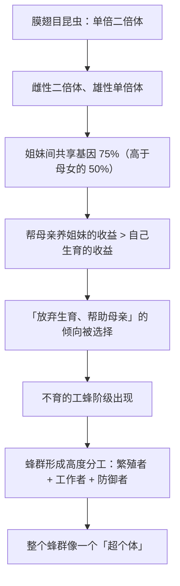

# 10｜工蜂为什么甘愿为蜂后卖命？——单倍二倍体与「超个体」

> 一只工蜂一辈子不生育，为什么还要为蜂群拼命工作，甚至为保护蜂巢而自杀？

---

## 一、先说结论

这是亲缘选择理论最惊人的一次胜利，也是汉密尔顿最漂亮的解释之一。

答案藏在一个奇怪的遗传机制里——**单倍二倍体（haplodiploidy）**：

- 在蚂蚁、蜜蜂、黄蜂这类昆虫中，**雌性来自受精卵**（有父有母，二倍体）；
- **雄性来自未受精卵**（只有母亲，单倍体）。

这造成一个奇特的结果：

> **姐妹之间共享的基因比例，不是 50%，而是 75%——比母女之间的 50% 还高。**

于是从基因的账本看：

> **工蜂帮母亲养出更多姐妹，比自己生育更划算。**

这就是为什么它们甘愿做「不生育的工人」。道金斯称之为「基因算术最戏剧化的一次胜利」。

---

## 二、我们先理解一个问题

先算一笔账，看这个 75% 到底是怎么来的。

**一只蜂后和一只雄蜂交配生育。**

先看**母女关系**：
- 蜂后是二倍体，她给女儿的每个基因，有 50% 的概率是其中一条染色体上的；
- 所以母女共享 **50%**。

再看**兄妹关系**（同一母亲、不同父亲）：
- 女儿从母亲那里得到 50% 的基因；
- 女儿从父亲那里得到 50% 的基因。**但父亲是单倍体，他只有一套基因，所以他把同一套完整地传给了每一个女儿。**
- 所以两个女儿之间：
  - 来自父亲的基因：**完全相同**（100% 共享）
  - 来自母亲的基因：**平均共享 50%**

**合计：50% × 100% + 50% × 50% = 75%。**

也就是说：**一个工蜂和她的姐妹，共享 75% 的基因。**

现在问题来了：

> **如果工蜂自己能生育，她的女儿和她共享 50%；
> 如果她帮母亲生妹妹，那个妹妹和她共享 75%。**
>
> **哪一个更「划算」？**

---

## 三、作者到底提出了什么观点？

道金斯关于社会性昆虫的论证，可以拆成五点。

**第一，汉密尔顿法则在这里给出了惊人的答案。**

工蜂帮母亲生育的「收益率」是 75%；自己生育的收益率是 50%。**所以在基因层面，帮母亲更划算。**

**第二，这解释了「不育阶级」为什么能存在。**

在个体视角和群体视角下，「几万只工蜂不生育」都是一个巨大的谜。**只有基因视角能算出这笔账。**

**第三，但这个解释有边界——它只对雌性成立。**

工蜂和兄弟（雄蜂）之间，共享的基因只有 **25%**（因为兄弟只从母亲那里得到基因，没有父亲那一半）。**所以工蜂对兄弟的态度明显冷淡——甚至会出现工蜂杀死兄弟、或偏向姐妹的行为。**

**这一点非常关键**：它说明「亲情」不是笼统的，而是**精确到不同亲属类别，各有一笔账**。

**第四，兄弟姐妹之间也因此产生了冲突。**

因为工蜂之间的相关度（75%）高于工蜂与母亲之间的相关度（50%），**理论上，工蜂更希望母亲多生女儿（它们的姐妹），而不是少生。** 而蜂后则希望平衡投资。**这就是所谓「蜂群内的基因冲突」。**

**第五，道金斯由此提出「超个体」的概念。**

一个蜂群看起来像一个「个体」：有繁殖器官（蜂后）、有身体（工蜂）、有免疫系统（防御）。**道金斯说，我们可以把整个蜂群看成一个由基因组成的整体——而每一只工蜂，更像是这个整体的一个细胞。**

---

## 四、把这个观点翻译成人话

我们用一个现代的组织类比：**一家公司的三种股权结构。**

**第一种：普通公司（≈ 二倍体，50%）**
你和合伙人各占 50%，大家的利益大致一致，但也有分歧。

**第二种：特殊结构（≈ 单倍二倍体，75%）**
你和你的「姐妹部门」之间，因为某个特殊的股权设计，共享 75% 的收益。**而你和你的「下一代」（自己的项目）只共享 50%。**

现在问：**你会把精力投在哪里？**

按纯收益计算，**投资那个共享 75% 的姐妹部门，比单干更划算。**

这就是工蜂的选择。

再看一个更直观的类比：

> **想象你和你的兄弟（共享 50%）要一起做事，和你最好的朋友（共享 0%）要一起做事，你会更倾向于谁？**
>
> 如果突然出现了一种机制，让你和你的姐妹共享 75%——**那你对姐妹的投入倾向，会比对自己孩子还强。**

这听起来很反直觉，但**在蜂群里它就是事实**。

还有一个细节特别有意思：

**为什么工蜂对自己的「弟弟」（雄蜂）态度冷淡？**

因为共享度只有 25%。**从基因角度看，弟弟的「价值」只有姐妹的三分之一。** 所以在资源紧张时，工蜂可能优先照顾姐妹，甚至把弟弟的卵丢掉。

**这就是「亲情有刻度」最赤裸的体现——连一个蜂巢里的不同亲属，待遇都不同。**

---

## 五、为什么会这样？

为什么单倍二倍体会演化出「不育的工人阶级」？用一张图看这个因果链。

这里有几个特别值得注意的推论：

**第一，这是一个「结构性巧合」的结果。**

单倍二倍体并不是「为了」产生社会性而出现的。它先存在，然后**因为它的亲缘结构恰好使得利他特别划算**，社会性就在这条谱系上反复演化出来。

**证据是**：在社会性昆虫中，单倍二倍体的类群占比异常高。**道金斯（和汉密尔顿）认为这不是巧合。**

**第二，它把「利他」推到了个体逻辑的极限。**

一只工蜂为保护蜂巢而蜇人时，它会死。但从 75% 的相关度看，**它用一条命换来了成百上千个「75% 的自己」的安全。** 这笔账在基因层面非常划算。

**第三，「超个体」不是修辞，而是一种功能描述。**

蜂群有繁殖、有代谢、有防御、有免疫——**它的组织层级，在功能上确实像一个更高的个体。**

---

## 六、举一个现实生活中的例子

我们看一个现代组织的类比：**一个「超级合伙人团队」。**

假设有八个人一起创业。他们设计了一种特殊的股权结构：

- 每个人和「团队本身」利益共享度极高（75%）；
- 每个人单独去创业，收益相关度只有 50%。

**现在问：他们会怎么选？**

答案是：**他们会明显倾向于「留在团队里出力」，而不是单干。**

再看：
- 如果他们对自己的「直属家人」（相当于 25% 共享）投入，收益较低；
- 于是他们会优先投入团队。

**这就是蜂群的结构：把「个人利益」和「集体利益」的共享度调到足够高，合作就变成了理性选择。**

道金斯的启示在这里非常实用：

> **想让一群人愿意为集体付出，靠道德号召往往不够；真正有效的是改变「共享度」——也就是让集体成果和个人收益的关联变得更紧密。**

而反过来也成立：

> **如果共享度很低（比如干多干少一个样），那「搭便车」就会成为理性选择。** 这不是道德问题，而是结构问题。

---

## 七、回到书中重新理解

现在回到第六章后半部分，道金斯引用汉密尔顿的这一解释时，读者最容易被「75%」这个数字震住。

但更重要的是他随后的推理：

- 他明确指出，**这解释了为什么社会性昆虫中，不育的工人阶级几乎总是雌性**；
- 他也指出，**这解释了工蜂与雄蜂之间的冲突**——因为它们之间的相关度只有 25%；
- 他还提出了「超个体」的视角：**整个蜂群可以被看作一台机器，而每一只蜂是它的一个部件。**

道金斯在这一章还做出了一个很重要的方法论证：

> **越是「看起来高度利他」的行为，越需要基因层面的精确解释。** 因为在个体层面，它们完全是矛盾的。

**而这正是这本书最有力量的地方：它能解释那些「看起来说不通」的事。**

---

## 八、这个观点背后还有什么？

**隐含前提一：亲缘系数是精确可算的。**

在单倍二倍体系统里，这个计算确实很干净。**这也是这个案例被反复引用的原因——它是理论最清晰的一次验证。**

**隐含前提二：工蜂真的「知道」相关度吗？**

当然不是。**这里的机制是：那些「倾向于帮助姐妹」的基因恰好被保留了下来。** 不需要任何认知。

**隐含前提三：除了亲缘，还有别的因素。**

现代研究表明，生态因素（如筑巢的难度、能否独立建巢）也对社会性的演化有重要作用。**亲缘结构是必要条件之一，但不是唯一条件。**

**与其他观点的联系：**
- 第 09 篇的汉密尔顿法则是理论基础，这一篇是它的最强案例；
- 第 11 篇会区分「表面利他」和「真正的利他」；
- 第 12 篇会讲「亲人之间的冲突」——而蜂群内部的冲突，正是这类冲突的一个极端版本。

---

## 九、这个观点有问题吗？

有，而且这一条后来引发了学界最激烈的争论之一。

**第一，有学者（如 E. O. 威尔逊后期）认为亲缘解释被过度强调。**

在《社会生物学》之后，威尔逊本人一度转向认为**群体选择**在社会性昆虫的演化中也很重要。**这引发了与他人的激烈争论。** 所以这个问题至今没有完全统一。

**第二，单倍二倍体并不能解释所有社会性昆虫。**

白蚁是二倍体（不是单倍二倍体），但同样演化出了高度社会性。**这说明亲缘系数不是唯一的通路。**

**第三，工蜂「罢工」的现象说明这套系统并不完美。**

如果亲缘解释完全成立，工蜂应该完全服从。但研究表明，工蜂会：

- 偏向照顾关系更近的幼虫；
- 在蜂后生育力下降时「罢工」或产卵；
- 甚至会杀死蜂后的卵。

**这些行为恰恰说明：所谓「超个体」，内部其实充满了利益博弈。**

**第四，「超个体」这个说法容易让人误以为蜂群真的像一个有机体。**

它更像一个「高度协作的利益共同体」，而不是真正意义上的单个生物。**隐喻有力，但也有误导性。**

---

## 十、今天再看这个观点

「改变共享度，合作就会变得理性」——这个思路在今天最好的应用领域，是**组织设计**。

- **期权与股权**：本质上是提高员工与公司成果的「共享度」；
- **分成制 vs 固定工资**：分成制模拟了「共同利益」，固定工资则容易产生搭便车；
- **平台与创作者的分成比例**：它直接决定了创作者的最优努力程度；
- **社区激励**：积分、声誉、治理权，都是在调整「共享度」。

**道金斯的蜂群给出的教训是：**

> **如果一个人「为大家努力」和「只为自己努力」在收益上差不多，那么要求他无私，就是要求他和自己的理性作对。**
>
> **想让合作发生，靠改变结构，而不是靠改变人性。**

这是**基于道金斯思想的现代延伸**。

---

## 十一、这一篇真正应该记住什么？

1. **单倍二倍体让姐妹间共享 75% 的基因，高于母女的 50%。**
2. **因此工蜂帮母亲养姐妹，比自己去生育更「划算」——这是不育阶级的基因解释。**
3. **工蜂对雄蜂（共享 25%）明显冷淡，说明「亲情」是精确到类别的算术。**
4. **整个蜂群可以看成「超个体」，但它内部依然充满博弈，并非完美和谐。**
5. **这个案例的真正启示：想让人合作，改变「共享度」比呼吁道德更有效。**

---

## 十二、留一个问题

> 在你所在的组织里，「为集体多付出」和「为自己多付出」，收益差距有多大？
>
> 如果差距很小，那么要求大家无私，是不是在要求大家做不理性的事？
>
> 下一篇，我们正面处理全书最著名、也最容易被误用的一个判断——**「明显的利他行为，其实是伪装起来的自私」这句话，到底在说什么。**
