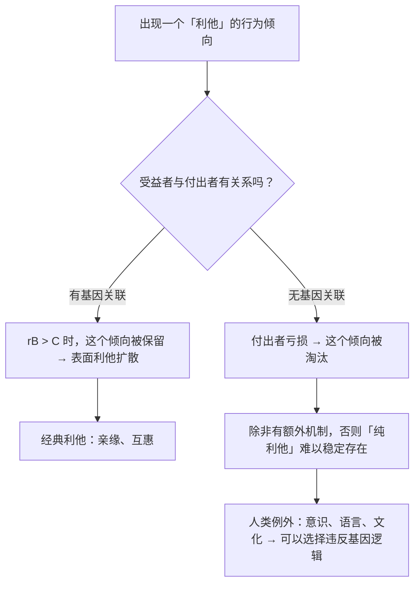

# 11｜「舍己救人」真的存在吗？——利他行为的真相

> 如果每个基因都是自私的，那些冒着生命危险的利他行为，到底该怎么解释？

---

## 一、先说结论

道金斯在这一章做了一个极其重要的区分：

| | 定义 | 在自然界中的情况 |
|---|---|---|
| **表面利他** | 付出者受损、受益者获利 | 极其普遍 |
| **真正的利他** | 付出者受损、受益者获利，且两者**没有基因关联** | 极其罕见 |

由此得出他最有名、也最容易被误读的一句话：

> **明显的利他行为，往往是伪装起来的自私行为。**

**关键在于：这里的「自私」不是道德判断，而是记账方式。** 它说的是——**收益最终回到了基因的账本上**，而不是说行为者内心虚伪。

而这一章真正的结论，其实比这句话更复杂：

> **人类恰好是那种能够做出「真正的利他」的动物。**

---

## 二、我们先理解一个问题

先看一个所有人都会遇到的两难。

你正在散步，突然看到有人落水。你不会游泳。

**选项 A**：跳下去救。你可能会死，对方也未必能被救上来。
**选项 B**：大声呼救，找工具，等专业救援。

现在问一个进化生物学会问的问题：

> **如果「利他」在基因层面永远是一笔划算的账，那么一个「明知必死、收益为零」的救援，该怎么解释？**

更进一步：

> **如果自然界里的利他都是为了基因收益，那人类这种「为陌生人送命」的行为，是反常，还是另一种东西？**

---

## 三、作者到底提出了什么观点？

道金斯关于利他的论证，可以拆成五点。

**第一，先分清「利他」这个词的两个层次。**

- **行为层面**：谁付出了、谁受益了？
- **基因层面**：谁的基因拷贝变多了？

**很多行为在行为层面是利他的，在基因层面却是自利的。**

**第二，自然界中绝大多数「利他」，是亲缘计算或互惠计算的结果。**

- 父母照顾孩子 → 亲缘；
- 动物互相理毛 → 互惠；
- 工蜂蜇人 → 亲缘。

**它们都符合「rB > C」或者「这次给你、下次你还我」的逻辑。**

**第三，真正的利他极其罕见，但并非不存在。**

道金斯不否认「纯粹利他」的可能性。他只是指出：**在自然界，它非常少见，而且需要特殊条件。**

**第四，群体选择是一个错误的框架。**

道金斯再次强调：**用「为了物种的利益」解释利他，是有问题的。** 因为群体内部的搭便车者会持续侵蚀善意。

**第五，全书最关键的转折：人类是例外。**

道金斯在末尾转向人：

> **我们可能是唯一能够理解并反抗基因预设的生物。**

也就是说，**只有人类可能做出真正意义上的利他——不是因为基因的账划算，而是因为我们能够选择。**

---

## 四、把这个观点翻译成人话

我们用一个特别贴切的场景来理解这两种利他。

**场景一：母亲把最后一块蛋糕留给孩子。**

这是**表面利他、基因自利**——孩子身上有她一半的基因。

**场景二：一个陌生人把最后一瓶水递给了一个和他毫无关系的人。**

这是**真正的利他**——它在基因层面算不平账。

现在看道金斯那句话：

> **「明显的利他行为，往往是伪装起来的自私行为。」**

**这句话在说什么？**

- 它有**不是在说**「母亲的爱是假的」；
- 它有**不是在说**「做好事的人内心都是为了自己」；
- 它**是在说**：「如果你顺着基因的账本去查，你会发现收益最终回到了基因这里。」

**「伪装」这个词，用的是「在基因层面看起来像」的意思，不是「有意欺骗」。**

这里有一组对照，能帮你看清这个区别：

| 说法 | 是否成立 |
|---|---|
| 母亲的爱是真实的体验 | ✅ 成立 |
| 母亲的行为在基因层面是自利的 | ✅ 也成立 |
| 因此母亲的爱是虚伪的 | ❌ 推论错误 |

**最后那条推论，就是四十年来最主流的误读。**

---

## 五、为什么会这样？

为什么「表面利他」在自然界如此普遍，而「真正的利他」如此罕见？用一张图看这个筛选过程。

关键在于 F 和 G 之间的那一跃。

**为什么「真正的利他」在自然界难以稳定？**

因为它是「结构性亏损」的。一个基因让你无条件地帮助毫无关联的个体，那么在竞争里，**你的后代就会比别人的后代少**——这个基因会逐渐减少。

**那人类为什么是例外？**

道金斯的推理大致是：

- 人类拥有**有意识的先见**（能想象未来的后果）；
- 人类拥有**文化传递**（模因，第 19 篇会讲）；
- 于是人类可以**识别出「基因的倾向」，然后选择违抗它**。

**这就是全书从「描述」走向「立场」的地方：不是「人天生自私」，而是「人能够不服从」。**

---

## 六、举一个现实生活中的例子

我们看一个真实感极强的现代场景：**器官捐献。**

一个人登记成为器官捐献者。他可能在意外中去世，而他健康的器官会救活几个完全陌生的人。

**从基因的账本看，这件事是彻底的亏损：**

- 帮助的是陌生人（相关度≈0）；
- 自己承担了成本（虽然生前没有直接损失，但涉及本人及家属的意愿）；
- 没有任何基因层面的回报。

**这在纯演化框架里，是「不该存在」的行为。**

但它在现实中大量存在。而且有一个细节很有意思：

**为什么大多数人愿意捐献，但登记率又很低？**

答案往往不在「愿不愿意」，而在**默认选项的设计**：

- 采用「选择加入」制度的国家，登记率通常很低；
- 采用「默认加入、可退出」制度的国家，登记率极高。

**这说明什么？**

说明人类既有「真正的利他」的能力，又不是完全理性的圣人——**我们的行为受制度、默认值、社会规范的强烈影响。**

而这恰好印证了道金斯的框架：

- **基因给你的是「亲缘偏好」这个默认设置**；
- **但人类可以通过制度和文化，把它覆盖掉。**

**「反抗基因预设」在这里不是一个哲学口号，而是一个具体的设计问题。**

---

## 七、回到书中重新理解

现在回到第六章（以及第十章）道金斯关于利他的讨论，他的措辞是很讲究的。

他说的是「**明显的利他行为，往往是伪装起来的自私行为**」，而不是「所有利他都是自私的」。

**「往往」这个词很重要**——它给「真正的利他」留了位置。

而在全书最后一章，他把这个位置明确地留给了人。他提出了人类独有的两种能力：

1. **有意识的先见**——能够想象长远的后果，从而不被短期本能支配；
2. **真正的利他**——能够在不划算的时候，依然选择帮助别人。

他还特别指出：**这两种能力，让我们有可能违抗「自私的基因」和「自私的模因」这两重支配。**

**所以，这本书的完整立场是这样的：**

> **基因是自私的（描述）；人是基因造出来的（结构）；但人是唯一能理解并反抗它的（可能）。**

**漏掉最后一条，就会把它读成一本绝望的书。**

---

## 八、这个观点背后还有什么？

**隐含前提一：「真正的利他」可以被界定。**

用「是否存在基因关联」来界定，逻辑清晰，但**在人类社会中，几乎所有人都可能有远亲关系，这让界限变得模糊。**

**隐含前提二：基因是利他行为的唯一解释来源。**

这一点被很多社会科学家批评——**文化、规范、共情、理性也都能产生利他。**

**隐含前提三：群体选择完全无效。**

这是道金斯 1976 年的立场。**现代多层次选择理论认为，群体层面的选择在特定条件下可能产生真实效应**（第 23 篇会讨论）。

**与其他观点的联系：**
- 第 09 篇的汉密尔顿法则提供了「表面利他」的解释；
- 第 16 篇的互惠利他提供了另一种「表面利他」；
- 第 19、20、21 篇会讲模因、基因与模因的冲突、以及人类的「反抗」；
- 第 23 篇会讨论「群体选择」与「深层争议」。

---

## 九、这个观点有问题吗？

有，而且这一条是全书被批评最集中的地方。

**第一，「伪装的自私」这个表述极具误导性。**

它把一个技术性的记账结论，说成了一句听起来像道德指控的话。**大量读者因此认为道金斯在说「做好事的人都是伪君子」。**

道金斯本人对此有过回应，但**这个表述本身的传播后果，已经很难挽回了。**

**第二，它可能低估了人类利他的真实性。**

心理学与神经科学的大量研究表明，人类有**真实的共情反应**——看到别人痛苦，我们确实会感到不适；帮助别人，我们确实会感到愉悦。**这些体验不能被简单归约为「基因的账」。**

**第三，把「真正的利他」定义为「无基因关联」，可能太窄。**

一个人帮助老朋友、帮助同乡、帮助同一种宗教的人，往往带有多重动机（情感、身份、互惠、认同），**很难被干净地归到哪一类。**

**第四，道金斯对群体选择的批评可能过于绝对。**

他写作时，群体选择论确实混乱且常被滥用。**但后续研究表明，在特定条件下（群体间差异大、内部迁移少），群体层面的选择是真实存在的。** 更重要的是，**道金斯自己也承认「群体选择」在文化层面（第 19–21 篇）是一种真实力量。**

**第五，「人类是唯一」这个说法过于浪漫。**

有研究表明，一些高等动物（如大象、海豚、某些灵长类）也会帮助非亲属个体。**「唯一」这个判断，可能需要打折扣。**

---

## 十、今天再看这个观点

道金斯讨论的这个区分，在今天有一个极其现实的应用场景：**算法化的「帮助」**。

想一想：

- 平台说「我们帮助了偏远地区的人卖货」——但它的目标是 GMV 还是真的帮助？
- AI 说「我在帮你」——但它优化的是你的体验，还是你的停留时长？
- 推荐系统说「为你推荐」——它是在帮你找到需要的东西，还是在帮你找到它想让你买的东西？

**它们都符合道金斯说的「表面利他」：**

- 行为层面：你受益了；
- 真实层面：收益最终流回了「它的账本」。

**但这里有一个人和算法的关键差别：**

> **人可以做出「算法不会做」的选择——在算不平账的时候，依然去帮。**

这是人类利他最珍贵的部分，也是在 AI 时代最需要被保留下来的部分。

**「真正的利他」不是一个演化事实，而是一个选择。** 而选择，恰恰是需要被保护的。

这是**基于道金斯思想的现代延伸**。

---

## 十一、这一篇真正应该记住什么？

1. **要区分「表面利他」（行为层面）和「真正的利他」（基因层面无关联）。**
2. **自然界绝大多数利他，是亲缘或互惠的计算结果。**
3. **「伪装起来的自私」是记账说法，不是道德指控——母亲的爱依然真实。**
4. **群体选择作为解释框架，在道金斯的时代问题很大；但现代「多层次选择」并非完全无效。**
5. **人类可能是唯一能做出「真正的利他」的生物——这不是事实判断，而是一种可能性。**

---

## 十二、留一个问题

> 你能回忆起自己做过的一件「完全不划算」的好事吗？
>
> 如果它确实不划算——**那它是从哪里来的？**
>
> 下一篇，我们把镜头拉回最亲的关系——**父母和子女的基因明明高度相关，为什么还会冲突、断奶、争吵、离家？**
