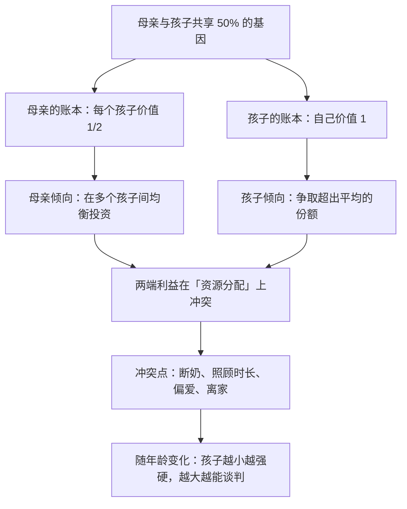

# 12｜父母和子女为什么会冲突？——代际之战

> 父母和子女的基因高度重叠，为什么还会有断奶、争吵与离家出走？

---

## 一、先说结论

这是道金斯全书里最尖锐的一章。

初听起来，「代际冲突」是个悖论：**父母和子女的基因明明高度重叠，他们应该是天然同盟，怎么会冲突？**

道金斯的回答只有一句话：

> **因为重叠是 50%，不是 100%。**

- 对**母亲**来说，每个孩子是「一半的自己」；
- 对**孩子**来说，**自己才是全部**。

于是：

> **父母希望在每个孩子之间均衡投资；而每个孩子都希望自己多分一点。**

断奶、哭闹、撒娇、争宠、青春期叛逆、离家出走——**在道金斯看来，这些都是同一场不对称博弈的不同表现。**

---

## 二、我们先理解一个问题

先看一个所有父母都会遇到的场景。

一个婴儿半夜大哭。母亲已经连续两周没睡好觉。

现在问：

> **婴儿为什么哭得那么大声、那么持久、那么「不体谅」？**

常识答案是：「他难受」「他还小不懂事」。

但道金斯式的追问是：

> **如果哭是「沟通」，为什么婴儿的哭声设计得如此难以忍受，以至于父母根本无法忽视？**

再深一层：

> **如果母亲和孩子的利益完全一致，为什么需要这种「强迫对方关注我」的机制？**

---

## 三、作者到底提出了什么观点？

道金斯关于代际冲突的论证，可以拆成五点。

**第一，从孩子的视角：自己比兄弟姐妹更「值钱」。**

对母亲来说，每个孩子的基因价值都是 1/2。**但对孩子自己来说，自己的价值是 1。**

所以当资源有限时：

- **母亲倾向于「平均分配」**，因为多保住一个孩子就多一份 1/2；
- **孩子倾向于「多要一点」**，因为多得到的每一份，对自己是 100% 的收益。

**第二，所以每个孩子都会「索要更多」。**

道金斯指出，婴儿的哭、闹、撒娇，本质上都是**在向母亲施加压力，争取超出「平均水平」的资源**。

**第三，从母亲的视角：孩子不是唯一的投资对象。**

母亲还有别的孩子、自己的生存、未来可能的再生。**所以她必然要「计算」，而不是无限满足。**

**第四，所以有一系列可预测的冲突节点。**

道金斯列举的典型场景包括：

- **断奶**：母亲想要停止哺乳，孩子想要继续；
- **断奶后的照顾**：母亲想投入下一个孩子，前一个孩子想继续独占；
- **偏爱**：当某个孩子特别弱或特别需要时，母亲可能会偏心；
- **离巢**：父母希望孩子独立，孩子希望继续依赖。

**第五，冲突会随年龄变化。**

道金斯指出，越小的孩子越「任性」（因为母亲的投入对它的生存更关键），越大的孩子越会「讲道理」（因为它已经能自己生存，谈判筹码变少了）。

**这就是为什么青春期的冲突既激烈又短暂——它是一场权力交接。**

---

## 四、把这个观点翻译成人话

我们用一个所有人都懂的现代场景：**分家产。**

假设一位父亲有四个孩子，要分配他的财产。

现在看三种视角：

**父亲的视角（≈ 母亲视角）**：
- 希望平均分配，让每个孩子都能过得好；
- 也会考虑谁是长子、谁更需要、谁照顾过他，做微调；
- 但总体目标是「整体最优」。

**每个孩子的视角**：
- 我希望多分一点，因为**我的收益是 100%**；
- 我可能觉得「我照顾父亲最多，应该多分」；
- 我可能觉得「我条件最差，应该多分」；
- **我永远不会觉得自己分得够多了。**

请注意：**这种冲突不是因为不爱。** 孩子是真的爱父亲，父亲也是真的爱孩子。**冲突来自「利益结构」，不来自感情。**

再做一个对照：

| | 母亲的账本 | 孩子的账本 |
|---|---|---|
| 每个孩子的价值 | 1/2 | 自己 = 1 |
| 面对「多给谁」 | 倾向均衡 | 倾向多要 |
| 面对「停止投入」 | 想转向下一个 | 想继续被投入 |

**同一份资源，两套完全不同的账。这就是代际冲突的全部来源。**

---

## 五、为什么会这样？

为什么母子之间会出现这种结构性冲突？用一张图看这个不对称。

这里有几个特别值得注意的推论：

**第一，冲突是「程度问题」，不是「有无问题」。**

道金斯强调，母子之间的利益**大部分是重叠的**——50% 的重叠意味着**绝大多数时候他们会合作**。**冲突只发生在「多分一点还是少分一点」的边缘上。**

**第二，婴儿的「哭」是一种精确设计的信号。**

它必须足够难以忽视，才能有效施压；又必须不至于让母亲彻底放弃（因为那会毁掉这个孩子）。**这是一个平衡点。**

**第三，「父母偏心」是结构性的，不是道德缺陷。**

当某个孩子更需要帮助时，母亲多投入是合理的；当资源极度紧张时，母亲可能会「放弃」某个孩子（这在动物界很常见）。**这些都不是「坏父母」，而是账本的结果。**

**第四，这也是为什么「父母的爱」从来不是完全无条件的。**

它是有条件、有刻度、有边界的——**而这恰恰是它能够长期存在的原因。**

---

## 六、举一个现实生活中的例子

我们看一个特别真实的场景：**一个妈妈同时照顾婴儿和一个上小学的哥哥。**

**哥哥的行为可能表现为：**

- 突然变得「退化」——本来会自己穿衣服，现在非要妈妈帮忙；
- 故意捣乱——打妹妹、故意犯错误、哭得比妹妹还大声；
- 说「妈妈不爱我了」。

**家长通常会怎么解释？**
- 「他就是嫉妒。」
- 「他就是故意气我。」
- 「大的要让小的。」

**道金斯式的解释会是这样：**

1. 哥哥的「分享额」，因为妹妹的出现被大幅压缩了；
2. 从他的视角看，**这是一次「投资份额的缩减」**；
3. 所以他会**采取一切能增加自己份额的行为**——包括退化成婴儿（因为婴儿能拿到更多关注）；
4. 这不是「变坏」，而是**在资源竞争中的理性（无意识）反应**。

**而母亲的困境则是：**
- 她想平均分配；
- 但婴儿的生存确实更依赖她；
- 所以她不得不偏心；
- 而这又加剧了哥哥的行为。

**这是一个典型的动态博弈：双方的策略都在对方策略的影响下调整。**

**理解这个结构，能带来一个非常实际的转变：**

> **不再把孩子的「任性」当成「道德问题」，而是把它当成「分配问题」。**

比如：给哥哥一段专属时间（恢复他的份额感），比单纯地说「你要懂事」有效得多。

**这就是道金斯框架的实用价值：它把「道德责备」换成「结构诊断」。**

---

## 七、回到书中重新理解

现在回到第八章「代际之战」，道金斯的原始表述会更清楚。

他在这章里明确提出：**父母与子女之间的利益并不完全一致，因为它们的相关度只有 50%。**

他还特别强调了一个反直觉的判断：

> **从基因的视角看，一个母亲对孩子的「爱」和「投资」，是有额度的。**

他举了很多具体的行为例子（比如哺乳、断奶、保护、训练独立），并指出**这些行为在两代之间的「最优时点」是不同的**：母亲希望更早，孩子希望更晚。**这种时点上的分歧，就是冲突的来源。**

他也讨论了「溺爱」和「忽视」的极端情况，并指出它们都是**投资策略的偏差**，而不是单纯的情感问题。

**这一章最重要的贡献，是把「家庭」从一个「无条件的爱」的领域，重新描述成一个「有算计、有边界、有博弈」的领域。**

**而恰恰是这种清醒，让「爱」显得更珍贵**——因为它不是必然的，而是在利益不完全一致的情况下，仍然选择投入。

这是道金斯在第 21 篇会回到的主题。

---

## 八、这个观点背后还有什么？

**隐含前提一：父母能控制投资。**

这依赖父母对资源的掌控程度。**在极端贫困或资源完全不可控的环境下，「投资策略」这个说法就失去了操作空间。**

**隐含前提二：孩子能「谈判」。**

对婴儿来说，谈判手段只有哭闹和可爱。**但道金斯指出，婴儿的「可爱」本身可能就是演化出来的「谈判筹码」——它能提高父母对它的投入意愿。**

**隐含前提三：遗传度可以解释家庭冲突。**

这一条是个大假设。**文化、依恋模式、经济条件、代际创伤，都会深刻影响亲子关系。** 基因视角只是其中一层。

**与其他观点的联系：**
- 第 09 篇的汉密尔顿法则是这一篇的基础；
- 第 13 篇的「计划生育」是同一逻辑的另一面（数量与质量的权衡）；
- 第 14 篇会把「投资」这个概念延伸到两性关系；
- 第 26 篇会回到「如何在理解这套账本之后，依然选择爱」。

---

## 九、这个观点有问题吗？

有，而且这一条的争议非常现实。

**第一，「代际冲突 = 基因博弈」可能过度简化了人类家庭。**

人类的亲子关系深受文化、法律、情感、经济、依恋模式的影响。**把一个非常复杂的现象全部归因于「50% 的相关度」，会漏掉大量真实的东西。**

**第二，这个框架缺少「爱」的维度。**

道金斯解释的是「资源分配」，但人类父母爱孩子的原因，**不只是基因的账**。大量的爱、牺牲、耐心，是无法被「投资策略」完全解释的。

**第三，把婴儿的行为解释为「施压」，可能有些冷酷。**

现代发展心理学认为，婴儿的哭更多是**表达需求与不适**，而不是「策略性地争取份额」。**这两种解释在结果上可能相似，但在理解上差别很大。**

**第四，「父母偏心」可能被用来合理化各种不公平。**

如果「偏心是结构性的」，那么它可能被用来为家长的不当行为辩护。**但结构性的存在，不等于它不能被改善。**

**第五，这个框架几乎无法验证。**

「父母内心深处有 50% 的账本」——这个判断很难被实证检验。**它更像一个解释模型，而不是一个可检验的科学命题。**

---

## 十、今天再看这个观点

「代际冲突」这个框架，在今天有一个非常现实的现代版本：**投资回报的焦虑。**

想一想：

- 为什么父母在孩子的教育上不计成本？——**因为他们把「孩子」当成了最重要的投资标的**；
- 为什么「鸡娃」会失控？——**因为这变成了一个「别人也在投，我不投就落后」的军备竞赛**；
- 为什么孩子会反抗？——**因为被当作投资标的的体验，是「我不是为自己活」。**

**道金斯的账本，在这里变成了一个文化现象：当「投资」超过了「照顾」，亲子关系就会异化。**

还有一个更现代的对照：

**养老问题。** 传统社会里，父母投资子女，子女回报父母——这是一种**跨代互惠**。而在社会保障体系出现后，这个循环被打破了：**投资和回报不再对应同一批人。**

**这改变了家庭的博弈结构**——而这正是道金斯的框架能够帮助我们看到的东西：**当「账本」变了，家庭关系也会变。**

这是**基于道金斯思想的现代延伸**。

---

## 十一、这一篇真正应该记住什么？

1. **代际冲突的根源是：相关度只有 50%，不是 100%。**
2. **母亲倾向均衡投资，孩子倾向多要一点——这是两套不同的账本。**
3. **断奶、争宠、偏心、离家，都是同一场不对称博弈的不同表现。**
4. **孩子越小越「强硬」，越大越能谈判——冲突会随年龄变化。**
5. **理解这个结构，能把「道德责备」换成「结构诊断」，但也要警惕它漏掉了「爱」这一层。**

---

## 十二、留一个问题

> 如果你接受「亲子之间有一本各自不同的账」——**那父母的爱还成立吗？**
>
> 或者反过来问：**是不是正因为账算不平，愿意去爱才更值得被称作「选择」？**
>
> 下一篇，我们看同一枚硬币的另一面——**为什么动物不拼命多生，反而会「计划生育」？**
