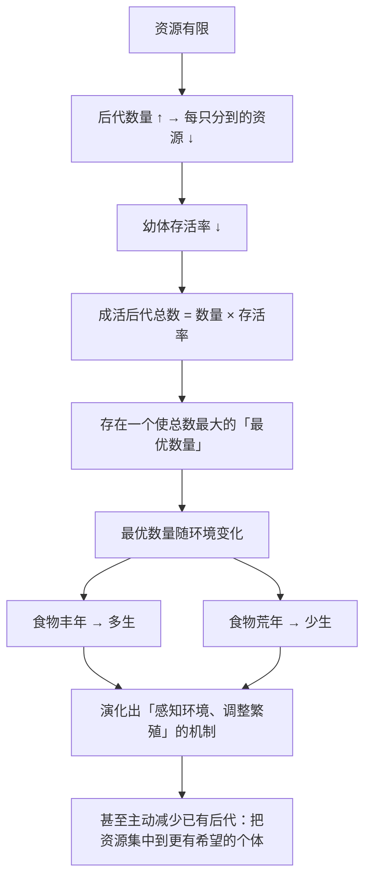

# 13｜动物为什么会「少生孩子」？——计划生育

> 如果基因只想尽可能多地复制自己，为什么动物不拼命多生？

---

## 一、先说结论

按照「基因要最大化自己的拷贝数」这个直觉，动物应该：**能生多少生多少，越多越好。**

但真实的自然界恰好相反：

- 鸟类的窝卵数往往是**固定的**（比如某种鸟总是下 4 个蛋）；
- 有些动物在食物不足时会**主动放弃**繁殖；
- 灵长类动物的繁殖间隔很长，幼崽数很少。

道金斯引用拉克的理论给出解释：

> **后代的「数量」和「质量」之间存在权衡。多生几个，就意味着每个分到的资源更少，可能一个都养不大。**

所以：

> **基因最大化的不是「数量」，而是「期望总收益」。**

而当环境恶化时，「少生」反而可能是最优策略。**这就是动物版的「计划生育」。**

---

## 二、我们先理解一个问题

先看一个非常直观的场景。

假设有一只鸟，今年食物充足。它可以：

- **方案 A**：下 4 个蛋，每只雏鸟都能吃饱长大；
- **方案 B**：下 8 个蛋，食物被摊薄，结果每只都瘦弱，最坏情况一只都活不下来。

现在问：

> **如果目标是「尽可能多地留下后代」，哪个方案更好？**

直觉会选 B（数量多）。但请算一下期望：

- 方案 A：4 只全部成活 = **4 个后代**
- 方案 B：8 只里可能活 2 只、1 只、甚至 0 只 = **期望可能只有 1–2 个后代**

**方案 A 赢了。**

所以问题不是「多生好还是少生好」，而是：**在给定的资源下，生多少才是最优的？**

---

## 三、作者到底提出了什么观点？

道金斯关于「计划生育」的论证，可以拆成五点。

**第一，资源是有限的。**

食物、领地、时间、父母的精力——都是硬约束。**这必然导致「数量」和「质量」的权衡。**

**第二，存在一个「最优窝卵数」。**

道金斯引用了拉克的研究：**鸟类有一个最优的窝卵数，既不是越多越好，也不是越少越好。** 在这个数量上，成活的幼鸟总数最大。

**第三，最优数量随环境变化。**

道金斯特别强调：**最优窝卵数不是一个固定数字，而是一个随环境调整的判断。**

- 食物丰年 → 可以多生；
- 食物荒年 → 应该少生；
- 领地质量差 → 应该少生。

**第四，所以动物进化出了「感知环境并调整繁殖」的能力。**

这就是为什么有些鸟类会根据食物供应决定下几个蛋；有些哺乳动物在压力或饥饿时会停止排卵。

**第五，最惊人的是：动物会「主动减少」已有后代。**

道金斯指出，很多物种会：

- 把多余的蛋推出巢外；
- 让最弱的幼崽饿死（**这叫「选择性淘汰」**）；
- 主动杀死部分后代。

**这在道德上极其残酷，但在账本上是「把资源集中到更可能成活的后代身上」。**

---

## 四、把这个观点翻译成人话

我们用一个现代人都能理解的类比：**创业公司的资源分配。**

假设一家公司拿到了一笔有限的资金。现在有两条路：

**方案 A（分散投资）**：
把钱平均分成 10 份，投 10 个小项目。
结果：每个项目都缺人缺钱，10 个都做不好，可能全军覆没。

**方案 B（集中投资）**：
把钱集中在 3 个最有希望的项目上。
结果：3 个项目都跑出来了。

**这就是「窝卵数」的逻辑。**

而且注意：**这个决策不是固定的。**

- 如果今年市场特别好（融资容易），可以多投几个；
- 如果市场很冷，就只投最核心的；
- 如果已经投了 5 个，发现其中 1 个明显没戏，**最理性的做法是砍掉它，把资源给另外 4 个**。

**最后那一步，就是动物「淘汰弱崽」的组织版本。**

**残酷吗？残酷。但它是资源约束下的最优解。**

所以道金斯说的「计划生育」，不是「动物有意识地节育」，而是：**那些「不考虑环境、拼命多生」的基因，因为后代成活率低，反而在竞争中被淘汰了。**

**留下来的，是那些「会算这笔账」的基因。**

---

## 五、为什么会这样？

为什么「最优数量」会存在，而且是动态的？用一张图看这个权衡。

这里有几个非常关键的推论：

**第一，「少生」不是失败，而是理性。**

表面上，少生的个体「输」了。但从**期望成活后代数**看，它可能赢了。

**第二，动物是在「对环境的短期预测」下决策的。**

鸟类根据今年春天的食物量决定下几个蛋——**它是在用当下的信息，预测未来几个月的资源。** 这是一种朴素但有效的预测。

**第三，人类是这个逻辑的「失控版本」。**

人类拥有技术和医学，能够大幅降低幼体死亡率。**这直接打破了原来的权衡**——于是「多生」在很长一段时间里变成划算的策略。

**而一旦教育成本、城市化、女性就业率上升，「质量」的权重又急剧上升，生育率就掉下来了。**

**也就是说：人类生育率的下降，虽然不完全是「基因的安排」，但它遵循的正是同一套「数量 vs 质量」的权衡逻辑。**

---

## 六、举一个现实生活中的例子

我们看一个特别有当代感的场景：**一个家庭决定要不要生二胎、三胎。**

**影响这个决定的，恰恰是道金斯描述的那几个变量：**

| 变量 | 影响方向 |
|---|---|
| 家庭收入 | 越高，越可能多生 |
| 教育成本 | 越高，越倾向于少生（而把资源集中） |
| 托育支持 | 越强，越可能多生 |
| 女性职业成本 | 越高，越倾向于少生 |
| 居住空间 | 越紧，越倾向于少生 |
| 对未来收入的预期 | 越稳定，越可能多生 |

**你会发现：这些变量和「鸟类根据食物量决定下几个蛋」是同一个逻辑。**

只是人类多了一层：**我们能用语言和计算，把「权衡」变成一个可以被讨论的决策。**

再看一个特别有冲击力的对照：

**在传统农业社会，孩子是「劳动力 + 养老保障」，多生是资产；**
**在现代城市社会，孩子是「教育投入 + 长期支出」，多生是负债。**

**同一个基因，在两种环境里会得出相反的结论。**

**这说明「少生」不是基因变了，而是环境变了，最优解跟着变了。**

---

## 七、回到书中重新理解

现在回到第七章「计划生育」，道金斯的原始表述会更容易读懂。

他在这章里提出了一个重要的方法论澄清：

> **动物的「计划生育」不是有意识的决定，而是自然选择筛选出来的结果。**

也就是说：**那些「不顾环境、拼命生」的个体，它们的后代成活率低，基因反而传得少；而「会算账」的个体，后代成活多，基因传得广。**

他还强调了一个很重要的判断：

> **个体不会「为了物种的利益」而节制生育。** 它节制，是因为「在资源约束下，节制对自己更有利」。

**这句话很重要，因为它区分了两种完全不同的解释：**

| 解释 | 逻辑 | 道金斯是否支持 |
|---|---|---|
| 群体利益说 | 为了物种不灭绝，所以节制 | ❌ 不支持 |
| 个体利益说 | 为了自己的后代成活更多，所以节制 | ✅ 支持 |

**而这也再次呼应了第 02 篇的「选择单位」问题。**

---

## 八、这个观点背后还有什么？

**隐含前提一：动物能感知环境并调整。**

这需要一定的信息处理能力。**对非常简单的生物，这种「调整」可能是程序化的（比如营养状况直接影响排卵）。**

**隐含前提二：后代质量可以补偿数量。**

这是权衡逻辑的核心。**如果一个后代即使只有很少的资源也能成活，那么「多生」就总是更优——这就是为什么在资源极其丰富、或幼体不需要照顾的物种中，会出现「r 策略」（生得多、不管）。**

**隐含前提三：父母对「成活概率」有判断能力。**

这其实是道金斯论证中最难的部分——**动物如何「知道」哪个幼崽更可能成活？** 答案往往是一些外在线索：体型、叫声、活跃度。

**与其他观点的联系：**
- 第 12 篇的「代际之战」讲的是「如何分配」；
- 这一篇讲的是「生多少」，两者是同一账本的两个维度；
- 第 14 篇会把「投资」这个概念推广到两性；
- 第 26 篇会回到「当人类打破了这个权衡，会发生什么」。

---

## 九、这个观点有问题吗？

有，值得注意的有四点。

**第一，「动物在做计划生育」这个说法容易被过度拟人化。**

动物不会「计划」。**它们只是被筛选出了「对环境敏感」的繁殖机制。** 这个区别在传播中经常被抹掉。

**第二，「最优窝卵数」的实证证据并不完全一致。**

拉克的假说在部分鸟类中得到支持，但在其他物种中，**实际窝卵数往往低于或高于理论预测的最优值**——说明还有其他约束在起作用。

**第三，这个框架解释「数量」，但不解释「为什么有些动物生几百个蛋」。**

需要区分「r 策略」和「K 策略」：**前者是「多生、不管」，后者是「少生、精养」。** 两者都是不同环境下的最优解。

**第四，人类生育行为的解释，基因框架远远不够。**

避孕技术、女性受教育程度、城市化、社会保障、文化观念——**这些因素的影响，远远超过「基因的账」。** 把人类生育率简单套进「最优窝卵数」，是一种不恰当的类比。

---

## 十、今天再看这个观点

「数量 vs 质量」这个权衡，今天在一个全新的领域出现了：**内容生产。**

- **多而浅**：一天发 10 条，追求曝光总量；
- **少而精**：一周发 1 条，追求单条质量。

这几乎就是「r 策略」与「K 策略」的现代版本。而哪一个更优，取决于：

- 平台的推荐机制（相当于「资源」）；
- 竞争的激烈程度（相当于「环境」）；
- 受众的注意力存量（相当于「食物量」）。

**道金斯框架的启示是：**

> **不存在「最佳发布频率」，只存在「在当前环境下的最优数量」。**
>
> **当环境变化时，最优解会跟着变——所以在内容行业里，唯一不变的策略是「持续校准」。**

另一个更宏观的对照是：

**AI 训练也在做同样的权衡。** 用多大的模型、多少数据、训多少轮——**这本质上是「数量 vs 质量 vs 成本」的同一个账本。**

这是**基于道金斯思想的现代延伸**。

---

## 十一、这一篇真正应该记住什么？

1. **基因最大化的不是「数量」，而是「期望总收益」。**
2. **数量与质量存在权衡，所以存在一个「最优窝卵数」。**
3. **最优数量随环境变化：食物丰年多生，荒年少生。**
4. **「少生」不是道德或理性选择，而是被筛选出来的策略——不算这笔账的基因被淘汰了。**
5. **人类打破了这个权衡（医学降低了死亡率），所以生育逻辑才会出现反常。**

---

## 十二、留一个问题

> 如果「多生」和「精养」在基因账本上只是两种环境下的最优解——那么今天很多人的生育焦虑，到底是在焦虑「孩子」，还是在焦虑「账本」？
>
> 下一篇，我们进入两性关系——**为什么从配子开始，雌雄就注定不平等？亲代投资理论。**
