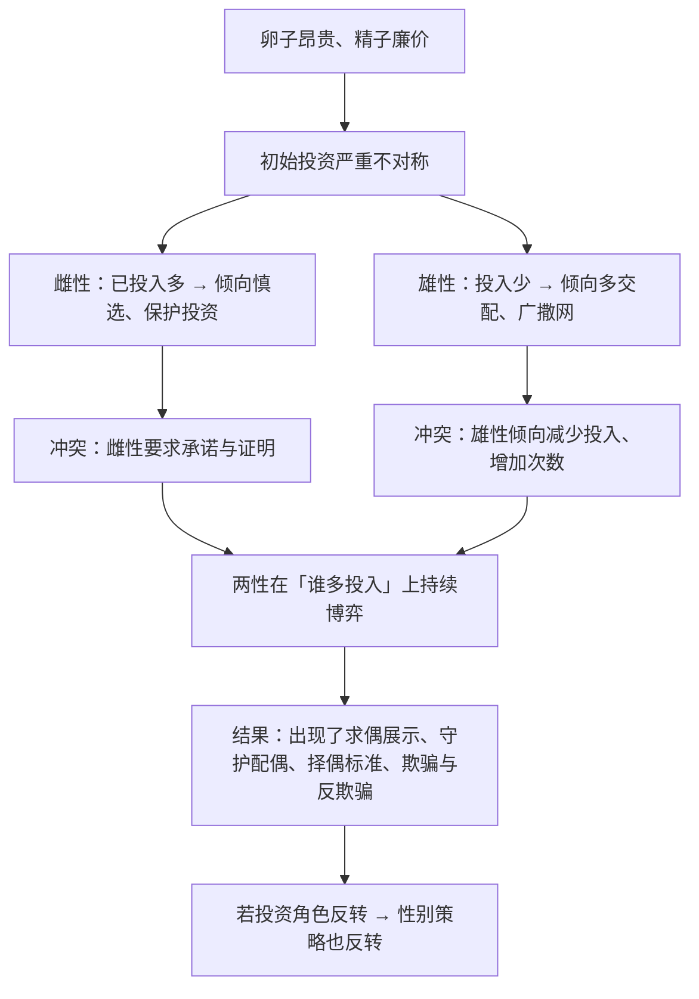

# 14｜两性之间为什么注定有冲突？——亲代投资

> 为什么雄性普遍「花心」，雌性普遍「挑剔」？这种不平等到底从哪里来？

---

## 一、先说结论

道金斯和特里弗斯的回答是：

> **不平等从「配子」就开始了——卵子又大又贵，精子又小又便宜。**

因为投资不对称：

- **投资多的一方**（通常是雌性）会变得**谨慎、挑剔**，因为它输不起；
- **投资少的一方**（通常是雄性）会倾向于**广撒网**，因为多试一次的成本很低。

这就是「亲代投资」理论：

> **两性的冲突不是道德问题，而是投资结构问题。**

而这背后的关键概念是：

> **「被利用」是一件坏事。在繁殖这件事上，两性各自都想让对方多投资一点。**

---

## 二、我们先理解一个问题

先看一个极为常见的现象。

在绝大多数动物里：

- 雄性会为了争夺交配权而竞争、打斗、炫耀；
- 雌性则相对挑剔、审慎、缓慢。

常识解释通常是：「雄性天生花心」「雌性天生忠贞」。

**但道金斯式的追问是：**

> **为什么「花心」的偏偏是雄性，而不是雌性？**

如果只是「性格」问题，那为什么整个自然界会是这么一致的规律？

更奇怪的是：

> **在少数「雄性负责孵卵、雌性去竞争」的物种中，恰恰是雌性变得花心、雄性变得挑剔。**

这说明什么？

**说明这不是「雄性或雌性的性格」，而是「投资角色的后果」。**

---

## 三、作者到底提出了什么观点？

道金斯关于亲代投资的论证，可以拆成五点。

**第一，不平等从配子开始。**

- 卵子：大、昂贵、数量少、含营养；
- 精子：小、廉价、数量巨大。

**受精的那一刻，双方已经投入了极不对等的资源。**

**第二，投资多的一方，天然更「舍不得」。**

一只雌性如果投入了大量营养、时间和风险，她会倾向于**慎选对象、保护投资、减少冒险**。

**第三，投资少的一方，天然更「无所谓」。**

对雄性来说，多交配一次的成本极低。**因此他会倾向于追求次数，而不是质量。**

**第四，所以产生了两种策略。**

- 雌性：**挑剔、筛选、要求证明**；
- 男性：**竞争、展示、广撒网**。

**注意：这两种策略都不是「道德问题」，而是「投资结构」的结果。**

**第五，谁投资多，谁就挑剔——角色可以互换。**

道金斯特别指出：**在雄性承担主要养育责任的物种里，性别角色会反转。** 比如某些鱼类、鸟类（如三趾鹑），雌性反而更艳、更好斗、更花心。

**这就证明了：不是「性别」决定了行为，而是「投资」决定了行为。**

---

## 四、把这个观点翻译成人话

我们用一个现代商业类比：**投资人与创业者。**

假设你是一个投资人，手里有 1000 万，只能投一个项目。

你会：

- **极度谨慎**，反复尽调，问各种刁钻问题；
- **要求对方证明**（有数据、有团队、有护城河）；
- **不会轻易承诺**。

现在假设你手里有 1000 块，可以投 100 个项目，每个 10 块。

你会：

- **快速决策**，看到有点意思就投；
- **不要求太多证明**；
- **广撒网**。

**这两者不是「性格差异」，而是「筹码结构」决定的。**

现在把它套到性别的生物学上：

| | 雌性（卵子） | 雄性（精子） |
|---|---|---|
| 初始投入 | 大（卵子昂贵） | 小（精子廉价） |
| 数量 | 少 | 极多 |
| 策略 | 挑剔、慎选 | 竞争、广撒网 |
| 类比 | 大额投资人 | 天使投资人 |

**「挑剔」不是保守，「广撒网」不是不负责任——它们各自都是投资结构下的理性反应。**

而这也解释了道金斯说的那句话：

> **在繁殖这件事上，双方都想「让对方多投资一点」。** 因为多投资的一方，承担的风险更大。

---

## 五、为什么会这样？

为什么投资不对称会制造出「两性冲突」？用一张图看这个博弈。

这里有三个特别值得注意的推论：

**第一，冲突是内生的，不是「道德败坏」。**

只要投资不对称存在，冲突就必然存在。**它是结构性的，不是个别人的问题。**

**第二，所有「求偶现象」都可以被理解为「议价过程」。**

- 雄性的炫耀 = 展示投资能力；
- 雌性的挑剔 = 提高对方的准入成本；
- 雄性的「承诺」= 提高自己的可信度。

**第三，投资角色反转是这套理论的「关键实验」。**

如果「谁投资多谁挑剔」是对的，那么在雄性投资多的物种里，就应该看到相反的现象。**而这在自然界确实被观察到了。**

**这一点，是这门理论最有力的证据。**

---

## 六、举一个现实生活中的例子

我们看一个特别当代的场景：**相亲市场。**

很多人会观察到一些「规律」：

- 一方更看重「条件」（房子、收入、家庭）；
- 另一方更看重「感觉」和「外在」。

现在的问题是：**这个「规律」到底是「性别天性」，还是「结构问题」？**

**道金斯式的分析会拆成几个变量：**

| 变量 | 影响 |
|---|---|
| 谁承担生育的身体成本 | 承担者更谨慎 |
| 谁承担主要养育成本 | 承担者更谨慎 |
| 生育窗口的长短 | 窗口短的一方更挑 |
| 经济地位的差异 | 资源少的一方更谨慎 |
| 年龄与再婚难度 | 直接影响「再投资」的成本 |

**关键在于：当这些变量改变时，「谁更挑剔」也会改变。**

所以你会观察到：

- 在高收入女性群体中，「挑剔」的方向会变化（更看重情感与匹配，而非纯经济）；
- 在生育成本被社会分担（托育、产假）的地区，「投资不对称」被削弱，两性策略也会更趋近；
- 在男性承担主要养育成本的关系中，会出现明显的角色反转。

**这说明：道金斯说的不是「男的就该花心、女的就该挑剔」，而是「投资结构决定策略」。**

**而投资结构是可以被改变的**——这也是这一篇最实用的一层含义。

---

## 七、回到书中重新理解

现在回到第九章「两性战争」，道金斯的原始表述会更容易读懂。

他在这章引入了特里弗斯的「亲代投资」概念，并给出了一个关键定义（大意）：

> **亲代投资，是指父母为某个后代付出的、以牺牲对其他后代投资能力为代价的任何投入。**

**这个定义的精髓在于「机会成本」** ——不是「投入了多少」，而是「这份投入让父母放弃了什么」。

他还提出了一个很重要的观察：

> **在任何一个物种里，投资少的一方，会在繁殖竞争中更主动、更挑剔地选择对象——因为它的成本低。**

**注意这里有一个反直觉的地方：** 我们通常以为「挑剔」是强势的表现，但**在道金斯的框架里，「挑剔」其实是因为「输不起」。**

这也解释了为什么「被追求的一方」往往是「更有议价权的一方」——**它手里握着的资源更稀缺。**

道金斯还讨论了「雌性如何迫使雄性多投资」的一系列策略（如要求长时间的求偶、拒绝立即交配），以及「雄性如何欺骗少投资」的策略。**这就是所谓的「两性战争」。**

---

## 八、这个观点背后还有什么？

**隐含前提一：两性的投资差异是普遍存在的。**

在绝大多数物种里确实如此。**但在人类中，随着技术、制度、文化的介入，这个差异被大幅削弱了。**

**隐含前提二：「投资少的一方更主动」是一个演化倾向，不是个体规律。**

它描述的是**统计上的倾向**，不适用于每一个个体。**用它来预测某个具体的人，是不靠谱的。**

**隐含前提三：繁殖是行为的核心目标。**

这是演化生物学的标准假设。**但在人类身上，性行为、亲密关系、婚姻都有大量非繁殖的功能和意义。**

**与其他观点的联系：**
- 第 12 篇的「代际之战」讲的是「父母如何分配投资」，这一篇讲的是「谁来投资」；
- 第 15 篇会讲「雌性如何筛选，雄性如何展示」；
- 第 16 篇会转向「非亲属之间如何合作」，与这一篇形成对照。

---

## 九、这个观点有问题吗？

有，而且这一条特别容易被误用。

**第一，它极易被用来为性别刻板印象辩护。**

「雄性花心是基因决定的」「女性天生就该挑经济条件」——**这类说法在公共讨论中非常常见，而它们恰恰是对这个理论的粗暴简化。**

道金斯的理论是**描述性的**，它不能推出「应该如何」。**而且它预测的是「倾向」，不是「个体」，更不是「宿命」。**

**第二，「投资不对称」在人类中远没有在动物中那么强。**

避孕技术、女性经济独立、育儿社会化、法律保障——**这些都在系统性削弱投资的不对称性。** 所以用动物模型直接套人类，误差极大。

**第三，它忽略了「性」在人类中的非繁殖功能。**

依恋、亲密、愉悦、身份认同、情感连接——**人类性行为的动机远比「繁殖」复杂。** 全用亲代投资解释，会严重失真。

**第四，这套理论对「同性别关系」「无生育关系」几乎无法解释。**

如果一切从繁殖出发，那么不生育的关系就成了「异常」。**但现实中它们大量存在，而且完全是正常的。**

**第五，「被利用」这个表述可能带来过度对抗的框架。**

把两性关系描述为「战争」，虽然在理论上精确，但在现实中**容易强化对立，忽略了合作与共同利益**。

---

## 十、今天再看这个观点

「亲代投资」这套框架，今天最有价值的迁移，是**谈判与议价分析**。

想一想商业谈判：

- **谁已经投入得更多，谁就更难退出**（沉没成本）；
- **谁的选择更多，谁的议价权就更大**；
- **因此谈判的关键，往往不是「说服对方」，而是「改变双方的选择空间」**。

**这和「谁投资少谁更主动」是同一个结构。**

而在人际关系里，这个框架也能带来一个很有用的自觉：

> **当你发现自己「特别舍不得」时，先别急着问「我是不是太爱了」，
> 先问「我是不是已经投入得太多了」。**

**这不是冷漠，而是清醒。清醒之后再去爱，才是选择。**

这是**基于道金斯思想的现代延伸**。

---

## 十一、这一篇真正应该记住什么？

1. **不平等从配子开始：卵子贵、精子便宜，投资天然不对称。**
2. **投资多的一方谨慎挑剔，投资少的一方广撒网——这是结构，不是道德。**
3. **谁投资多谁挑剔；在雄性育幼的物种里，性别角色会反转。**
4. **两性冲突是内生的：双方都想让对方多投资。**
5. **在人类中，投资不对称被技术、制度、文化大幅削弱，不能直接套用动物模型。**

---

## 十二、留一个问题

> 如果你在一段关系里觉得自己「很被动」，先不要问「他为什么这样」——**先问「是不是我投入得更多、选择更少」？**
>
> 这个问题，会不会让你更清醒，而不是更怨？
>
> 下一篇，我们来看这套博弈最华丽的表现——**孔雀的尾巴是个累赘，为什么反而成了择偶优势？**
