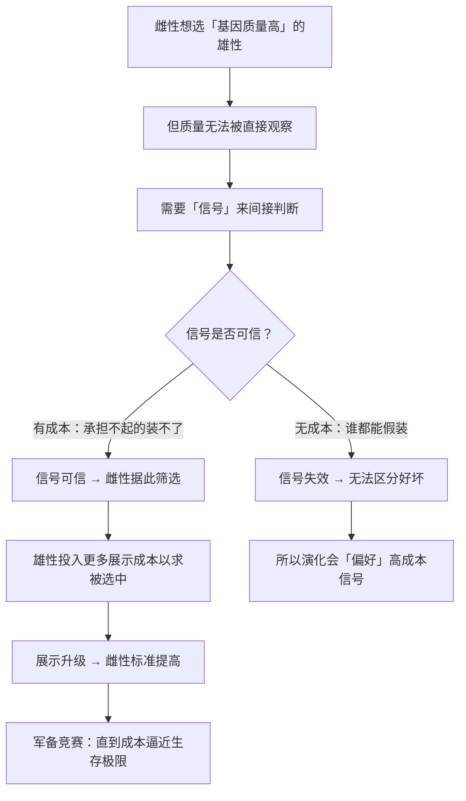

# 15｜雌性为什么挑剔，雄性为什么炫耀？——性选择与「广告」

> 孔雀的尾巴又重又累赘，为什么反而成了择偶优势？

---

## 一、先说结论

道金斯在这一篇要解释一个看起来很矛盾的现象：

> **如果演化只筛选「生存优势」，那么孔雀的尾巴、雄鹿的巨角、青蛙响亮的叫声——这些都是纯粹的负担，应该被淘汰。**

但它们不但没被淘汰，反而越演越夸张。为什么？

答案是：

> **因为繁殖成功不等于生存成功。** 自然选择之外，还有一层更强的筛选——**性选择**。

而性选择的核心逻辑是：

> **雌性用挑剔来筛选「好基因」，雄性用夸张的展示来证明自己的质量。**
>
> **所以「炫耀」不是浪费，而是广告。**

---

## 二、我们先理解一个问题

先看一个直觉上说不通的现象。

一只雄孔雀拖着一条一米多长的尾巴。它：

- 飞行笨拙，容易被捕食者抓住；
- 消耗大量能量；
- 行动不便，觅食效率低。

**按「适者生存」的逻辑，这样的雄孔雀应该早就被淘汰了。**

但事实是：**尾巴越大、越华丽的雄孔雀，越容易找到配偶，留下的后代越多。**

于是问题来了：

> **为什么雌性会选择那些「看起来更难生存」的雄性？**

---

## 三、作者到底提出了什么观点？

道金斯关于性选择的论证，可以拆成五点。

**第一，繁殖成功和生存成功是两件事。**

自然选择看的是「活下来」，性选择看的是「被选中」。**一个生命力很强但没人愿意交配的个体，基因照样断掉。**

**第二，雌性的挑剔是一种「质量筛选」。**

因为雌性投资多、输不起，所以她必须尽量选到**基因质量高、或能提供资源**的雄性。**挑剔是提高期望收益的方式。**

**第三，雄性的展示是一种「质量证明」。**

这里有一个很精妙的地方：**如果一只雄性带着这么重的负担还能活到现在，那说明他的基因一定很好。**

**换句话说，尾巴是在说：**
> **「我拖着这么大的累赘都没死，你说我有多强？」**

**第四，所以展示是一种诚实的信号。**

道金斯和扎哈维的「累赘原理」指出：**一个信号要可信，它必须是有成本的。** 如果没有成本，谁都能假装「我很强」，于是信号就失去意义。

**第五，于是出现「演化军备竞赛」。**

雌性的标准提高 → 雄性需要更强的展示 → 展示变得更强 → 雌性的标准再提高……**这是一个持续升级的循环**，直到展示的成本高到接近生存的极限。

---

## 四、把这个观点翻译成人话

我们用一个现代社会最直观的类比：**简历与学历。**

假设你在招人。你面前有两类候选人：

**候选人 A**：履历平平，没读什么书，说自己「能力很强」。
**候选人 B**：名校毕业，发过论文，拿过奖，说自己「能力很强」。

**大概率你会选 B。**

为什么？不是因为你迷信名校，而是因为：

> **B 的成本更高——他花了十几年读书、通过一堆筛选，才能站在这里。**

**高成本本身就是一个信号：能承担这个成本的人，大概率具备相应能力。**

这就是「累赘原理」：

| 动物世界 | 人类社会 |
|---|---|
| 孔雀的华丽尾巴 | 名校学历 / 大厂履历 |
| 「我背着这么大的累赘还能活」 | 「我通过了这么多筛选，我有能力」 |
| 展示成本高 → 信号可信 | 教育成本高 → 信号可信 |
| 雌性挑剔 | 用人单位筛选 |

**但这里有一个关键的补充：**

**信号不一定真的对应能力。**

有些尾巴只是「好看」，有些学历只是「会考试」。**这引出了下一层：欺骗与识别欺骗的军备竞赛。**

**而这恰恰是道金斯说的「两性战争」——一方想展示，一方想识破。**

---

## 五、为什么会这样？

为什么「高成本」能成为一个可信的信号？用一张图看这个逻辑。

这里有几个关键推论：

**第一，「浪费」在演化里往往是有功能的。**

尾巴、鹿角、歌喉、筑巢——**它们看起来是纯消耗，实际上是在传递信息。**

**第二，诚实的信号必须「付得起代价」。**

如果炫耀没有成本，那么所有个体都会假装，信号就失去了区分能力。**所以「昂贵的信号」是必要的。**

**第三，这是一场没有终点的竞赛。**

只要存在「装得更好」的可能，标准就会继续上升。**这就是为什么自然界有那么多看起来「夸张到荒谬」的展示。**

**第四，人类社会的很多现象，也是这场竞赛的延伸。**

奢侈品、名校文凭、豪车、社交媒体的精致生活——**它们都在传递「我付得起这个成本」这个信号。**

---

## 六、举一个现实生活中的例子

我们看一个特别有当代感的场景：**社交媒体的「晒」。**

为什么有人要晒：

- 豪华酒店、头等舱；
- 限量球鞋、名牌包；
- 健身成果、读书打卡；
- 精心布置的咖啡馆照片。

**从性选择的角度看，这些行为都有一个共同逻辑：**

> **它们在传递「我有能力承担某种成本」这个信号。**

| 展示内容 | 传递的信号 |
|---|---|
| 昂贵消费 | 资源充裕 |
| 健身成果 | 自律与健康 |
| 读书与专业输出 | 智力与投入 |
| 精致生活 | 时间与品味 |

**这几乎就是「孔雀开屏」的社会版本。**

但道金斯框架的洞见在于，它同时指出了这个系统的脆弱之处：

**当「展示」变得可以伪造，信号就会贬值。**

- 滤镜可以伪造颜值；
- 摆拍可以伪造生活；
- 抄袭可以伪造专业；
- 租车可以伪造财富。

**于是出现了「军备竞赛」：**

- 展示者不断升级伪装技术；
- 观察者不断提高识别能力；
- 平台的算法又在放大最容易被传播的展示。

**这就是道金斯说的「两性战争」在社交时代的形态。**

而它也解释了一个很微妙的现象：

> **越是「看起来完美」的展示，越容易让人怀疑。**
>
> 因为人本能地知道：**可信的信号需要成本，而「完美」往往是伪造的标志。**

---

## 七、回到书中重新理解

现在回到第九章后半部分，道金斯讨论「雌性选择」和「雄性炫耀」时，会更容易理解。

他指出，雌性的挑剔并不是「审美偏好」，而是**一种投资保护机制**——她在用自己的稀缺资源（卵子与养育）去换一个尽可能好的基因组合。

而雄性的展示，也不是「虚荣」，而是**一种竞争投资**——他在用自己的生存资源（能量、风险）去买繁殖机会。

**双方都在投资，只是投资的资产不同。**

道金斯还讨论了一个重要概念：**性选择可以「跑赢」自然选择。** 也就是说，如果雌性的偏好足够强烈，雄性的展示可以演化到「明显损害生存」的程度——**只要繁殖收益大于生存损失。**

**这就是为什么会有「过度设计」的现象。** 它看起来不合理，但在这套账本里是合理的。

---

## 八、这个观点背后还有什么？

**隐含前提一：雌性能「判断」雄性质量。**

这需要一定的感知与评估能力。**研究确实表明，很多动物的择偶标准与真实质量（如抗病能力、对称性）相关。**

**隐含前提二：展示的成本是可信的。**

这是「累赘原理」的核心。**如果一个信号的成本可以忽略，它就不再可信。**

**隐含前提三：偏好在遗传上是稳定的。**

如果偏好本身变得很快，整个系统就会乱掉。**偏好通常有遗传基础，因此可以稳定地驱动演化。**

**与其他观点的联系：**
- 第 14 篇的「亲代投资」是这一篇的前提；
- 第 16、17、18 篇会转向「非亲属合作」，与这一篇的「竞争」形成对照；
- 第 19 篇的「觅母」会用到同一个「复制 + 竞争 + 选择」的框架。

---

## 九、这个观点有问题吗？

有，值得注意的有四点。

**第一，「好基因假说」并非唯一解释。**

另一种可能是「性感儿子假说」：雌性之所以挑，是因为挑出来的儿子也会受欢迎，从而带来更多孙辈。**这两种解释在数据上都有支持，争论仍在继续。**

**第二，这套理论特别容易被误用为「外貌焦虑」的科学背书。**

「雌性天生爱挑选」「男性天生爱竞争」——**这类说法经常被用来为消费主义、外貌焦虑、性别刻板印象提供「科学依据」。** 但道金斯的理论是描述动物倾向的，不是规范人类行为的。

**第三，人类的择偶远比动物模型复杂。**

情感、价值观、文化、共同经历、社会网络——**这些因素在人类择偶中的作用，可能远超「基因质量信号」。**

**第四，把一切「炫耀」都解释为「信号」有过度解读的风险。**

有些炫耀就是纯粹的快乐、社交需要、或身份表达，**不一定都在「传递可验证的质量信号」。**

---

## 十、今天再看这个观点

「昂贵的信号」这套逻辑，今天最好的应用领域是**信任与品牌**。

想一想：

- 为什么公司愿意花巨资做品牌广告？——**因为它传递「我们付得起这个成本，所以我们大概不会跑路」**；
- 为什么平台要投入大量资源做认证、审核、赔付？——**因为它在传递「我们承担得起长期责任」**；
- 为什么个人愿意花几年读一个难考的证？——**因为成本本身就是可信度。**

**道金斯说的「累赘原理」，其实是一套通用的信任生成机制：**

> **在信息不对称的环境里，最有效的证明方式，往往是「承担一个假装不起的成本」。**

而这个逻辑在今天有一个有趣的反弹：

**AI 让「低成本伪造高成本信号」变得极其容易。**

- 生成的图片可以伪造颜值；
- 生成的文章可以伪造专业；
- 生成的音频可以伪造身份。

**当伪装成本趋近于零，原来的信号体系就会崩塌。** 这不仅是社交问题，也是身份验证、学术诚信、金融安全的核心问题。

**「如何重新建立可信的信号」——这可能是 AI 时代最迫切的问题之一。**

这是**基于道金斯思想的现代延伸**。

---

## 十一、这一篇真正应该记住什么？

1. **繁殖成功 ≠ 生存成功；性选择是独立于自然选择的一层筛选。**
2. **雌性挑剔是投资保护，雄性炫耀是质量证明。**
3. **可信的信号必须有成本——「累赘原理」。**
4. **展示与挑剔之间会形成没有终点的军备竞赛，这就是「过度设计」的来源。**
5. **这套逻辑可以被迁移到品牌、学历、社交媒体——但要注意它描述的是倾向，不是规范。**

---

## 十二、留一个问题

> 如果「昂贵的信号」是可信度的来源，那么在 AI 让伪造成本趋近于零的时代——**什么东西的成本，还是假装不起的？**
>
> 下一篇，我们从「竞争」转向「合作」——**两个毫无血缘关系的动物，凭什么互相帮助？互惠利他的三个硬条件。**
