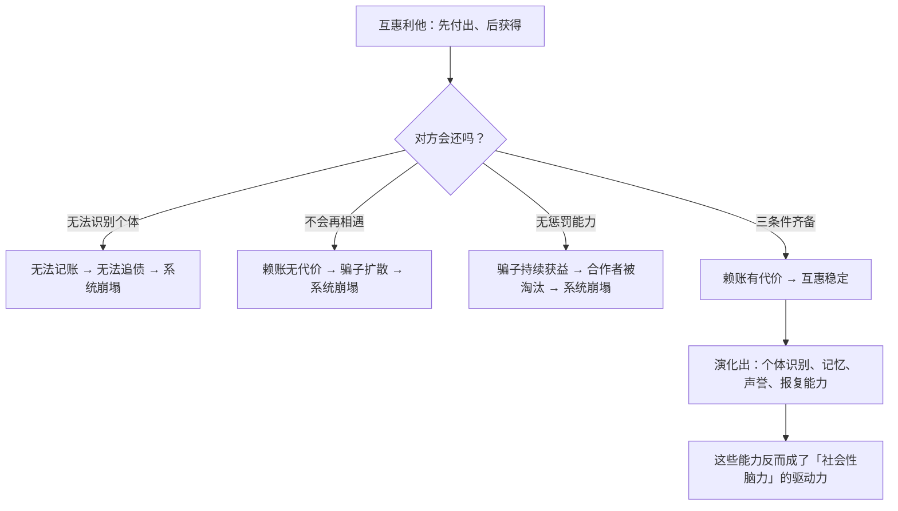

# 16｜非亲属之间为什么会互相帮助？——互惠利他

> 没有亲缘关系，帮助别人在基因账本上怎么算得回来？

---

## 一、先说结论

亲缘选择能解释「帮亲戚」。但自然界里还有大量**非亲属之间的互助**：

- 两条鱼轮流清理对方身上的寄生虫；
- 一只鸟为另一只鸟报警；
- 猴子互相理毛；
- 蝙蝠会把吸到的血反刍喂给饥饿的同伴。

道金斯（引用特里弗斯）给出的答案是：

> **互惠利他：今天我给你，是为了明天你能还。**

但这不是无条件的善意。它有**三个硬条件**，缺一不可：

1. **双方要能长期、反复相遇；**
2. **要能识别对方是谁；**
3. **要能记住并惩罚「欠账不还」的骗子。**

> **本质上，互惠利他是一种「记账 + 执法」的系统。**

---

## 二、我们先理解一个问题

先看一个很常见的场景。

你和同事每天一起吃饭。有一天你没带钱，他帮你付了。

**你会还吗？** 大概率会。

**为什么？**

不是因为你道德高尚，而是因为：

> **你们明天还要一起吃饭。**

现在换一个场景。

你在旅游时，一个陌生人帮你付了饭钱，然后你们再也没有见过。

**你还会特意去还吗？** 很多人可能不会。

**这两个场景的区别在哪里？**

> **不在「你是个什么样的人」，而在「你们还会不会再见」。**

---

## 三、作者到底提出了什么观点？

道金斯关于互惠利他的论证，可以拆成五点。

**第一，互惠利他的基本形式是「延迟交换」。**

不是同时交换（那叫交易），而是**先付出、后获得**。这需要信任，而信任需要条件。

**第二，第一个条件：反复相遇。**

如果两个人不会再见面，那么「赖账」没有任何代价。**所以互惠只在「长期关系」中才稳定。**

**第三，第二个条件：个体识别。**

对方必须能被认出来。**如果无法区分谁是谁，就无法记账，也就无法追债。**

**所以道金斯说：能识别个体、群体稳定的物种，更容易演化出互惠利他。**

**第四，第三个条件：惩罚能力。**

骗子必须付出代价。**如果赖账不会有后果，那么骗子的比例会迅速上升，整个互惠系统就会崩溃。**

**第五，所以互惠利他是一种「有执法的合作」。**

道金斯强调：**这不是温情，而是一套社会机制。** 它依赖记忆、识别、声誉与报复能力。

---

## 四、把这个观点翻译成人话

我们用一个现代场景：**村里的互助。**

在一个传统农村里：

- 张三家盖房子，李四来帮工；
- 明年李四家盖房子，张三去帮工。

**这是一套非常稳定的系统。为什么？**

| 条件 | 在农村里是否满足 |
|---|---|
| 反复相遇 | ✅ 大家一辈子住在一起 |
| 个体识别 | ✅ 谁是谁，全村都知道 |
| 惩罚能力 | ✅ 赖账的话，全村都知道，以后没人帮他 |

**所以互惠能稳定运行几十年。**

现在把这个系统搬到城市：

- 你搬家，找了一群临时工；
- 你付钱，他们干活，结束。
- **没有下次，也没有记账。**

**这就是为什么城市里的人际关系更依赖「即时交易」而不是「互惠」。**

再看一个更现代的场景：**职场。**

- 你帮同事顶了一次班，他会记着；
- 下次你需要帮忙，他会来；
- 但如果有个同事总是「只受不还」——
  - 短期看，他占了便宜；
  - 长期看，他在团队里的声誉破产；
  - **以后没人愿意帮他了。**

**这就是「惩罚」在起作用——不是惩罚行为，而是声誉的惩罚。**

---

## 五、为什么会这样？

为什么互惠利他需要「记账 + 执法」？用一张图看这个逻辑。

注意最后一步，它有一个非常深远的含义：

**互惠利他的需求，可能反过来推动了智力的演化。**

- 要记住谁帮过我 → **需要记忆**；
- 要识别骗子 → **需要辨识能力**；
- 要管理声誉 → **需要复杂的社会认知**；
- 要执行报复又不至于两败俱伤 → **需要策略与克制**。

**这就是后来被称为「马基雅维利智力假说」的一类思路：社会生活的复杂性，是推动大脑变大的重要原因。**

**而互惠利他，是这套复杂社会生活的核心机制之一。**

---

## 六、举一个现实生活中的例子

我们看一个非常真实的场景：**开源社区。**

开源软件是当代最成功的「互惠利他」案例之一。

- 你写了一个库，免费公开；
- 别人用了，报 bug、提 PR；
- 你也用别人写好的库；
- 整个生态因此繁荣。

**现在对照三个条件：**

| 条件 | 开源社区 |
|---|---|
| 反复相遇 | ✅ 长期参与者会反复互动 |
| 个体识别 | ✅ 用户名、贡献记录、GitHub 历史 |
| 惩罚能力 | ✅ 声誉受损、被排除在项目外、被公开批评 |

**这三个条件全满足。所以开源能长期运转。**

再对照一个**失败**的例子：

- 一个匿名论坛，用户可以随意提问、随意获取答案、不需要回报；
- 没有身份、没有历史、没有声誉；
- 结果：**认真回答的人越来越少，大家都只想「白嫖」。**

**这不奇怪——因为三个条件全都不满足。**

**这正是道金斯的框架最实用的地方：它可以预测「什么样的环境能长出合作，什么样的环境不能」。**

---

## 七、回到书中重新理解

现在回到第十章「你为我搔痒，我就骑在你的头上」，道金斯的原始表述会更容易读懂。

他在这章里明确提出了互惠利他的条件，并且做了一个很重要的判断：

> **互惠利他必须建立在「长期关系」的基础上。**

他还特别指出：**动物会「记账」。** 例如，一些研究表明，动物会「保留服务记录」——谁帮过它，它会记得，并且以后优先回报那个个体。

道金斯还讨论了「对称性」的问题：**互惠要求双方大致对等。** 如果一方总是付出更多、而始终得不到回报，这段关系就会终止。

**这一点在人类社会中也完全成立：长期不平等的关系，最终会解体。**

**而贯穿全章的核心判断是：互惠利他不是「无私」，而是「有条件的交换」。**

这和前面的亲缘选择形成了一个漂亮的对照：

| | 亲缘利他 | 互惠利他 |
|---|---|---|
| 前提 | 共享基因 | 长期关系 |
| 机制 | 相关度计算 | 记账与执法 |
| 是否依赖回报 | 否 | **是** |
| 对象 | 亲属 | 任何可信个体 |

---

## 八、这个观点背后还有什么？

**隐含前提一：动物有能力「记仇」和「报恩」。**

这需要记忆和社会认知。**研究表明，很多动物确实具备这种能力。**

**隐含前提二：收益和成本可以比较。**

互惠的前提是「这次付出 < 未来回报」。**如果未来回报不确定，互惠就会变弱。**

**隐含前提三：声誉系统有效。**

如果声誉不能被传播，惩罚就失效。**所以互惠利他通常出现在「小群体、高信息流动」的环境里。**

**与其他观点的联系：**
- 第 09、10 篇是「亲缘利他」，这一篇是「非亲缘利他」的第一种形式；
- 第 17 篇会把互惠推广到「重复博弈」，并给出最优策略；
- 第 18 篇会讨论「骗子」的生态位；
- 第 25 篇会把它延伸到「平台、社区、算法信任」的设计。

---

## 九、这个观点有问题吗？

有，值得注意的有四点。

**第一，实证证据并不总是支持「动物在精确记账」。**

有些研究显示，动物确实会「记账」；另一些研究则认为，**互惠行为可以通过更简单的机制（比如「谁最近对我好我就对谁好」）解释。** 争论仍在继续。

**第二，「互惠利他」容易被浪漫化。**

在公共叙事中，它常被说成「善有善报」，但**它的本质是一套带有惩罚与排除的机制，并不温情。**

**第三，人类合作中还有很多「非互惠」的成分。**

- 纯粹的共情；
- 道德规范（我帮你，不是因为你欠我，而是因为「应该」）；
- 身份认同（同乡、同行、同一信仰）。

**这些因素无法被「互惠」完全解释。**

**第四，强关系网络也可能制造排斥。**

互惠系统天然会区分「自己人」和「外人」。**这在带来合作的同时，也可能带来封闭、排外和小圈子文化。**

---

## 十、今天再看这个观点

「互惠利他三条件」在今天有极强的现实指导意义——**它就是平台与社区设计的基本原理。**

想一想：

- 为什么**实名 + 历史记录**能提升社区氛围？→ 满足了「个体识别」；
- 为什么**长期互动的社群**比一次性匿名平台更友善？→ 满足了「反复相遇」；
- 为什么**举报机制、信用分、封号**是必需的？→ 满足了「惩罚能力」；
- 为什么**「一次性的匿名交易」需要平台担保**？→ 因为三个条件都不满足，需要人工补上信任。

**用这套框架去看任何产品，几乎都能立刻判断出「它会繁荣还是烂掉」。**

而在 AI 时代，这个问题变得更复杂：

- **AI 参与的互动，是否能被「记账」？**
- 当你和很多人、很多 Agent 互动时，「谁帮过我」这个账本还有效吗？
- 如果一切都变成一次性的，信任从哪里来？

**道金斯的答案可能是：只要三个条件被重新建立，互惠就会重新出现。**

**所以问题不是「如何呼吁大家友善」，而是「如何设计出满足三条件的系统」。**

这是**基于道金斯思想的现代延伸**。

---

## 十一、这一篇真正应该记住什么？

1. **互惠利他 = 今天我给你，是为了明天你能还。**
2. **三个硬条件：反复相遇、个体识别、惩罚能力——缺一不可。**
3. **它依赖「记账 + 执法」，不是无私，而是有条件的交换。**
4. **互惠的需求可能反过来推动了社会认知与智力的演化。**
5. **想让人合作，不靠呼吁，靠设计出满足三条件的环境。**

---

## 十二、留一个问题

> 你所在的团队/社区，三个条件满足几个？缺的那一个，正是「合作起不来」的原因吗？
>
> 下一篇，我们来看博弈论给出的最优答案——**在一遍遍重复的囚徒困境里，什么样的策略最终能赢？**
