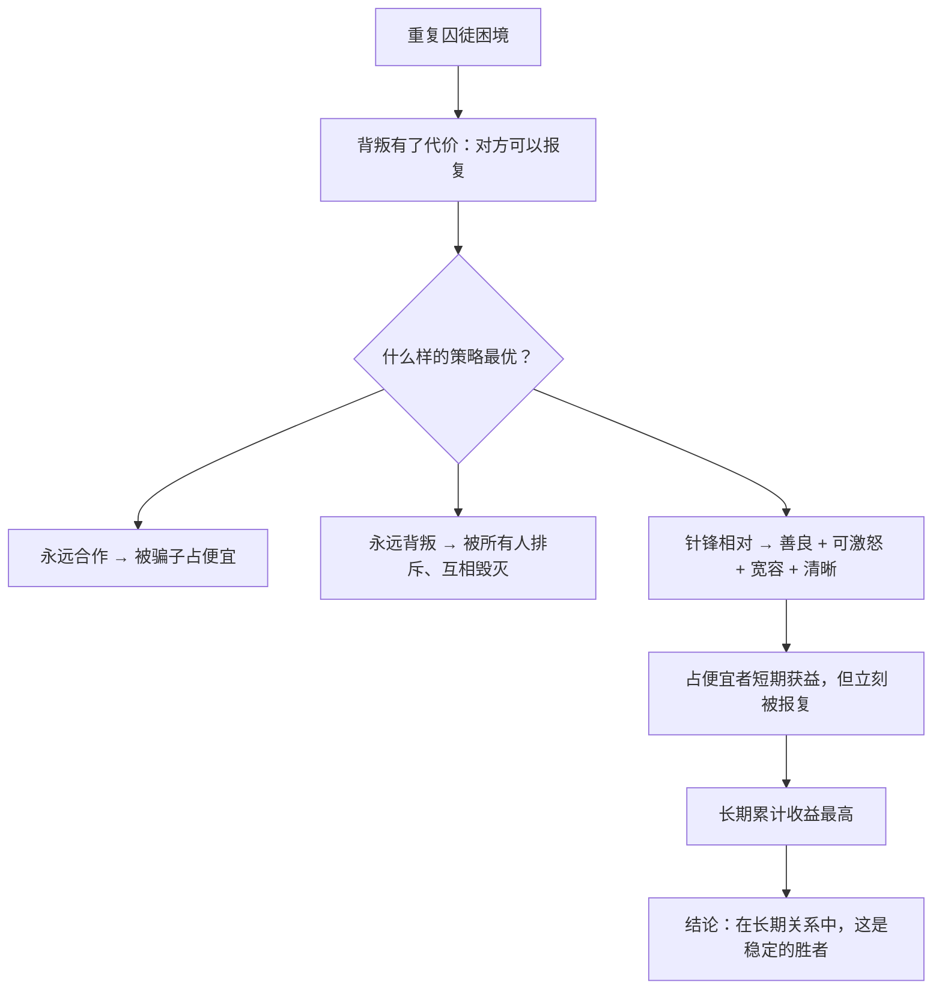

# 17｜为什么「好人」能赢？——囚徒困境与「针锋相对」

> 在一次又一次的重复博弈中，什么样的策略最终胜出？

---

## 一、先说结论

上一篇讲的是「互惠」需要什么条件。这一篇要问的是一个更精确的问题：

> **在长期反复的互动中，具体应该采取什么策略？**

美国政治学家罗伯特·阿克塞尔罗德给了这个问题一个著名的实验答案。他邀请了各路学者提交策略，让它们两两对局，进行一场「重复囚徒困境」的锦标赛。

结果夺冠的，是一个出乎意料地简单的策略——**「针锋相对」（Tit for Tat）**：

1. **第一次先友善**（选择合作）；
2. **对方背叛，我下一次也背叛**；
3. **对方回头合作，我立刻原谅**；
4. **行为清晰、可预测。**

道金斯为这个结果专门加写了第十二章，标题就叫**「好人终有好报」**。

---

## 二、我们先理解一个问题

先看「囚徒困境」这个经典设定。

两个同伙被抓，分开审讯。规则是：

- **两人都沉默**（合作）：各判 1 年；
- **一人招供、一人沉默**（背叛）：招供者 0 年，沉默者 5 年；
- **两人都招供**（互相背叛）：各判 3 年。

现在你是其中一个。你会怎么选？

**你会发现一个残酷的结论：**

> **不管对方选什么，你自己的最优选择都是「招供」。**

- 如果对方沉默，你招供 → 0 年（比 1 年好）；
- 如果对方招供，你招供 → 3 年（比 5 年好）。

**所以「理性」的双方都会招供，各判 3 年——而不是都沉默、各判 1 年。**

**这就是困境：个体理性导致了集体次优。**

那么问题来了：

> **如果只玩一次，背叛是唯一理性选择。可如果反复玩下去呢？**

---

## 三、作者到底提出了什么观点？

道金斯关于「针锋相对」的论证，可以拆成五点。

**第一，单次博弈里，背叛是理性的。**

这一点无法否认。**合作需要「未来」。**

**第二，重复博弈里，局面完全变了。**

因为对方可以「报复」你——**你今天背叛，他明天就背叛。** 于是「背叛」变成了有代价的行为。

**第三，阿克塞尔罗德的实验显示，「针锋相对」胜出。**

它是一个极其简单的策略，但它同时具备四个特征：

- **善良**：从不主动背叛；
- **可被激怒**：被背叛后立即报复；
- **宽容**：对方回头就原谅，不无限报复；
- **清晰**：行为可预测，对方知道该怎么和你相处。

**第四，这四个特征缺一不可。**

道金斯特别强调：**如果只有善良（永远合作），会被骗子吃干；如果只有报复（以牙还牙到底），会陷入无止境的循环。**

**第五，所以「好人先赢」——但有条件。**

「针锋相对」赢的前提是**长期互动、能识别对方、能记住历史**——**这正是第 16 篇那三个条件的博弈论版本。**

---

## 四、把这个观点翻译成人话

我们用一个所有人都经历过的场景：**办公室里的两个人长期协作。**

假设你和同事 A 长期一起做项目。

**策略一：永远配合（老好人）**
- A 每次都配合你，即使你甩锅给他。
- 结果：**你会习惯性地甩锅给他，他越来越累，最后崩溃或离职。**

**策略二：永远报复（记仇型）**
- 你得罪他一次，他记一辈子。
- 结果：**一次小摩擦导致永久敌对，双方都无法继续合作。**

**策略三：针锋相对**
- 第一次合作 → 你合作，他就合作；
- 你甩锅一次 → 他下次也让你难受一次，但只一次；
- 你恢复合作 → 他也恢复合作。

**结果：他既不会被占便宜，也不会陷入死循环，而且——他知道你是可以被「纠正」的。**

**这就是「针锋相对」的四个特征在起作用：善良、可被激怒、宽容、清晰。**

现在再想想：

> **你身边合作最顺畅的人，是不是恰好具备这四个特征？**

**而「老好人」和「记仇型」各有各的问题——一个被榨干，一个把关系凝固在冲突里。**

---

## 五、为什么会这样？

为什么「针锋相对」能在竞赛中胜出？用一张图看这个机制。

这里有几个特别关键的推论：

**第一，「宽容」是被严重低估的美德。**

很多人以为「报复到底」才叫强势。但阿克塞尔罗德的实验显示：**不宽容的策略会因为「冤冤相报」，整体收益大幅下降。**

**第二，「清晰」比「聪明」更重要。**

实验中很多复杂的策略输给了「针锋相对」。原因是：**复杂策略让对方难以判断你的意图，于是对方倾向于保守或攻击。**

**而一个可预测的人，反而更容易获得长期合作。**

**第三，「善良」在长期里是优势，不是软肋。**

因为「善良」才能吸引到其他善良的策略。**一个总是背叛的人，最终只能吸引到同样背叛的人。**

**第四，但这依赖于「未来还有交集」。**

一旦博弈接近尾声，或者双方不会再见面——**背叛就重新变得划算。** 这也是为什么「最后一步」在很多关系里总是最危险的一刻。

---

## 六、举一个现实生活中的例子

我们看一个非常贴近生活的场景：**房东与租客。**

**场景设定：** 一个长期出租的房东，一个长期租房的租客。双方每月都要打交道。

**房东的策略选择：**

**永远好说话（老好人房东）**
- 租客晚交房租，他体谅；
- 房子有小问题，他马上修；
- 结果：**有些租客开始拖房租、要更多让步，最后他心累退出。**

**永远强硬（记仇型房东）**
- 一有问题就威胁赶人；
- 押金能扣就扣；
- 结果：**好租客不愿意续租，他不断换租客，空置成本高。**

**针锋相对型房东**
- 第一次，友好、按时修、按合同来；
- 租客违约一次（比如拖欠）→ 他立刻按合同提醒，并收取滞纳金；
- 租客恢复正常 → 他也恢复友好；
- 他的规则明确、一致、可预测。

**结果：他既保护了自己，又筛选出了愿长期合作的租客。**

**这个例子的重点是：**

> **「针锋相对」不是性格，而是一套规则。** 任何人都可以执行，而且它不需要你「变得冷血」或「变得善良」，它只需要你「一致」。

**这大概是这本书最实用的一条原则。**

---

## 七、回到书中重新理解

现在回到第十二章「好人终有好报」，道金斯为什么专门为它加写一章？

因为他意识到：**「基因都是自私的」这个结论，容易让人误以为「善良注定失败」。** 而阿克塞尔罗德的实验正好给出了一个反例：

> **在长期重复的博弈中，善良的策略不但能存活，而且能胜出——但前提是它必须「带牙齿」。**

道金斯在这一章里做了一个很关键的澄清：

> **「好人终有好报」这句话，取决于你怎么定义「好」。**

- 如果「好」指的是「永远退让、从不报复」——那在演化里，它确实会被淘汰；
- 如果「好」指的是「善良、但会反击、且不忘宽容」——**那它是最好的策略。**

**所以「好人」不是软弱的人，而是「有原则地友善」的人。**

这个区分，是这一章最核心的贡献。

---

## 八、这个观点背后还有什么？

**隐含前提一：博弈可以长期重复。**

现实中，很多关系确实会结束。「针锋相对」的优势在「有未来」的前提下才成立。

**隐含前提二：能识别对方的行为并记住。**

这需要记忆与信息。**在信息不透明、对方身份不明确的场合，这个策略会失效。**

**隐含前提三：噪音不太大。**

如果「误会」频繁发生（比如对方其实想合作，但行为被误判为背叛），「针锋相对」会陷入无休止的报复循环。**这就是著名的「噪音问题」。**

**与其他观点的联系：**
- 第 16 篇的「互惠三条件」是这一篇的前提；
- 第 18 篇会讨论「骗子」——即「针锋相对」的弱点与寄生者；
- 第 21 篇的「反抗」会用到类似的「理解规则之后做出选择」的思路。

---

## 九、这个观点有问题吗？

有，值得注意的有四点。

**第一，「针锋相对」在现实中并不总能夺冠。**

阿克塞尔罗德后来做了「带噪音」的实验（可能误会导致背叛），结果发现：**在噪音环境下，「宽容的针锋相对」（Tit for Tat with forgiveness）表现更好——它会在对方背叛后，偶尔原谅一次。**

**第二，实验的「赢」是累计得分，不是「活下来」。**

这套结果描述的是「谁的总收益最高」，而不是「谁最终消灭了谁」。**两者不是一回事。**

**第三，人类的行为远比策略复杂。**

现实中，人会因为情绪、误解、面子、文化而偏离「最优策略」。**把人际关系简化为博弈矩阵，会漏掉大量真实的动态。**

**第四，「善良」这个词容易被浪漫化。**

「好人终有好报」在传播中，往往被理解成「只要真诚就会被善待」——**但道金斯的意思恰恰相反：善良必须带牙齿，否则就是被宰的料。**

**这一层如果被忽略，「好人终有好报」就变成了一句误导性的鸡汤。**

---

## 十、今天再看这个观点

「针锋相对」在今天最有价值的应用，是**AI 时代的信任与协作机制设计**。

想一想：

- **平台规则**本质上定义了一套「收益矩阵」。它奖励什么、惩罚什么，决定了参与者会采用什么策略；
- **长期博弈**：如果一个平台上大家都是「一次性交易」，那么针锋相对就不会出现；如果平台能建立长期身份和记录，它就自然会出现；
- **AI Agent 之间的协作**：当 Agent 与 Agent 反复交互时，**「针锋相对」很可能成为默认的稳定策略**——除非有人能通过欺骗获得短期超额收益。

**这里有一个很有意思的推论：**

> **如果 AI 的互动是长期的、可识别、可记录的，那么「善良 + 会反击 + 宽容 + 清晰」很可能会被自动发现为最优策略——不管有没有人刻意设计它。**

**反过来，如果一个系统的设计让互动变成一次性、匿名、不可追溯的，那么最优策略就会滑向背叛。**

**所以，「社会好不好」很大程度上不是道德问题，而是「博弈结构」问题。**

这是**基于道金斯思想的现代延伸**。

---

## 十一、这一篇真正应该记住什么？

1. **单次博弈里背叛是理性的；重复博弈里，合作变得可能。**
2. **「针锋相对」胜出的原因：善良、可被激怒、宽容、清晰——四者缺一不可。**
3. **「好人」不是软弱的人，而是「有原则地友善、且会反击」的人。**
4. **在噪音环境里，「偶尔原谅一次」的版本表现更好。**
5. **合作能不能发生，取决博弈结构，而不只是人的品格。**

---

## 十二、留一个问题

> 如果你发现自己总在「当老好人」，问题可能不在你的善意——**而在你有没有让对方为背叛付出代价的能力。**
>
> 下一篇，我们来看这个系统里最顽强的角色——**如果「针锋相对」这么好，为什么骗子永远消灭不了？**
