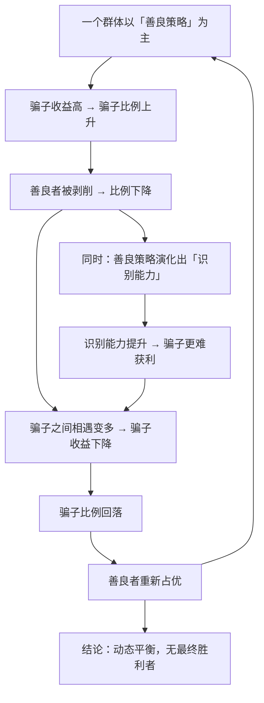

# 18｜骗子为什么消灭不了？

> 如果「针锋相对」这么好，为什么世界上还有搭便车的人？

---

## 一、先说结论

上一篇讲了一个好消息：在长期重复的博弈里，「善良 + 会反击 + 宽容 + 清晰」的策略能胜出。

那么一个自然的问题就来了：

> **既然如此，为什么骗子还没有被淘汰干净？**

道金斯的回答是：

> **因为任何策略都有可被利用的弱点。「针锋相对」的宽容，恰好是骗子的入口。**

更根本的一个判断是：

> **演化里没有「善的最终胜利」，只有各种策略频率的动态平衡。**

**善良必须配一双能识别骗子的眼睛——否则它只是待宰的猎物。**

---

## 二、我们先理解一个问题

先看一个非常具体的场景。

假设一个群体里全是「针锋相对」的玩家。大家互相信任、互相合作、收益都很好。

现在突然出现一个「骗子」——他是这么玩的：

> **先假装合作，骗到好处后立刻背叛，然后消失（或者换个身份再来）。**

**在「全是好人」的环境里，骗子几乎是稳赚的。为什么？**

因为「针锋相对」的规则是「第一次先友善」。

**第一次相遇时，好人会毫无防备地跟骗子合作——于是骗子拿到了最大收益。**

**问题来了：**

> **如果骗子在好人堆里这么赚钱，为什么他不会迅速占领整个群体？**

---

## 三、作者到底提出了什么观点？

道金斯关于「欺骗与稳定」的论证，可以拆成五点。

**第一，任何策略都有可攻击的弱点。**

- 「永远合作」的弱点：被骗子白吃；
- 「针锋相对」的弱点：**第一次的善意会被利用**（因为骗子可以先拿好处再跑）。

**第二，所以骗子的数量会上升。**

在好人占多数的环境里，骗子收益高，于是比例上升。

**第三，但骗子上升会摧毁自己的生存基础。**

骗子越多，好人越少。**而骗子必须依赖好人才能获利。** 当好人稀少时：

- 相遇的双方都是骗子 → 双方都受损；
- 骗子再也骗不到东西了。

**第四，于是骗子的比例会下降。**

**这是一个典型的「频率依赖」过程：**

- 骗子少时 → 收益高 → 增多；
- 骗子多时 → 收益低 → 减少。

**第五，所以最终会出现一个动态平衡。**

道金斯说得很清楚：**稳定不等于「某一方获胜」。** 更常见的状态是：

> **善良者、骗子、以及各种中间策略，长期共存于一个比例大致稳定的混合状态。**

**这就是为什么骗子永远消灭不了——他们的存在，本身就是系统平衡的一部分。**

---

## 四、把这个观点翻译成人话

我们用一个所有人都经历过的场景：**二手交易平台。**

假设一个平台上：

- 大部分卖家是诚实的；
- 少部分卖家是骗子（发假货、收钱不发货）。

**现在看三个阶段的演化：**

**阶段一：平台刚起步，骗子很少。**
- 骗子成功率极高——因为买家还没有防备；
- 结果：骗子涌入。

**阶段二：骗子变多。**
- 买家开始警惕：要平台担保、要评价、要视频验货；
- 骗子的成功率下降；
- 结果：骗子退出或转型。

**阶段三：稳定状态。**
- 大部分交易是诚实的；
- 少部分骗子仍然存在（因为总会有「新买家」没有防备）；
- 平台通过担保、信用分、押金维持平衡。

**注意：**

> **平台的作用不是「消灭骗子」，而是「把骗子压到一个可接受的水平」。**

**这就是道金斯说的「动态平衡」。**

**而这也解释了一件事：**

为什么平台会持续更新风控、持续打假？**因为骗子也在持续升级。**

**这是一场没有终点的军备竞赛，而不是一场可以宣布胜利的战争。**

---

## 五、为什么会这样？

为什么「任何策略都无法彻底胜出」？用一张图看这个频率依赖的循环。

这里有几个非常关键的推论：

**第一，这是一个「循环」，不是「终局」。**

理解这一点非常重要：**很多社会现象之所以反复出现，不是因为它没有被解决，而是因为它是一个均衡的一部分。**

**第二，「识别能力」是被骗子的存在「逼」出来的。**

如果世界上没有骗子，就不会有警惕、验证、合同、担保。**骗子催生了信任的基础设施。**

**第三，任何防御都会被针对。**

当好人学会识别「一次性骗子」时，骗子就进化出「长期伪装」——先老实做几单，养起信誉，然后一次性骗个大的。**这就是「低频高效」的欺骗策略。**

**第四，所以「稳定的坏均衡」也可能长期存在。**

在某些结构性条件下（比如信息极不透明、惩罚极弱），骗子可能稳定地占据很高的比例。**这不是自然演化的必然，而是制度设计的结果。**

---

## 六、举一个现实生活中的例子

我们看一个特别有现实感的场景：**学术界的造假。**

假设学术圈是一个大博弈场：

**阶段一：造假者很少。**
- 造假的收益很高（发顶刊、拿经费、升职）；
- 被发现的概率低；
- 结果：**造假增多。**

**阶段二：造假变多。**
- 审稿人开始警惕，要求原始数据、重复实验；
- 期刊加强核查；
- 结果：**造假的成功率下降。**

**阶段三：稳定状态。**
- 大部分研究是正当的；
- 仍有一小部分造假存在（因为核查成本不可能无限高）；
- 而且**造假的技术也在升级**（P图、数据操纵、AI 生成）。

**注意这个循环的几个特征：**

| 特征 | 学术造假 | 道金斯的一般模型 |
|---|---|---|
| 骗子少时收益高 | 造假容易成功 | 骗子在好人堆里获利 |
| 骗子多时收益下降 | 审稿变严、核查加强 | 好人减少、骗子互相撞车 |
| 防御被针对 | 造假技术升级 | 欺骗策略进化 |
| 稳定但不为零 | 造假长期存在 | 动态平衡 |

**所以「彻底消灭学术造假」是一个不可能的目标。**

**更现实的目标是：**

> **把造假压到一个可接受的水平，同时持续提高核查的技术和成本。**

**这正是「频率依赖平衡」的实用含义。**

---

## 七、回到书中重新理解

现在回到第十二章（以及第六章结尾部分），道金斯讨论「欺骗者」时，给出了一个非常重要的框架性判断。

他指出，**演化里没有「终极的胜利」**。一个策略的成败，取决于它在当前种群构成下的表现。**而种群构成又会被这个策略本身改变。**

**这是一个自我调节的系统。**

他还指出了几种不同的欺骗类型：

- **纯骗子**：从不回报，只要有机会就占便宜；
- **条件性骗子**：只在确定不会被发现时才骗；
- **伪装者**：长期表现良好，最后一次性收割。

**这些变体的存在，让「识别」变得极其困难。** 因为你不能只根据一次行为判断一个人。

道金斯还强调：**「善良」和「识别能力」必须同时演化。** 只有善良没有识别，会被吃干；只有识别没有善良，就无法获得合作收益。

**两者必须配对，这才是稳定的策略组合。**

---

## 八、这个观点背后还有什么？

**隐含前提一：欺骗有成本。**

如果欺骗完全没有成本（比如零风险的伪装），那么欺骗策略会迅速占优，合作会崩溃。**现实中，伪装、维持信誉、隐藏行为都是有成本的。**

**隐含前提二：存在「新加入者」。**

骗子需要一个「还没建立防御」的池子。**如果所有参与者都经验丰富且信息完全共享，骗子就无处下手。**

**隐含前提三：信息可以被传递。**

如果被骗的经验不能被传播（比如没有声誉系统），那么每个人都要重复被骗一次。**声誉系统是打破这个循环的关键。**

**与其他观点的联系：**
- 第 16 篇的「惩罚能力」是这一篇的前提；
- 第 17 篇的「针锋相对」是这一篇要讨论的策略；
- 第 20 篇的「模因」会讨论文化层面的「欺骗性传播」（比如谣言为什么传播得快）。

---

## 九、这个观点有问题吗？

有，值得注意的有四点。

**第一，「稳定平衡」也可能是一个「坏平衡」。**

理论说平衡会自然出现，但**平衡点的高低完全取决于条件**。在恶劣条件下，可能稳定在高欺骗率的状态。

**所以「会自然平衡」不等于「结果会好」。**

**第二，这个框架可能被用来为欺骗开脱。**

「骗子永远存在，这是自然的」——**这句话是对的，但不构成「所以不必治理」的理由。** 平衡点是可以被制度移动的。

**第三，人类社会的欺骗远比动物博弈复杂。**

语言、信息操纵、系统性欺诈、金融骗局——**这些涉及复杂的认知与文化层面，不是简单的收益矩阵能描述的。**

**第四，「善良 + 识别」这套组合，在现实中很难执行。**

一个人要同时做到「愿意先合作」和「善于识破」——**这两者需要非常不同的能力，而且容易相互冲突。**

**所以现实中，人往往偏向一端：要么太善良被骗，要么太警惕错失机会。**

---

## 十、今天再看这个观点

「骗子永远消灭不了」这个结论，在今天有了一个全新的、也更棘手的形式：**信息污染。**

想一想：

- 谣言比真相传播得更快（因为它更刺激、更简单）；
- 标题党比好内容更容易获得点击；
- 虚假好评、刷量、水军——都是「欺骗策略」；
- AI 让虚假内容的生产成本趋近于零。

**用道金斯的框架看，这就是一个典型的「频率依赖」系统：**

- 当虚假内容少时，它能获得巨大流量；
- 当虚假内容多时，用户开始不信任一切，**整个信息生态的价值下降**——连真实内容也受连累。

**这就是所谓的「信息公地悲剧」。**

**而道金斯给出的思路是实用的：**

> **不能指望「骗子消失」，而要设计「识别 + 惩罚」的机制，把平衡点推向可接受的位置。**

- 来源验证；
- 内容溯源；
- 声誉与信用；
- 惩罚的成本足够高。

**关键不是道德，而是让「欺骗不划算」。**

这是**基于道金斯思想的现代延伸**，他所处的时代还没有这样的信息环境。

---

## 十一、这一篇真正应该记住什么？

1. **任何策略都有弱点，「针锋相对」的弱点就是第一次的善意。**
2. **骗子靠好人获利，所以骗子越多，自身的生存基础越差。**
3. **演化没有「善的最终胜利」，只有各种策略频率的动态平衡。**
4. **善良必须配识别能力——两者缺一，都活不好。**
5. **平衡点的高低取决于制度，所以「骗子永远存在」不构成「不必治理」。**

---

## 十二、留一个问题

> 你上一次被骗，是因为不够善良，还是因为**先付出了善意却没有配套的识别与惩罚**？
>
> 下一篇，我们进入全书最富想象力的一章——**文化也会像基因一样复制和进化吗？「觅母」（meme）的诞生。**
