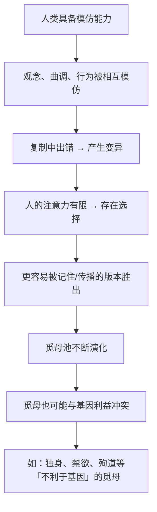

# 19｜文化也会像基因一样进化吗？——「觅母」的诞生

> 除了基因，还有没有别的复制因子？

---

## 一、先说结论

在全书的最后一章，道金斯提出了一个当时只是「顺手一提」、后来却影响极大的概念：

> **觅母（meme）**——文化层面的复制因子。

它的定义可以概括成一句话：

> **凡是能够通过模仿在人与人之间被复制、变异、淘汰的东西，都是觅母。**

曲调、观念、口号、时尚、宗教、手艺、流行语——**它们都在被复制，而且遵循和基因相似的演化逻辑。**

道金斯的关键洞察是：

> **「复制、变异、淘汰」这三件事，不专属于基因。任何具备这三件事的系统，都会自发地演化。**

**而人类的文化，恰好就是这样一个系统。**

---

## 二、我们先理解一个问题

先看一个很普通的日常现象。

一首洗脑的歌，你没有特意去学，但听了几遍之后，就会不由自主地哼出来。再过几天，你身边的人也在哼。

**现在问：**

> **这首歌「想要」被传播吗？**

当然不会——歌没有意识。

**但它的行为效果，非常像「想要被传播」。**

- 副歌简单、重复 → 容易被记住 → 传播得更广；
- 旋律好哼 → 容易从一个人传到另一个人；
- 有情绪钩子 → 让人愿意分享。

**于是问题来了：**

> **如果我们把这首歌当成一个「复制因子」，它的传播遵循的规则，和基因的传播有多大差别？**

---

## 三、作者到底提出了什么观点？

道金斯关于觅母的论证，可以拆成五点。

**第一，复制因子不必是基因。**

道金斯指出，「复制」这件事只需要三个条件：**能复制、复制会出错、出错后会形成差异。** 只要满足这三点，演化就会自动发生。

**第二，文化中存在这样的复制单位。**

他给它们起名叫 **meme**（源自希腊语 mimeme，意为「被模仿的东西」）。**它的传播方式不是遗传，而是模仿。**

**第三，觅母也是「自私」的。**

和基因一样，觅母的成功标准只有一个：**能不能被复制、传播下去。** 那些更容易被人记住、愿意被分享、容易打动人心的觅母，会占据更多「大脑份额」。

**第四，觅母也有「选择压力」。**

道金斯举的例子包括：

- 曲调；
- 观念；
- 口号与流行语；
- 时尚与穿着方式；
- 建筑与手艺的方法。

**能存活下来的觅母，未必是「最真」或「最好」的，而是「最容易传播」的。**

**第五，觅母可能和基因的利益冲突。**

这一点非常重要，也是他埋下的伏笔：**一个觅母可以让人做出基因「绝不希望」的事**——比如独身、禁欲、殉道。**第 20 篇会专门展开。**

---

## 四、把这个观点翻译成人话

我们用一个今天最直观的场景：**网络迷因（梗）。**

一个「梗」是怎么诞生的？

- 有人创作了一个句式、一张图、一个动作；
- 别人觉得有趣 → 转发；
- 有些人开始模仿、改编、二创；
- 传播中出现变体；
- 大多数变体死掉，少数变体爆红。

**现在对照基因：**

| 基因 | 梗 |
|---|---|
| 基因是复制单位 | 梗是复制单位 |
| 复制靠细胞机制 | 复制靠人的模仿与转发 |
| 复制会出错 → 变异 | 二创会改动 → 变异 |
| 适应环境的基因存活 | 有趣的梗存活 |
| 基因池 | 「梗池」 |

**这就是道金斯说的觅母——只不过他写这本书的时候，还没有互联网。**

而且注意一个细节：

> **梗的传播速度，远远超过基因。**

基因传递一代需要二三十年。**一个梗可以在几小时内传遍全球。**

**这意味着：文化的演化速度，可以比生物的演化速度快上几个数量级。**

**这也解释了为什么人类在几千年里能产生如此剧烈的变化——而生物演化在同样的时间里几乎什么都没发生。**

---

## 五、为什么会这样？

为什么文化会自发地演化？用一张图看这个机制。

这里有三个特别关键的推论：

**第一，「容易被传播」是觅母的唯一硬标准。**

一个观念可以不真实、不道德、不有用，但只要**容易被记住、被重复、被分享**，它就能扩散。

**这解释了一个非常令人不安的现象：**

> **谣言、偏见、极端观点，往往比准确、平衡、理性的内容传播得更快。**

因为它们更简单、更情绪化、更容易被记住。**在觅母的世界里，「真实」不是优势，「好传播」才是。**

**第二，觅母的复制精度远低于基因。**

基因复制有纠错机制，误差极小；**而文化传播中的「失真」是常态。** 所以文化的变异速度极快。

**第三，觅母的载体是大脑，资源也是有限的。**

人的注意力、记忆容量都是有限的。**所以觅母之间也在竞争——争的是「人的心智资源」。**

**这一点在今天尤其明显：注意力经济，本质上就是觅母的竞争。**

---

## 六、举一个现实生活中的例子

我们看一个非常具体、也非常当下的例子：**一句口号的传播。**

假设有两句话同时出现在网络上：

**句子 A**：
> 「在面对复杂的社会问题时，我们需要更严谨的证据、更细致的分析，以及对自己立场保持怀疑的态度。」

**句子 B**：
> 「他们就是想毁掉你的一切。」

**哪一句传播得更快？**

**几乎必然是 B。**

为什么？因为它：

- 更短，更容易记住；
- 更情绪化，更容易触发反应；
- 有明确的「敌人」，能形成身份认同；
- 更容易被任何立场的人改写使用。

**这就是「觅母的适应性」：不是「说得对不对」，而是「能不能活下来」。**

道金斯在书里用过类似的例子：**「上帝」这个觅母，可能是人类历史上最成功、存续最久的觅母之一。**

为什么？因为它：

- 极易被记住（简单、有力）；
- 提供了强烈的心理安慰（减少了面对死亡的恐惧）；
- 有自我复制的机制（传教、仪式、教育）；
- 有内在的稳定结构（难以被简单证伪）。

**注意：道金斯在这里完全没有讨论「上帝是否真实」。**

**他讨论的是：作为一个「复制因子」，它在传播效率上极其成功。**

这也提醒我们：**「一个观念能广泛传播」和「一个观念是真的」，是两件完全不同的事。**

---

## 七、回到书中重新理解

现在回到第十一章「觅母：新的复制因子」，道金斯的原始表述就能读懂他的用意了。

他在这一章开头说，他要在书里讨论一个「新的复制因子」，它就在我们眼前，还在「原始汤」里笨拙地漂流——**只不过这个汤，是人类文化的汤。**

他还特别强调：**觅母的传播方式是模仿，而不是遗传。** 所以它不需要生物学上的亲属关系。

道金斯在末尾做了一个非常诚实的自我评价：**他说这个概念还需要大量研究，他没有能力断言它会走向哪里。** 事实上，他当时只是把这章当作一个「有趣的延伸」，而不是核心主张。

**但历史证明，这一章可能是整本书影响最深远的一部分。**

- 「meme」这个词进入了英语日常词汇；
- 「模因学」（memetics）成为一门研究领域；
- 而互联网时代，让觅母第一次可以被大规模地、可视化地观察。

**道金斯自己也在后来的版本里承认，如果早知道这个概念的命运，他可能会把它写得更完整。**

---

## 八、这个观点背后还有什么？

**隐含前提一：模仿是人类（或文化主体）的基本能力。**

道金斯强调，觅母的传播依赖模仿。**所以具备模仿能力的物种，才可能有觅母演化。**

**隐含前提二：文化的复制足够「像基因」以形成演化。**

这一点是有争议的。**批评者认为，文化传播有大量「定向、有目的、有理解」的成分，和基因的盲目复制有本质差异。**

**隐含前提三：觅母是离散的单位。**

「一个觅母」到底是什么，边界在哪里？**这一点道金斯没有给出严格定义，也是模因学后来最受批评的地方。**

**与其他观点的联系：**
- 第 03 篇的「复制因子」是这一篇的理论原型；
- 第 20 篇会讲「觅母与基因的冲突」；
- 第 21 篇会讲「人类如何同时对抗两种复制因子」；
- 第 25 篇会把觅母延伸到「算法与 AI 时代的复制单元」。

---

## 九、这个观点有问题吗？

有，而且这一章的争议相当大。

**第一，「觅母」这个概念太模糊了。**

一个观念、一首歌、一句话，是不是同一个觅母？**它的边界在哪里？能不能被计数？** 这些基础问题始终没有干净的答案。

**这就导致「模因学」虽然流行，但始终没有成为严格的科学。**

**第二，文化传播和基因复制有本质差异。**

- 基因是**盲目**复制；文化传播往往**有理解、有目的、有选择**；
- 基因的变异是**随机**的；文化的变异往往是**有意的创新**；
- 基因不能「思考」；文化的传播者会思考。

**这些差异让「文化即演化」这个类比，可能只在很浅的层面上成立。**

**第三，「觅母自私」的说法容易造成同样的拟人化误读。**

「这个梗想传播」是一种修辞。**但读者很容易把它当成「文化有自己的意志」。**

**第四，把责任推给「觅母」可能成为一种开脱。**

如果一切都被解释为「觅母在传播」，那么具体的传播者、创作者、平台的责任就被模糊了。**而实际上，觅母的传播高度依赖人的选择与制度的设计。**

**第五，道金斯本人对这个概念的态度也很谨慎。**

他没有把它当作严格的理论，而是当作一个「有启发性的类比」。**后来的「模因学」试图把它做成硬科学，但收效有限。**

---

## 十、今天再看这个观点

道金斯 1976 年提出的这个「顺手一想」，在今天变成了一个**字面意义上的现实**。

- 网络迷因（meme）已经是一个日常词汇；
- 内容平台本质上就是**觅母的进化加速器**；
- 推荐算法在做的事，就是**筛选「最容易传播的觅母」**；
- 而「传播力」这个指标，会系统性地偏向**情绪化、极端化、简单化**的内容。

**这就是为什么道金斯这一章在今天读起来格外惊人——他几乎预言了我们今天的处境。**

但也带来一个道金斯没有预见到的问题：

> **当觅母的传播可以被算法大规模加速时，「什么能存活」这个筛选标准，正在被少数系统的优化目标所左右。**

**换句话说：觅母的演化不再是「自然选择」，而是被「设计过的选择」。**

**这比道金斯担心的「文化被觅母支配」，可能更值得警惕。**

这是**基于道金斯思想的现代延伸**。

---

## 十一、这一篇真正应该记住什么？

1. **复制因子不必是基因——凡是能被复制、变异的单位，都会进入演化。**
2. **觅母（meme）是文化层面的复制因子，靠模仿传播，遵循「复制 + 变异 + 选择」。**
3. **觅母的唯一硬标准是「好传播」，不是「真实」或「正确」。**
4. **文化演化的速度远快于基因演化，因为复制更快、变异更多。**
5. **「广泛传播」和「是真的」是两件完全不同的事。**

---

## 十二、留一个问题

> 你最近转发过的那条内容——**你是因为它「是真的」才转，还是因为它在觅母的意义上「太适合被传播了」？**
>
> 下一篇，我们来看这两种复制因子打起来会怎样——**基因想要你生孩子，觅母想要你独身，谁赢？**
