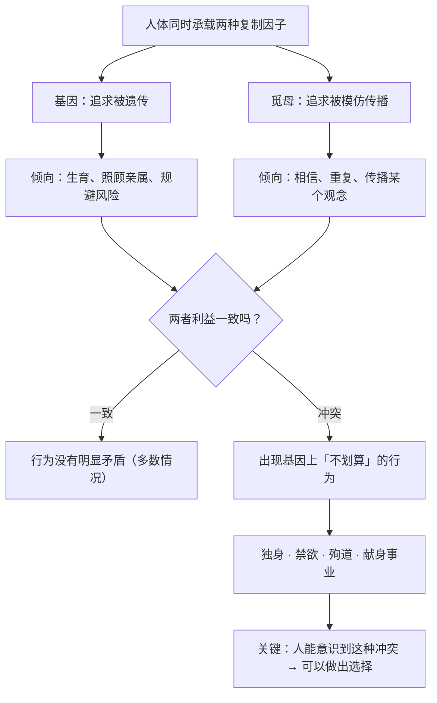

# 20｜基因和模因，谁在控制我们？——两种复制因子的战场

> 当觅母与基因的利益发生冲突时，会发生什么？

---

## 一、先说结论

上一篇提出了觅母。这一篇要处理一个更尖锐的推论：

> **如果觅母也是复制因子，那它就会追求自己的复制——而这种追求，未必符合基因的利益。**

道金斯的判断是：

> **人类是两种复制因子的交汇点，而且它们常常方向相反。**

- 基因「希望」你：活下去、生育、照顾亲属；
- 觅母「希望」你：相信它、重复它、传播它。

**当两者冲突时，会出现大量「基因上说不通」的现象：**

- **独身主义**：不生育，但传播了一种观念；
- **禁欲**：放弃繁殖，但弘扬了一种教义；
- **殉道**：牺牲生命，但让一个信念流传千年；
- **把一生献身于艺术或研究**：不留下后代，但留下作品。

**道金斯的话大意是：一个成功的觅母，可以让人做出基因绝不会「允许」的事。**

---

## 二、我们先理解一个问题

先看一个非常具体的历史现象。

一位修道士，终身独身、清贫、不生育。他把一生献给了宗教。

**从基因的账本看，这是一次彻底的「失败」：**

- 没有留下后代；
- 没有照顾亲属；
- 消耗了大量资源。

**但问题来了：**

> **如果「繁殖成功」是演化的唯一标准，那么一种能让人终身不婚不育的观念，是怎么在人类历史上持续存在两千年的？**

**这就是道金斯埋下的那个伏笔。**

---

## 三、作者到底提出了什么观点？

道金斯关于「基因与觅母冲突」的论证，可以拆成五点。

**第一，觅母和基因是两套独立的复制系统。**

它们的「目标」不一样：**基因要的是被遗传，觅母要的是被模仿与传播。**

**第二，觅母的传播不需要你生育。**

一个观念只要被**传递**出去，它就成功了。**至于传递者有没有孩子，与这个观念无关。**

**第三，所以会出现「不利于基因、有利于觅母」的观念。**

道金斯举了典型的例子：

- **独身**：传播效率极高的观念，因为它让传播者把全部精力投入传播；
- **殉道**：虽然牺牲了个人，但往往极大强化了整个信念的传播力；
- **禁欲**：与基因目标直接冲突。

**第四，觅母之间存在竞争，而竞争会筛选出「传播力强」的版本。**

这带来一个很重要的结果：

> **能存活的觅母，未必是「最好」或「最真」的，而是「最擅长在人脑之间复制」的。**

**第五，人类因此成了一个「战场」。**

道金斯说，我们身上同时承载着基因组与觅母组合，**两种力量在我们身上拉扯。**

**而这也正是人类特殊性的来源**——因为我们能意识到这种拉扯。

---

## 四、把这个观点翻译成人话

我们用一个今天最直观的现象来理解「基因与觅母冲突」。

**想象一个年轻人。**

**基因的「偏好」是：**
- 找个伴侣，生几个孩子，把资源投给后代；
- 优先照顾亲属；
- 规避致命风险，活到能生育的年龄。

**但觅母会告诉他：**

- **事业第一**：先拼十年，四十岁再考虑生娃；
- **要保持自由**：婚姻是一种束缚；
- **要追求热爱**：把一生献给艺术、科研、创业；
- **要为理想献身**：为了一个信念，可以放弃一切。

**你会发现，现代人的很多选择，都是「觅母赢了」。**

**而且这不一定坏。** 一个人选择不生育、把一生投给研究或创作，可能做出巨大的贡献——**这在基因账本上是「亏」的，但在人的意义上可能是最值得的。**

**关键在于：**

> **道金斯不是在说「生育更重要」，他是在说「基因和觅母是两套逻辑，而你可以意识到这个冲突」。**

**意识到冲突，是选择的前提。**

---

## 五、为什么会这样？

为什么两种复制因子会冲突？用一张图看这个结构。

这里有三个非常重要的推论：

**第一，两种因子的利益大多数时候是一致的。**

日常生活中的大多数行为（吃饭、工作、社交），基因和觅母不冲突。**冲突只在少数关键节点出现。**

**第二，冲突恰恰出现在「最重要」的选择上。**

生育与否、为谁献身、要不要为信念冒险——**这些是人生中最重大的决定，而它们恰恰是两种因子争夺最激烈的地方。**

**第三，人类是唯一能「看见」这个战场的生物。**

一只鸟不会反思「我为什么想筑巢」。**但人可以问：「这个愿望是我的，还是某个东西植入的？」**

**这个「看见」的能力，就是第 21 篇要讲的「反抗」的基础。**

---

## 六、举一个现实生活中的例子

我们看一个特别有当代感的场景：**职业选择 vs 生育选择。**

**场景：** 一个 32 岁的女性，事业正处于上升期。

**她感受到两股力量在拉扯：**

**基因侧的声音（通常被体验为「本能」「焦虑」「家里催」）：**
- 「该生孩子了，再晚就来不及了。」
- 「同龄人都生了。」
- 「父母一直问。」

**觅母侧的声音（通常被体验为「理想」「使命」「自我实现」）：**
- 「你现在放弃，几年的积累就白费了。」
- 「女性的价值不该只由生育定义。」
- 「你的项目/研究/作品还没完成。」

**这两股力量都很真实，而且都不是「坏」的。**

**道金斯的框架不是要告诉你该听谁，而是要告诉你：**

> **这两种声音，来自两套不同的复制系统的逻辑。看清它们的来源，你才有可能做出「属于你自己的选择」。**

**这才是这本书的真正价值：**

- 它不主张「基因优先」；
- 它也不主张「觅母优先」；
- 它主张的是**「看清来源，再做选择」。**

**而这，恰恰是「反抗」的第一步。**

---

## 七、回到书中重新理解

现在回到第十一章和全书结尾，道金斯的原始表述会更容易读懂。

他提出了一个非常关键的概念区分：**基因组（gene pool）与觅母池（meme pool）。**

- 基因组是基因的集合；
- 觅母池是文化单位的集合，**它同样有竞争、有淘汰、有演化。**

他还特别指出：**觅母的复制速度极快，而基因的复制速度极慢。** 所以在人类历史上，文化的变化远远快于生物的变化。

在全书的最后，道金斯做出了他最重要的转向：

> **人类拥有两种独特的能力——有意识的先见（能预见长远后果）和真正的利他（能超越基因的计算）。**

**而这两种能力，正是「反抗」两套复制因子的工具。**

**注意：道金斯把「反抗」的对象明确写成了两个——「自私的基因」和「自私的觅母」。**

**这一点经常被忽略。大多数读者只记住了前半句。**

---

## 八、这个观点背后还有什么？

**隐含前提一：觅母真的是独立的复制因子。**

这一条争议很大（见第 19 篇）。**如果觅母只是基因的延伸（比如宗教信仰其实是某种基因策略），那这个冲突就不成立。**

**隐含前提二：人可以感知两股力量的拉扯。**

这需要高度的自我觉察能力。**很多人可能只是「感到矛盾」，但无法识别矛盾的来源。**

**隐含前提三：人能做出「不服从」的选择。**

这正是道金斯整个立场能否成立的关键。**如果人完全被决定，那「反抗」只是一句浪漫的空话。**

**与其他观点的联系：**
- 第 19 篇交代了觅母是什么；
- 第 21 篇会正面处理「反抗」的可能性；
- 第 22 篇的「延伸的表现型」会提出另一种边界模糊的问题；
- 第 25 篇会把「两种复制因子的战争」延伸到 AI 时代。

---

## 九、这个观点有问题吗？

有，值得注意的有四点。

**第一，「觅母与基因冲突」这个论述可能过于戏剧化。**

在现实中，绝大多数文化观念其实是**帮助基因传播的**：

- 家庭观念 → 促进生育；
- 婚姻制度 → 稳定抚养；
- 道德规范 → 维持群体合作。

**真正「反基因」的觅母，其实是少数特例。**

**第二，容易变成「责任外推」的借口。**

「不是我选的，是觅母控制了我」——**这种说法把责任推给了一个抽象概念。** 但实际上是**具体的人在传播、接受、强化这些觅母。**

**第三，这套框架对「意义」问题处理不足。**

一个人选择不生育、把生命投给艺术，可能在基因账本上「亏」，但在人生意义上极其丰盈。**而道金斯的框架只能描述「冲突」，无法告诉你「该怎么选」。**

**第四，「基因想要」这个说法仍然在拟人化。**

基因没有欲望。**说「基因想要你生孩子」，只是描述一种统计倾向。** 这个修辞很容易让人产生宿命论的错觉。

---

## 十、今天再看这个观点

「两种复制因子的战争」，在今天有了一个全新的形态：**算法作为第三种复制因子。**

想一想：

- 基因想让你生育；
- 觅母想让你相信并传播某个观念；
- **而算法想让你继续停留、继续互动、继续消费。**

**算法的「传播单位」，是那些能最大化你停留时间的内容。**

**它不关心你的基因利益，也不关心你相信的是真还是假——它只关心你是否继续滑动。**

**这就是道金斯「觅母战争」的升级版：**

> **过去是「观念争着进你的脑子」，现在是「算法在替你决定哪个观念能进你的脑子」。**

而这带来一个非常现实的问题：

**在基因、觅母、算法三重力量之间，人的「选择空间」还剩多少？**

道金斯的答案大概是：

> **看清每一种力量的逻辑，是你保留选择空间的前提。**

这是**基于道金斯思想的现代延伸**。

---

## 十一、这一篇真正应该记住什么？

1. **觅母和基因是两套独立的复制系统，目标不同。**
2. **觅母的传播不需要你生育——它是「横向」扩散，不是「纵向」遗传。**
3. **所以会出现「不利于基因、有利于觅母」的观念：独身、禁欲、殉道。**
4. **大多数时候两种因子一致，冲突只在人生最重大的选择上爆发。**
5. **人能意识到这种拉扯——这正是「可以选择」的前提。**

---

## 十二、留一个问题

> 你人生中那个最纠结的选择，到底是「基因在说话」，还是「觅母在说话」？
>
> 如果两者都在说话——**那么「你自己」的声音，在哪里？**
>
> 下一篇，我们来看道金斯最有立场的一句话——**我们能反抗自己的基因吗？**
