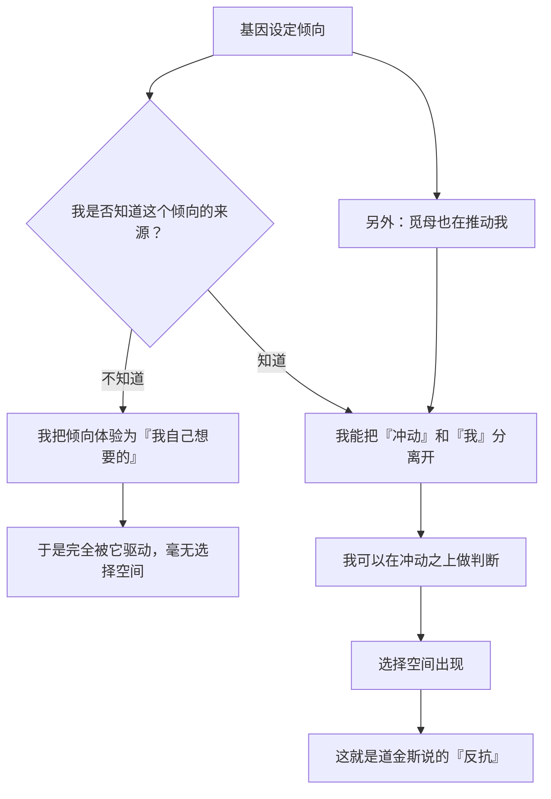

# 21｜我们能反抗自己的基因吗？

> 如果一切都被基因的自私逻辑解释，那我们还自由吗？

---

## 一、先说结论

道金斯给出了他的答案，而且是全书最重要的一次立场声明。在第三章结尾，他写下了一段大意如下的文字：

> **我们以及其他一切动物，都是各自基因所创造的机器……但在这个世界上，只有我们，能够反抗自私的复制因子的暴政。**

这句话包含三个层次：

1. **描述**：我们确实是基因造出来的载体；
2. **限制**：这种「编程」不是绝对的，因为人有意识和先见；
3. **立场**：看清规则之后，我们**有能力选择不服从**。

所以这本书的结论不是「人天生自私」，而是一句更激进的话：

> **理解基因的逻辑，正是获得自由的第一步。**

---

## 二、我们先理解一个问题

先看一个非常现实的困境。

一个人发现自己：

- 明知该睡了，还是刷到凌晨；
- 明知该锻炼，还是躺着；
- 明知那段关系不健康，还是离不开；
- 明知该拒绝，还是答应了。

**如果他相信「基因决定了一切」，他会怎么想？**

> 「人性就是这样，我改不了。」

**但问题是：**

> **为什么「基因给了你倾向」会被理解成「你必须服从这个倾向」？**

**这两句话之间，其实跳过了整整一步。**

---

## 三、作者到底提出了什么观点？

道金斯关于「反抗」的论证，可以拆成五点。

**第一，基因设定的是「倾向」，不是「命令」。**

我们在第 06 篇讲过：基因是规则编写者，不是遥控器。**它给的是一种默认的拉力，而不是不可违抗的指令。**

**第二，人类拥有一种别的生物没有的能力：有意识的先见。**

道金斯说，人类能够**想象未来、预测后果、并据此改变当下行为**。**这让我们可以算「长期账」，而不只是被短期本能驱动。**

**第三，人类还拥有另一种能力：真正的利他。**

我们在第 11 篇讲过：人类可以做出「在基因账本上不划算」的事。**而这件事本身，就证明了我们不完全服从基因的逻辑。**

**第四，理解机制，是反抗的前提。**

道金斯的意思不是「知道就自动自由」，而是：**如果你不知道是什么在推你，你就不可能选择不往那个方向走。**

**第五，所以这本书的目的，其实是一次「启蒙」。**

道金斯在书末说得很直接：他希望读者能明白自私的基因在做什么，**因为这样我们至少有机会打乱它的设计。**

**注意这个措辞——「打乱设计」，是一种主动的姿态，而不是被动的服从。**

---

## 四、把这个观点翻译成人话

我们用一个所有人都懂的类比：**一台预装了默认设置的电脑。**

想象你买了一台新电脑，厂商预装了一堆东西：

- 默认开机自启动某个软件；
- 默认把浏览器主页设成某网站；
- 默认开启某些推送；
- 默认收集使用数据。

**现在问：这台电脑「被决定」了吗？**

- 从出厂设置看，是的，它默认会那么做；
- 但**只要你知道这些默认设置存在，你就可以改掉它们。**

**这就是「基因设定的倾向」和「你的自由」之间的关系。**

| 电脑 | 人 |
|---|---|
| 默认开机自启 | 基因设定的本能偏好 |
| 厂商的推送策略 | 觅母的传播倾向 |
| 你不知道有这些设置 | 被推着走而不自知 |
| 你打开设置面板 | 理解机制的觉醒 |
| 你改掉默认值 | 反抗与选择 |

**关键就是中间那一步：「打开设置面板」。**

**而道金斯这本书，就是那个「设置面板的说明书」。**

---

## 五、为什么会这样？

为什么「理解」能带来「自由」？用一张图看这个逻辑。

这里有三个非常关键的推论：

**第一，「自由」不是「没有冲动」，而是「冲动之上还有一层判断」。**

人不可能消灭本能。**但可以在本能之上加一层「观察与决策」。**

**第二，这一层能力是「可以被训练」的。**

冥想、反思日记、决策复盘——**它们的共同作用，都是提升「观察自己」的能力。**

**第三，反抗不等于「永远逆着基因走」。**

有时基因的倾向是好的（比如照顾孩子、避免危险）。**「反抗」的意思不是一味对着干，而是「不再盲目服从」。**

**这一点非常容易被误读。** 道金斯不是在号召「反生育」「反亲密」——他是在说：**你可以选择，而不是只能服从。**

---

## 六、举一个现实生活中的例子

我们看一个极其具体、也极其当代的场景：**戒断短视频。**

**不知道机制的版本：**

一个人每天刷短视频到深夜，第二天疲惫。他觉得自己「没自制力」「就是个懒惰的人」。

**结果是：**自责 → 短暂振作 → 再次失控 → 更深的自我否定。**这是一个死循环。**

**知道机制的版本：**

他理解了几件事：

1. **推荐算法的目标是「停留时长」**——它不是中立的信息工具，它被设计来争夺注意力；
2. **「不确定性奖励」（不知道下一条是什么）会触发强烈的期待回路**——这是赌场用的同一个机制；
3. **人对「稀缺时代的高热量/高刺激」有本能偏好**——这个本能在今天被精准利用了；
4. **所以这不是「我的道德问题」，而是「我被一个专业的系统针对了」。**

**然后他能做什么？**

- 把手机拿出卧室（改变环境，而不是靠意志力）；
- 关闭自动播放（打断循环）；
- 给使用设一个明确的时限（用机制代替决心）；
- 在冲动出现时，命名它：「这是那个回路在起作用。」

**注意最后一步：命名。**

> **当你能说出「这是回路在起作用」时，你就不再完全等同于那个冲动。**

**这一小步，就是道金斯说的「反抗」。**

**它很小，但它是真实的、可重复的、可以被训练的。**

---

## 七、回到书中重新理解

现在回到第三章结尾和全书最后一段，道金斯的原始表述值得反复读。

他先描述了「生存机器」，然后做出了转折。他大意说：

> **我们是唯一能够对抗我们自身基因的生物。**
>
> **我们可以在理解这件事之后，选择去教导慷慨和利他，因为我们生来自私。**

注意这句话的结构：

- **「因为我们生来自私」**——这是描述；
- **「所以我们更要教导慷慨」**——这是立场。

**他不是在做道德说教，而是在做一次清醒的选择建议：正因为默认设置是那个方向，所以我们才需要主动往另一个方向走。**

他还提出，我们要能**识别并抵抗「自私的觅母」**（第 20 篇）。

**所以这本书的完整结论是：**

> **我们面对两重「自私」——基因的和觅母的——而我们是唯一能理解它们、并选择不被它们支配的生物。**

**这是一个非常「存在主义」的结论：自由不是被给予的，而是被夺取的。**

---

## 八、这个观点背后还有什么？

**隐含前提一：意识真的能够影响行为。**

这依赖「自由意志」这个古老的哲学问题。**道金斯没有解决它，他只是采取了「可操作」的立场：既然我们能反思并改变行为，那就当作有这个能力。**

**隐含前提二：理解机制真的能改变行为。**

这在心理学上有大量支持，但**也有大量反例**——知道危害不必然能戒掉成瘾。

**隐含前提三：「反抗」有可操作的空间。**

如果一个人处在极端的压力、贫困、疾病中，他可能根本没有余力去「反抗」。**「看清机制就能自由」这句话隐含了一定的自由度前提。**

**与其他观点的联系：**
- 第 06 篇的「基因机器」是这一篇要反抗的对象；
- 第 11 篇的「真正的利他」是反抗的具体形式；
- 第 19、20 篇的觅母与冲突，是第二重反抗的对象；
- 第 26 篇会回到「这本书最终该拿走什么」。

---

## 九、这个观点有问题吗？

有，而且这一条最大的问题在于它的**证据地位**。

**第一，「我们能反抗」不是科学结论，而是哲学立场。**

演化生物学描述的是「是什么」。**「我们可以选择不服从」是一个价值主张，不是实验结论。**

**道金斯把这一句写在了科学论证的结尾——它很有力量，但它其实是外挂在科学之上的。**

**第二，它可能高估了「理解」的力量。**

心理学的很多研究表明：**知道一件事有害，并不能让你摆脱它。** 成瘾、偏见、习惯的力量，往往远超「认知」。

**所以「看清机制就能自由」，可能是一种知识分子的乐观。**

**第三，它可能变成一种新的道德要求。**

如果「理解就能反抗」，那么那些「理解却做不到」的人，就会陷入更深的自我谴责：

> 「我都知道了，还是做不到，说明我这个人不行。」

**这是一种残酷的转嫁——把结构性问题变成了个人品格问题。**

**第四，它的姿态有点孤独而悲壮。**

「我们是唯一能反抗的生物」——这句话很有力量，但**它把自由描述成一场孤军奋战，忽略了制度、环境、关系、支持系统的作用。** 真正的「反抗」，往往需要外部条件的配合。

**第五，「反抗」这个词本身可能太对抗。**

不是所有的事都需要「反抗」。**有时候更好的方式是「重新设计环境」，让坏的倾向不再被触发。** 这比「对抗意志」更有效。

---

## 十、今天再看这个观点

「我们能反抗」这个主张，在今天有了一个新的、也更严峻的语境。

**过去要反抗的是：基因 + 觅母。**
**现在还要反抗的是：算法。**

而且算法比前两者更难反抗：

| | 基因 | 觅母 | 算法 |
|---|---|---|---|
| 是否可见 | 看不见 | 半可见 | 不透明 |
| 是否可讨论 | 需要知识 | 可以讨论 | 黑箱 |
| 是否会在你身边 24 小时 | 是 | 是 | **是，且被优化过** |
| 是否有专门的团队优化它 | 否 | 否 | **是，全世界最聪明的人** |

**这就是为什么道金斯那句「我们唯一能反抗」在今天读起来既鼓舞又沉重。**

**因为「能反抗」是一回事，「反抗的成本很低」是另一回事。**

**而今天，反抗的成本正在变高。**

**这也许是这本书在今天最值得被重读的一句话：**

> **自由不是被给予的，而是需要被持续争取、持续防守的。**

这是**基于道金斯思想的现代延伸**。

---

## 十一、这一篇真正应该记住什么？

1. **道金斯的名句：我们是唯一能够反抗自私复制因子暴政的生物。**
2. **基因设定的是「倾向」，不是「命令」；自由是「冲动之上还有一层判断」。**
3. **理解机制是反抗的前提——不知道是什么在推你，就不可能选择不往那走。**
4. **反抗 ≠ 一味逆着基因走；它是「不再盲目服从」，不是「永远对着干」。**
5. **「反抗」不是科学结论，而是哲学立场；它需要环境与制度的支持。**

---

## 十二、留一个问题

> 如果「自由」是「冲动之上还有一层判断」——那么你上一次停下来、对自己说「这是那个回路在起作用」，是什么时候？
>
> 如果一次都没有——**那你现在做的大部分选择，是谁在做？**
>
> 下一篇，我们进入全书的反思部分——**基因的影响能延伸多远？比如河狸的坝，算不算基因的「身体」？**
