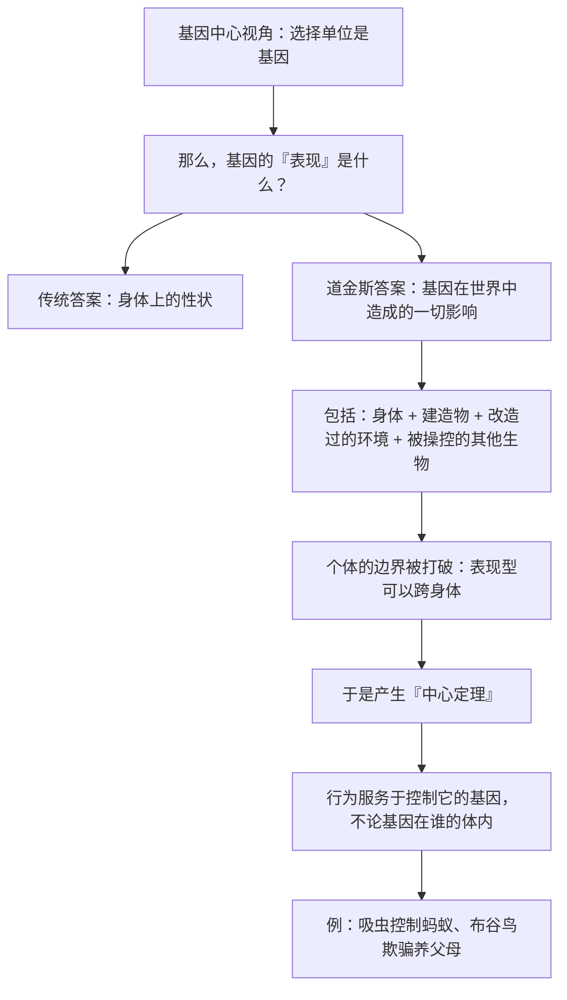

# 22｜基因的影响能延伸多远？——延伸的表现型

> 基因的「表现」只到身体表面为止吗？河狸的坝，算不算基因的「身体」？

---

## 一、先说结论

道金斯在 1982 年的《延伸的表现型》里提出了一个更大胆的想法，并在 1989 年把它作为第十三章加进了《自私的基因》：

> **基因的表现型，不必止步于身体表面。它可以延伸到身体之外——延伸到动物建造的东西、改变的环境，甚至延伸到其他生物的行为。**

典型的例子包括：

- **河狸的坝**：由基因最终「造成」的水利工程；
- **石蛾幼虫的巢**：用石子和丝编织的移动房子；
- **鸟的巢、白蚁的丘**：基因的外化建筑；
- **寄生虫改变宿主的行为**：某个基因让另一只动物做了它「本来不会做」的事。

道金斯由此提出了一个关键的定理：

> **动物行为的倾向，是为了让「控制这个行为的基因」存活下来——而这些基因未必在这只动物的身体里。**

**这一句，把「个体的边界」彻底打碎了。**

---

## 二、我们先理解一个问题

先看一个非常经典的例子。

**有一种吸虫（扁虫），它的一生要在几个宿主之间辗转：**

- 先寄生在**蜗牛**体内；
- 然后进入**蚂蚁**体内；
- 最后进入**羊**（终宿主）体内完成繁殖。

**现在看它在蚂蚁体内做的事：**

它会钻到蚂蚁的脑部，**操控蚂蚁爬上草叶的顶端**，并在那里一动不动地等待——**等着被羊吃掉。**

如果这只蚂蚁被吃了，吸虫就完成了生命周期。如果没被吃，蚂蚁会在白天回到地面，晚上再爬上去。

**现在问一个问题：**

> **「爬上草尖」这个行为，到底是蚂蚁的行为，还是吸虫的行为？**

**从身体上看，是蚂蚁在爬。**
**但从因果上看，是吸虫的基因在操控。**

**这就是「延伸的表现型」要处理的问题。**

---

## 三、作者到底提出了什么观点？

道金斯关于延伸表现型的论证，可以拆成五点。

**第一，表现型是「基因造成的影响」，不是「身体本身」。**

传统的定义里，表现型指身体上的性状（眼睛颜色、身高）。**道金斯说，这只是「邻近的」表现，实际上基因的影响可以传得更远。**

**第二，动物建造的东西，是基因的外化。**

- 河狸的坝 → 基因的产物；
- 鸟的巢 → 基因的产物；
- 蜘蛛的网 → 基因的产物。

**它们和「腿的长度」一样，都是基因的表现型——只不过长在身体外面。**

**第三，更激进的是：基因的载体可以不是自己。**

这是道金斯的「中心定理」：

> **行为的适应性，是为了让控制这个行为的基因存活——不管那些基因是否在行为者的身体里。**

**所以：一只被吸虫操控的蚂蚁、一只被布谷鸟雏鸟欺骗的养父母——都是在为「别人的基因」服务。**

**第四，于是「个体」这个概念被削弱了。**

如果我们把表现型看作「基因的影响范围」，那么**这个范围可以是跨越身体的**。个体的边界，变成了一个「约定」而不是「事实」。

**第五，这是基因中心视角推到极致的结果。**

道金斯说得很清楚：**如果基因是选择单位，那么衡量它的「表现」，当然要看它影响了多少世界，而不只是影响了多少身体。**

---

## 四、把这个观点翻译成人话

我们用一个现代类比：**一个人和他的社交媒体账号。**

现在问：**这个人的「影响范围」到哪里结束？**

- 到他的皮肤为止？
- 到他发的每一条内容为止？
- 到那些被别人转发、模仿、二创的内容为止？
- 到那些因为他的观点而改变行为的人为止？

**你会发现，「边界」这个问题，很难回答。**

**再进一步：**

如果一个人写的一段话被另一个人转发，并影响了第三个人的行为——**那这段「影响」，算谁的？**

**道金斯的答案会是：算「造成这段影响的那个信息单元」的。**

这就是延伸表现型的核心思路：

> **不要问「这是谁的身体做的」，要问「这是谁的『信息』在起作用」。**

而这么一问，很多事情就变了：

| 现象 | 传统理解 | 延伸表现型理解 |
|---|---|---|
| 河狸筑坝 | 河狸的行为 | 河狸基因在改造环境 |
| 吸虫操控蚂蚁 | 蚂蚁的异常行为 | 吸虫基因借蚂蚁之身行动 |
| 养父母喂布谷鸟雏鸟 | 母爱 | 被欺骗的、为别人基因服务的机器 |
| 人建城市、造工具 | 人的行为 | 基因（和觅母）的延伸表现 |

**「个体」在这里变成了「基因的临时执行器」——而它的影响范围，取决于它能伸多远。**

---

## 五、为什么会这样？

为什么「延伸表现型」这个概念是重要的？用一张图看这个逻辑。

这里有几个非常重要的推论：

**第一，它让「利他」这个概念变得更清晰。**

在第 11 篇里，我们区分了「表面利他」和「真正的利他」。**延伸表现型提供了一个判据：**

- 如果一个行为最终服务于**行为者体内的基因** → 表面利他；
- 如果它服务于**其他个体的基因** → 那就是真正的「被利用」。

**第二，它解释了自然界中大量「荒谬」的现象。**

为什么养父母会喂养一只杀死自己孩子的雏鸟？**因为它们的识别机制被骗了——它们以为自己是在服务自己的基因。**

**第三，它把「环境」也纳入了演化的范畴。**

动物不只是适应环境，**它还在改造环境**（河狸改河道、白蚁改土壤、人类改气候）。**而环境一旦被改造，又会反过来筛选基因——这叫「生态位建构」。**

**第四，这是基因中心视角最激进、也最脆弱的一步。**

它把个体彻底工具化，**也因此受到了最强烈的批评。**

---

## 六、举一个现实生活中的例子

我们看一个特别有冲击力的现代例子：**广告与算法。**

假设一个平台设计了一套推荐机制，目标是「最大化停留时长」。

现在问：

> **当一个用户刷到凌晨三点时，「刷手机」这个行为是谁的行为？**

- 从身体看：是用户在刷；
- 从因果看：**是那套机制在通过用户实现自己的目标。**

**这几乎是「吸虫操控蚂蚁」的现代版本。**

| 吸虫 | 推荐算法 |
|---|---|
| 需要宿主把基因传下去 | 需要用户把停留时长做上去 |
| 操控蚂蚁爬上草尖 | 引导用户不断下滑 |
| 蚂蚁「以为」自己在做正常的事 | 用户「以为」自己在自由选择 |
| 最终服务于吸虫的复制 | 最终服务于平台的指标 |

**注意：这个类比不是说道金斯讨论过算法——他没有。**

**但这个结构是完全一样的：**

> **一个信息单元，借由另一个「身体」，实现了自己的目标。**

**而这也让「延伸表现型」这个概念在今天变得极其现实：**

> **你以为在做的很多事，其实是在为别人的「基因」（算法、平台、觅母）服务。**

**看清这一点，就是第 21 篇说的「反抗」的起点。**

---

## 七、回到书中重新理解

现在回到第十三章「基因的延伸」，道金斯的原始表述会容易理解得多。

他在这一章里提出了一个非常著名的比喻：**「拉长的表现型」。**

他的意思是：

- 一个基因可以影响一个身体；
- 但一个基因也可以影响**身体之外的东西**；
- 而且这个影响链条可以很长——**从细胞，到身体，到环境，到其他生物的行为。**

他还提出了那条「中心定理」，大意是：

> **动物行为的倾向，会让控制这个行为的基因更可能存活——不管这些基因是否在这只动物的身体里。**

**这一句话，可能是整本书里最激进的一句。**

因为它意味着：

- **个体不是「利益的中心」**；
- **身体可以是「被利用的工具」**；
- **而真正的行动者，是那些「伸出去的基因」。**

这也就是说：**延伸表现型是把基因中心视角贯彻到底的必然结果。**

---

## 八、这个观点背后还有什么？

**隐含前提一：因果链可以被追溯到基因。**

「河狸的坝是基因的表现型」——这个说法在逻辑上成立，但它把「基因的贡献」和「环境的贡献」混在了一起。**坝的具体形状，也取决于河流、地形、木材。**

**隐含前提二：基因的影响可以被清晰地界定。**

如果基因的影响无处不在地延伸到世界各处，那「边界」这个概念就失去了意义。**这也是这个概念最难处理的地方。**

**隐含前提三：可以用「服务于谁的基因」来判断行为。**

这在寄生虫案例里很清晰，但在复杂生态系统中极难判定。

**与其他观点的联系：**
- 第 02、05 篇的「选择单位」和「生存机器」是这一篇的理论基础；
- 第 11 篇的「表面利他」在这里得到了更严格的定义；
- 第 24 篇会讨论这一视角受到的批评（过度简化、难以验证）。

---

## 九、这个观点有问题吗？

有，而且这一条的批评相当专业。

**第一，「延伸表现型」的边界是模糊的。**

如果基因的影响可以无限延伸，那么「哪里有基因的表现型」就成了没有答案的问题。**有批评者认为，这个概念因为无法界定边界，而失去了科学价值。**

**第二，它可能把大量的「环境贡献」错误地归给基因。**

河狸的坝的形状，**既由基因决定，也由具体的河流地形决定。** 把它说成「基因的表现型」，掩盖了发育过程中环境的巨大作用。

**第三，它容易被用来支持「基因决定一切」的论调。**

「连城市、文化、制度都可以被看作基因的表现型」——**这个说法如果被滥用，就变成了对基因作用的无限放大。** 事实上，道金斯本人在后来的写作中多次强调，他并不主张这一点。

**第四，这个理论在实证上很难被检验。**

「某个行为是不是为了别人的基因」——**这个判断往往只能事后解释，无法事前预测。** 这削弱了它的科学可操作性。

**第五，也是最根本的：它在哲学上让「个体」消失了。**

如果一切都是基因为了复制自己而伸出的「触手」，那么**「我」这个第一人称的体验，就被彻底消解了。** 而这恰恰是很多人最难接受的。

---

## 十、今天再看这个观点

「延伸表现型」在今天，有了一个惊人的现实对应物：**AI Agent。**

想一想：

- 一个 Agent 被设定了一个目标（比如「完成这个任务」）；
- 它会调用工具、写代码、发消息、操作浏览器；
- **它的「影响范围」远远超出了「它自己」。**

**用道金斯的语言说：**

> **Agent 的目标，可以通过「借来的身体」实现——通过 API、通过其他人、通过自动化流程。**

**这就是「延伸表现型」的技术版本：**

| 生物 | 技术 |
|---|---|
| 基因在体内 | 目标/提示词在系统里 |
| 通过身体影响世界 | 通过工具与 Agent 影响世界 |
| 通过操控其他生物实现目标 | 通过调用其他 Agent 实现目标 |
| 表现型延伸到体外 | 影响范围延伸到系统外 |

**这也带来一个和吸虫类似的问题：**

> **当越来越多的「目标」通过越来越多的「借来的身体」行动时，我们怎么知道，谁是真正的行动者？**

这是**基于道金斯思想的现代延伸**。

---

## 十一、这一篇真正应该记住什么？

1. **基因的表现型不必止步于身体：河狸的坝、鸟的巢、寄生虫的操控都是。**
2. **中心定理：行为服务于控制它的基因，不管这些基因在谁体内。**
3. **这打破了「个体」作为利益中心的边界。**
4. **「被利用」在自然界极其普遍：养父母养大布谷鸟，就是被欺骗的机器。**
5. **这个概念很有启发性，但边界模糊、难以验证，也容易被过度使用。**

---

## 十二、留一个问题

> 如果你每天做的很多事，其实是在为「别人的目标」服务——**那你有没有想过，那些目标是谁的？**
>
> 下一篇，我们来看这本书最受攻击的地方——**「自私的基因」到底是科学，还是意识形态？**
